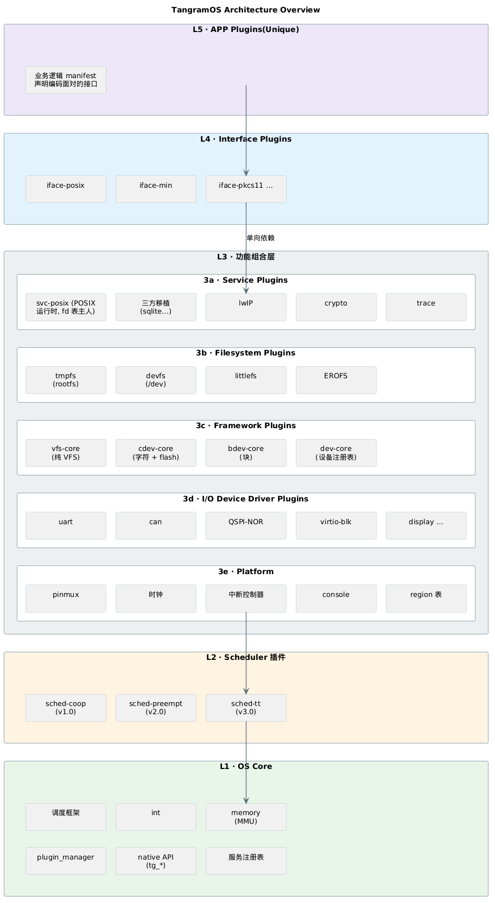
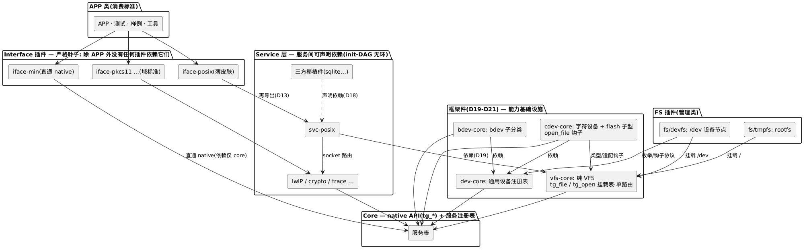
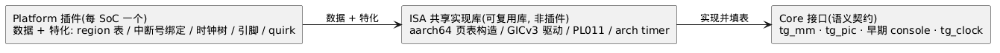
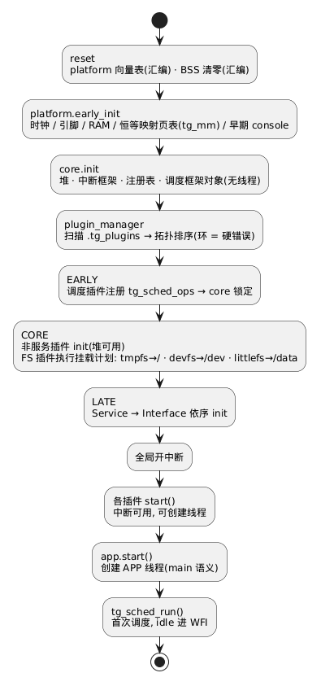

# TangramOS 架构讨论稿 v0.10

> 状态: 讨论中的活文档。标注 **[?]** 为待定决策点。所有图为 PlantUML(plantuml 代码块; VSCode/IDEA 插件或 GitLab 原生渲染, CLI: `plantuml docs/*.md` 直出)。
> v0.10: **D24–D26 HSM 完整样例入 v1.x(新增 M5)**——第二产品域纵向切片(`io/virtio-hsm` + `service/crypto`/`keyring`/`hsm-host`/`seclog` + `iface-pkcs11` 由 v2.0 前移 + `app/hsm`); **crypto 服务契约 v1.x 定稿**(D25: v2.0 只做后端与算法面扩展, 契约不变); **HSM 资产边界诚实声明 + §14.1 域支撑矩阵**(D26, 收口评审 P1/P2); §12 依赖链按 D25 精确到"ed25519 能力(v2)"; 设计基线 `docs/9-app/9-02-hsm-sample.md`。
> v0.9a: 全部架构图 mermaid → **PlantUML**(布局可读性)。
> v0.9: D22 设备 ops 统一预留——**所有设备类别 ops 预留 ioctl/suspend/resume**(poll/close 由 cdev-core 通用 tg_file_ops 适配层提供, devfs 经钩子取得; 动机 = D14: ops 布局入 golden, 预留即免二进制破坏); D23 VFS ops 分层——**super(fs 级)/inode/file/dentry(预留)四层, Linux 型**; 路径走查(lookup 链)移入 vfs-core; inode v1 瞬态(无缓存, SD-3 不变); file_ops 增加 open(会话建立); D20 钩子演化为返回 {fops, fpriv}(`docs/7-storage/7-01-vfs.md` §2, `docs/8-device/8-01-device.md` §2/§3)。
> v0.8: D21 设备接入 VFS——**所有设备经 /dev(devfs 插件)接入 VFS 管理**(Linux devtmpfs/rCore DeviceFS 同型); **fs/tmpfs 挂载为 rootfs("/")**; `tg_open` 撤销裸名设备路由(单一挂载表路由, SD-1 修订); **vfs-core 纯化**(设备依赖移出); D20 协议扩展 open_file 钩子; 新插件 fs/tmpfs + fs/devfs(`docs/7-storage/7-03-concrete-fs.md` §2/§3)。
> v0.7: D20 设备子分类框架化——dev-core 收缩为**通用设备**(注册表/命名/语义/子分类协议), 向下分 **cdev-core(字符, 含 flash 子型)**/**bdev-core(块)** 子分类框架; **spi-nor/nand 对接 cdev-core**; 框架件 3→4 件(§3/§4.5/§6.3/§7.2, `docs/8-device/8-01-device.md` §3)。
> v0.6: D19 框架件拆分——设备/挂载注册表与 VFS/设备框架成为 **dev-core / vfs-core / bdev-core 插件**(§4.5, `docs/8-device/8-01-device.md` §1); 插件分类七类→八类(+框架件); core 收缩为 native API + 服务注册表; 依赖宪法更新(§7.2)。
> v0.5: D18 修正案——**POSIX 双角色拆分**: `svc-posix`(POSIX 运行时)从接口插件降为**普通服务**, 三方中间件(sqlite/curl 类)可声明依赖它; 接口插件成为**严格叶子**(仅被 APP 依赖); 依赖铁律重写为四条治理规则(§7.2); 依赖方向论证更新(§7.5); 移植双模式(§7.6)。
> v0.4: 吸收评审意见(用户手写笔记 `1-01-architecture-comment.md`, 仓库外、不随库分发): 战略语境与持久资产(§0); 虚拟内存政策反转——v1 恒等/v2 重定位/vx MPU(§4.3); 平台能力三层模式(§8); 插件依赖·版本·环管理深化(§6.5); 存储栈(§10); debug 基础设施(§11); D1 修订——v3 动态加载+鉴权(§12); D5/D6/D9/D10 落定; 版本路线图拆至 `docs/1-architecture/1-03-roadmap.md`, debug 细节拆至 `docs/5-debug/5-01-debug.md`。
> v0.3: 接口插件化(D11), core 收缩为 native API + 注册表。
> v0.2: D1–D4 决策; 调度策略插件化; QEMU 先行。

## 缩略词(abbreviations)

| 缩略词 | 英文全称 | 说明 |
|---|---|---|
| **ABI** | Application Binary Interface | 二进制接口: 布局/调用约定; D14 二进制兼容的对象 |
| **API** | Application Programming Interface | 应用程序接口 |
| **APP** | Application | 应用(插件类别: 唯一业务逻辑, 恰一个, 不被任何插件依赖) |
| **ASan** | AddressSanitizer | 内存错误检测器(host 平台插件上白捡, CI 常开) |
| **AUTOSAR** | AUTomotive Open System ARchitecture | 汽车开放系统架构(车规标准, 对比项) |
| **bh** | bottom half | 下半部: 中断外的延迟处理(此仓库 = work queue) |
| **CAN** | Controller Area Network | 控制器局域网(车载总线) |
| **cdev / bdev / netdev** | character / block / network device | 设备子分类框架: 字符 / 块 / 网络(dev-core 之下的对称子分类) |
| **CI** | Continuous Integration | 持续集成(三层门禁的落地处) |
| **CLI** | Command-Line Interface | 命令行界面 |
| **COBS** | Consistent Overhead Byte Stuffing | 帧定界编码(bridge 成帧用) |
| **COOP_ONLY / SAFE_PREEMPT / TT_SAFE** | — | sched_class: 插件声明自身对调度器的兼容类别(D10, 三态) |
| **DMA** | Direct Memory Access | 直接内存访问(外设不经 CPU 读写内存) |
| **EARLY / CORE / LATE / APP** | — | 插件生命周期四相(主文档 §6.2): 关中断无线程 → 堆可用 → 服务/接口 → 进 APP main |
| **EROFS** | Enhanced Read-Only File System | 只读压缩文件系统(代码/资产分区, v2.0) |
| **FIFO** | First-In First-Out | 先进先出(队列语义) |
| **FreeRTOS** | — | 通用 MCU RTOS(对比项: 无组合粒度) |
| **FS** | File System | 文件系统(插件类别之一) |
| **GIC** | Generic Interrupt Controller | ARM 通用中断控制器(GICv3 = 其第 3 版) |
| **GPIO** | General-Purpose Input/Output | 通用输入输出(引脚) |
| **HMI** | Human-Machine Interface | 人机界面 |
| **HSM** | Hardware Security Module | 硬件安全模块(此处指第二产品域: 安全核) |
| **I2C** | Inter-Integrated Circuit | 板级两线串行总线 |
| **I/O** | Input/Output | 输入输出; 插件类别 **IO** = 外设驱动 |
| **IPI** | Inter-Processor Interrupt | 核间中断(SMP 用) |
| **IRQ** | Interrupt Request | 中断请求(硬件中断线) |
| **ISA** | Instruction Set Architecture | 指令集架构 |
| **ISR** | Interrupt Service Routine | 中断服务例程(中断上下文中的处理函数) |
| **KVM** | Kernel-based Virtual Machine | Linux 内核虚拟化(对比项) |
| **L1 / L2 / L3 / L4 / L5** | — | 架构分层(主文档 §3): OS Core / Scheduler 插件 / 功能组合层 / Interface 插件 / APP 插件 |
| **LIN** | Local Interconnect Network | 低成本车载总线 |
| **LTO** | Link-Time Optimization | 链接期优化(影响符号表与 ABI 面) |
| **lwIP** | lightweight IP | 轻量 TCP/IP 协议栈(v2.0 服务) |
| **LZ4** | LZ4 | 快速无损压缩算法(ramdump 压缩用) |
| **MCU** | Microcontroller Unit | 微控制器 |
| **MMIO** | Memory-Mapped I/O | 内存映射 I/O |
| **MMU** | Memory Management Unit | 内存管理单元 |
| **MPU** | Memory Protection Unit | 内存保护单元(无 MMU 目标的 region 保护) |
| **OTA** | Over-The-Air | 空中升级 |
| **page cache** | — | 页缓存: 堆叠于 bdev 之上的无感层(SD-8) |
| **PKCS#11** | Public-Key Cryptography Standards #11 | 密码设备接口标准(crypto 服务适配对象) |
| **PM** | Power Management | 电源管理 |
| **PMIC** | Power Management IC | 电源管理芯片(典型级联中断域来源) |
| **POSIX** | Portable Operating System Interface | 可移植操作系统接口 |
| **QEMU** | Quick Emulator | 开源模拟器(v1 的主要验证平台) |
| **RAM** | Random Access Memory | 随机访问存储器 |
| **rCore** | — | Rust 操作系统教学内核(参照实现: DeviceFS) |
| **RFC** | Request for Comments | 提案文档; 此处指变更提案流程(对齐 IETF RFC 体例) |
| **RTE** | Runtime Environment | AUTOSAR 运行时环境(对比项) |
| **SMP** | Symmetric Multi-Processing | 对称多处理(多核同构) |
| **SoC** | System on Chip | 片上系统 |
| **SPI** | Serial Peripheral Interface | 板级四线串行总线 |
| **super / inode / file / dentry** | — | VFS ops 四层(D23, Linux 型): fs 级 / inode 级 / 打开会话级 / 目录项级(预留) |
| **TLB** | Translation Lookaside Buffer | 地址转换旁路缓冲 |
| **TLSF** | Two-Level Segregated Fit | O(1) 动态内存分配算法(此仓库的堆池实现) |
| **TRNG** | True Random Number Generator | 真随机数发生器(v1.x 缺平台熵源契约, 见 §14.1 与 9-02 §6.3) |
| **TT** | Time-Triggered | 时间触发(sched-tt: 按调度表触发) |
| **UART** | Universal Asynchronous Receiver/Transmitter | 串口 |
| **UDS** | Unified Diagnostic Services | 汽车统一诊断服务(仪表域诊断协议) |
| **Unikraft** | — | 云 unikernel 组合框架(对比项: 库级组合) |
| **VA** | Virtual Address | 虚拟地址 |
| **VFS** | Virtual File System | 虚拟文件系统(统一可打开模型 + 挂载表) |
| **WCET** | Worst-Case Execution Time | 最坏执行时间(时间触发调度的输入) |
| **Zephyr** | — | 通用嵌入式 RTOS(对比项: Kconfig + devicetree 组合) |

> **编号约定**: `D1–D26` = 全局决策(§1); `R1–R10` = 风险(§16); `CA-*`/`SD-*`/`O-S*`/`R-S*` = 各领域决策与风险(见 3-01 / 7-01–7-03 / 8-01); `O-H*`/`R-H*`/`TC-HSM-*` = HSM 样例的开放问题 / 风险 / 用例(`docs/9-app/9-02-hsm-sample.md`); `M0–M5` = 里程碑(1-03)。

## 0. 定位与战略

一句话定位: 一切皆插件。面向深度嵌入式产品的 **单应用 / 单异常级 / 组合式(composable) OS**:

```
产品镜像 = OS Core (恒定小核) + 按需选取的插件集合 + 唯一的 APP
```

核心价值主张: **新产品的 OS 部分零开发, 只做组合** —— 仪表(dashboard)、HSM 等产品线共享同一个内核与插件库, 新产品只写 APP 插件 + 选插件 + 配平台。

| 持久资产 | 内容 |
|---|---|
| 插件契约 | 描述符、生命周期、sched_class、接口叠加规则 |
| native API 设计 | 不透明句柄 + 三态生命周期(`docs/1-architecture/1-02-api-contract-governance.md`) |
| 组合工具链 | CLI + manifest + 组合期校验规则 |
| 插件组合库 | C 驱动与中间件的大头 |
| 验证体系 | conformance 套件、host 平台插件、trace 工具链 |

⇒ 设计原则升格: **契约优先于实现** —— 一切接口按"将来要在别的内核上重新实现"的标准设计。详见 `docs/1-architecture/1-03-roadmap.md` §0。

**命名(D16, 已定)**: OS 定名 **TangramOS(七巧板——七块积木拼出万物, 即 core + 插件组合的隐喻)**; 符号前缀 `tg_` / 宏 `TG_` / CLI `tg` / 链接段 `.tg_*`, 已全局替换, 避开 Unikraft `uk_*` 的正面冲突(量产若基于 Unikraft 二次开发不再撞车)。正式启用前建议做一次商标与开源库检索。

## 1. 决策记录(已定)

| # | 决策 | 结论 | 主要推论 |
|---|---|---|---|
| D1 | 组合模型 | **静态优先; v3.0 起动态加载为选配能力(带鉴权)** | v1/v2 纯静态: 无加载器、无运行时符号解析; 插件管理器价值在"构建期 manifest 校验 + 启动期排序"; v3 动态依赖链 = 重定位(v2)+**ed25519 验签能力(v2, D25)**+符号表导出(v1.x), 模块 ed25519 签名 + 加载期 api_rev/abi_id 复核; 认证件可不编入动态路径 |
| D2 | 并发契约 | **core=抽象调度框架; 协作+抢占并存; 调度器是插件** | 上下文切换原语/超时框架留 core; 策略与锁实现(PI)归调度插件; sched_class 声明 + 组合期校验(§5.3); 实现顺序 coop(v1)→preempt(v2)→tt(v3) |
| D3 | 首个平台 | **QEMU 虚拟平台先行** | 契约先于硬件固化; 真实 SoC(M4)依战略语境可降级为选配 |
| D4 | 内存保护 | **暂不做 MPU, 按插件分段保留元数据** | `.tg_plug_<name>` 分段为 vx.0 MPU 插件留钩子 |
| D5 | 语言与工具链 | **core: C(v1.0)→C+Rust(v4.0); 插件: C(v1.0)/Rust(v2.0)** | 插件边界恒为 C ABI(D14); Rust 插件走 `extern "C"`, 二进制兼容纪律照旧 |
| D6 | SMP | **v1.0 单核; v2.0 SMP(与 preempt 同期)** | SMP 触碰锁语义/perCPU/IPI, 建议独立分期 v2b(见 R8) |
| D9 | ISA | **aarch64** | QEMU virt 先行; riscv 不作卫生检查(评审裁剪) |
| D10 | sched_class 校验严格度 | **双保险: 组合期校验 + 静态分析** | 对应 R1 |
| D11 | 接口插件化 | **API 皮肤(POSIX/域标准)做成 Interface 插件; 注册表机制与 native API 留 core** | 接口可叠加、符号命名空间独占; ~~能力插件永不依赖接口插件~~ → **D18 修订**: 铁律退役, 由四条治理规则取代(§7.2), 接口成为严格叶子 |
| D12 | native API 冻结流程 | **已定**: 三态生命周期 + 轻量 RFC(决策记录) + 三层 CI 门禁 | 见 `docs/1-architecture/1-02-api-contract-governance.md` |
| D13 | 接口叠加规则 | **已定**: 双层混合(模块级声明 + 符号级真值) | 见 `docs/1-architecture/1-02-api-contract-governance.md` |
| D14 | 二进制插件分发 | **Day1 按二进制兼容设计** | 不透明句柄纪律 CI 强制; 布局入 golden 硬门禁; 描述符带 `abi_id`(§6.1) |
| D15 | 冻结启动时机 | **M3(=v1.0 完整化)起分批冻结** | M0–M2 全部 API 留实验区 |
| D16 | OS 命名 | **TangramOS(七巧板)** | 符号前缀 `tg_` / 宏 `TG_` / CLI `tg` / 段名 `.tg_*`; 避开 Unikraft `uk_*` 撞车 |
| D17 | v1.0 可写 FS | **littlefs 入 v1.0** | DA 日志/仪表配置需要落盘; 与 EROFS(v2)分工: littlefs=数据, EROFS=代码/资产 |
| D18 | POSIX 双角色拆分 | **POSIX 运行时服务化(svc-posix); 接口插件成为严格叶子** | POSIX 实现=普通服务(open/read/pthread/socket 唯一实现, fd 表唯一主人, 实现于 native+注册表); 三方中间件可声明依赖它; 铁律"服务不得依赖接口"退役, 由四条治理规则取代(§7.2); iface-posix 保留为薄皮肤(再导出 + stdio/errno 接线, §7.4); 移植双模式(§7.6) |
| D19 | 框架件拆分 | **能力框架成为插件: dev-core / vfs-core / bdev-core** | file/open/VFS 契约 = **vfs-core**; 设备相关接口 = **dev-core**; bdev 类 = **bdev-core(依赖 dev-core)**; 具体文件系统(littlefs)依赖 **vfs-core**; 派生: ~~vfs-core→dev-core(设备路由+适配)~~ → **D21 修订**: 该依赖已撤销, 设备路由改经 devfs/cdev-core 侧(见 D21); svc-posix→vfs-core; 框架件 = 插件身份(可裁剪) + core 纪律(golden/门禁); core 收缩为 native API + 服务注册表(§4.5); 详见 `docs/8-device/8-01-device.md` §1 |
| D20 | 设备子分类框架化 | **dev-core = 通用设备, 向下分 cdev-core(字符)/bdev-core(块)子分类; spi-nor/nand 对接 cdev-core(flash 子型)** | dev-core 只管"是个设备"(注册表/命名/语义/子分类协议), 不定义 ops 形状; cdev-core 拥有 `tg_cdev_ops` + flash 子型 `tg_flash_ops`; 框架件 3→4 件; netdev 答案空间 = 第三个子分类框架(O-S5); 详见 `docs/8-device/8-01-device.md` §3 |
| D21 | 设备接入 VFS + tmpfs rootfs | **所有设备经 /dev(devfs 插件)接入 VFS 管理; tmpfs 挂载为 rootfs("/")** | Linux devtmpfs/rCore DeviceFS 同型; `tg_open` 单路由(挂载表, 撤销裸名设备路径——SD-1 修订); **vfs-core 纯化**(设备依赖移出, 依赖面收缩到 core); D20 协议扩展 **open_file 钩子**(子分类框架实现可文件化); 新插件 fs/tmpfs(rootfs)+fs/devfs(/dev); 挂载计划: tmpfs→/ → devfs→/dev → littlefs→/data, 挂载点缺失自动 mkdir; 详见 `docs/7-storage/7-03-concrete-fs.md` §2/§3/§6 |
| D22 | 设备 ops 统一预留 | **所有设备类别 ops 预留 ioctl / suspend / resume(poll/close 由 cdev-core 通用 tg_file_ops 适配层提供, devfs 经钩子取得)** | 动机 = D14: ops 布局入 golden, 后补字段 = 布局破坏——**预留即免破坏**; suspend/resume 为设备级 PM 钩子(v1 无统一调用方, v2 service/pm 经注册表枚举, O-S6); NULL → -ENOTSUP; 详见 `docs/8-device/8-01-device.md` §3 |
| D23 | VFS ops 分层 | **super(fs 级)/ inode / file / dentry(预留)四层 ops, Linux 型** | **路径走查(lookup 链)在 vfs-core**; inode v1 瞬态(走查产物, free_inode 即弃——有 inode ops, 无 inode cache, SD-3 不变); `tg_dentry_ops` 为 v2 dcache 预留(槽位先占, D14 同理); `tg_file_ops` 增加 open(会话建立); D20 open_file 钩子演化为返回 {fops, fpriv}; littlefs inode = 路径前缀包装, devfs 根 inode = 注册表投影; 详见 `docs/7-storage/7-01-vfs.md` §2 |
| D24 | HSM 完整样例入 v1.x(M5) | **第二产品域从"声明"变为"可运行样例"**: 新增 6 件插件(`io/virtio-hsm`、`service/crypto`、`service/keyring`、`service/hsm-host`、`service/seclog`、**`iface-pkcs11` 由 v2.0 前移**)+ 样例 APP `app/hsm` | **组合即产品**(增量只有 APP + manifest)/ **置换证明**(调度器 · 密码后端 · 接口各换一次, 插件源码零改写)/ 复用 v1.0 全栈(四件框架件 + vfs 栈 + trace)/ **不依赖 M4**(QEMU virtio-serial 对端); `iface-posix`/`svc-posix` 不在样例组合内(接口可裁剪); 里程碑 = 1-03 §3 M5; 设计基线 `docs/9-app/9-02-hsm-sample.md` |
| D25 | crypto 服务的版本策略 | **服务契约 v1.x(M5) 定稿; v2.0 只做后端与算法面扩展——契约不变** | v1.x = mbedTLS 算法子集(SHA-256 / HMAC-SHA256 / AES-CBC/CTR / DRBG; **不含 ed25519/TLS**)+ 服务面一次定稿; v2.0 = 完整算法集 + 恒定时间加固 + 硬件引擎后端; **算法实现一律引上游, 不自行实现密码原语**(风格纪律); v3 动态加载的**绑定约束是重定位(v2)**, 不是"crypto 服务是否存在"(§12); 遗留缺口: 熵源契约(O-H1)、ops 是否入 golden(O-H7) |
| D26 | HSM 资产边界(诚实声明) | **v1.x 无内存隔离 ⇒ 资产保护 = 逻辑边界(密钥只经 keyring 不透明 handle 暴露)+ 落盘加密 + 物理封装/外置安全核假设; 不承诺抵抗同地址空间内的任意读** | 域支撑矩阵(§14.1)逐格写"有/无/部分", 缺口须有编号与版本归宿; 认证件策略(§12: 可完全不编入动态路径)照旧; "伪安全"叙事风险登记 R10; 威胁表详见 `docs/9-app/9-02-hsm-sample.md` §2.3 |

## 2. 两个"单"的工程含义

### 2.1 单 APP

- 同一时刻只有一个应用 ⇒ **无进程模型、无 fork/exec、无跨进程 IPC、无地址空间切换**
- APP 内部仍可有并发(多线程/事件循环)—— 这是调度框架存在的理由
- APP 本身也是一个插件(§6.3): 与 OS 其他部件同段位

### 2.2 单异常级

| ISA 家族映射(现役: aarch64, D9) | 运行级别 | 说明 |
|---|---|---|
| ARM Cortex-A | EL1 裸跑 | 不进 EL2/EL3, 不用 TrustZone 分世界 |
| ARM Cortex-M/R | 恒特权态 | 不进入非特权线程模式(CONTROL.nPRIV 保持 0) |
| RISC-V | M-mode | `-bios none` 直入 M-mode |

**红利:**
- syscall 退化为普通函数调用: 接口插件 = 库, 零陷入开销、无用户/内核拷贝
- 无地址空间切换 ⇒ 上下文切换只剩"寄存器 + 栈"
- 无特权级配置面 ⇒ 启动代码极短; 调试器一个地址空间看穿全局

**代价(诚实面对):**
- 无硬件隔离: 野指针可破坏一切。缓解: MMU region 属性(v1 起恒等映射即有 RO/NX/device 保护, §4.3)+ 插件分段(D4)+ 将来 MPU 插件
- 中断仍是硬件入口: **ISR 上下文 vs 线程上下文**是全系统唯二"世界", 构成第一契约(§4.2)

> **重要澄清(评审修订)**: "支持虚拟内存" ≠ "多地址空间"。单 APP 保持**单一地址空间**不变; MMU 的用途 = region 属性与保护(v1)+ 重定位(v2)+ 动态模块布局(v3)。**换页/swap 与多地址空间仍是明确非目标。**

## 3. 总体分层



> 源文件: [plantUML/1-01-architecture-01.puml](plantUML/1-01-architecture-01.puml)

要点:
- **L3 可组合能力层 = 五个子层(3a–3e, 阅读序)**: 消费者(服务)→ 文件系统 → 契约中心(框架件)→ 实现者(驱动)→ 板级数据; 总图**只画层间单向流**——层内具体依赖/注册拓扑不进总图(避免拉宽), **详见 `docs/8-device/8-01-device.md` §1 依赖图**; 框架件是能力层枢纽: 驱动与 FS 向它注册/挂载, 服务经它取能力
- **POSIX 有两个角色**(D18): 产品 API 皮肤(iface-posix, 薄, APP 面)与**移植基座**(svc-posix, 服务, 三方中间件的依赖对象)——一份实现, 两个身份
- **框架件(D19/D20)**: dev-core(通用设备)/cdev-core(字符, 含 flash 子型——**spi-nor/nand 对接于此**)/bdev-core(块, 依赖 dev-core)/vfs-core(纯 VFS, D21)——能力基础设施以**插件形态**存在: 可按组合裁剪, 纪律同 core(golden/门禁), 详见 `docs/8-device/8-01-device.md` §1/§3
- **设备接入 VFS(D21)**: 所有设备经 **/dev**(fs/devfs 插件, 实时枚举 dev-core 注册表)接入 VFS 管理; **fs/tmpfs 挂载为 rootfs("/")**——Linux devtmpfs/rCore DeviceFS 同型; 挂载计划: tmpfs→/ → devfs→/dev → littlefs→/data; 见 `docs/7-storage/7-03-concrete-fs.md` §2/§3/§6
- **接口插件是严格叶子**: **除 APP 外**没有任何插件依赖它们 ⇒ 可替换性最大化
- 能力插件不知道任何接口皮肤的存在——驱动向 dev-core/bdev-core 注册设备, FS 向 vfs-core 注册挂载, 服务向 core 服务注册表发布
- svc-posix 是普通可选服务: 不选它, 极小组合照旧纯 native(与 D11 可裁剪性一致)

## 4. OS Core: 模块职责边界

Core 是唯一"不可组合"的部分(调度框架在 core, 调度策略不在)。目标 footprint: ~4–16KB flash / 2–8KB RAM(不含堆与线程栈)[?]。

### 4.1 schedule → 调度框架 (D2 落地)

**core 保留的(与调度策略无关):**

| 能力 | 理由 |
|---|---|
| 上下文切换原语(每 ISA 一段汇编 save/restore) | 任何调度器都要做切换, 与策略无关 |
| 线程对象 `tg_thread_t`、栈布局、入口 trampoline | 对象表示是公共的 |
| tickless 超时框架(超时链/绝对时间) | sleep/超时是公共语义 |
| 调度器注册点 `tg_sched_ops`(§5.1) | 策略插拔的接口 |
| 锁的 **API 与语义契约** | 优先级继承是策略 ⇒ **实现归调度插件** |
| `tg_work_submit` 延迟工作抽象 | ISR 底半部统一入口, 实现在调度插件 |

**core 不做的:** 就绪队列管理、抢占决策、优先级继承、调度表——全部在调度插件。

### 4.2 int (中断)

- IRQ 注册表: IRQ 号 → (handler, arg, 插件归属)
- 中断控制器抽象 ops(mask/unmask/ack/prio/eoi)——接口在 core, **实现由 Platform 插件经三层模式填表**(§8)
- 临界区原语 `tg_irq_lock()/unlock()` + 嵌套计数
- **级联中断域(v1.x)**: PMIC/GPIO 复用线——物理线 → 域 → 子中断; FAST/SLOW 双上下文契约(SLOW = 状态读取走 I2C 不能在 ISR), `docs/3-os-core/3-01-core-api-list.md` §8.1
- **fault 路径(v2)**: aarch64 向量表同步异常分槽 + `tg_fault_handler_register()`(ramdump 挂钩, `docs/5-debug/5-01-debug.md` §3)

**ISR 契约:** 最小工作, 尽快 `tg_work_submit` 转底半部; 禁止阻塞/malloc/持锁跨 ISR 返回。
**v1.0 即实现 bottom half**(评审要求): coop 调度下 work queue = 事件队列, 是首要延迟路径——v1 就强制"bh + 锁纪律"的编写习惯, v2 抢占到来时插件零返工。

### 4.3 memory (内存) —— v0.4 政策反转

**分期(评审修订):**

| 版本 | 能力 | 说明 |
|---|---|---|
| v1.0 | **恒等映射** | MMU 从第一天就开: region 属性(cacheable/device/NX/RO)——即使不重定位也有真实保护 |
| v2.0 | **重定位** | 镜像可加载到任意 VA; A/B 更新与 v3 动态模块布局的地基 |
| vx.0 | MPU 插件 | Cortex-M/R(A 核继续用 MMU region); 启用 D4 分段元数据。**诚实注**: v1/v2 的全部内存契约(恒等映射页表/region 属性/重定位)只适用 **MMU 平台**——Cortex-R 无 MMU, 其路径完全取决于本行 MPU 插件(vx.0, 未排期), 详见 §14.1 |

**core 职责:**
- `tg_mm` 接口: region 描述(base/size/attrs)、map/unmap、TLB 维护、cache 维护 API(R4: M2 起定好签名)
- **region 表由 Platform 插件提供**(三层模式, §8); 页表构造 = ISA 共享实现库
- 核堆: TLSF, `tg_malloc/tg_free/tg_dma_alloc`; **per-plugin arena 记账**(memleak 归属, `docs/5-debug/5-01-debug.md` §4)
- 链接布局: `.tg_core` / `.tg_sched_<name>` / `.tg_plug_<name>` / `.tg_iface_<name>` / `.tg_app` 分段

**非目标(不变):** 换页/swap、多地址空间(单 APP = 单一地址空间)。

### 4.4 plugin_manager (插件管理)

纯静态组合下(D1), 其价值在两处:

1. **构建期**: 读产品 manifest, 校验(§6.4: 依赖闭包、版本区间、环检测、调度类别、接口声明、符号碰撞、资源预算), 驱动链接(选段、gc-sections)
2. **启动期**: 扫 `.tg_plugins` 链接段 → 拓扑排序 → 生命周期回调(§9)

**非目标:** 运行时热插拔(v3 前无运行时加载)。

### 4.5 native API + 服务注册表 (D11/D19 落地)

**服务注册表(core 公地——插件间无环会合点):**

```c
tg_service_publish(name, &svc_ops)         /* 命名服务表 */
tg_service_lookup(name)   → ops
```

**设备/挂载注册表已拆为框架件插件(D19–D21, `docs/8-device/8-01-device.md` §1)**: dev-core(**通用设备**注册表/语义/子分类协议)、cdev-core(字符设备, **含 flash 子型——spi-nor/nand 对接于此**)、bdev-core(bdev 子分类, **依赖 dev-core**)、vfs-core(纯 VFS: `tg_file_t`/`tg_open` 挂载表·单路由/挂载表)。**框架件 = 插件的身份(可按组合裁剪) + core 的纪律(API 面进 golden/门禁)**。

**native API(全系统第一契约, 刻意保持小面):**

```c
/* 任务/同步: 语义在 core, 实现在调度插件 */
tg_task_create / tg_task_sleep / tg_task_exit / tg_task_yield
tg_mutex_lock/unlock  tg_sem_take/give  tg_cond_wait/signal
/* 时间 */
tg_clock_now / tg_deadline_from_now
/* 延迟工作 */
tg_work_submit
/* 内存 */
tg_malloc / tg_free / tg_dma_alloc / tg_mm_map
/* 中断 */
tg_irq_register / tg_irq_enable / tg_irq_lock
```
(设备/文件/挂载访问 `tg_open`/`tg_file_*`/`tg_bdev_*`/`tg_flash_*` 归框架件契约, 见 `docs/7-storage/7-01-vfs.md` / `docs/8-device/8-01-device.md`; **native API 完整清单与签名: `docs/3-os-core/3-01-core-api-list.md`**)

**留 core 的理由:** 服务注册表是插件间无环会合点(§7.2 单向流下服务/框架件层另有声明依赖); native API 是全部插件作者的编码对象。冻结纪律: `docs/1-architecture/1-02-api-contract-governance.md`(D12–D15)。
**libc 挂接点:** picolibc/newlib 弱符号 stub 由 `svc-posix` 实现(D18); `sbrk` 指向 core 堆[?]。

## 5. Scheduler 插件 (D2 深化)

### 5.1 注册接口

```c
typedef struct tg_sched_ops {
    const char *name;
    uint32_t    sched_kind;       /* 调度器类别: PREEMPT | COOP | TT(§5.2; 与插件侧 sched_class(§5.3)区分) */

    /* 决策 */
    void        (*thread_ready)(tg_thread_t *t);
    void        (*thread_block)(tg_thread_t *t);
    tg_thread_t *(*pick_next)(void);               /* idle 由 core 兜底 */
    void        (*on_tick)(void);                 /* TT 调度表驱动点 */

    /* 策略相关的阻塞/超时 */
    int         (*thread_sleep)(tg_thread_t *t, tg_time_t abs);

    /* 锁的实现归属 (优先级继承等是策略) */
    int         (*mutex_lock)(tg_mutex *m, tg_time_t timeout);
    int         (*mutex_unlock)(tg_mutex *m);
    int         (*sem_take)(tg_sem *s, tg_time_t timeout);
    ...
} tg_sched_ops;

/* 调度插件在 EARLY 阶段注册; core 在首个线程创建前锁定 */
void tg_sched_register(const tg_sched_ops *ops);
```

静态组合 ⇒ 每镜像恰一个调度器; ops 调用可经 LTO 特化[?]。

### 5.2 三个调度插件与实现顺序(评审排序)

| 插件 | sched_kind | 就绪结构 | 锁实现 | 版本 |
|---|---|---|---|---|
| `sched-coop` | COOP | FIFO 事件/队列 | 锁退化为 irq 锁(极便宜) | **v1.0** |
| `sched-preempt` | PREEMPT | 位图优先级队列 | PI 互斥 | **v2.0**(与 SMP 同期) |
| `sched-tt` | TT | 静态调度表 | 表级互斥(时间上互斥) | **v3.0** |

顺序理由(`docs/1-architecture/1-03-roadmap.md` §2): coop 先行最小可用; **SAFE_PREEMPT 纪律下写的插件在 coop 下天然正确** ⇒ v2 引入 preempt 插件零改写——sched_class 设计的第一次实战验证; tt 最后(需要周期元数据与 conformance 成熟度)。

`tg_work_submit(fn, arg)` 实现差异: preempt → 唤醒 worker 线程; coop → 事件入队、主循环分派(v1 形态); TT → 下一帧槽位[?]。

### 5.3 调度兼容类别 (关键契约)

调度器插件化 ⇒ **并发契约从"全局固定"变成"每产品组合参数"**。插件必须声明:

| 类别 | 含义 | 成本 |
|---|---|---|
| `SAFE_PREEMPT` (默认) | 抢占安全: 在**任意**调度器下正确 | coop 下锁退化为更便宜实现, 略有冗余 |
| `COOP_ONLY` | 仅协作/时间表下正确(热路径免锁优化) | 选 preempt 调度器时**组合期硬错误** |
| `TT_SAFE` + 周期/WCET 元数据 | 满足时间表声明 | 供 sched-tt 排表与静态 WCET 分析 |

**组合期校验规则:** preempt ⇒ 全部 SAFE_PREEMPT; coop ⇒ 允许 COOP_ONLY; tt ⇒ SAFE_PREEMPT 或 TT_SAFE(周期元数据闭合)。**D10 双保险**: 组合期校验 + 静态分析(R1)。

## 6. 插件模型

### 6.1 描述符 v2(评审: 增加版本管理)

```c
typedef struct {
    const char *name;              /* "io-can", "iface-posix", "app-main" */
    uint16_t    ver[3];            /* 插件自身语义版本 {maj, min, pat} */
    uint16_t    api_rev;           /* 编码面对的 native API 版本 */
    uint32_t    sched_class;       /* §5.3 */
    const tg_dep_t *deps;          /* {name, ">=1.0,<2.0", phase} 数组 */
    const char *abi_id;            /* 工具链 + ABI 影响选项指纹(D14 二进制分发) */
    const char *const *api_syms;   /* 仅 Interface 插件: 占有的 API 符号族(§7.3) */
    tg_res_t    res;               /* RAM/栈/IRQ/DMA 需求, 组合期预算校验 */
    int  (*early_init)(void);      /* 不使用堆/无线程/关中断(堆已由 core.init 建立, 本相约定不使用) */
    int  (*init)(void);            /* 堆可用, 调度器已锁定, 中断仍关 */
    int  (*start)(void);           /* 中断可用, 可创建线程 */
} tg_plugin_t;

#define TG_PLUGIN(name_, deps_, ...) \
    const tg_plugin_t _tg_plugin_##name_ \
    __attribute__((used, section(".tg_plugins"), aligned(4))) = {...};
```

### 6.2 生命周期阶段

`EARLY → CORE → LATE → APP`, 同阶段内按依赖拓扑序。**调度插件必须在 EARLY 完成注册**; **Interface 插件在 LATE 初始化**(晚于其依赖的 Service)。

描述符回调与阶段的映射(§9 为运转视图):

| 阶段 | 调用的回调 | 运行环境 |
|---|---|---|
| EARLY | `early_init`(全部插件, 拓扑序) | 不使用堆 / 无线程 / 关中断 |
| CORE | `init`(非 Service/Interface 插件; FS 挂载计划在此执行) | 堆可用, 调度器已锁定, 中断仍关 |
| LATE | `init`(Service → Interface 依序) | 同 CORE |
| 全局开中断后 | `start`(全部插件) → `app.start()` | 中断可用, 可创建线程 |

### 6.3 插件分类(八类, v0.6: +框架件)

| 类 | 内容 | 数量约束 | 依赖方向 |
|---|---|---|---|
| Platform | reset 汇编、时钟/引脚/RAM、中断控制器实现、console、cache、timer、**内存 region 表** | 每 SoC 一个 | 最底层 |
| **Scheduler** | 调度策略(§5) | **恰一个** | 用 core 框架 |
| **框架件(Framework)** | 能力基础设施: **dev-core**(通用设备注册表/语义/子分类协议)、**cdev-core**(字符设备 + flash 子型)、**bdev-core**(bdev 子分类, 依赖 dev-core)、**vfs-core**(tg_file/tg_open/挂载表) | 每件 0 或 1, 按需组合 | 依赖 core; 被驱动/FS/服务依赖; 纪律同 core(golden/门禁) |
| I/O | 外设驱动: uart/spi/i2c/can/gpio/adc/display | 任意 | 向 cdev-core / bdev-core 注册设备 |
| FS | tmpfs(rootfs) / devfs(/dev) / littlefs / EROFS / romfs | 任意 | **依赖 vfs-core**, 注册挂载(D21: 设备经 devfs 接入 VFS) |
| Service | 中间件: lwIP、UDS 诊断、日志、OTA、crypto、trace、**svc-posix(POSIX 运行时, D18)**、**keyring/hsm-host/seclog(v1.x/M5, D24)**、三方移植件(sqlite…) | 任意 | 向 core 服务注册表发布; **服务间可声明依赖(含 svc-posix 与框架件)** |
| **Interface** | API 皮肤(严格叶子): POSIX 薄皮肤 / 极简 / 域标准(§7; **iface-pkcs11 = v1.x/M5, D24**) | **零或多个, 可叠加** | 仅被 APP 依赖; 可再导出 svc-posix 符号 |
| APP | 唯一业务逻辑 | 1 | 依赖 Interface(或直调 native), 不许被依赖 |

### 6.4 组合期校验(构建器执行)

1. 依赖闭包求解 + **版本区间交集校验**(deps range vs 提供方 ver)
2. **环检测: 硬错误**, 报出完整环路径(§6.5)
3. 调度类别校验(§5.3) + 双保险静态分析(D10)
4. 接口校验: APP 声明的接口在闭包内; Interface 插件间符号族碰撞检测(§7.3)
5. 资源预算: Σ(插件 RAM/栈) ≤ platform 提供量; IRQ/DMA 独占冲突检测
6. abi_id 一致性(二进制分发件与镜像工具链匹配, D14)

### 6.5 依赖与环管理(评审深化)

**两类依赖必须区分:**

| | init 依赖(初始化顺序) | 调用依赖(运行期调用) |
|---|---|---|
| 含义 | "你必须先 init 完我才能 init" | "我运行时会调你的函数" |
| 环政策 | **禁止**——拓扑排序硬错误 | **允许**——经回调/注册表天然无环 |

**环的四种解法模式**(当"互相需要"的诱惑出现时):

1. **依赖降级为数据流**: B 把 handler 回调注册给 A(`tg_service_publish` / 显式 register), A 通过函数指针调用——构建期依赖消失
2. **接口/实现分离**: 抽出小接口插件 C, A、B 都只依赖 C
3. **注册表中介**: 双方都只依赖 core 注册表(本设计内置的会合点)
4. **init 依赖 vs 调用依赖分离**: 真正禁环的只有 init 顺序; 运行期互调经 1/3 化解

**运行期不做任何检测**(纯静态, 构建期全解); v3 动态加载时加载期复核 api_rev/abi_id(§12)。

## 7. Interface 插件 (D11)

### 7.1 机制/策略切分

| | 性质 | 归宿 |
|---|---|---|
| 能力注册表(设备/挂载/服务表) | 机制: 插件公地 | 服务表 → **core**(§4.5); 设备注册表 → **dev-core**; 挂载表 → **vfs-core**(框架件, D19–D21) |
| API 皮肤(POSIX 签名、fd 表、errno、pthread 适配) | 策略: 标准 API 适配 | **Interface 插件** |
| 插件描述符/生命周期契约 | 元契约 | **core, 冻结** |

### 7.2 依赖宪法(D18 修订: 铁律 → 四条治理规则)

v0.4 的铁律"能力插件永不依赖接口插件"是安全的**结构代理**; v0.5 起由治理机器本身接管安全, 规则重写为:



> 源文件: [plantUML/1-01-architecture-02.puml](plantUML/1-01-architecture-02.puml)

单向流语义: 箭头只许指向"更靠近 core"; 同类内部允许接口叠接口(再导出)、服务依赖服务(含 svc-posix 与框架件)、框架件间单向(cdev-core→dev-core 与 vfs-core, bdev-core→dev-core); **设备经 fs/devfs 接入 VFS, 挂载经 fs 插件接入**(D21)。

| # | 规则 | 执法机制 |
|---|---|---|
| 1 | **单向流**: 依赖箭头只许从"靠近 APP"指向"靠近 core"; 接口插件是**严格叶子**(仅被 APP 依赖); 框架件(D19)位于服务/能力层底部, 被服务与驱动依赖, 框架件间单向 | 组合期依赖图方向校验 |
| 2 | **init 依赖无环** | 拓扑排序硬错误, 报环路径(§6.5) |
| 3 | **共享状态唯一主人**(fd 表=single owner) | D13 符号独占 + 状态归属声明 |
| 4 | **符号命名空间独占** | D13 符号级碰撞检测(链接前) |

**铁律退役的理由**: 它真正想保住的是无环/单主人/可裁剪三件事, 而这三件事规则 1–4 + manifest 闭包已完整覆盖; 同时它误伤了 POSIX 的"移植基座"角色——三方中间件(sqlite 类)无法声明依赖 POSIX 实现, 移植成本不可接受(§7.6)。native API 本就刻意 POSIX 形状化, "不得用 POSIX"实为字母规则而非架构规则。

### 7.3 组合规则

- **叠加式**: 一镜像可含多个接口插件(posix + pkcs11 共存)
- **符号命名空间独占**: `api_syms` 声明; 重叠 ⇒ 组合期硬错误(链接前检测)
- **双层粒度(D13)**: manifest 模块级声明+版本(人读); 碰撞检测符号级(链接器符号表为唯一真值); 模块→符号映射由工具从头文件生成, CI 防漂移
- **再导出**: 显式 `reexports`, 不转移所有权, 纯传递依赖
- **共享状态唯一主人**: fd 表恰一个 owner, socket 类插件向 owner 注册 file_ops(VFS provider 模式)
- **host 直通模式**: host 平台插件上 iface-posix 可直通宿主机 open(), APP 逻辑 CI 全速跑(`docs/5-debug/5-01-debug.md` §4 同源思路)

### 7.4 首批接口插件(v0.5: 均为薄皮肤)

| 插件 | 内容 | 版本 |
|---|---|---|
| `iface-posix` | **薄皮肤**: 再导出 svc-posix 符号(D13 reexport, 不转移所有权)+ APP 面 stdio/errno 接线 | v1.0 |
| `iface-min` | 极薄别名层, 直通 native API, 无 fd/errno 开销 | v1.0 |
| `iface-pkcs11` | 域标准: 加密 token API, 适配 crypto + keyring Service | **v1.x(M5, D24——原排 v2.0, 由 HSM 完整样例前移)** |

POSIX 的**实现**在 `svc-posix`(Service 类, §3): fd 表 + VFS 路由 + pthread 映射 + libc stub, 实现于 native API + 注册表; socket 子系统路由到 net 服务。皮肤与基座一份实现、两个身份(D18)。

> 泛化: **接口插件不限于 OS API——任何域标准 API 都是一个插件**。存量代码按什么标准写, 就插什么皮肤。

### 7.5 依赖方向论证(v0.5 修订: D18 后保留的部分)

方向仍由以下论证固定, 但 v0.4 的论证 2/3 已按 D18 修正:

1. **谁实现谁**(不变): 标准 API 的一部分语义由中间件实现——POSIX sockets → lwIP, PKCS#11 → crypto。适配器必须同时看见"标准的语义"与"能力的机器", 只能坐在两者之间。
2. **接口必须是严格叶子**(v0.5 强化): 除 APP 外没有任何插件依赖接口插件 ⇒ 皮肤可任意替换/裁剪, 且换皮肤永不重验服务。反向(服务依赖皮肤)则每换 API 皮肤都要重验中间件——验证经济学: 依赖箭头 = 重新验证的方向, 贵的(网络栈/crypto)必须待在箭头根部。
3. **复用经济学**(v0.5 诚实版): native 编码的服务在任何组合可用; POSIX 编码的服务在**不带 svc-posix 的组合**中不可用——这是组合期可见的取舍(manifest 闭包), 不是运行期惊喜。极小组合照旧纯 native, 可裁剪性不变。
4. **两种绑定分离**(不变): 结构需求走 manifest 声明; 运行机会走注册表晚绑定——svc-posix 与 littlefs 之间没有依赖边, 换 FS 零改动。

**四分法**(v0.5): 能力(Service/I/O/FS)提供机器; **基座(svc-posix)提供"标准的运行时实现"供能力复用**; 皮肤(Interface)提供 APP 面的标准; 消费(APP)使用标准。谁想"用"标准 API, 谁就是 APP 类插件(测试/样例/工具同此)。

**附带红利**: POSIX 实现按服务边界自然分解——svc-posix-core(不需 net)与 svc-posix-sockets(依赖 net)可分开组合, API 面随能力面伸缩。

### 7.6 三方中间件移植(双模式, D18 的落地)

以 sqlite 为例, 移植增量 = 描述符 + 可选 VFS 后端, **上游 amalgamation 零改动**:

```c
/* service/sqlite/plugin.c — 移植的全部增量 */
TG_PLUGIN(sqlite, .deps = (const tg_dep_t[]){{"svc-posix", ">=1.0", TG_PHASE_LATE}}, ...);  /* deps 形状见 §6.1: {name, 区间, phase} 数组 */
static int sqlite_port_init(void) {
    sqlite3_config(SQLITE_CONFIG_MUTEX, &tg_mutex_methods);  /* tg_mutex */
    sqlite3_config(SQLITE_CONFIG_MALLOC, &tg_mem_methods);   /* tg_malloc */
    sqlite3_initialize();
}
/* tg_service_publish("db", &db_ops) → APP/其他服务按名字用 */
```

| 模式 | 增量 | 上游同步 | 依赖面 | 适用 |
|---|---|---|---|---|
| A: os_unix.c 直链 svc-posix | ~0 | 替换 amalgamation 即升级 | svc-posix 子集 | 快速跑通(QEMU/host 验证) |
| B: os_tangram.c VFS 后端(~600 行) | 一次写作后稳定 | 同上, 后端不动 | 纯 native + vfs-core 框架件契约(`tg_open`/`tg_file_*`) | 裁剪/性能; **无 svc-posix 的极小组合也能用 sqlite** |

- 模式 A 的 POSIX 子集需求(sqlite 视角): `pread/pwrite/ftruncate/unlink/stat/fstat/usleep/gettimeofday/pthread_mutex/mmap(可关)`; `fcntl(F_SETLK)` 咨询锁在**单 APP 下退化为进程内互斥**——语义文档化, 这是"单应用"红利
- **移植成本从此是一个旋钮**: 快速路径(基座)与深度路径(native)都是一等公民
- 战略呼应: 与 Unikraft 的 libc-as-library 移植模型对齐 ⇒ 原型期攒的三方移植件可平移到量产基座(持久资产原则)

**新的诚实代价**(记录在案):
1. svc-posix 成为引力中心——中间件自然滑向全 POSIX 编码, native API 使用萎缩(Unikraft 教训)。缓解: 一方服务 native-first 写进风格规范; svc-posix 在 manifest 显式可见
2. 子集诚实义务——实现/未实现必须成文 + conformance 覆盖; 三方代码在链接期撞墙好过运行期
3. 契约治理面 +1: svc-posix 的 POSIX 符号面进 golden/门禁体系(`docs/1-architecture/1-02-api-contract-governance.md` §2.3 同机制)

## 8. 平台能力三层模式(评审: memory map / 中断控制器可否为插件)

**答案: 是插件职责——但形态是"数据 + 特化", 机制接口在 core, ISA 公共部分提炼为共享库:**



> 源文件: [plantUML/1-01-architecture-03.puml](plantUML/1-01-architecture-03.puml)

| 能力 | core 接口 | ISA 共享库 | Platform 插件提供 |
|---|---|---|---|
| 内存 map 管理 | `tg_mm`(region/attrs/map/unmap/TLB) | aarch64 页表构造 | **region 表**(RAM/DMA/MMIO/保留区) |
| 中断控制器 | `tg_pic`(mask/unmask/ack/prio/eoi) | GICv3 驱动 | 中断号绑定、路由策略 |
| console | 早期 console 语义 | PL011/16550 轮询 | 用哪个 UART、波特率 |
| timer | `tg_clock` tickless 语义 | arch timer | 频率、校准 |

- 每个平台插件不重写 ISA 公共部分(页表/GIC), 只给数据和 quirk ⇒ 新平台成本 = 一张表 + 少量胶水
- console 双形态: platform 早期 console(轮询, init 链打印)→ I/O 插件完整 tty(中断驱动)
- 该模式是"快速开发"的平台侧落点: **新 SoC = 新 Platform 插件, 不动 core**

## 9. 启动序列



> 源文件: [plantUML/1-01-architecture-04.puml](plantUML/1-01-architecture-04.puml)

## 10. 存储与设备栈(评审: FS & Block Device) — 详细设计: 存储域 `docs/7-storage/7-01-vfs.md` / `7-02-bdev.md` / `7-03-concrete-fs.md`; 设备域 `docs/8-device/8-01-device.md`


> 源文件: [plantUML/1-01-architecture-05.puml](plantUML/1-01-architecture-05.puml)

- **两章分工**: 上图是一条**体系链**(deviceXXX → 具体设备类 → dev-core → VFS), 但**不是一条依赖链**——`7-storage`(VFS/块设备/具体 FS)与 `8-device`(设备体系与管理)分立, 正因为设备框架可在没有 VFS 的组合里独立成立。**三种组合形态**(形态 A 接 VFS / 形态 B 只用设备框架 / 形态 C standalone)见 `docs/8-device/8-01-device.md` §1.2
- **rootfs 与设备节点(D21)**: **fs/tmpfs 挂载为 rootfs("/")**(命名空间骨架, 无介质产品也有完整 VFS); **所有设备经 fs/devfs 以 /dev 节点接入 VFS**(实时枚举 dev-core 注册表, 打开经 open_file 钩子)——Linux devtmpfs/rCore DeviceFS 同型(**形态 A** 的完整收益; 形态 B 不经此路径)
- **VFS ops 分层(D23)**: super(fs 级)/inode/file/dentry(预留)四层, Linux 型; **路径走查(lookup 链)在 vfs-core**; inode v1 瞬态(无缓存); 设备节点 inode 由 devfs+钩子产出——详见 `docs/7-storage/7-01-vfs.md` §2
- **设备 ops 统一预留(D22)**: 所有设备类别 ops 预留 ioctl/suspend/resume(设备级 PM); poll/close 由 cdev-core 通用 tg_file_ops 适配层提供(devfs 经钩子取得); 动机 = D14(ops 布局入 golden, 预留即免破坏)——详见 `docs/8-device/8-01-device.md` §3
- **框架件归属(D19/D20)**: VFS = vfs-core(纯 VFS, 设备依赖已移出)、bdev 子分类 = bdev-core(**依赖 dev-core**)、**flash = cdev-core 子型(spi-nor/nand 对接 cdev-core)**; **littlefs 依赖 vfs-core**(另按介质绑定 cdev-core/bdev-core)——详见 `docs/8-device/8-01-device.md` §1/§3
- **双设备类(SD-2)**: bdev(磁盘型: 扇区 read/write/flush)与 flash(raw flash: read/program/erase/sync)——littlefs 块接口天然是 flash 形态, 1:1 零胶水; QEMU 上经 bdev 适配器跑功能测试
- **统一可打开模型(SD-1, D21 修订)**: 一切 = `tg_file_t`; `tg_open` **只走挂载表**(设备经 /dev 接入) ⇒ svc-posix fd 层设备/文件零特判
- **block 层 API 可堆叠**: provider 同时可以是 consumer ⇒ page cache 插件成为"三明治"(上层看到同一 `tg_bdev_ops`), VFS 与驱动**无感**(评审要求)
- **page cache 约束**: 静态预算(manifest 定死)、无换页无回收——比 Linux 简单一个量级; 写穿优先; **必须转发 flush/barrier**(cache 不能吞 fsync); EROFS 特例: 缓存解压后的页比缓存原始块划算
- **EROFS 选型理由**: 只读压缩、车规生态熟面孔、`mkfs.erofs` 工具链与 Linux 同源
- DMA/对齐: bdev 请求带 cache 维护职责标注(对齐 R4)

## 11. Debug 基础设施(摘要, 详见 `docs/5-debug/5-01-debug.md`)

| 能力 | 机制 | 版本 |
|---|---|---|
| trace | 定长 16B 事件环形缓冲, ISR 可用, 编译期可整层移除(零开销) | **v1.0** |
| debug bridge | COBS 帧协议(UART 先行), `tg dbg` 主机工具; **panic 独立通道**(轮询, 不依赖插件栈) | v1.0(M3) 最小集 |
| mini ramdump | fault handler 注册 + 静态缓冲捕获 + LZ4 + host 离线分析 | **v2.0** |
| ASan/memleak | **host 完整 ASan 白捡**(host 平台插件, CI 常开); target: TLSF 红区+金丝雀(v1.x)、per-plugin arena 泄漏记账(v2.0)、完整 ASan 为 vx 实验 | 分层 |

原则: 单异常级无硬件隔离 ⇒ **debug 体系就是隔离的替代品**。

## 12. 组合剖面: 静态优先 + v3 动态(鉴权)(D1 修订)

| 阶段 | 形态 |
|---|---|
| v1/v2 | **纯静态**: 全插件链接为单镜像, gc-sections 裁剪; 无加载器/符号解析/模块签名 |
| v3.0 起 | **动态加载 = 选配能力**: 模块 ed25519 签名验证(crypto 服务 + **ed25519 能力 v2**)→ 符号表精选导出 → 重定位加载(v2 重定位地基)→ 加载期 api_rev/abi_id 复核; 从 FS(EROFS/littlefs)加载 |
| 认证件 | 可完全不编入动态路径(26262 论述负担为零) |

依赖链: `MMU恒等(v1)→重定位(v2)` + `crypto·ed25519 能力(v2)` + `符号表导出(v1.x)` ⇒ **动态加载只能是 v3**。

> **D25 口径修正**: crypto **服务**与其契约已于 v1.x/M5 交付(算法子集不含 ed25519); 链条上的节点指**动态加载所需的 ed25519 验签能力**, 随 v2.0 的 crypto 后端交付。因此绑定约束是**重定位(v2)**, 不是"crypto 服务是否存在"——拿掉这条口径, 读者会误以为 crypto 一进 v1.x 动态加载就能提前(`docs/9-app/9-02-hsm-sample.md` §6.1)。

## 13. 开发工作流

```
tg init myapp --domain dashboard
tg add platform/qemu-aarch64 sched/sched-coop iface/posix \
   io/uart-pl011 fs/littlefs service/trace
tg run qemu          # aarch64 virt, 秒级启动
tg test              # host 平台插件 + 接口直通, CI 无硬件单测(含完整 ASan)
tg build --release   # 产线镜像
```

版本路线图(v1.0 walk / v2.0 run / v3.0 compose / v4.0 migrate)与内部 M 里程碑: **`docs/1-architecture/1-03-roadmap.md`**。

**第二产品域(HSM)走同一条工作流, 但增量只有 APP + manifest**(D24): 插件全选既有/已排期的, 换产品策略只换 `app/hsm`——可运行样例与验收标准见 `docs/9-app/9-02-hsm-sample.md`(v1.x/M5)。

## 14. 两域映射(同一核, 不同插件组合)

| 域 | Platform | 调度器 | 接口 | 典型插件组合 | APP 关注点 | 本 OS 内状态 |
|---|---|---|---|---|---|---|
| 仪表 dashboard | Cortex-A/R SoC | sched-preempt(v2) | iface-posix | display/2D、CAN/LIN、touch、EROFS、UDS、日志 | HMI、帧渲染节奏 | 域插件大头**未排期**(量产基座 / M4 选配); core · 调度 · EROFS · 接口在本 OS 验证 |
| **HSM(安全核)** | 安全核 | `sched-coop`(v1.x/M5 基线)→ sched-preempt(v2, **置换维**) | iface-pkcs11(**v1.x/M5**, D24)+ iface-posix(可选) | `service/crypto` + `service/keyring` + `service/hsm-host` + `service/seclog` + `io/virtio-hsm` | 密钥策略 | **v1.x/M5 完整样例**(D24)——组合全部排期且可在 QEMU 跑通: `docs/9-app/9-02-hsm-sample.md` |

两域在插件层几乎不共享, **共享的是 core + 调度框架 + 注册表 + 组合模型**。

**与 §0 主张之间的桥(评审 P2 收口)**: §0 的"新产品 OS 零开发"在本 OS 原型内**由 HSM 域兑现**(v1.x/M5 的可运行样例); 仪表域的 display/CAN/LIN/touch/UDS/日志**不属本 OS 原型范围**——归宿是量产基座(或 M4 选配的真实板级驱动)。本 OS 验证的是**组合模型与契约**, 不是两个域的全部产品插件清单。

### 14.1 域支撑矩阵(评审 P1 收口: 每域所需能力 × 版本供给)

| 域 / 所需能力 | v1.0–v1.x 供给 | 缺口与诚实声明 |
|---|---|---|
| HSM · 密钥资产访问边界 | **逻辑边界**: 密钥材料只经 `service/keyring` 不透明 handle 暴露(D14), 落盘经 crypto 加密 | **无内存隔离**: 单地址空间全特权(§2.2), 同镜像任意代码可读走密钥; MPU(vx.0, 未排期)前**不承诺**(9-02 §2.3) |
| HSM · host 鉴权 | **无**——链路即信任 | 会话挑战-响应依赖完整密码后端, 落地不早于 v2(9-02 §4.3 O-H2) |
| HSM · 密码算法面 | SHA-256 / HMAC-SHA256 / AES-CBC/CTR / DRBG(v1.x 子集, D25) | 公钥/签名/证书/AEAD = v2 后端; **算法实现一律引上游**(不自行实现密码原语, R-H1) |
| HSM · 熵源 | QEMU 测试种子(`TEST_ENTROPY=1`, **禁用于生产密钥**) | **平台 TRNG 熵源契约缺失**(9-02 §6.3 O-H1), 建议 M4 收口 |
| HSM · 抗回滚 | 审计摘要链可**检测**回滚 | 无单调硬件 ⇒ 不能**阻止**(9-02 §5.3 O-H3) |
| 仪表 · display / CAN / LIN / touch / UDS / 日志 | **无** | 未排期(量产基座 / M4 选配); 本 OS **不承诺** |
| 仪表 / Cortex-R · 内存模型 | **无** | v1/v2 内存契约(恒等映射 / region 属性 / 重定位)仅适用 **MMU** 平台; Cortex-R 路径待 MPU 插件(vx.0, 未排期, §4.3) |

**原则**: 域支撑矩阵是**诚实账本**——每格写"有 / 无 / 部分", 缺口必须带编号(O-*/R-*)与版本归宿, 不用"将来会支持"填空。它也是 D26(资产边界)的载体。

## 15. 与现有系统对比

| | TangramOS | FreeRTOS | Zephyr | Unikraft | AUTOSAR OS |
|---|---|---|---|---|---|
| 组合粒度 | 插件级(含调度器+接口) | 无(仅调度) | Kconfig+dev tree | 库级 | 静态配置生成 |
| 调度策略 | 插件(协作/抢占/时间表) | 固定 | 固定(可配置) | 固定 | 静态表 |
| 应用 API | 插件(POSIX/极简/域标准) | FreeRTOS API | 固定+POSIX shim | libc | RTE 风格 |
| 特权级 | 单级 | 单级(可选 MPU 分离) | 可选 userspace | 单级(云) | SC1 单级 |
| 定位 | 深度嵌入式原型→成熟基座 | 通用 MCU | 通用嵌入式 | 云/KVM | 车规确定性 |

## 16. 风险清单

1. **R1 调度无关契约的执行**: sched_class 声明可能撒谎——D10 双保险(组合期校验 + 静态分析)+ conformance 矩阵执法
2. **R2 源码级 API 演化**: 插件库 × core × 接口插件版本矩阵需纪律(语义化版本 + 兼容 CI, `docs/1-architecture/1-02-api-contract-governance.md`)
3. **R3 范围蔓延**: "又一个 Zephyr"; 用 §0 一句话定位做边界裁决
4. **R4 QEMU-first 后置风险**: cache/DMA 一致性问题真实硬件才暴露——v1 起定好 cache 维护 API 签名; M4 真实 SoC 验证(可降级选配)
5. **R5 sched-tt 与 pthread 语义摩擦**: 时间表模式下动态线程语义受限, 组合期校验须早期落地
6. **R6 生态冷启动**: 头两个 Platform 插件最贵
7. **R7 native API 冻结纪律**: 第一契约; 面刻意小、门禁三层(`docs/1-architecture/1-02-api-contract-governance.md`)
8. **R8 v2.0 过载(v0.4 新增)**: preempt+SMP+重定位+**crypto 后端**+EROFS+ramdump+Rust 插件挤在一版——**内部分期 v2a(单核能力)/v2b(SMP 隔离)**, 每项独立 feature flag(crypto 的**服务契约与子集已于 v1.x/M5 交付**, D25——v2.0 只剩后端与算法面)
9. **R9 原型→量产迁移(v0.4 新增)**: 契约若与内核实现耦合过深则不可平移到 Unikraft/rCore——缓解: **契约优先于实现**原则 + conformance 套件作为可平移性度量
10. **R10 HSM 样例的"伪安全"叙事风险(v0.10 新增)**: 单地址空间 / 单异常级下, 样例的资产边界只是**逻辑边界**——任何代码(含 APP 与出错驱动)都能绕过它; 样例可跑通 ≠ 安全设计。缓解: §14.1 域支撑矩阵 + D26 诚实声明 + 9-02 §2.3 威胁表; **生产密钥必须落在真实隔离(量产基座)或外置安全核**

## 17. 待定决策点

| # | 决策 | 倾向 |
|---|---|---|
| D7 | Service 插件确切边界 | 中间件 + 注册表 |
| D8 | 中断线程化 | v1 仅 bottom-half |
