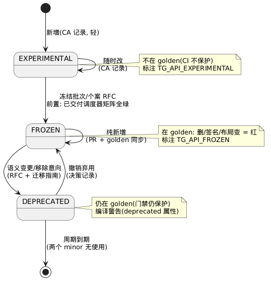

# 1-02 — native API 契约治理 (D12/D13/D14/D15)

> 对应主文档 R7/D12–D15。契约治理三件事: 变更怎么管(D12)、接口插件怎么声明与叠加(D13)、二进制兼容与冻结时点(D14–D15)。
> 状态: **已定稿**(v3)。D12/D13 方案 + D14(二进制兼容 day1) + D15(M3 分批冻结) 均已确认。
> v3: 新增 **§2.6 native API 管理机制详细设计**——管理对象/状态机机械语义/标注编译期行为/golden 管线/变更产物清单/门禁特化(政策 §2.1–2.5 的机械落地)。

## 缩略词(abbreviations)

| 缩略词 | 英文全称 | 说明 |
|---|---|---|
| **ADR** | Architecture Decision Record | 架构决策记录(此处落为 `docs/decisions/NNNN-*.md`) |
| **API** | Application Programming Interface | 应用程序接口 |
| **APP** | Application | 应用(插件类别: 唯一业务逻辑, 恰一个, 不被任何插件依赖) |
| **BSP** | Board Support Package | 板级支持包(SoC 厂商交付的二进制件, D14 面对的现实) |
| **CI** | Continuous Integration | 持续集成(三层门禁的落地处) |
| **EXPERIMENTAL / FROZEN / DEPRECATED** | — | native API 生命周期三态标注(1-02 §2.1) |
| **FUNC / STRUCT / ENUM** | — | golden 记录类型: 函数签名 / 结构布局 / 枚举值(3-01 §13.4) |
| **IETF** | Internet Engineering Task Force | 互联网工程任务组(RFC 体例的来源) |
| **ISR** | Interrupt Service Routine | 中断服务例程(中断上下文中的处理函数) |
| **POSIX** | Portable Operating System Interface | 可移植操作系统接口 |
| **PR** | Pull Request | 合并请求 |
| **RFC** | Request for Comments | 提案文档; 此处指变更提案流程(对齐 IETF RFC 体例) |
| **SoC** | System on Chip | 片上系统 |
| **TLS** | Thread-Local Storage | 线程局部存储(errno 等每线程状态) |
| **VFS** | Virtual File System | 虚拟文件系统(统一可打开模型 + 挂载表) |

> **编号约定**: `D12–D15` = 契约治理四项全局决策; `CA-*` = core API 契约决策(3-01 §14)。

## 1. 问题陈述

native `br_*` API 是全系统第一契约: 所有插件作者都编码面对它, APP 亦不例外——APP 经 Interface 插件(如 `iface-min`)面对 native API(主文档 R7)。(A-2; 见 `brickie` v0.1 §13.2)
它一旦"被顺手改动", 代价分散在所有插件库里, 且无人能完整盘点 → 必须有变更流程与机械门禁。

## 2. D12: 冻结与演化流程

### 2.1 三态生命周期

```
experimental ──(升级评审)──▶ frozen ──(标注)──▶ deprecated ──(弃用周期)──▶ 移除
frozen ◀──(撤销弃用, §2.6.2)── deprecated
```

| 态 | 标注 | 保护 | 变更自由度 |
|---|---|---|---|
| experimental | `BR_API_EXPERIMENTAL` | 无 | 随时可碎, 无流程门槛(改动留 CA 存档, §2.2) |
| frozen | 进入 golden 面 | CI 门禁硬保护 | **单向冻结(append-only 保护)**: 面只能追加, 不能改写/删除已承诺条目 —— **新增=轻量**(即**新增免解冻**), 语义/签名变更或删除=决策记录+弃用周期(须改面时走**解冻 → 重新冻结**, §2.6.2) |
| deprecated | `BR_API_DEPRECATED` | 门禁仍保护 | 存在但警告; 移除需决策记录 + 两个 minor 版本无使用(**v0.1 口径见下注**) |

**冻结节奏: 按子系统分批, 不搞"全部冻结"。** M3 之前不冻结任何东西(M0–M2 是 API 探索期, 冻结会卡死自己, 见 D15)。

> **弃用周期在 v0.1 的口径(`brickie` v0.1 §6.4; `r1/03` P1-5)**: "两个 minor 无使用"拆成两条 —— **声明面零使用是硬门**(v0.1 可统计: 该单元未出现在任何 `requires_iface`/`reexport_of` 中); **符号面零使用(谁在代码里调了它)在 v0.1 无法验证** ⇒ 该项**降级为 warning**(`release` 亦然, `--profile dev` 下只提示, 不阻断 `REMOVED`)。

### 2.2 变更流程: 轻量 RFC(决策记录)

本质: **契约变更权收归流程** —— 不许直接改 frozen 面, 先提案后代码。三个作用:
1. 变更前强制兼容性思考(模板必填节)
2. 给插件作者(利益相关方)否决/知情窗口
3. 决策存档 = 设计考古

小团队落地形态 = **决策记录(ADR 风格) + PR 门钩**, 不是 IETF 仪式:

```
docs/decisions/0007-br-poll.md
  # 0007: 增加 br_poll — 多对象等待
  # 状态: 已接受 | 影响面: frozen(调度框架) 纯新增
  # 动机 / 设计 / 替代方案(为什么不是 br_select) /
  # 兼容性影响(golden +6 符号) / 调度类别影响(三调度器均需实现)

PR 模板: "是否触及 frozen 面?" 勾"是" → 必须链接决策记录, 否则 CI 拒收
```

**阈值表(防止流程卡死开发或形同虚设):**

| 变更 | 流程 |
|---|---|
| experimental 区任意改动 | 无流程门槛(留 CA 存档) |
| frozen 新增纯函数 | 轻量: PR 说明 + 同 PR 更新 golden |
| frozen 语义变更(阻塞行为/错误码/ISR 安全性) | 完整决策记录 + 弃用周期 |
| frozen 删除/签名变更 | 决策记录 + 弃用周期 |
| **解冻 / 重新冻结**(单元级 `freeze_state` 进出 `unfreezing`; 见 §2.6.2) | **最高门槛**(影响所有插件): 需决策记录 + 明确的"改/删哪些已冻结条目"清单; 只有**确有**改/删时才 `COMPAT_GEN+1`(空解冻不 bump) |
| sched_class 契约 / 插件描述符 / 注册表语义 | 最高门槛(影响所有插件) |

### 2.3 兼容 CI 门禁(三层)

**层 1 — 面 diff(机械层): 抓"源码不兼容"**

```
api/frozen/br-sched.txt        ← golden 文件(生成物, 勿手编)
  FUNC br_task_create (br_thread_t**, const br_task_attr_t*)   # v1.0
  FUNC br_task_sleep (br_time_t)                            # v1.0
  STRUCT br_thread_t  # opaque — 无公开字段
  ENUM br_task_prio { BR_PRIO_MIN=0, ... }                  # append-only
```

- CI: 构建产物 vs golden 做 diff。工具: libabigail `abidiff`(现成, 能看穿结构布局)或自研头文件解析
- 规则: **删除/签名变更/布局变更 = 硬红; 新增 = 绿但强制同 PR 更新 golden**(评审者看见面在长大)
- **v0.5(D18)**: `runtime/posix` 的 POSIX 符号面是第二个被治理对象——同一 golden/门禁机制; POSIX 子集从"口头承诺"变成被测试的契约(子集清单成文, 未实现项在链接期暴露)
- **v0.6(D19)/v0.7(D20)**: 框架件(dev-core/cdev-core/vfs-core/bdev-core)的 API 面是第三类被治理对象——通用设备/字符/文件/块设备契约各自独立 golden(`br-devcore.txt`/`br-cdevcore.txt`/`br-vfscore.txt`/`br-bdevcore.txt`), 同一门禁机制

**层 2 — 语义一致性套件(语义层): 抓"编过了但行为变了" + 执法 R1**

- 一套 native API 行为测试(阻塞语义、ISR 安全、错误码、超时精度), 跑在 host 平台插件(CI 秒级)
- 矩阵: **{sched-preempt, sched-coop, sched-tt} × 同一套测试**
- sched_class 声明的机械执法者: 在 sched-preempt 下过不了"抢占安全"用例 ⇒ SAFE_PREEMPT 声明为假(矩阵执法; coop 下不发生抢占, 检验力在 preempt 侧)

**层 3 — 版本矩阵(声明层): 抓"声明的兼容性是愿望"**

- 插件声明 `compat.core = ">=1.2.0"`(3 段 `range`)与**精确钉代**的 `compat_gen`; CI 把全部一方插件 × 声称支持的 core 版本各编一遍
- **依赖必须精确指定 `COMPAT_GEN`; `>=`/`>`/`=` 只比较 `MAJOR.MINOR.REVISE`**(版本 = 四段 `COMPAT_GEN.MAJOR.MINOR.REVISE`; `range` 固定 3 段, 缺段右补 0, 4 段非法。A-12)
- 声称支持但编不过 = 红
- **层 3 对齐 golden 版本戳(§2.6.6)**

### 2.4 API 设计纪律(门禁的另一半)

**最好的兼容流程是让需要冻结的面变小:**

- **不透明句柄优先**: 插件只拿 `br_thread_t*`, 不得嵌入/窥视 core 结构; 访问器函数化
- 必要的内联访问器显式标注 `BR_API_INLINE_FROZEN`
- 枚举只追加、不重排、不当位标志跨版本扩展
- **条目级 `append vs modify` 判定**(冻结面变更的判定表, 与 `brickie` v0.1 §5.4 同源): 「追加」(免解冻) = 新增独立结构体 / 枚举**末尾**追加成员 / 填充预留槽位; 「修改」(**须走硬路径**) = **给已有结构体加/删/重排字段**(D22: 后补字段 = 布局破坏) / 枚举重排或复用旧位 / 已有 service 的 ops 表加槽或改签名 / 改已有宏的值
- **冻结前应预留扩展槽**: 预留即免将来解冻 —— 它把"将来必须走最高门槛"变成"现在就已存在", 让 `COMPAT_GEN` 更稳定(D22 的推广, 冻结评审清单必查项)
- 布局纪律让 abidiff 的"布局面"趋近于零 → 门禁自然轻

### 2.5 静态组合下"兼容"的三层含义(为什么 D14 重要)

| 层 | 含义 | 现实风险(monorepo 源码构建) | 二进制分发后 |
|---|---|---|---|
| 源码兼容 | 头文件改了编不过 | 高 | 高 |
| 语义兼容 | 编过了但行为变了 | 高 | 高 |
| 布局兼容 | 结构偏移变了 | **无**(同树同编译) | **致命** |

车规生态 SoC 厂商交付二进制 BSP(.a)是常态 ⇒ D14 已定 Day1 二进制兼容, 布局从 day 1 按硬契约对待。

### 2.6 native API 管理机制详细设计(D12 的机械落地)

§2.1–§2.5 定义了**政策**; 本节定义**机器**——被管对象、状态机的机械语义、golden 管线、每类变更的完整产物清单。

#### 2.6.1 管理对象与同步规则

| 制品 | 位置 | 性质 |
|---|---|---|
| 头文件族 | `include/br/{br_sched,br_mem,br_mm,br_irq,br_svc}.h`(按 golden 分组, `docs/3-os-core/3-01-core-api-list.md` §1) | 人写(声明) |
| 标注 | 头文件内 `BR_API_EXPERIMENTAL/FROZEN/DEPRECATED` | 人写(声明的一部分) |
| golden | `api/frozen/*.txt` | **生成物**(构建产物符号表, 3-01 §13.4) |
| 决策记录 | `docs/decisions/NNNN-*.md` + 3-01 §14(CA-*) | 人写(流程存档) |
| 每函数规格 | `docs/3-os-core/3-01-core-api-list.md` §2–§9 | 人写(文档跟随) |

**同步规则**(CI 执法): 头文件改动 ⇒ 同 PR 更新 3-01 规格与 golden(若触及 frozen)——**声明的事实来源是头文件, 符号真值是构建产物; 文档与 golden 都是衍生物**。

> **v0.1 的过渡真值(关闭 `r1/02` P1-10)**: 上述"头文件 = 声明真值"是**目标态**; 而 `brickie` v0.1 的**接口面真值暂时是声明文件**(`api/iface/<provider>/<unit>.toml` + `plugin.toml [[export]]`), 因为 v0.1 **无编译、无符号表**。过渡规则(本节即其落点):
> 1. **每个接口单元必须显式声明 `truth`(v0.1 只允许 `"decl"`)与 `hash_scope`(`"decl"`)** —— 即"谁是真值"是**可读、可校验的元数据**, 不是隐性假设(`brickie` v0.1 §6.6 / BRV-D7 的 C 方案);
> 2. **头文件此时不是治理对象**: v0.1 的 golden 门禁仍按 §2.6.4 对 **core 符号面**生效, 但**接口单元的 `iface_hash` 是"声明面 hash", 不是 ABI hash** —— 快照文件头必须印这句话(对应 `brickie` 的 V-11/RV-3);
> 3. **迁移门禁(v0.2 起)**: `truth = "header"` 的单元强制 `brickie iface check` **双算一致**(声明面 hash 与符号面 hash 的**条目集合差为空**), 不一致 ⇒ 红 —— 这条使"真值迁移"成为一次**可验收的开关**, 而不是静默的真值偷换;
> 4. **不新增第三真值**: 声明面与符号面之外, 不得再引入"以文档/以 golden 文本为准"的第三条路径。
>
> 该过渡**只影响接口发布侧**(`brickie iface *`), 不改变本节三层 CI 门禁对 core 符号面的既有执法。

#### 2.6.2 生命周期状态机(机械语义)



> 源文件: [plantUML/1-02-api-contract-governance-01.puml](plantUML/1-02-api-contract-governance-01.puml)

> 注: "CA 记录" = `docs/3-os-core/3-01-core-api-list.md` §14 的契约决策记录(CA-*)——轻量存档; experimental 区改动无流程门槛、仅留此存档(§2.2)。

**两条轴, 缺一不可**(口径来自 `brickie` v0.1 §5.3.1, 本节即其下游落地):

| 轴 | 取值 | 粒度 | 回答 |
|---|---|---|---|
| **`status`**(本节状态机) | `EXPERIMENTAL` \| `FROZEN` \| `DEPRECATED` | **条目** | "这个条目受不受保护?" |
| **`freeze_state`**(单元级瞬态) | `unfrozen` \| `frozen` \| **`unfreezing`** | **接口单元** | "这个单元当前在不在冻结窗口里?" |

> `unfreezing` **不是**第 4 个 `status`: 窗口内的条目**仍是我们不打算放弃的承诺**, 只是正在**重新谈判** ⇒ 单列单元级瞬态, 避免 `frozen → unfreezing` 被误读为"放弃承诺"。

| 转换 | 触发 | 前置条件 | 产物 |
|---|---|---|---|
| *→EXPERIMENTAL | 新增函数 | CA 记录(轻) | 头文件声明 + 3-01 规格 |
| EXPERIMENTAL→FROZEN | 冻结批次(3-01 §15)或个案 RFC | **当期已交付调度器的 conformance 矩阵全绿**(层 2); **v0.1 显式例外见下** | golden 收录 + 标注改 FROZEN + 决策记录 |
| FROZEN→DEPRECATED | 语义变更/移除意向 RFC | 完整决策记录 | 标注改 DEPRECATED(编译警告)+ 迁移指南 |
| DEPRECATED→移除 | 弃用周期到期 | 两个 minor 版本无使用(§2.1) | 删 golden 记录 + 删头文件声明 |
| DEPRECATED→FROZEN | 撤销弃用 | 决策记录 | 标注恢复 |
| **FROZEN→(单元进入 `unfreezing`)** | `brickie iface unfreeze <unit> --note <决策记录>` | **最高门槛**(§2.1/§2.2): 决策记录内必须写明"要改/删哪些已冻结条目" | 单元 `freeze_state: frozen → unfreezing`; 条目 `status` **不变**(仍 `FROZEN`); 新快照 |
| **(单元 `unfreezing`)→FROZEN** | `brickie iface refreeze <unit> [--note <path>]` | 改/删已完成, 且改面动作本身满足对应阈值行(签名变更/删除 ⇒ 弃用周期等) | 单元 `freeze_state` 回 `frozen`; **确有**改/删已冻结条目 ⇒ `COMPAT_GEN+1` + golden 更新, **空解冻 ⇒ 四段全不动** |
| **(单元 `unfreezing`)→release 阻断** | 任何 `brickie check --profile release` | 单元处于 `unfreezing` | **红**: `BRV-IFACE-0009` —— 发布不得停在"半谈判"状态 |

> **两条改面路径(v0.1 §5.3.3 的落地)**: **软路径** = 面内演化(纯语义变更 / 弃用 → RFC + 弃用周期, **不 unfreeze**, `COMPAT_GEN` 不变); **硬路径** = `unfreeze` → 改/删已有条目 → `refreeze`(`COMPAT_GEN+1`)。二者**独立要求**: 删除 frozen 接口走硬路径, **同时**仍须满足 §2.6.5 的弃用周期——一个管兼容代, 一个管通知期。
>
> **`append vs modify` 的判定落在条目内部结构上**(v0.1 §5.4, 详见 §2.4/§4.1): "新增免解冻"**只在条目级成立** —— 给已冻结**结构体加字段**是**修改**(D22"后补字段 = 布局破坏") ⇒ 必须走硬路径。

> **⚠ v0.1 的显式例外(`freeze` 不得真正落 frozen)**: 上表 `EXPERIMENTAL→FROZEN` 的前置是"**当期已交付调度器的 conformance 矩阵全绿**"(层 2), 而 test/conformance 排在 v0.4、golden 排在 v0.6 ⇒ **v0.1 无法完成一次合法冻结**。故 v0.1 的处理是: `brickie iface freeze` **只能生成"待升格提案"**(写入 `build/gen/proposals/<unit>.toml` + 要求 `--note`), **不得落 `frozen` 快照、不得 bump `COMPAT_GEN`**; 真正的升格在 v0.4+(有矩阵)执行。**这是显式例外声明, 不是对状态机的静默偏离** —— 本例外已回灌自 `brickie` v0.1 设计 §6.4(该文档 A-26)。

#### 2.6.3 标注的编译期语义

| 标注 | 编译期行为 | 理由 |
|---|---|---|
| `BR_API_EXPERIMENTAL` | 无警告(文档/CI 层识别) | 探索期调用是常态, 警告太吵 |
| `BR_API_FROZEN` | 无警告 | 正常态 |
| `BR_API_DEPRECATED` | `__attribute__((deprecated("...")))` — **调用处真警告** | 给消费者迁移信号 |
| `BR_API_INLINE_FROZEN` | `static inline` + 布局入 golden(§2.4) | 布局扩散风险, 每个需 CA 记录 |

标注宏与 `BR_API` 可见性宏同文件(`br_api.h`, 3-01 §13.1); **改标注 = 改声明**, 走对应流程。

#### 2.6.4 golden 管线(生成 → 消费)

```
构建(libbrcore.a) → 生成器(nm --defined-only + abidiff)
  → api/frozen/<组>.txt(FUNC/STRUCT/ENUM 记录, §2.3 层 1 格式)
CI 层 1: 构建产物 vs golden diff
  删/签名变/布局变 = 红; 新增 = 绿但强制同 PR 更新 golden
```

- **PR 工作流**: 改头文件 → 本地 `brickie api-dump` 出 diff → 同 PR 提交 golden 变更 → CI 用**独立重生成**比对(防手编 golden 造假)
- 记录粒度: 符号名 / 签名 / 结构布局(不透明体记 `# opaque`) / 枚举值(append-only: 只追加不重排, §4.1)
- **分组 = 冻结批次单元**(3-01 §15): 每文件独立升格, 互不绑架
- **`COMPAT_GEN` 的粒度 = 接口/冻结批次单元**(`br-sched`/`br-mem`/… 每个 golden 文件即一个冻结单元); 插件级取 `max(F_u)` 且该值**仅**用于注册表/显示/结构依赖(**不参与** `range` 比较), 见 `brickie` v0.1 §5.5/§8.1

**IFACE-IR 的 hash 输入字段(声明面 hash 的规范化规则, 本节是下游落点)**: 记录粒度必须覆盖**所有会变的面**, 否则"面变了但 hash 没变"会漏检。以下四条与 `brickie` v0.1 §6.2 的规则 4/7/9/10 一一对应:

| # | 规则 | 理由 |
|---|---|---|
| 1 | `func` 取**规范化签名**(参数名不进 sig; `--strict-params` 可选) | 形参改名是源码兼容的, 不应抖 hash |
| 2 | **`macro` 取宏值、`var` 取常量值、`enum` 取成员表(按声明序)、`service` 取 ops 槽位摘要** 进 hash | `#define BR_MAX 16→4096` 与"已有 service 的 ops 表加槽"必须产生**不同 hash**; 缺这些字段时变更集会错报 `NONE` |
| 3 | 类型别名经 **`[iface.typedefs]` 表显式展开**到规范名 | 避免"同一类型的两种写法"产生两个面; 规则依赖一张必须存在的表 |
| 4 | hash 做**域分隔**(unit id + `hash_rev` 前缀), 且 `strict_params` 存进快照 | 防跨单元碰撞; 防跨环境 hash 抖动 |

#### 2.6.5 变更的完整产物清单(阈值表的机械展开)

| 变更类型 | 决策记录 | golden | 3-01 规格 | conformance | 弃用周期 |
|---|---|---|---|---|---|
| experimental 新增/改动 | CA 记录 | 不涉及 | 更新 | 建议补用例 | — |
| frozen 纯新增 | 轻(PR 说明) | +1 行(同 PR) | 更新 | 新函数用例先行 | — |
| EXPERIMENTAL→FROZEN | 决策记录(批次) | 整组收录 | 状态标注 | **当期已交付调度器矩阵全绿前置** | — |
| frozen 语义变更 | 完整 RFC | 旧记录挂 DEPRECATED | 更新 | 新旧用例并存 | 是 |
| frozen 删除/签名变 | 完整 RFC | 移除(周期后) | 移除 | 移除用例 | 是(两 minor; **v0.1 口径 = 声明面硬门 + 符号面软门, 见 §2.1 注**) |
| **解冻 / 重新冻结**(§2.6.2 的单元级 `freeze_state` 转移) | **最高门槛 RFC**(注明改/删哪些已冻结条目) | 确有改/删 ⇒ 更新并 `COMPAT_GEN+1`; 空解冻 ⇒ **不动** | 随改面动作更新 | 改面动作对应用例 | 视改面动作 |
| sched_class/描述符/注册表 | 最高门槛 RFC | 元契约面 | 主文档 §5/§6 | 全矩阵 | 视影响 |

#### 2.6.6 门禁的 native API 特化

- **层 1 双保险**: 可见性宏(3-01 §13.1 hidden 默认)与 golden 互查——未标注符号泄漏出 `libbrcore.a` = 红; 标注 `BR_API_FROZEN`/`BR_API_DEPRECATED` 而 golden 无记录 = 红; `BR_API_EXPERIMENTAL` 不入 golden(§2.6.2)
- **层 2 是升格前置**(§2.6.2), 不是事后检查——矩阵红 = 不许进 frozen
- **层 3 对齐 golden 版本戳**: golden 文件头记录冻结版本, 插件 `compat.core = ">=x.y.0"`(3 段)配合精确钉代的 `compat_gen` 解析时比对

## 3. D13: 接口声明粒度与叠加

### 3.1 模块级 + export 的四个缺点

1. **中央注册表 = 第二契约 + 治理瓶颈**: 模块→符号映射需要权威定义处; 每个新符号都要动中央文件; "poll 归 fd 还是 event"是语义判断, 争论无客观答案; 注册表自身需要 D12 流程 ⇒ **冻结面 ×2**
2. **分类学难题**: POSIX 不是不相交模块的并集 —— fd 表是 fd/pthread/socket 共享的状态, errno 是全局 TLS。模块所有权暗示状态所有权, 把"状态唯一主人"这个真问题伪装成"命名归属"伪问题
3. **粗粒度排斥(假碰撞)**: 同族接口拆分(posix-base / posix-sockets)被模块边界挡住; 拆细模块 ⇒ 注册表组合爆炸 —— 粒度问题只是下移一层
4. **export 两份真值 + 再导出陷阱**: "声明模块内容" vs "实际导出符号集"永远需要调和机器; 再导出的所有权转移/悬空语义含糊; 静态链接下符号别名(weak/wrap)工具链相关且脆弱

函数级的缺点(对称呈现): manifest 冗长不可读、无自然版本单元、diff 噪音大。

### 3.2 提案: 双层混合

| 层 | 粒度 | 职责 |
|---|---|---|
| 人读层(manifest) | **模块级** | `provides/requires: posix-fd@1.2` — 可读、可版本化 |
| 机器层(真值) | **符号级** | 碰撞检测以链接器符号表为唯一权威 |

**调和机制(消灭漂移):**
- 模块→符号映射由工具从接口插件**公共头文件生成**, 不手工维护
- CI 校验: 声明模块覆盖全部已导出公共符号(不多不少)

**再导出规则:**
- `reexport_of: [...]` 显式声明(声明面即 `[[export]]` 的 **`reexport_of` 列表**; 旧名 `reexports` 已改名, 见 `brickie` v0.1 §13.2 A-11); **不转移所有权**, 纯传递依赖
- **一个皮肤可以同时再导出多个提供者**(判例: `iface-pkcs11` 再导出 `service/crypto` 与 `service/keyring` 两个单元) ⇒ 该字段**必须是列表**, 单值装不下旗舰判例
- **再导出单元的分类必须与皮肤自身的 `api_type` 相等**(分类不变量; 皮肤是 `runtime_adapter` 则被再导出单元也必须是 `runtime_adapter`) ⇒ 该字段同时是分类学的执法点
- **"自有别名面"不走本条**: 若接口插件暴露的是自己拥有的别名面(判例: `iface-min` 的 native 别名层), 则用 `form = "api"` 且 `api_iface` 随该面的规范(`iface-min` ⇒ `api_type = native`), **不需要** `reexport_of` —— 见 `1-01` §7.4 的三种皮肤分类表
- 主人被移除 ⇒ 再导出方组合期报错(依赖声明可见)

**共享状态唯一主人(碰撞检测的真正对象):**
- fd 表等共享状态恰一个 owner; socket 类插件向 owner 注册 file_ops(VFS provider 模式)
- 符号碰撞只是状态所有权冲突的影子 —— 规则写在状态上, 检测落在符号上

### 3.3 与 D12 合流

模块分类表(模块名 → 版本 → 头文件)纳入冻结契约, 走同一套决策记录 + golden + 门禁流程。不新增流程, 只新增一个被管对象。

## 4. 已定决策

| # | 决策 | 结论 | 落地约束 |
|---|---|---|---|
| D14 | 二进制插件分发 | **Day1 按二进制兼容设计** | 不透明句柄纪律**强制化**(插件禁止嵌入/窥视 core 结构, 违者 CI 拒收); 结构布局入 golden **硬门禁**; 为车规 BSP 厂商 .a 交付预留通路。信息隐藏从"风格建议"升格为"架构约束" |
| D15 | 冻结启动时机 | **M3 起分批冻结** | M0–M2: 一切 API 都在 `BR_API_EXPERIMENTAL` 区, 随时可碎; M3: 契约已被 sched-coop + 多接口插件压测(sched-preempt/tt 交付后补跑矩阵并保持全绿), 按子系统分批升格 frozen; 每批升格走一次决策记录 |

### 4.1 D14 强制化的具体含义(写进 CI 与评审清单)

1. core 结构体一律不透明: 头文件只有 `typedef struct br_thread br_thread_t;`, 定义在 core 内部 `.c`
2. 访问器函数化; 性能敏感路径用 `BR_API_INLINE_FROZEN` 标注的**内联访问器**(读简单标量字段), 其布局变更按硬门禁处理
3. 插件禁止 `offsetof`/指针算术窥视 core 对象 —— conformance 套件加静态扫描项
4. 枚举 append-only 进 golden; 位标志集合新增值只许 OR 进, 不许复用旧位
5. 组合工具输出镜像符号表清单(供二进制 BSP 声明依赖与版本核对)
