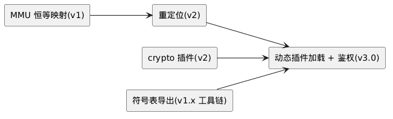

# 1-03 — 版本路线图 (v1.0 → v4.0)

> 依据: 用户手写笔记 `1-01-architecture-comment.md`(仓库外、不随库分发)评审意见。OS 已定名 **brickOS**(D16), 符号前缀 `br_`。
> v3(本轮): 补全**各版本插件清单**(§1 各小节)——清单暴露了网络栈缺口, 补排 `service/lwip` + `io/virtio-net`(v2.0, 需先定 netdev 设备类, `docs/8-device/8-01-device.md` O-S5); 新增"未排期"小节。
> v4(D20): 设备子分类框架化——新增 **cdev-core**(v1.0 框架件 3→4 件); **spi-nor/nand 对接 cdev-core**(flash 子型); netdev 答案空间 = 第三个子分类框架。
> v5(D21): **所有设备经 /dev(devfs)接入 VFS**; 新增 **fs/tmpfs(rootfs)+ fs/devfs**(v1.0 插件 15→17 件); vfs-core 纯化(撤销设备路由)。
> v6(D22/D23): 设备 ops 统一预留 **ioctl/suspend/resume**(PM 钩子); VFS ops 四层分层(**super/inode/file/dentry 预留**, Linux 型), 路径走查移入 vfs-core。
> v7(D24–D26): **HSM 完整样例入 v1.x(新增 M5)**——第二产品域的纵向切片(设备/服务/接口/APP 全栈): 新增 6 件插件(`io/virtio-hsm`、`service/crypto`、`service/keyring`、`service/hsm-host`、`service/seclog`、`iface-pkcs11`)+ 样例 APP `app/hsm`; `iface-pkcs11` 由 v2.0 **前移**; **crypto 服务契约 v1.x 定稿**(服务面 + mbedTLS 算法子集), v2.0 改为后端与算法面扩展(D25, 契约不变); HSM 资产边界**诚实声明**(D26, 见主文档 §14.1「域支撑矩阵」); 设计基线 `docs/9-app/9-02-hsm-sample.md`。

## 缩略词(abbreviations)

| 缩略词 | 英文全称 | 说明 |
|---|---|---|
| **ABI** | Application Binary Interface | 二进制接口: 布局/调用约定; D14 二进制兼容的对象 |
| **AES** | Advanced Encryption Standard | 对称分组密码(crypto 服务 v1.x 算法子集) |
| **API** | Application Programming Interface | 应用程序接口 |
| **APP** | Application | 应用(插件类别: 唯一业务逻辑, 恰一个, 不被任何插件依赖) |
| **ASan** | AddressSanitizer | 内存错误检测器(host 平台插件上白捡, CI 常开) |
| **CI** | Continuous Integration | 持续集成(三层门禁的落地处) |
| **CLI** | Command-Line Interface | 命令行界面 |
| **DMA** | Direct Memory Access | 直接内存访问(外设不经 CPU 读写内存) |
| **DoD** | Definition of Done | 完成定义(此仓库指设计阶段收敛清单) |
| **EROFS** | Enhanced Read-Only File System | 只读压缩文件系统(代码/资产分区, v2.0) |
| **FIFO** | First-In First-Out | 先进先出(队列语义) |
| **FS** | File System | 文件系统(插件类别之一) |
| **GIC** | Generic Interrupt Controller | ARM 通用中断控制器(GICv3 = 其第 3 版) |
| **GPIO** | General-Purpose Input/Output | 通用输入输出(引脚) |
| **HMAC** | Hash-based Message Authentication Code | 基于哈希的消息认证码(HMAC-SHA256) |
| **HSM** | Hardware Security Module | 硬件安全模块(此处指第二产品域: 安全核, v1.x/M5 完整样例) |
| **I/O** | Input/Output | 输入输出; 插件类别 **IO** = 外设驱动 |
| **IPI** | Inter-Processor Interrupt | 核间中断(SMP 用) |
| **IRQ** | Interrupt Request | 中断请求(硬件中断线) |
| **ISA** | Instruction Set Architecture | 指令集架构 |
| **ISR** | Interrupt Service Routine | 中断服务例程(中断上下文中的处理函数) |
| **LZ4** | LZ4 | 快速无损压缩算法(ramdump 压缩用) |
| **M0–M5** | — | v1.0/v1.x 内部里程碑(1-03 §3; M5 = HSM 完整样例) |
| **mbedTLS** | — | 嵌入式 TLS/密码库(crypto 服务候选实现) |
| **MMU** | Memory Management Unit | 内存管理单元 |
| **MPU** | Memory Protection Unit | 内存保护单元(无 MMU 目标的 region 保护) |
| **O-S1–O-S8** | — | 存储与设备域的开放问题编号 |
| **page cache** | — | 页缓存: 堆叠于 bdev 之上的无感层(SD-8) |
| **PKCS#11** | Public-Key Cryptography Standards #11 | 密码 token 接口标准(iface-pkcs11 的语义来源) |
| **PL011** | ARM PrimeCell UART (PL011) | ARM 通用串口外设(v1.0 驱动样例 uart-pl011) |
| **PMIC** | Power Management IC | 电源管理芯片(典型级联中断域来源) |
| **POSIX** | Portable Operating System Interface | 可移植操作系统接口 |
| **QEMU** | Quick Emulator | 开源模拟器(v1 的主要验证平台) |
| **RAM** | Random Access Memory | 随机访问存储器 |
| **RISC-V** | — | 开放指令集架构(备选 target, 未排期) |
| **Rust** | — | 系统级编程语言(架构探索项 rust-core, 未排期) |
| **SHA-256** | Secure Hash Algorithm 256 | 摘要算法(crypto 服务 v1.x 子集; 亦用于 seclog 摘要链) |
| **SMP** | Symmetric Multi-Processing | 对称多处理(多核同构) |
| **SoC** | System on Chip | 片上系统 |
| **TLSF** | Two-Level Segregated Fit | O(1) 动态内存分配算法(此仓库的堆池实现) |
| **TRNG** | True Random Number Generator | 真随机数发生器(平台熵源契约缺口见 9-02 §6.3 O-H1) |
| **UART** | Universal Asynchronous Receiver/Transmitter | 串口 |
| **UDS** | Unified Diagnostic Services | 汽车统一诊断服务(仪表域诊断协议) |
| **USB** | Universal Serial Bus | 通用串行总线 |
| **VA** | Virtual Address | 虚拟地址 |
| **VFS** | Virtual File System | 虚拟文件系统(统一可打开模型 + 挂载表) |
| **WCET** | Worst-Case Execution Time | 最坏执行时间(时间触发调度的输入) |
| **WTFPL** | Do What The Fuck You Want To Public License | 本仓库使用的许可证 |

> **编号约定**: `D*` = 全局决策; `R*` = 风险; `M0–M5` = v1.0/v1.x 内部里程碑(§3); `O-S*` = 存储与设备域开放问题; `O-H*`/`R-H*`/`TC-HSM-*` = HSM 样例的开放问题 / 风险 / 用例(`docs/9-app/9-02-hsm-sample.md`)。

## 0. 战略语境: 原型 → 量产基座

本项目为**实验性原型**, 但可靠性/可移植性/性能指标不可放松; **量产产品计划在成熟基座上二次开发——Unikraft(较成熟的 unikernel)/ rCore(教学核, 原型验证)**。因此项目成功的真实度量是**可迁移的持久资产**, 而非本内核实现本身:

| 持久资产 | 内容 |
|---|---|
| 插件契约 | 描述符、生命周期、sched_class、接口叠加规则 |
| native API 设计 | 不透明句柄 + 三态生命周期(`docs/1-architecture/1-02-api-contract-governance.md`) |
| 组合工具链 | CLI + manifest + 组合期校验规则 |
| 插件组合库 | C 驱动与中间件的大头 |
| 验证体系 | conformance 套件、host 平台插件、trace 工具链 |

设计原则升格: **契约优先于实现** —— 一切接口按"将来要在别的内核上重新实现"的标准设计。

基座选择的含义:
- aarch64 + C ABI + 插件化 → **Unikraft 路径最顺**(同为 C/aarch64/细粒度库组合)
- v4.0 core C→C+Rust 迁移 → 为 **rCore 路径**(Rust/RISC-V 教学核)留门
- conformance 套件就是"可平移性"的量化度量(主文档 R9)

## 1. 版本序列

### v1.0 "walk" — 单核 · 协作 · 静态

| 域 | 内容 |
|---|---|
| ISA | aarch64, QEMU virt 先行, EL1 恒特权 |
| 内存 | **恒等映射**(MMU 用于 region 属性; 虚拟内存 ≠ 多地址空间); TLSF 堆 + per-plugin arena; DMA 友好分配 |
| int | IRQ 框架 + **bottom half(work queue)** —— v1 即首要延迟路径(coop 下=事件队列) |
| sched | **sched-coop**(评审排序; 见下"顺序理由") |
| 插件管理 | 依赖版本区间 + 拓扑排序 + **环检测硬错误** + 版本管理(描述符 v2) |
| 接口 | native API(全 experimental, **完整清单: `docs/3-os-core/3-01-core-api-list.md`**)+ **svc-posix(D18: POSIX 运行时服务, fd/VFS/stdio/pthread 子集)** + iface-posix 薄皮肤 + iface-min |
| 框架件 | **dev-core**(通用设备: 注册表/命名/语义/子分类协议)、**cdev-core**(字符设备 + flash 子型, 依赖 dev-core)、**bdev-core**(bdev 子分类, 依赖 dev-core)、**vfs-core**(br_file/br_open/挂载表)——D19/D20, `docs/8-device/8-01-device.md` §1/§3 |
| 三方移植 | **sqlite 双模式移植作为移植性验证**(主文档 §7.6: 模式 A 直链 svc-posix 跑通, 模式 B native VFS 后端按需)——移植故事是架构的生死线(战略语境) |
| 存储 | VFS + **tmpfs rootfs + devfs(/dev)**(D21)+ block 层 + 可写 FS(littlefs, D17) |
| debug | **trace 插件**(环形缓冲, 主文档 §11) + 最小 debug bridge(memread / trace 流) |
| 工具 | CLI + manifest 校验 + **host 平台插件**(CI + 完整 ASan 白捡) |
| 并发 | 单核 |

**v1.0 插件清单(17 件 + 样例/测试 APP):**

| 插件 | 类别 | 职责 | 依赖 | 里程碑 |
|---|---|---|---|---|
| `platform/qemu-aarch64` | Platform | QEMU virt: EL1、GICv3、PL011、arch timer、恒等映射页表、region 表 | — | M0 |
| `platform/host` | Platform | host 平台(Linux 进程): CI 单测 + 完整 ASan 直通 | — | M3 |
| `sched-coop` | Scheduler | 协作调度: FIFO 事件队列, 锁退化为 irq 锁 | core | M1 |
| `dev-core` | 框架件 | **通用设备**: 注册表 + 命名/语义 + ioctl 编码 + 子分类协议(+open_file 钩子, D19–D21) | core | M2 |
| `cdev-core` | 框架件 | **字符设备子分类**: br_cdev_ops(含 **PM 钩子预留, D22**)+ flash 子型 br_flash_ops + open_file 实现(D20–D23) | dev-core + vfs-core(类型) | M2 |
| `vfs-core` | 框架件 | **纯 VFS**(D21): br_file/br_open 挂载表·单路由/挂载表; **ops 四层分层(D23: super/inode/file/dentry 预留)+ lookup 链走查** | core | M2 |
| `bdev-core` | 框架件 | bdev 子分类 + 几何 + 分区映射器(SD-9, v1.x) | dev-core | M2 |
| `fs/tmpfs` | FS | **rootfs(D21)**: RAM 文件系统, 挂 "/", 预建 /dev /data /tmp | vfs-core | M2 |
| `fs/devfs` | FS | **/dev 设备节点(D21)**: 实时枚举 dev-core 注册表, open 经类钩子 | dev-core + cdev-core + vfs-core | M2 |
| `io/uart-pl011` | I/O | PL011: 早期轮询 console(M0: platform 早期 console, 不注册设备)→ 中断 tty(M2: 注册 cdev) | —(M0)/cdev-core(M2) | M0(轮询)/M2(tty) |
| `io/virtio-blk` | I/O | virtio-mmio 块设备(ISR→bh→信号量, `docs/7-storage/7-02-bdev.md` §5) | bdev-core | M2 |
| `fs/littlefs` | FS | 可写 FS(D17): flash 子型绑定 + QEMU bdev 适配器 | vfs-core + cdev/bdev-core + fs/tmpfs | M2 |
| `svc-posix` | Service | POSIX 运行时(D18): fd/stdio 子集 + libc stub(pthread 子集后置) | vfs-core | M2 |
| `service/trace` | Service | 16B 事件环形缓冲(`docs/5-debug/5-01-debug.md`) | core | M2 |
| `service/dbg-bridge` | Service | COBS/UART 最小命令集 + panic 独立通道 | vfs-core(/dev/uart0)+ trace | M3 |
| `iface-posix` | Interface | 薄皮肤: 再导出 svc-posix + stdio/errno 接线 | svc-posix | M2 |
| `iface-min` | Interface | 极简别名层, 直通 native(`api_type = native`, `form = "api"`; 见 `1-01` §7.4 的皮肤分类表) | core | M2 |
| `app/hello` + conformance | APP | 启动链演示(M0: 直接主循环, 不依赖 iface —— **M0 引导例外**, 此时 Interface 插件尚未交付)+ native API conformance 首版(M3, **用例目录: `docs/6-test/6-01-test.md`**) | —(M0)/iface(M3) | M0/M3 |

注: 框架件、svc-posix 与 fs/tmpfs/fs/devfs 经**依赖闭包**自动进入组合(`brickie add` 无需显式列出; 挂载计划含 "/" 或 "/dev" 即拉入); sqlite(三方移植, 模式 A)在 M2 作为移植性验证件, 不属系统插件。

### v1.x "walk+" — 真实平台(选配)+ HSM 完整样例

**M4(选配)**: `platform/<真实 SoC>` + `io/qspi-nor` 等板级驱动(依战略语境**可降级**为量产基座事项)。

**M5 — HSM 完整样例(D24, 设计基线 `docs/9-app/9-02-hsm-sample.md`)**, 新增 **6 件插件 + 1 样例 APP**:

| 插件 | 类别 | 职责 | 依赖 | 里程碑 |
|---|---|---|---|---|
| `io/virtio-hsm` | I/O | QEMU virt: virtio-serial(virtio-mmio)**虚拟 HSM host 链路**——COBS+CRC16 成帧 + 命令-响应环; ISR→bh→信号量; 注册 `hsm0` → `/dev/hsm0`(D21) | cdev-core | M5 |
| `service/crypto` | Service | 密码服务(注册表名 `crypto`): **v1.x = 服务契约 + mbedTLS 算法子集**(SHA-256 / HMAC-SHA256 / AES-CBC/CTR / DRBG); v2.0 = 后端与算法面扩展(**契约不变**, D25) | core | M5(契约)/v2.0(扩展) |
| `service/keyring` | Service | **密钥资产唯一主人**: 槽位 / 生命周期 / 用途位 / 计数上限 / 加密落盘 `/data/keys`; 对外只给不透明 handle(D14) | core + service/crypto + vfs-core | M5 |
| `service/hsm-host` | Service | **host 协议面**: 解帧 / 命令分派 / 结果回填 / 逐条审计; 唯一接触 host 的服务 | io/virtio-hsm + crypto + keyring + seclog | M5 |
| `service/seclog` | Service | **安全日志**: 只追加 + SHA-256 摘要链 → `/data/seclog`; 与 trace(观测, 可整层移除)职责正交 | service/crypto + vfs-core | M5 |
| `iface-pkcs11` | Interface | **由 v2.0 前移**: 严格叶子薄皮肤, PKCS#11 子集适配 keyring + crypto | service/crypto + service/keyring | M5 |
| `app/hsm` | APP | 密钥策略: 首启 provision / 策略表 / 命令节流 / 审计巡检 | iface-pkcs11(零开销路径由 iface-min 承接; A-2, 见 `brickie` v0.1 §13.2) | M5 |

**M5 的复用量(即"组合即产品"的证据)**: 四件框架件 + `fs/tmpfs`/`fs/devfs`/`fs/littlefs` + `io/virtio-blk` + `service/trace` + `sched-coop` 全部**零改写**, 仅在 manifest 中选取; `iface-posix`/`svc-posix` **不在** HSM 组合内(接口可裁剪的证据)。M5 **不依赖 M4**(可在 QEMU 上独立交付); M4 若先行, 熵源契约缺口(9-02 §6.3 O-H1)可一并收口。

> **与 §4"没有半个能力"的一致性(D25 自检)**: `service/crypto` 在 M5 **不是半成品**——它作为"密码服务"这个能力**完整进入 v1.x**(可用的算法子集 + 冻结的服务契约 + 注册表发布)。v2.0 增加的**不是它的另一半**, 而是**新算法与新后端**(ECC/RSA/ed25519/AEAD/硬件引擎); 消费者代码零改动。判据: 若 v2.0 的 crypto 工作全部取消, M5 的 HSM 样例仍然端到端成立(9-02 §11 A2–A4)——这正是"完整能力"的检验方式。

### v2.0 "run" — 多核 · 抢占 · 重定位

| 域 | 内容 |
|---|---|
| sched | sched-preempt(PI 互斥) |
| 并发 | **SMP**(与抢占同期——无抢占的 SMP 是别扭组合): per-CPU 就绪队列、IPI、锁核间语义 |
| 内存 | **重定位**(镜像可加载到任意 VA; A/B 更新与 v3 动态模块布局的地基) |
| 服务 | **crypto 服务后端升级**(v1.x/M5 已交付服务契约与 mbedTLS 算法子集, D25): 完整算法集(ECC/RSA/ed25519/AEAD)+ 恒定时间加固 + 可选硬件引擎后端 |
| 存储 | **EROFS**(只读压缩代码/资产分区, 挂 /assets; mkfs.erofs 工具链与 Linux 同源) |
| debug | **mini ramdump** + target 侧 memleak(arena 记账)——红区/金丝雀已于 v1.x 落地(5-01-debug §4), 不属 v2.0 交付 |
| 插件 | **Rust 插件支持**(`extern "C"` 边界; D14 二进制兼容纪律照旧) |

> **R8 过载风险**: v2.0 塞了 7 件事(SMP 计在内)。建议内部再分期: **v2a**(单核能力升级: preempt+重定位+crypto 后端+EROFS+ramdump+Rust 插件) → **v2b**(SMP 单独隔离——它触碰锁语义/perCPU/IPI, 波及面最大, 必须独立验证)。

**v2.0 插件清单(6 件):**

| 插件 | 类别 | 职责 | 依赖 |
|---|---|---|---|
| `sched-preempt` | Scheduler | 抢占调度: 位图优先级队列 + PI 互斥(v2b: SMP 化) | core |
| `service/crypto` | Service | **后端升级**(v1.x/M5 已交付契约与子集): 完整算法集 + ed25519(v3 鉴权的前置)+ 恒定时间加固 + 硬件后端 | core(契约同 v1.x) |
| `service/lwip` ★ | Service | 网络栈: svc-posix socket 路由的实现方 | netdev 设备类 [?] |
| `io/virtio-net` ★ | I/O | virtio-mmio 网卡 | dev-core(netdev) |
| `fs/erofs` | FS | 只读压缩 FS + FS 级解压页缓存 | vfs-core + bdev-core |
| `service/ramdump` | Service | fault handler 注册 + LZ4 捕获 + host 离线分析 | core fault 钩子 |

注: `iface-pkcs11` 已由 **v1.x/M5 前移交付**(D24), 不再列于本版; v2.0 对它的影响仅限"底下 crypto 换后端"(契约与皮肤不变); v3 动态加载所需的 **ed25519 能力随本版 crypto 后端交付**(依赖链以重定位(v2)为绑定约束, 见 `docs/1-architecture/1-01-architecture.md` §12)。

注(插件视角的 v2a/v2b): 上表全部插件属 **v2a**; **v2b(SMP)** 是 core/调度框架/锁语义改造, **不是新插件**; 重定位、memleak 记账同理; Rust 插件支持 = 工具链能力。
★ **本轮补排**: 网络栈此前未显式出现在路线图(架构文档已引用——svc-posix socket 路由的实现方), 插件清单暴露的缺口; 前置设计: **netdev**——D20 子分类模型给出答案空间: **netdev-core 作为第三个子分类框架**(依赖 dev-core, 对称 cdev/bdev, `docs/8-device/8-01-device.md` O-S5), v2.0 设计前必须定。

### v3.0 "compose" — 时间触发 · 动态组合

| 域 | 内容 |
|---|---|
| sched | sched-tt(静态调度表 + 周期元数据) |
| 组合 | **动态插件加载 + 鉴权**(D1 修订的落地): ed25519 模块签名验证; 加载期 api_rev/abi_id 复核; 符号表精选导出; 从 FS(EROFS/littlefs)加载 |

依赖链(为什么动态加载只能是 v3):

> 源文件: [plantUML/1-03-roadmap-01.puml](plantUML/1-03-roadmap-01.puml)

**v3.0 插件清单(2 件):**

| 插件 | 类别 | 职责 | 依赖 |
|---|---|---|---|
| `sched-tt` | Scheduler | 静态调度表 + 周期/WCET 元数据 | core |
| `service/modload` | Service | 动态加载+鉴权: ed25519 验签、重定位加载、加载期 api_rev/abi_id 复核、符号表解析 | service/crypto + vfs-core(加载源) |

注: 运行时挂载/热插拔 = vfs-core **增强**(非新插件, `docs/7-storage/7-01-vfs.md` O-S3)——事件模型 v2 设计(与 USB 栈联动), 运行时挂载落地不早于 v3 [?]。

### v4.0 "migrate"
- core C → **C+Rust** 迁移(对齐 rCore 路径; 契约不变, 实现语言演进)
- **无新插件**: Rust 插件支持 v2 已就绪, 本版只做 core 语言迁移, 插件契约全部不变

### vx.0(不定版本)— 插件清单

| 插件 | 类别 | 职责 | 依赖 |
|---|---|---|---|
| `io/pagecache` | I/O(堆叠 bdev) | page cache 无感层(SD-8): 静态预算 · 写穿 · flush 必须转发 | bdev-core |
| MPU 插件 [?] | 待定(框架件?) | D4 分段元数据启用, 插件级内存保护 | core |

(target 完整 ASan = QEMU 工具链实验, 非插件)

### 未排期(架构已提及, 暂无版本归属)

按"持久资产"战略, 量产产品落在成熟基座上; 以下只在原型需要验证时拉入:

- `service/uds`(UDS 诊断, 仪表域)、`service/ota`、`service/log`(结构化日志)
- `io/display` / `io/can` / `io/lin` 等产品驱动(随真实 SoC, M4 选配或量产基座)
- `iface-autosar-ish`(车规域标准示例, 见 `docs/10-interface/10-01-interface.md` §1 [?])

## 2. sched 顺序的理由(coop → preempt → tt)

- coop 先行 = 最小可用调度; **SAFE_PREEMPT 纪律下写的插件在 coop 下天然正确**(锁退化为更便宜的实现) ⇒ v2 引入 preempt 时**插件零改写** —— sched_class 设计的第一次实战验证
- v1 就强制"bottom-half + 锁纪律"的编写习惯, 避免 v2 抢占到来时的全库返工
- preempt 与 SMP 同期(无抢占的 SMP 语义别扭)
- tt 最后: 需要周期元数据、WCET 声明与 conformance 成熟度, 且用户最少(车规确定性专用)

## 3. v1.0 / v1.x 内部里程碑(M 系列, QEMU 先行)

| # | 内容 | 验证目标 |
|---|---|---|
| M0 | 启动链 + 插件管理 | hello + init 链打印 + **环检测用例**(故意造环看组合器报错) |
| M1 | sched-coop + native task API + tickless timer + bottom half | 协作切换、sleep、work 提交/执行 |
| M2 | 框架件四件(dev-core/cdev-core/vfs-core/bdev-core, D19/D20)+ **fs/tmpfs(rootfs)+ fs/devfs(/dev, D21)**+ virtio-blk + littlefs(flash 子型绑定 + QEMU bdev 适配)+ trace ring + **svc-posix(fd/stdio 子集)** | fd 落盘; **/dev 设备节点可 open**; trace 解码; **sqlite 模式 A 移植跑通(移植性验证)** |
| M3 | bridge 最小集 + host 平台插件 + CLI + conformance 首版 | **v1.0 完整化 + native API 冻结启动(D15)** |
| M4(v1.x, 选配) | 首个真实 SoC platform 插件 + PMIC/GPIO **级联域驱动**(域 API 实战, `docs/3-os-core/3-01-core-api-list.md` §8.1) | 契约虚拟→真实迁移成本; 依战略语境**可降级为选配**(量产在成熟基座上) |
| **M5(v1.x)** | **HSM 完整样例**(D24, 第二产品域纵向切片): M5 清单 6 件插件 + `app/hsm` + 复用 v1.0 全栈; 设计基线 `docs/9-app/9-02-hsm-sample.md` | **组合即产品**(增量只有 APP + manifest, 9-02 §11 A1)+ **置换证明**(调度器/密码后端/接口各换一次, 源码零改写)+ 策略与审计链闭环(A2–A4)+ TC-HSM 用例全绿(A6) |

> M4 与 M5 **无依赖关系**: M5 可在 QEMU 上独立交付(virtio-serial 对端, 9-02 §7.1); M4 若先行, HSM 的熵源契约缺口(9-02 §6.3 O-H1)可一并收口。

## 4. 版本号政策

- 主版本 = 能力代际(如上), **不承诺时间**
- native API 冻结节奏: M3 起按子系统分批升格 frozen(`docs/1-architecture/1-02-api-contract-governance.md` §2.1)
- 每版发布物: 镜像 + conformance 报告 + 插件兼容矩阵
- 一个能力只有"进了哪个版本"和"没进", 没有"半个" —— 防止半成品契约外泄

## 5. 设计阶段完成清单(v1.0 设计 DoD)—— README 触发条件

> 约定: **README 在 v1.0 全部设计与 milestone 讨论完成后编写**。以下清单全部收敛即触发; 它同时也是设计阶段的议题议程。

| # | 待收敛项 | 产出形态 |
|---|---|---|
| 1 | D7(Service 插件边界)/ D8(中断线程化)收口 | 决策记录入主文档 §1 |
| 2 | **native API 头文件级规格**(第一契约的完整形态: 任务/时间/锁/内存/中断/注册表) | **清单+管理机制已完成**: `docs/3-os-core/3-01-core-api-list.md`(48 函数+3 宏, CA-1~10, 符号导出 §13, 函数规格样例 §2)+ `docs/1-architecture/1-02-api-contract-governance.md` §2.6(生命周期状态机/golden 管线/变更产物清单); 头文件草案待写 |
| 3 | **br_sched_ops 完整规格** + sched-coop v1 语义(yield 点、事件队列、work queue 行为) | 规格文档 |
| 4 | 插件描述符 + manifest 文件格式定稿(组合器输入) | 格式规范 + 校验规则清单 |
| 5 | 构建系统与仓库骨架(构建系统选型论证——make/CMake/自研 [?], 见 `docs/2-toolchain/2-01-toolchain.md` §3; 目录布局、链接脚本、QEMU 脚本) | 设计文档 |
| 6 | host 平台插件架构(core+插件 → Linux 进程的映射规则) | 设计文档 |
| 7 | M0–M5 每个里程碑的验收标准细化(现在只有一句"验证目标"; **M5 已有 6 条 A1–A6**, 见 `docs/9-app/9-02-hsm-sample.md` §11) | 里程碑 DoD |
| 8 | trace 事件 id 分配方案 + bridge 最小命令集定稿 | 定稿入 `docs/5-debug/5-01-debug.md` |

README 内容预案(届时一次写完): 定位一句话、文档导览(1-01–1-03; 5-01 在 5-debug)、两域示例(主文档 §14; HSM 域可运行样例 = `docs/9-app/9-02-hsm-sample.md`)、QEMU 快速上手、许可证(WTFPL)。
