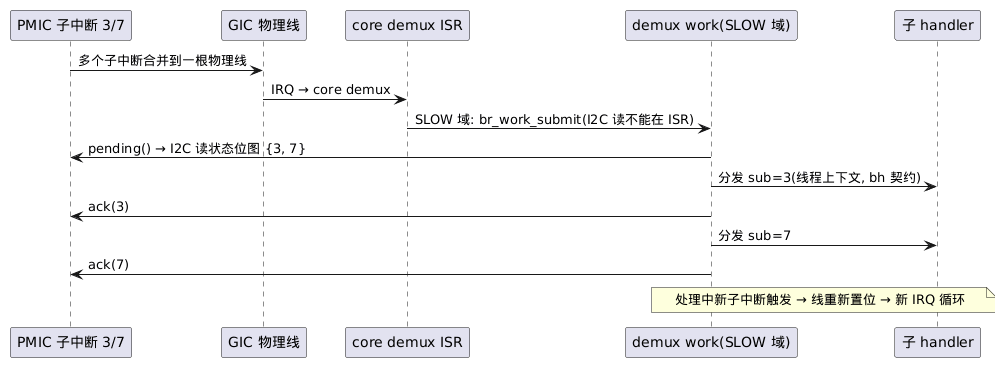

# 3-01 — Core Native API 清单与详细设计(第一契约的完整形态)

> 对应主文档 §4.5(native API + 服务注册表); 治理: `docs/1-architecture/1-02-api-contract-governance.md`; **这是 `docs/1-architecture/1-03-roadmap.md` §5 DoD 第 2 项的清单与详细设计部分**, 头文件草案随后。
> 状态: **全部 `BR_API_EXPERIMENTAL`**(D15: M0–M2 随时可碎, M3 起分批升格 frozen 并进 golden)。
> 范围: **core 拥有的 API**——框架件契约(`7-01-vfs`/`7-02-bdev`/`8-01-device`)与 svc-posix 符号面(D18)不在本清单。
> 规模: **48 函数 + 3 静态定义宏**(CA-5: 面目标 ≤50, 余量 2)。
> 详细设计约定: 以任务组为样例(§2.1/§2.2)——每组两小节: **语义规格**(每函数: 错误/阻塞/归属)+ **实现设计**(数据结构/不变量/竞态); "归属" = core / 调度插件 / platform(三层, 主文档 §4.1)。

## 缩略词(abbreviations)

| 缩略词 | 英文全称 | 说明 |
|---|---|---|
| **AAPCS64** | ARM Architecture Procedure Call Standard (AArch64) | ARM 64 位过程调用标准(ABI 的一部分) |
| **API** | Application Programming Interface | 应用程序接口 |
| **CA-1–CA-10** | — | core native API 契约决策编号(3-01 §14) |
| **CPU** | Central Processing Unit | 处理器核 |
| **DMA** | Direct Memory Access | 直接内存访问(外设不经 CPU 读写内存) |
| **ELF** | Executable and Linkable Format | 可执行与可链接格式(链接产物/符号表载体) |
| **errno(E*)** | error number | POSIX 错误码; core 以**负值**返回 `-EINVAL`/`-EAGAIN`/`-ETIMEDOUT`/`-ENOTSUP`/`-EBUSY`/`-EEXIST`/`-EIO`/`-ENODEV`/`-ENOMEM`/`-ENOSPC` 等, 域用子集 |
| **FAST / SLOW** | — | 级联中断域双上下文契约(CA-9): FAST = ISR 内可读寄存器, SLOW = 仅下半部(bh)可读 |
| **GIC** | Generic Interrupt Controller | ARM 通用中断控制器(GICv3 = 其第 3 版) |
| **GPIO** | General-Purpose Input/Output | 通用输入输出(引脚) |
| **I2C** | Inter-Integrated Circuit | 板级两线串行总线 |
| **I/O** | Input/Output | 输入输出; 插件类别 **IO** = 外设驱动 |
| **ISR** | Interrupt Service Routine | 中断服务例程(中断上下文中的处理函数) |
| **MMU** | Memory Management Unit | 内存管理单元 |
| **PIC** | Programmable Interrupt Controller | 可编程中断控制器(实现归 Platform 插件) |
| **PMIC** | Power Management IC | 电源管理芯片(典型级联中断域来源) |
| **POSIX** | Portable Operating System Interface | 可移植操作系统接口 |
| **RAM** | Random Access Memory | 随机访问存储器 |
| **READY / RUNNING / BLOCKED / ZOMBIE** | — | 任务状态(ZOMBIE = 已退出待 join 回收) |
| **SMP** | Symmetric Multi-Processing | 对称多处理(多核同构) |
| **SP** | Stack Pointer | 栈指针(初始 SP 需 16 字节对齐, AAPCS64) |
| **TCB** | Task Control Block | 任务控制块(任务的全部元数据) |
| **TLSF** | Two-Level Segregated Fit | O(1) 动态内存分配算法(此仓库的堆池实现) |

> **编号约定**: `CA-1–CA-10` = 本篇 §14 的契约决策; 分组名 `br-sched`/`br-mem`/`br-mm`/`br-irq`/`br-svc` = golden 冻结单元。

## 0. 契约分层(谁拥有什么)

| 契约层 | 拥有者 | golden 文件 | 文档 |
|---|---|---|---|
| **native API(本清单)** | core | `br-sched/br-mem/br-mm/br-irq/br-svc.txt` | 本文 |
| 框架件 API | dev-core / cdev-core / vfs-core / bdev-core | `br-devcore/br-cdevcore/br-vfscore/br-bdevcore.txt` | `docs/7-storage/7-01-vfs.md`–`8-01` |
| POSIX 符号面 | svc-posix | `br-svcposix.txt` | 主文档 §7 |
| 插件元契约(描述符/生命周期) | core(plugin_manager) | —(冻结元契约) | 主文档 §6.1 |

**刻意不在本清单上**(防面膨胀, 同样是契约): fd/文件/挂载(vfs-core)、设备/cdev/bdev/flash(dev-core/cdev-core/bdev-core)、POSIX 符号(svc-posix)、SMP 原语(v2: per-CPU/IPI)、async I/O(v2+)、per-plugin arena 归属分配(v2, memleak 记账 `docs/5-debug/5-01-debug.md` §4)。

## 1. API 总览(按 golden 分组)

| golden 文件 | 组 | 函数数 | ISR-safe | 冻结批次建议(D15) |
|---|---|---|---|---|
| `br-sched.txt` | 任务/同步/时间/工作(调度框架组, §2–§5) | 21 | sem_give, work_submit | **第二批**(需当期已交付调度器的 conformance 矩阵压测; sched-preempt/tt 交付后追加矩阵行) |
| `br-mem.txt` | 堆/连续内存/页/DMA(§6) | 11 | 无 | 第一批(contig/page 实现建议 v1.0, 主消费方 v1.x+) |
| `br-mm.txt` | MMU/cache(§7) | 5 | 无 | 第一批(签名 M2 起定稿——主文档风险 R4; M3/v1.0 升格 frozen, D15) |
| `br-irq.txt` | 中断 + 级联域(§8) | 9 | lock/unlock | 基础五件第一批; 域四件随 M4 实现后冻结 |
| `br-svc.txt` | 服务注册表(§9) | 2 | 无 | 第一批 |

## 2. 任务与线程(br-sched 组)

```c
typedef struct br_thread br_thread_t;            /* 不透明(D14) */

typedef struct {
    const char *name;         /* trace/诊断显示 */
    void        *stack;       /* NULL = br_malloc 分配 */
    size_t       stack_size;
    uint8_t      prio;        /* sched-preempt 使用; coop 忽略(主文档 §5.2) */
    uint32_t     flags;       /* BR_TASK_F_* (append-only, D14) */
} br_task_attr_t;                                 /* 入参结构, 布局进 golden */

int  br_task_create    (br_thread_t **t, const br_task_attr_t *attr,
                        void (*entry)(void *), void *arg);
int  br_task_join      (br_thread_t *t, int *exit_code);   /* 阻塞回收 */
void br_task_exit      (int code);                 /* 只能结束自身 */
void br_task_yield     (void);       /* coop: 强制切换点; preempt: 提示 */
int  br_task_sleep     (br_time_t rel_us);
int  br_task_sleep_until(br_time_t abs_us);
br_thread_t *br_task_self(void);
```

- 全部 **thread-only**(ISR 禁令, §11)
- `prio` 的 sched_class 交互: coop 忽略、preempt 使用、tt 由调度表决定——属性是"建议", 语义归调度插件
- v1 无 task_wakeup(外部唤醒一律经同步原语, 避免竞态 API)

### 2.1 语义规格

| 函数 | 语义 | 错误 | 阻塞 | 归属 |
|---|---|---|---|---|
| `br_task_create` | 分配 TCB+栈, 构造初始栈帧, 交调度器入列 | `-EINVAL`(attr NULL / 栈过小) / `-ENOMEM` | 否 | core 构造 + `sched_ops.thread_ready`(入列) |
| `br_task_join` | 等待目标退出并回收 TCB/栈 | `-EINVAL`(自 join / 已被 join) | 是 | core(join 等待)+ sched_ops |
| `br_task_exit` | 置 exit_code, 标 ZOMBIE, 唤醒 joiner, 切走(不返回) | — | n/a | core + `sched_ops.thread_block` + `sched_ops.pick_next` |
| `br_task_yield` | 交出 CPU | — | 切换 | core 发起 + `sched_ops.pick_next` |
| `br_task_sleep` | 挂超时表切走, 到期唤醒(不早醒, 晚到无上界) | `-EINVAL`(如 `BR_TIMEOUT_INF`——`br_time_t` 为无符号, 无"负值"可言) | 是 | core 超时框架 + sched_ops |
| `br_task_sleep_until` | 同上; 期限已过 → 立即返回 0 | 同上 | 是 | 同上 |
| `br_task_self` | current 指针 | — | 否 | core |

### 2.2 实现设计

- **TCB = core 公共头 + 调度插件私有尾**(CA-2 同型): 公共头{state/prio/name/stack 基与顶/exit_code/join 链}; 私有尾{就绪队列节点/时间片/PI 字段}; `sizeof` 来自调度插件头
- **线程状态机**(core 拥有): `NEW → READY ⇄ RUNNING`; `RUNNING → BLOCKED`(等待队列+超时表)与 `BLOCKED → READY`(唤醒); `RUNNING → ZOMBIE`(`br_task_exit` 仅自身可调)→(join 回收)
- **上下文切换 asm = core**(主文档 §4.1): callee-saved 集; 初始栈帧由 create 构造, entry 经 **trampoline**——忘记 join 的线程从 trampoline 调 `br_task_exit`, 不返回野地址
- **current 指针**: `TPIDR_EL1`(core 独占; v2 per-CPU)
- 栈约束: `stack_size ≥ BR_STACK_MIN`(2K [?]), **初始 SP 16 字节对齐**(AAPCS64: 栈大小为 16 的倍数); 栈保护区(guard region)= vx.0
- join 回收: ZOMBIE 立即回收; create 时 `stack==NULL` 的栈经 `br_free` 归还(仅此路径)

## 3. 同步原语(br-sched 组; 实现在调度插件, 主文档 §5.1)

```c
typedef struct br_mutex br_mutex_t;               /* 不透明; 布局见 CA-2 */
typedef struct br_sem   br_sem_t;
typedef struct br_cond  br_cond_t;

#define BR_MUTEX_DEFINE(name)        ...   /* 静态定义(core 公共头+调度插件私有尾) */
#define BR_SEM_DEFINE(name, init)    ...
#define BR_COND_DEFINE(name)         ...
int br_mutex_init (br_mutex_t *m);                /* DEFINE 之外的动态路径 */
int br_sem_init   (br_sem_t *s, unsigned initial);
int br_cond_init  (br_cond_t *c);

int br_mutex_lock    (br_mutex_t *m);             /* 阻塞至获得 */
int br_mutex_lock_to (br_mutex_t *m, br_time_t timeout);  /* trylock = ZERO */
int br_mutex_unlock  (br_mutex_t *m);

int br_sem_take (br_sem_t *s, br_time_t timeout); /* INF/ZERO/相对值(CA-4) */
int br_sem_give (br_sem_t *s);                    /* ISR-safe(CA-3) */

int br_cond_wait     (br_cond_t *c, br_mutex_t *m, br_time_t timeout);
int br_cond_signal   (br_cond_t *c);
int br_cond_broadcast(br_cond_t *c);
```

- **CA-2 对象布局**: core 公共头(状态字)+ 调度插件私有尾(PI 字段等); `BR_*_DEFINE` 宏展开的 `sizeof` 由所选调度插件头决定——静态组合天然成立; 二进制分发时公共头入 core golden, 私有尾入调度插件 golden(abi_id, D14)
- coop 下锁退化(主文档 §5.2): mutex ≈ irq 锁包装——同一 API, 不同成本

## 4. 时间(br-sched 组; tickless 框架, 平台 timer 供节拍)

```c
typedef uint64_t br_time_t;               /* 微秒(CA-1) */
#define BR_TIMEOUT_INF  UINT64_MAX
#define BR_TIMEOUT_ZERO 0

br_time_t br_clock_now(void);
br_time_t br_deadline_from_now(br_time_t rel_us);   /* 绝对期限构造 */
```

**CA-1 微秒**: ns 计量的 32 位中间量换算溢出陷阱多, us 对 tickless 精度足够; arch timer 的 ns→us 换算收敛在 core(平台差异不外泄)。

- `br_clock_now` 单调不减(6-01-test INV-5 执法)

## 5. 延迟工作(br-sched 组; bottom half, 实现在调度插件)

```c
int br_work_submit(void (*fn)(void *), void *arg);  /* ISR-safe; 队列满 → -EAGAIN */
```

- 队列深度 = manifest 静态声明(资源预算, 主文档 §6.4)
- v1 无 work 对象/cancel——fn+arg 裸提交; v1.0 即上线(评审要求: coop 下=事件队列)

## 6. 内存(br-mem 组; TLSF 堆 + 连续池 + 页池, 三池由 region 表/manifest 划分)

```c
/* ---- 字节堆(TLSF) ---- */
void *br_malloc (size_t n);
void *br_calloc (size_t n, size_t size);
void *br_realloc(void *p, size_t n);       /* svc-posix 的 libc stub 需要 */
void  br_free   (void *p);

/* ---- 物理连续内存(CA-7): 独立 contig 池, 不走 TLSF 堆 ---- */
int  br_mem_alloc_contig(size_t size, size_t align, void **out);
void br_mem_free_contig (void *ptr, size_t size);
   /* 服务无 scatter-gather 的 DMA 引擎、v2 重定位的大块搬运;
      帧缓冲类大固定块走 region 表静态预留, 不走运行时分配 */

/* ---- 页分配器(CA-8): 页粒度, 静态位图 + 连续 run 首次适配 ---- */
#define BR_PAGE_SIZE  ...                   /* 平台编译期常量(4K/16K/64K) */
void *br_page_alloc (size_t n_pages, uint32_t attrs);   /* BR_PAGE_F_* */
void  br_page_free  (void *vaddr, size_t n_pages);
   /* v1 消费者: 无(恒等映射页表由 platform early_init 先于页池构造, 不经本 API——TC-MM-003: v1 br_mm_map = -ENOTSUP);
      v1.x/v2: 无 SG DMA 大缓冲、page cache、EROFS 解压页; v3: 模块加载 */

/* ---- DMA(建于 contig 之上: 保证物理连续) ---- */
typedef struct { void *vaddr; uintptr_t dma_addr; size_t size; } br_dma_buf_t;
int br_dma_alloc (size_t n, uint32_t attrs, br_dma_buf_t *out);
        /* attrs: BR_DMA_F_*(对齐/cache 属性, append-only); v1 恒等: dma_addr==vaddr(CA-6) */
int br_dma_free  (const br_dma_buf_t *b);
int br_heap_usage(size_t *used, size_t *total);   /* arena 记账/bridge 上报 */
```

- **三池划分**: platform region 表把 RAM 划为 heap / contig 池 / 页池, 比例 = manifest 预算(主文档 §6.4 资源总账)——静态组合下无运行时协商
- per-plugin 归属分配(`br_malloc_a` 类) = **v2**(memleak 记账, `docs/5-debug/5-01-debug.md` §4), v1 只有全局堆 + heap_usage 统计
- `sbrk` 挂接点: svc-posix 的 libc stub → 本组(主文档 §4.5)

## 7. MMU 与 cache(br-mm 组; 接口在 core, 构造在 ISA 库 + platform 数据, 主文档 §8)

```c
typedef struct {
    uintptr_t base, size;
    uint32_t  attrs;        /* BR_MM_RO | BR_MM_NX | BR_MM_DEVICE | BR_MM_CACHED(append-only) */
} br_mm_region_t;

int br_mm_region_add(const br_mm_region_t *r);   /* platform early_init 声明恒等区(主文档 §9) */
int br_mm_map  (const br_mm_region_t *r);        /* v2 重定位主用; v1 签名定稿(R4), M3/v1.0 升格 frozen(D15) */
int br_mm_unmap(uintptr_t addr, size_t size);

int br_mm_cache_flush     (void *addr, size_t size);   /* 驱动 DMA 前后(R4) */
int br_mm_cache_invalidate(void *addr, size_t size);
```

## 8. 中断(br-irq 组; PIC 实现 = platform 三层模式)

```c
typedef struct { uint8_t prio; uint8_t trigger; uint32_t flags; } br_irq_attr_t;

int br_irq_register(uint32_t irq, void (*isr)(void *), void *arg,
                    const br_irq_attr_t *attr);
int br_irq_enable (uint32_t irq);
int br_irq_disable(uint32_t irq);

typedef uint32_t br_irq_state_t;                 /* 不透明状态字, 布局进 golden */
br_irq_state_t br_irq_lock  (void);              /* ISR-safe(嵌套计数在 core) */
void           br_irq_unlock(br_irq_state_t st); /* ISR-safe */

/* v2: br_fault_handler_register() — 同步异常钩子, ramdump 挂接(主文档 §4.2, docs/5-debug/5-01-debug.md §3) */
```

- **ISR 契约**(主文档 §4.2): ISR 内最小工作 → `br_work_submit`; 禁阻塞/malloc/持锁跨返回
- prio/trigger 的解释权在 platform(PIC ops), core 只传递

### 8.1 级联中断域(CA-9): PMIC/GPIO 等复用线的 demux

**场景**(评审提出): `device_xxx(如 PMIC) → GIC → CPU`——CPU 收到中断, 先定位到 PMIC 设备, 再经 PMIC **找到真实子中断**。一根物理线承载 N 个子中断源(PMIC 的电池/温度/电源键/充电…; GPIO 控制器的 N 个引脚)。

```c
typedef struct br_irq_domain br_irq_domain_t;      /* 不透明 */

typedef struct br_irq_domain_ops {
    void (*pending)(void *priv, uint32_t *bits, size_t nwords);
        /* 挂起查询: core 提供位图缓冲(容量 = ceil(n_sub/32) 字), 驱动填当前 pending */
    void (*mask)  (void *priv, uint32_t sub);      /* 子中断屏蔽 */
    void (*unmask)(void *priv, uint32_t sub);
    void (*ack)   (void *priv, uint32_t sub);      /* 子中断应答(core 在子 handler 返回后调用) */
} br_irq_domain_ops;

#define BR_IRQ_DOMAIN_F_FAST 0x0   /* 状态寄存器内存映射(GPIO 控制器): demux+子handler 在 ISR 上下文 */
#define BR_IRQ_DOMAIN_F_SLOW 0x1   /* 状态读取需总线事务(I2C/SPI PMIC): demux+子handler 在 bh/线程上下文 */

br_irq_domain_t *br_irq_domain_create(const char *name, uint32_t parent_irq,
                                      uint32_t n_sub, uint32_t flags,
                                      const br_irq_domain_ops *ops, void *priv);
int br_irq_register_child(br_irq_domain_t *dom, uint32_t sub,
                          void (*isr)(void *), void *arg, const br_irq_attr_t *attr);
int br_irq_enable_child (br_irq_domain_t *dom, uint32_t sub);
int br_irq_disable_child(br_irq_domain_t *dom, uint32_t sub);
```

**运行模型**(SLOW 域, 以 PMIC 为例):



> 源文件: [plantUML/3-01-core-api-list-01.puml](plantUML/3-01-core-api-list-01.puml)

- **FAST 域**(GPIO 控制器, 状态寄存器内存映射): pending → 分发 → ack 全在 demux ISR 内完成, 子 handler = **ISR 契约**
- **子 handler 契约随域类型**(conformance 分档执法): FAST = ISR 纪律(§11 白名单); SLOW = 线程上下文(bh 契约: 可短临界操作, **禁长阻塞**——会堵 demux 工作队列)
- 子中断 enable/disable → `domain_ops.mask/unmask`; 整线开关仍走 `br_irq_enable(parent_irq)`
- trace: 子中断为独立事件(id 由域分配)——中断可观测性不打折
- v1 单层级联; **嵌套域**(GPIO 扩展器挂 PMIC 之后)= 开放问题; **共享线**(无状态寄存器的多设备并线)= 明确非目标——每根物理线恰一属主, 复用一律走域
- 实现批次: API 定稿于本清单; 实现随 **M4**(真实 SoC 的 PMIC/GPIO), QEMU virt 的 PL061 GPIO 可作提前 conformance 夹具 [?]

## 9. 服务注册表(br-svc 组; core 公地, 插件间无环会合点)

```c
int  br_service_publish(const char *name, const void *ops);   /* 重复 → -EEXIST */
const void *br_service_lookup(const char *name);              /* NULL = 不存在 */
```

- core 只管**名字 → 指针**, 不解释 ops 类型——类型契约由服务方文档化(`docs/8-device/8-01-device.md` §1 消费者依赖声明表即用法总览)
- lookup 应在依赖方 init(LATE)使用; init 顺序由依赖声明保证(主文档 §6.5)

## 10. 插件侧 / 平台侧的 core 拥有接口(面向特定作者, 不属通用 native API)

| 接口 | 面向 | 权威定义 |
|---|---|---|
| `br_sched_register(const br_sched_ops *)` + `br_sched_ops` | 调度插件(EARLY, 恰一次, 二次→panic) | 主文档 §5.1 |
| `BR_PLUGIN(...)` 宏 + `br_plugin_t` 描述符 | 全部插件(元契约, 冻结) | 主文档 §6.1 |
| `br_pic` ops 表(中断控制器实现) | Platform 插件(填表) | 主文档 §8 |
| 早期 console 协议(轮询 putc) | Platform 插件 | 主文档 §8 |
| `br_mm_region_add`(§7; 兼属 native API, §1/§7) | Platform 插件(early_init) | 本文 §7 |

## 11. ISR-safe 白名单(CA-3)与错误码

**白名单(可在 ISR 上下文调用的全部 core API)**:

| API | 用途 |
|---|---|
| `br_work_submit` | ISR 的唯一正规延迟路径 |
| `br_sem_give` | ISR 直接触发等待者(virtio-blk 类) |
| `br_irq_lock` / `br_irq_unlock` | ISR 内嵌套临界区 |
| `BR_TRACE_EVT` 宏(`docs/5-debug/5-01-debug.md` §1) | 中断内追踪 |

其余**全部 thread-only**——静态扫描执法(D10 双保险之一; conformance 矩阵 = R1 执法); 设备/存储域 API 白名单为空(`docs/8-device/8-01-device.md` §4)。
**级联域子 handler 例外**: 契约随域类型——FAST 域子 handler 运行于 ISR 上下文(白名单纪律适用), SLOW 域子 handler 运行于线程上下文(bh 契约, §8.1)。

**错误码**(SD-10 全集的 core 域子集; 全集与设备域子集见 `docs/8-device/8-01-device.md` §4): int 返回, 负 errno 子集 `-EIO/-EAGAIN/-EINVAL/-ENOMEM/-ENODEV/-ENOTSUP/-EBUSY/-EEXIST/-ETIMEDOUT`(末项 = 阻塞超时统一, INV-1/CA-4——`docs/6-test/6-01-test.md` 用例设计前置补入); svc-posix 取 `-ret` 作 errno。

> **待收口(O-H8, v1.x/M5 提出)**: HSM 样例需要"权限类"错误码表达**策略拒绝**(用途位不符 / 超计数上限 / 禁止导出)——现有子集只有 `-EINVAL`/`-ENOTSUP` 等, 无 `-EPERM`。`docs/9-app/9-02-hsm-sample.md` §4.2 声明 HSM 域子集**新增 `-EPERM`**, 收口动作 = 并入本节与 `docs/6-test/6-01-test.md` INV-4 清单(先例同 `-ETIMEDOUT`: 用例设计前置暴露); 若核心域最终拒绝扩展, 样例退化为 `-EINVAL`。

## 12. 命名规范与类型总表

- 函数 `br_<对象>_<动作>`; 类型 `br_*_t`; 宏/常量 `BR_*`; 段名 `.br_*`
- `BR_API_EXPERIMENTAL` 标注于 M0–M2 全部声明; **golden 收录 = frozen**(1-02 §2.1 三态)

| 类型 | 组 | 备注 |
|---|---|---|
| `br_time_t`(uint64 微秒) | 时间 | CA-1 |
| `br_thread_t` / `br_task_attr_t` | 任务 | 不透明 / 入参布局进 golden |
| `br_mutex_t` / `br_sem_t` / `br_cond_t` | 同步 | 不透明, CA-2 布局 |
| `br_dma_buf_t` | 内存 | CA-6: v1 恒等 |
| `br_mm_region_t` | MMU | attrs append-only |
| `br_irq_attr_t` / `br_irq_state_t` | 中断 | state 布局进 golden |

## 13. 符号导出机制(声明 → 可见性 → 链接 → 验证)

native API 的"导出"不是运行时机制, 而是**编译期可见性 + 静态链接 + golden 符号表真值**的四层约定(CA-10):

### 13.1 可见性层: hidden 默认, `BR_API` 显式导出

```c
/* br_api.h — 全库统一 */
#define BR_API        __attribute__((visibility("default")))
#define BR_API_INLINE_FROZEN static inline   /* 布局受控访问器(1-02 §2.4/§2.6.3: 布局入 golden, 每例需 CA 记录) */
```

- core 与全部插件统一 `-fvisibility=hidden`: **默认全隐藏**
- native API 声明处显式标 `BR_API` → 只有契约符号对外可见; core 内部符号(调度私有函数等)不泄漏
- **"面小"(CA-5)从约定变编译器执法**: 想导出必须显式标注, 评审可见

### 13.2 声明层: 头文件 = 唯一入口

- 头文件按 golden 分组(`br_sched.h`/`br_mem.h`/`br_mm.h`/`br_irq.h`/`br_svc.h`, §1)
- 三态标注(`BR_API_EXPERIMENTAL/FROZEN/DEPRECATED`, 1-02 §2.1)编译期零成本, 真值在 golden
- **D13 双层**: 模块级声明(头文件分组)+ 符号级真值(golden 从构建产物生成, 非手写)

### 13.3 链接层: 静态组合, 函数指针协作

- 全镜像 ELF 静态链接: core = `libbrcore.a`, 插件 = `.o/.a`; 未定义 `br_*` = 链接错(依赖漏声明)
- **`br_*` 保留前缀的机械执法**: 重复强符号 = 链接错误(主文档 §7.2 规则 4)
- **插件导出面近零**: 插件间协作走**函数指针**(注册表 publish/lookup、ops 表注册), 不依赖链接符号——

```c
/* 描述符收集(3-05-plugin-mgr 契约): 无需导出任何符号 */
#define BR_PLUGIN_SECTION __attribute__((used, section(".br_plugins")))
static const br_plugin_t BR_PLUGIN_SECTION my_plugin = { ... };
/* plugin_manager 经链接器边界符号枚举 */
extern const br_plugin_t __br_plugins_start[], __br_plugins_stop[];
/* 边界符号由链接脚本 PROVIDE 定义(段名含 '.', 非 C 合法标识符, GNU ld 不自动生成 __start_/__stop_) */
```

- 例外(需要真导出): svc-posix 的 POSIX 面(`BR_API` 同型导出, golden: `br-svcposix.txt`)、iface 再导出符号(10-01-interface 选型 [?])

### 13.4 验证层: golden = 符号表真值

- 生成器扫构建产物符号表(`nm --defined-only` 过滤)→ `api/frozen/*.txt`——**真值是二进制, 不是文档**
- CI: 构建产物 vs golden diff(abidiff 穿符号看布局, D14); 删/签名变 = 红; 新增 = 绿但强制同 PR 更新 golden
- EXPERIMENTAL 符号不在 golden(允许碎); 升格 frozen 走决策记录(1-02 §2.2)后收录

### 13.5 v1 → v2 演进(D14)

- **v1 同树同编译**: 源码 + 布局兼容自然成立, 符号面治理仍全程执行(为 v2 演练)
- **v2 二进制分发**(core 以 `.a` + 头交付): 符号面/结构布局成硬契约(golden + 描述符 abi_id); static archive 无 ELF 符号版本化 ⇒ **版本矩阵 CI**(1-02 §2.3 层 3)承担兼容声明执法

## 14. 决策记录(CA-*)

| # | 决策 | 理由 |
|---|---|---|
| CA-1 | `br_time_t` = uint64 **微秒** | ns 计量的 32 位中间量换算溢出陷阱; us 足够 tickless 精度; ns→us 换算收敛在 core |
| CA-2 | 锁对象 = **core 公共头 + 调度插件私有尾**, `BR_*_DEFINE` 静态宏 | 静态组合天然可行; D14 二进制分发: 公共头入 core golden, 私有尾入调度插件 golden(abi_id) |
| CA-3 | ISR-safe 白名单四件(work_submit/sem_give/irq_lock/unlock + trace 宏), 其余 thread-only | 最小白名单 = 最小 ISR 契约面; conformance 执法 |
| CA-4 | 超时统一: 相对 `br_time_t` + `BR_TIMEOUT_INF/ZERO`; 绝对期限走 sleep_until | 一个约定覆盖全部阻塞 API |
| CA-5 | **API 面目标 ≤50 函数**(v1.0 实际 48 + 3 宏, 余量 2) | "刻意保持小面"的量化(R7); 超出需决策记录 |
| CA-6 | `br_dma_buf_t` 含 dma_addr, v1 恒等映射下 == vaddr | 为 v2 重定位预留结构形状, 签名不破 |
| CA-7 | 物理连续内存 = **独立 contig 池**(region 表 + manifest 预算), 不从 TLSF 堆取; `br_dma_alloc` 建于其上(保证物理连续) | 堆碎片化注定大块连续分配随机失败; 三池静态划分零运行时协商 |
| CA-8 | 页分配器 = 静态位图 + 连续 run 首次适配; `BR_PAGE_SIZE` 平台编译期常量 | 嵌入式规模下位图足够; 页表/page cache/解压页/模块加载的共同地基 |
| CA-9 | 级联中断域: 物理线 → 域 → 子中断; **FAST/SLOW 双上下文契约** | PMIC 状态寄存器走 I2C, pending 不能在 ISR 读——SLOW 域 demux 在 bh 完成; 统一子 handler 契约/逐子屏蔽/trace 可见, 优于各驱动自造 demux |
| CA-10 | **符号导出**: hidden 默认 + `BR_API` 显式导出 + golden 符号表真值; 插件经**函数指针**协作(描述符 `.br_plugins` section 收集, 近零导出面) | "面小"(CA-5)从约定变编译器执法; 插件导出面最小化 ⇒ 命名空间冲突面最小; D13"符号级真值"的落点; D14 演练自 v1(§13) |

## 15. 冻结计划(D15 落地)

golden 文件划分(§1)= 分批冻结的最小单元:

- **第一批(M3, 变化少的先冻)**: `br-mem` / `br-mm` / `br-irq`(基础五件)/ `br-svc`——contig/page 已实现则同批, 否则随实现
- **第二批(M3 后, conformance 矩阵压测后)**: `br-sched`——任务/同步与调度器策略强耦合, 必须 `{当期已交付调度器} × 同一套语义测试` 全绿后升格(1-02 §2.3 层 2); v1.0(M3) 时点仅有 sched-coop, sched-preempt(v2.0)/sched-tt(v3.0) 交付后必须在其上追加矩阵行并保持全绿
- **随实现批(M4 后)**: 级联域四件(`br-irq.txt` 增补)——真实 SoC 的 PMIC/GPIO 实战后冻结

每批升格走一次决策记录(1-02 §2.2 阈值表); 新增函数 = PR 更新 golden(评审可见面在长大); 语义变更 = 决策记录 + 弃用周期。
