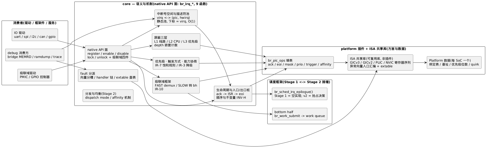
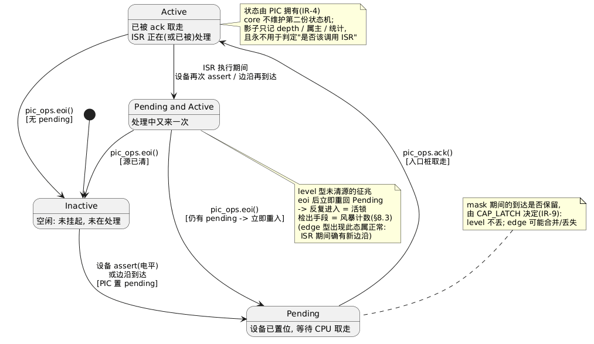
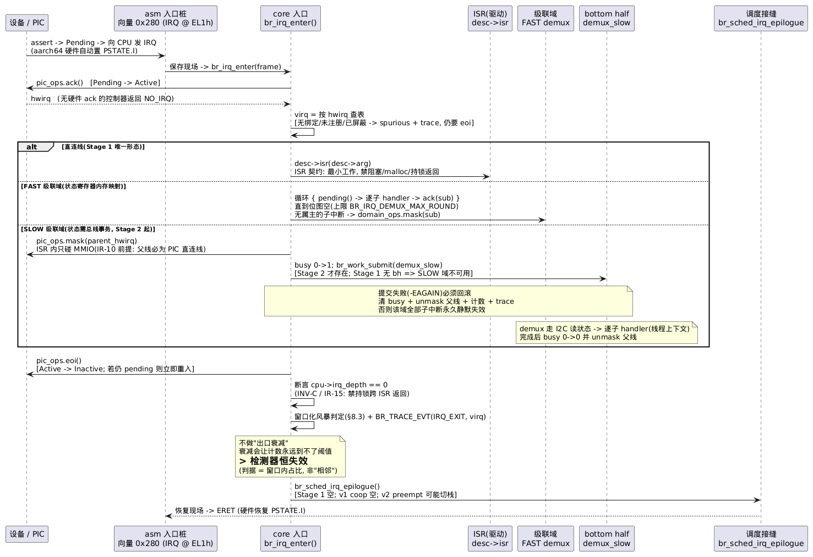
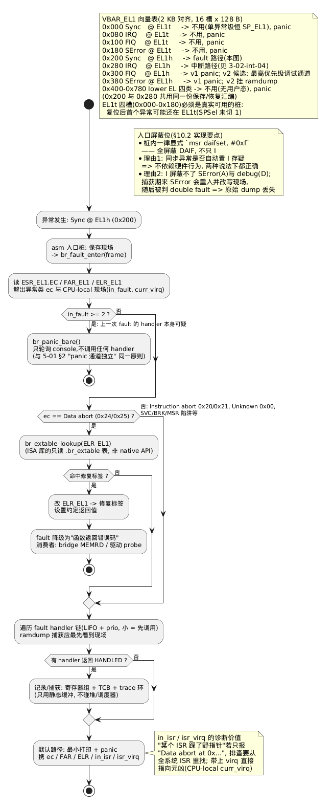
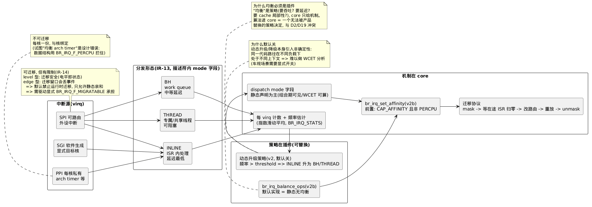
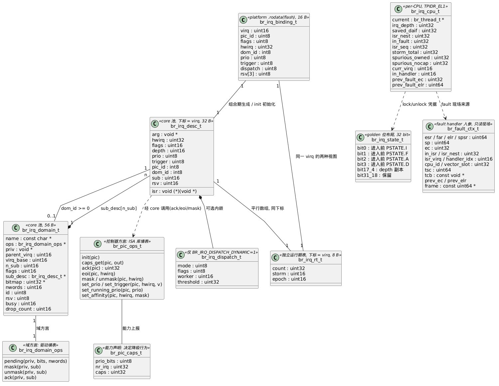

# 3-02 — 中断管理(int 框架)

> 章节: **3-os-core**。状态: **成文**。
> 来源: 主文档 §4.2(int 框架)、§8(PIC = platform 三层模式)、§5(调度框架); API: `docs/3-os-core/3-01-core-api-list.md` §8/§10/§11。
> 分工: 本篇 = 中断子系统的**详细设计**(机制/数据结构/不变量/分期); `br_irq` 组的**符号面与冻结计划** → 3-01 §8/§15; 调度器本体 → `docs/3-os-core/3-03-sched.md`; fault 的 debug 消费方(ramdump/bridge) → `docs/5-debug/5-01-debug.md`; 用例 → `docs/6-test/6-01-test.md` §3.7。
> **本篇新增编号**: `IR-1–IR-15` = 中断管理决策(§15); `INV-A–INV-H` = 中断子系统不变量(§14.7)——与 6-01 的 `INV-*`(跨子系统语义不变量)区分。

## 缩略词(abbreviations)

| 缩略词 | 英文全称 | 说明 |
|---|---|---|
| **API** | Application Programming Interface | 应用程序接口 |
| **bh** | bottom half | 下半部: 中断外的延迟处理(此仓库 = work queue) |
| **CA-1–CA-10** | — | core native API 契约决策编号(3-01 §14) |
| **D8** | — | 全局待定决策: 中断线程化(主文档 §17; 本篇 §11.4 给出收口建议) |
| **DAIF** | Debug/SError/IRQ/FIQ mask bits | aarch64 中断屏蔽位(PSTATE.D/A/I/F 四个字母) |
| **DoD** | Definition of Done | 完成定义(此仓库指设计阶段收敛清单) |
| **EC** | Exception Class | 异常类(ESR_EL1 字段, fault 分槽依据) |
| **eoi** | End Of Interrupt | 中断结束(硬件状态 Active → Inactive) |
| **ESR_EL1 / FAR_EL1 / ELR_EL1** | Exception Syndrome / Fault Address / Exception Link Register | aarch64 系统寄存器: 异常类 / 出错地址 / 异常返回地址 |
| **FAST / SLOW** | — | 级联中断域双上下文契约(CA-9): FAST = ISR 内可读寄存器, SLOW = 仅下半部(bh)可读 |
| **FIQ** | Fast Interrupt Request | aarch64 快速中断(独立于 IRQ 的第二个中断输入) |
| **GIC / GICv3** | Generic Interrupt Controller | ARM 通用中断控制器(及其第 3 版) |
| **GICD / GICR** | GIC Distributor / Redistributor | GICv3 的全局分发器 / 每核重分发器(MMIO) |
| **GPIO** | General-Purpose Input/Output | 通用输入输出(引脚) |
| **I2C** | Inter-Integrated Circuit | 板级两线串行总线 |
| **IAR / EOI / DIR** | Interrupt Acknowledge / End Of Interrupt / Deactivate Interrupt | GICv3 的 CPU 接口寄存器(取走 / 结束 / 停用) |
| **INV-A–INV-H** | — | 中断子系统不变量(本篇 §14.7) |
| **IPI** | Inter-Processor Interrupt | 核间中断(SMP 用) |
| **IR-1–IR-15** | — | 中断管理决策编号(本篇 §15) |
| **IRQ** | Interrupt Request | 中断请求(硬件中断线) |
| **ISA** | Instruction Set Architecture | 指令集架构 |
| **ISR** | Interrupt Service Routine | 中断服务例程(中断上下文中的处理函数) |
| **LPI** | Locality-specific Peripheral Interrupt | GICv3 基于消息的中断(ITS, 此仓库非目标) |
| **MMIO** | Memory-Mapped I/O | 内存映射 I/O |
| **NVIC** | Nested Vectored Interrupt Controller | ARM Cortex-M 的中断控制器 |
| **PIC** | Programmable Interrupt Controller | 可编程中断控制器(实现归 Platform 插件) |
| **PLIC** | Platform-Level Interrupt Controller | RISC-V 的平台级中断控制器 |
| **PMIC** | Power Management IC | 电源管理芯片(典型级联中断域来源) |
| **PMR** | Priority Mask Register | GICv3 优先级屏蔽寄存器(CPU 接口) |
| **PPI** | Private Peripheral Interrupt | GIC 每核私有中断(如 arch timer) |
| **PSTATE.I** | — | aarch64 的 IRQ 屏蔽位(1 = 屏蔽 IRQ) |
| **SError** | System Error | aarch64 异步系统错误异常 |
| **SGI** | Software Generated Interrupt | GIC 软件生成中断(核间/测试触发) |
| **SPI** | Shared Peripheral Interrupt | GIC 可路由到任一核的外设中断 |
| **SMP** | Symmetric Multi-Processing | 对称多处理(多核同构) |
| **VBAR** | Vector Base Address Register | aarch64 异常向量表基址寄存器 |
| **WCET** | Worst-Case Execution Time | 最坏执行时间(sched-tt 的输入) |

> **编号约定**: `D8`/`D14` = 全局决策(**主文档** §17/§6.1); `CA-*` = 3-01 契约决策; `IR-*` = 本篇决策(§15); `INV-A–H` = 本篇不变量(§14.7, 与 6-01 的数字 `INV-n` 区分); `O-*` = 本篇开放问题(§16); `TC-IRQ-*` = 6-01 用例。

---

## 1. 范围、分期与现状

### 1.1 分期(用户给定的两阶段)

中断子系统的实现被调度器交付时点切成两段——这不是人为分段, 而是**依赖方向**决定的: work queue(bh)实现在**调度插件**里(3-01 §5), 所以"中断→延迟工作"这条路在调度器缺席时根本不存在。

| 阶段 | 时点 | 内容 | 关键约束 |
|---|---|---|---|
| **Stage 1**(调度器实现前) | M0 | ① 中断号管理与抽象 ② 中断控制器抽象(PIC ops/方言/状态同步) ③ 生命周期抽象(Pending/Active/Inactive/Pending+Active) ④ fault 路径(仅同步异常分槽/分类/extable/panic; **注册 API 归 v2**) ⑤ 优先级与中断抢占 ⑥ 屏蔽与使能 ⑦ 触发方式 ⑧ 级联中断管理(**本节按 §1.1.1 的两段计**) | **必须不依赖调度器**: 无 bh、无线程、无 `br_work_submit`; ISR 内联执行且不得阻塞。中断框架在"无线程"世界里自洽闭合 ⇒ M0 即可独立做 conformance |
| **Stage 2**(调度器实现后) | M1 起 | ① 分发机制(inline/bh/线程三形态 + 决策) ② 负载均衡与分配策略(亲和性/IPI/迁移) | 复用 Stage 1 的全部机制, **只增加"谁来跑"的决策**, 不改变中断语义面 |

> Stage 1 的闭合性是刻意的:**中断入口是硬件入口, 不能等到调度器就绪才存在**。M0 的 hello 只需要 timer 中断轮询打印也要能跑——若 Stage 1 依赖 bh, M0 就无法验证任何中断路径。Stage 2 的接缝 = §11 的 `br_sched_irq_epilogue()` 钩子(Stage 1 恒为空实现)。

**术语锚定(全文遵守, 避免"Stage 1 vs v1"被读成矛盾)**:

| 词 | 指 | 时点 |
|---|---|---|
| **Stage 1** | 调度器交付**前**的世界(无 bh/无线程) | M0 |
| **Stage 2** | 调度器交付**后**的世界 | **M1 起** |
| **v1.0** | 首个发布版本(含 sched-coop + bottom half, 1-03 §1) | **= M3 ∈ Stage 2** |

⇒ **v1.0 有 bottom half**(主文档 §4.2 "v1.0 即实现 bottom half"; 1-03 M1 里程碑含 bottom half)。因此凡涉及 bh/线程上下文的机制, 属**Stage 2**、但在 **v1.0 内交付**——两者不冲突, 只是"Stage"按调度器有无切、"v1.0"按发布切。

#### 1.1.1 级联中断域的两段计(与 3-01 §15 / 6-01 §3.7 / 1-01 §4.2 对齐)

级联域**不能简单归入某一阶段**, 因为它的两种形态依赖不同:

| 部分 | 内容 | 交付时点 | 依据 |
|---|---|---|---|
| **框架与 API**(设计闭合) | `br_irq_domain_*`/`br_irq_*_child` 的签名与语义、域池、virq 窗口切片、FAST demux、逐子 mask/ack 契约 | **Stage 1**(设计在本篇闭合; **可编码**) | 本篇 §9; 3-01 §8.1(API 已定稿) |
| **FAST 域实现** | 状态寄存器内存映射的域(如 PL061 GPIO) | **Stage 1 可跑**(纯 ISR 内, 无 bh 依赖) | 本篇 §9.3 |
| **SLOW 域实现** | 状态需总线事务的域(PMIC 走 I2C) | **Stage 2 / v1.0 起可用**(其存在前提就是 bh) | 本篇 §9.4; CA-9 |
| **真实器件实战 + 冻结** | 真实 SoC 的 PMIC/GPIO 驱动; `br-irq.txt` 的域四件升格 frozen | **M4(v1.x)** | **3-01 §15"随实现批(M4 后)"**; 3-01 §8.1"实现随 M4"; 1-01 §4.2"级联中断域(v1.x)" |

**口径统一声明**: 本篇 §9 标题的"Stage 1 ⑧"指**用户给定的 Stage 1 议题清单里含"级联的中断管理"这一项**(设计必须在本篇给出), **不表示实现与冻结在 M0/M3 完成**。实现与 conformance 的时点以本表为准, 与 3-01 §15、6-01 §3.7(`TC-IRQ-101/102` 的 `target(M4 [?])`)、1-01 §4.2 完全一致——**本篇不推翻任一处既有口径, 只是把"设计闭合计入 Stage 1、实现冻结随 M4"这层区分写显式**。

### 1.2 继承的既有决策(深化时不变)

- **ISR 契约**(主文档 §4.2): ISR 最小工作 → `br_work_submit`; 禁阻塞/malloc/持锁跨返回; 静态扫描执法(D10 双保险之一)+ conformance 矩阵(R1 执法)
- **ISR-safe 白名单**(CA-3, 3-01 §11): `br_work_submit` / `br_sem_give` / `br_irq_lock/unlock` + `BR_TRACE_EVT` 宏, 其余 thread-only
- **PIC 抽象 = platform 三层模式**(主文档 §8): 机制接口在 core, 方言实现提炼为 **ISA 共享库**, Platform 插件只提供**数据 + 特化**(中断号绑定、路由策略、quirk)
- **级联中断域**(CA-9): 物理线 → 域 → 子中断; **FAST/SLOW 双上下文契约**; v1 单层; 共享线为明确非目标(每根物理线恰一属主)
- **v1 无中断线程化**(D8 待收口 → 本篇 §11.4 给出建议结论)
- **组合期校验**(主文档 §6.4): IRQ 号独占冲突检测在 manifest 侧

### 1.3 三层归属(本篇的"谁拥有什么")

| 层 | 拥有者 | 内容 |
|---|---|---|
| **语义与机制** | **core** | virq 号空间、描述符池、生命周期模型、屏蔽嵌套、优先级语义、触发语义、域 demux 框架、fault 分派链、统计/trace、分发模式字段 |
| **控制器方言** | **ISA 共享库**(可复用库, 非插件) | GICv3/GICv2/PLIC/NVIC 的寄存器序列: ack/eoi/mask/prio/trigger/亲和性实现; 异常向量入口汇编 |
| **数据与特化** | **Platform 插件** | 中断号绑定表(virq ↔ hwirq)、PIC 实例与基址、可用优先级位数、quirk、per-line 静态 trigger/prio 默认值 |

**判定规则**(与主文档 §8 一致): 同一段代码若"换 SoC 仍成立"→ ISA 库; 若"换板子就变"→ platform 数据; 若"换控制器型号就变"→ ISA 库的另一个方言实现。core **不含任何控制器型号名**。

### 1.4 与 3-01 符号面的关系(面不长大)

3-01 §1 记录 `br-irq.txt` = **9 函数**(基础五件 + 级联域四件), CA-5 的 native 面余量为 2。本篇的纪律是: **native API 零新增**(9 件不变), 但**新增核心符号是有的**, 必须逐一如实归类——**不把它们伪装成"3-01 已列"**:

| 类别 | 符号 | 归属与状态 |
|---|---|---|
| **native API**(9 件, 零新增) | `br_irq_register/enable/disable/lock/unlock` + 域四件(`domain_create`/`register_child`/`enable_child`/`disable_child`) | 3-01 §8/§8.1 已定稿; 本篇只深化语义(§14.1) |
| **新增: platform 侧契约**(非 native 面) | `br_pic_register` / `br_irq_bindings_set` + `br_pic_ops_t` / `br_pic_caps_t` | **属新增**。3-01 §10 目前只有一行"`br_pic` ops 表 → Platform 插件(填表)", **并未列出这两个函数** ⇒ 需补入 3-01 §10/§12 并走 1-02 §2.2 决策记录(§17.4 已列行动项) |
| **新增: 跨模块观测契约**(不能 hidden) | `br_irq_stats_get` + `br_irq_stat_t` | **属新增**。消费方是 **debug bridge / ramdump(5-01 §2/§3 = 插件)**, 因此**不能**按"core 内部"隐藏在 core 内 ⇒ 需作为观测契约登记(建议归 platform/debug 侧契约, §17.4) |
| **core 内部**(真 hidden, 无外部消费者) | `br_irq_enter` / `br_fault_enter` / `br_irq_desc` / `br_irq_virq_of` / `br_irq_pgm_mask` / `br_irq_pgm_unmask` / `br_irq_demux_fast` / `br_irq_demux_slow` / `br_irq_storm_check` | 仅 core 内部与 asm 桩调用(asm 是同镜像的 core 部分), **不导出**(CA-10 hidden 默认) |
| **新增: core → 调度插件接缝** | `br_sched_irq_epilogue` | **属新增**。core 调用、调度插件提供**实现** ⇒ 必须作为 `br_sched_ops` 的一个槽位登记(§17.4 已列 3-03 行动项), 而不是"隐藏函数" |
| **新增: 策略件契约**(v2, 需决策记录) | `br_irq_dispatch_set` / `br_irq_balance_register` | **属新增**。策略件(插件)要调用 ⇒ 不能 hidden(§12.3 义务已修正); 随 v2 面决策记录升格 |
| **v2/v2b 预留**(签名现在定稿) | `br_fault_handler_register`(v2)、`br_pic_save/restore`(v2)、`br_irq_set_affinity` + `br_ipi_send`(v2b) | §14.5; 升格 frozen 走 D15 批次 |

**"面不长大"的准确含义**: native API(**第一契约**, 全插件作者的编码对象)零新增 ✓; 但**核心符号总数是长的**——新增集中在 (a) platform 侧、(b) 观测侧、(c) 调度接缝、(d) v2 策略侧。这四类都**不在 CA-5 的 native 面预算内**(3-01 §10 的定位正是"面向特定作者, 不属通用 native API"), 所以面预算未被侵蚀; 但它们**必须各自登记**, 否则就成了"没有契约的隐藏接口"——这正是 1-02 要防的漂移。

---

## 2. 架构总览



> 源文件: [plantUML/3-02-int-01.puml](plantUML/3-02-int-01.puml)

**读图要点**: 三根竖轴 = 三层归属(§1.3)。驱动只面对 `br_irq_*` native API; core 只面对 `br_pic_ops` 填表; 控制器寄存器序列在 ISA 库, 地址/引脚/号在 platform 数据。**core 与具体控制器型号零耦合**, 与具体板子零耦合。

| 组件 | 职责 | 不做 |
|---|---|---|
| **IRQ 入口/出口桩**(asm + C) | 异常向量 → 保存上下文 → `br_irq_enter()`; 出口 `br_irq_exit()` → 恢复/可能切栈 | 不含任何控制器逻辑 |
| **号空间与描述符池**(§3) | virq 查找、描述符索引、边界校验 | 不做动态分配(v1 全静态) |
| **生命周期**(§5) | ack → 运行 ISR → eoi 的**顺序与约束**; 影子状态(诊断) | 不复制硬件状态机(状态归 PIC) |
| **屏蔽/优先级/触发**(§6–§8) | 语义定义、嵌套计数、能力协商与降级 | 不做位宽/编码的方言换算(归 ISA 库) |
| **级联域**(§9) | FAST demux 循环 / SLOW 转 bh 的时机与竞态 | 不做子中断的寄存器语义 |
| **fault 分派**(§10) | 向量分槽、handler 链、double fault 兜底 | 不做寄存器现场解码(归 debug 消费方) |
| **分发与均衡**(§12–§13, Stage 2) | 分发模式字段、亲和性机制、计数 | 不做均衡**策略**(可插拔) |

---

## 3. 中断号管理与抽象(Stage 1 ①)

### 3.1 双层号模型

**问题**: 驱动源码里出现 `INTID 33` 这种数字, 就把板级/控制器差异焊死在驱动里, 与 8-01 §6"驱动代码板级无关, 换板只换 Platform 插件"直接冲突。反之若让驱动用字符串在运行期查找, 又要吃 native API 名额(CA-5)且引入运行期失败面。

**设计(IR-1/IR-2)**: 三层分离——

| 概念 | 类型 | 谁定义 | 谁使用 | 例子 |
|---|---|---|---|---|
| **逻辑线名**(line name) | 字符串常量 | manifest 声明 + platform 绑定 | 驱动源码(**只出现名字, 不出现数字**) | `"uart0"` / `"pmic"` |
| **virq**(virtual IRQ) | `uint32_t` | **组合期确定**, 运行期恒定 | core 描述符池下标、native API 参数 | `8` |
| **hwirq** | `uint32_t` | PIC 域内号, platform 绑定表 | 仅 ISA 库/PIC ops 内部 | GICv3 `INTID 33` |

- **native API 的 `irq` 参数 = virq**(3-01 §8 签名不变)
- **名字 → virq 的解析发生在构建期**: 组合器按 (驱动声明的线名 × platform 绑定表) 生成 `br/board_irq.h`, 内含 `#define BR_IRQ_UART0 8`。驱动 `#include <br/board_irq.h>` 后写 `br_irq_register(BR_IRQ_UART0, ...)`——
  - 驱动源码**零数字、零板级知识** ✓
  - 组合期可校验"每个声明的线名都有绑定""每个 virq 恰一属主" ✓
  - **零运行时代价、零新增 API** ✓(保住 48 面)
- **退路**(若 2-01/4-03 的生成头机制未落地): platform 插件导出静态头, 内含同型宏。语义等价, 仅"谁生成"不同 ⇒ 本篇设计**不阻塞**工具链进度。
- **不做运行期名字查找 API**(如 `br_irq_lookup_name()`): 会引入"名字错→运行期失败"面, 而这正是静态组合要消灭的东西。host 平台插件同样走生成头(CI 里生成, 无特殊性)。

> **跨文档行动项**: 生成头机制(minifest 线名声明 → `board_irq.h`)的**工具侧**实现归 `docs/2-toolchain/2-01-toolchain.md`; **声明面格式**归 `docs/4-plugin/4-03-plugin-manifest.md`; 资源冲突校验归 `3-05-plugin-mgr` §2 第 5 项(组合期校验清单)。

### 3.2 virq 空间布局(编译期)

```
virq
 0 ──────────────────────────────  BR_IRQ_NR_PIC - 1    直连 PIC 线(SPI + v1 的 PPI)
                                   绑定表静态分配; 每线恰一属主
BR_IRQ_IPI_BASE ──────────────── + N_IPI - 1             IPI 窗口(v2b 预留, v1 未用)
BR_IRQ_DOMAIN_BASE ───────────── + N_DOMAIN_SUB - 1      级联域子中断窗口(按域连续切片)
BR_IRQ_MAX - 1                                           描述符池上界(manifest 预算)
```

- 全部边界是**编译期常量**, 来自 manifest 资源预算(主文档 §6.4)——无运行期协商
- `BR_IRQ_INVALID = UINT32_MAX`(3.1 的 `irq` 参数校验上界)
- **virq 与物理线一一对应**(IR-1 的一部分): 一根物理线恰一个 virq ⇒ 描述符即线; 级联域的子中断**不是物理线**, 但为统一 trace/屏蔽/注册接口, 同样占 virq(在域窗口内)——语义上它们是"域的成员", `desc->dom_id >= 0` 标识
- **PPI**(arch timer 等每核私有中断)在 v1 单核下就是普通直连线; 其"每核"性质是 v2b 的关注点(§13)
- **INV-E(virq 恒定)**: 上述空间全部在**组合期**确定、运行期不变——生成头(§3.1)是它的执法载体; 任何"运行期分配 virq"的诉求都必须先推翻 INV-E

**宽度不变量(与 3-01 的 `uint32_t` 公共签名对齐, 实现要点)**: 公共 API 的 `irq`/`parent_irq`/`sub` 参数是 `uint32_t`(3-01 签名冻结), 而池内字段是 `uint16_t`/`int8_t` 以省 RAM。二者的契约是**定义域约束**, 必须在入口校验:

| 量 | 公共签名类型 | 内部存储 | 合法域(入口校验) | 越界行为 |
|---|---|---|---|---|
| virq(`irq`/`parent_irq`/`sub`) | `uint32_t` | `uint16_t` | `0 .. BR_IRQ_MAX-1`, 且 `!= BR_IRQ_INVALID` | `-EINVAL` |
| `pic_id` | (内部) | `int8_t`(描述符)/`uint8_t`(绑定表) | `0 .. 127`(负数保留给域成员/无效) | 注册时 `-EINVAL`(PIC 实例数超 128) |
| `dom_id` | (内部) | `int8_t` | `-1`(直连) 或 `0 .. BR_IRQ_DOMAIN_MAX-1` | 域池满 → `NULL` |

⇒ **`BR_IRQ_MAX ≤ 65535` 与 `PIC 实例数 ≤ 128` 是硬约束**, 由编译期 `_Static_assert` 锁定; `BR_IRQ_INVALID = UINT32_MAX` 只用于公共签名的"无效"表达, **绝不写进内部字段**(内部用 `-1`/越界值表示无效)

### 3.3 关键数据结构

```c
/* 绑定表条目: platform 提供的静态数据(编译进 .rodata, 可放 flash) */
typedef struct {
    uint16_t virq;          /* 全局虚拟号(下标语义) */
    uint8_t  pic_id;        /* 挂在哪个 PIC 实例(platform 注册顺序) */
    uint8_t  flags;         /* BR_IRQB_F_*: 静态属性(极性/独占性/PPI 等) */
    uint32_t hwirq;         /* PIC 实例内硬件号(INTID / IRQ number / pin) */
    int8_t   dom_id;        /* -1 = 直连 PIC; >=0 = 级联域成员 */
    uint8_t  prio;          /* 静态默认优先级(attr.prio == DEFAULT 时生效) */
    uint8_t  trigger;       /* 静态默认触发方式(attr.trigger == DEFAULT 时生效) */
    uint8_t  dispatch;      /* ★ 静态分发形态 BR_IRQ_DISPATCH_*(§12.2): 放 flash, 不占 RAM */
    uint8_t  rsv[3];        /* append-only 预留(D14) */
} br_irq_binding_t;         /* 16 B */

/* 平台侧一次性提交绑定表 */
int br_irq_bindings_set(const br_irq_binding_t *tbl, size_t n);   /* EARLY 相, 恰一次 */

/* 描述符: core 静态池, 下标 = virq(热路径 O(1), 无查找表)
 * ★ 字段顺序是"按宽度降序 + 同宽度成对"排的, 目的是消除填充:
 *   8+8 | 4 | 2+2 | 1+1+1+1 | 2 | 2  = 32 B, 无内部空洞(见下 size 说明) */
typedef struct br_irq_desc {
    void    (*isr)(void *);  /* ISR 入口(thread-only 的 register 写入) */
    void    *arg;            /*                                [0..15]  16 B */
    uint32_t hwirq;          /* 缓存绑定表的 hwirq(热路径省一次查表)   [16..19] */
    uint16_t flags;          /* BR_IRQ_F_*: 运行期属性          [20..21] */
    uint16_t depth;          /* br_irq_disable 嵌套计数(IR-5)   [22..23] */
    uint8_t  prio;           /* 逻辑优先级(数值小 = 高, IR-7)   [24] */
    uint8_t  trigger;        /* BR_IRQ_TRIG_*                   [25] */
    int8_t   pic_id;         /* 直连: PIC 实例; 域成员: 父 PIC  [26] */
    int8_t   dom_id;         /* -1 = 直连; >=0 = 域 id          [27] */
    uint16_t sub;            /* dom_id >= 0 时的子中断号        [28..29] */
    uint16_t storm;          /* 本线"连续被服务"游标(§8.3; **安全特性, 恒在**) [30..31] */
} br_irq_desc_t;             /* 基准 sizeof = 32 B(指针 8 对齐, 无填充) */

/* 结论: 上面这个结构**只放"配置与身份"**, 不放运行期计数 —— 理由见下 */

/* ── 运行期计数表(与描述符分离; **恒在**, 不随 BR_IRQ_STATS 消失) ──
 * ★ 为什么分离成独立数组(两个理由, 都是硬的):
 *   (1) **golden 布局稳定**(D14): 描述符布局一旦冻结就不该为了"加个计数器"而破;
 *       把易变的运行期量放旁边, 配置结构可以长期不变。
 *   (2) 风暴检测是**安全特性**(§8.3 的活锁检出), 不能挂在诊断开关后面。 */
typedef struct br_irq_rt {
    uint32_t count;   /* 进入次数(仅当 BR_IRQ_STATS=1 时维护; 关掉则恒 0) */
    uint16_t storm;   /* 本线"连续服务、期间基上下文未进展"次数(§8.3) */
    uint16_t epoch;   /* storm 复位用的 epoch 快照(§8.3, 与 cpu->base_epoch 比较) */
} br_irq_rt_t;        /* 8 B */

br_irq_desc_t  _br_irq_desc_pool[BR_IRQ_MAX];   /* 2 KB @ 64 线(配置与身份, golden) */
br_irq_rt_t    _br_irq_rt_pool  [BR_IRQ_MAX];   /* 512 B @ 64 线(运行期计数) */
```

**尺寸与预算的推导(用编译器验证过, 不靠"看起来对齐")**:

| 结构 | 尺寸 | 说明 |
|---|---|---|
| `br_irq_desc_t` | **32 B** | 字段顺序按宽度降序 + 同宽度成对; **`uint32 hwirq` 紧跟两个指针**是关键 |
| `br_irq_rt_t` | **8 B** | `count`(4) + `storm`(2) + `epoch`(2) |
| `br_irq_binding_t` | **16 B** | 在 flash, 不占 RAM |

| 项 | 64 线 RAM |
|---|---|
| 描述符池(32 B × 64) | 2 KB |
| 运行期计数表(8 B × 64) | **512 B** |
| **合计** | **2.5 KB** |

- **为什么基准 32 B 是可达的**: 2 个指针(16)+ 1 个 `uint32`(4)+ 2 个 `uint16`(4)+ 4 个 `uint8`(4)+ 1 个 `uint16`(2)+ 1 个 `uint16` 预留(2)。**易错点**: 若把 `uint32` 字段排在多个 `uint16`/`uint8` 之后, 中间会产生填充、尾部再对齐到 8, 实际变成 40 B。实现侧用 `_Static_assert(sizeof(br_irq_desc_t) == 32)` 锁定
- **`BR_IRQ_STATS` 不再影响 RAM**(第一版把它记成"+4 B/线"或"+8 B/线"都是错的): 计数槽位恒在, 开关只决定**要不要维护** `count`(省的是指令不是内存)。**这也消除了"统计是否改变 golden 布局"的歧义** —— 它不改变
- **风暴游标不在描述符里**: `storm`/`epoch` 在运行期表(§8.3 的判据需要它们, 但它们是"运行状态"而非"身份"); 描述符的 `rsv` 槽位保留给后续 append-only 字段

⇒ v1 默认 64 线的中断子系统静态 RAM = 2 KB + 512 B = **2.5 KB**, 落在 core 2–8 KB RAM 目标内(主文档 §4)。`BR_IRQ_MAX` 由 manifest 裁剪(小产品 16 线 = 640 B)。

> **hwirq → virq 索引表的预算(诚实修正)**: 一个"按 hwirq 直接索引"的表是 O(1), 但代价是 `nr_irq` 条目 —— GICv3 的 SPI 可达 1000+, 那就是 `uint16_t[1024]` = **2 KB**, 与描述符池同量级,**不能记成"platform 数据、不占 RAM"**。压缩表示(只存已绑定项)则查找是 O(log n) 而非 O(1)。二者不可兼得, 因此:
> - **v1 选择**: `uint16_t virq_of[nr_irq]` 的**直接索引表**, 尺寸 `2 × ceil(nr_irq)` B, 由 platform 在 region 表里**显式声明**(它是 platform 数据, 但**计入总账**; GICv3 平台典型 +2 KB)
> - **小控制器**(NVIC/PLIC 的 `nr_irq` 小)该表可忽略; **大控制器**若嫌 2 KB 贵, 用"已绑定 hwirq 的有序表 + 二分"(O(log n), 表项 = 4 B, 只按实际绑定数计)
> - 两种形态的**选择权在 platform**(它知道自己的 `nr_irq` 和绑定量), core 只要求"给一个 hwirq→virq 的解析函数", 并在 `br_irq_bindings_set()` 时构造

### 3.4 `br_irq_attr_t.flags` 的定义(D14 append-only)

`br_irq_attr_t`(3-01 §8)`{ prio, trigger, flags }` 的 `flags` 字在此定死语义。**只增不改**(D14); v1 只用前四项, 其余为"现在就占位、将来不破布局":

| 位 | 宏 | v1 行为 |
|---|---|---|
| `0x0001` | `BR_IRQ_F_SHARED` | **共享线 = v1 非目标**(3-01 §8.1): 置位 → `-ENOTSUP`(槽位留给 v2 的共享 handler 链) |
| `0x0002` | `BR_IRQ_F_PERCPU` | 每核私有中断(PPI)。**通常不用手填**——由绑定表/`caps` 推导; 手填与硬件不符 → `-EINVAL`(防"把 PPI 当 SPI 去均衡", §13.1) |
| `0x0004` | `BR_IRQ_F_DISPATCH_BH` | Stage 2: 该线分发到 bh(§12.1)。Stage 1 置位不报错但忽略(无 bh), trace 提示 |
| `0x0008` | `BR_IRQ_F_DISPATCH_THREAD` | Stage 2: 分发到线程(= SLOW 域形态, §11.4)。同上, Stage 1 忽略 |
| `0x0010` | `BR_IRQ_F_MIGRATABLE` | v2b: 允许运行时迁移。**边沿型中断必须显式置位才可迁移**(默认禁止, IR-14); level 型可只靠 caps 判定 |
| `0x0020` | `BR_IRQ_F_STATS` | 该线开启统计(需 `BR_IRQ_STATS` 编译开关; 未开时置位 → `-ENOTSUP`) |
| `0x0040` | `BR_IRQ_F_NO_STORM_GUARD` | 该线豁免风暴保护(§8.3 的逃生门: 已知高频率且合法的线) |
| `0x0080+` | — | 保留(append-only, D14); `register` 遇未知位置位 → `-EINVAL` |

> **"未知位置位 → `-EINVAL`"这条是刻意的**: 若静默忽略, 用新头文件编译的插件在老 core 上会**静默失去**它请求的属性(例如豁免风暴保护), 属于最难查的一类兼容性 bug。宁可让它注册失败。

---

## 4. 中断控制器抽象(Stage 1 ②)

### 4.1 `br_pic_ops`: core ↔ platform 的填表契约

```c
typedef struct br_pic br_pic_t;              /* platform 拥有的实例存储(不透明) */

typedef struct {
    uint8_t  prio_bits;      /* 有效优先级位数(0 = 不支持优先级, 如简化控制器) */
    uint32_t nr_irq;         /* 本实例 hwirq 上界 */
    uint32_t caps;           /* BR_PIC_CAP_*: 能力位图(§4.2) */
} br_pic_caps_t;

typedef struct br_pic_ops {
    const char *name;                       /* "gicv3" / "plic" / "nvic" / "soft" */

    /* ── 生命周期 ── */
    int  (*init)     (br_pic_t *pic);                       /* EARLY: 控制器复位/初始化(关中断) */
    int  (*caps_get) (br_pic_t *pic, br_pic_caps_t *out);   /* EARLY: 能力上报(IR-3) */

    /* ── 取走与结束(热路径: 必须 ISR 内可调用) ── */
    uint32_t (*ack)  (br_pic_t *pic);                       /* 取走当前最高优先级 pending → 返回 hwirq
                                                             * ★ 方言义务: 无中断可领时返回 BR_PIC_NO_IRQ */
                                                            /* GICv3: ICC_IAR1_EL1 的 1020–1023(含 spurious 1023)
                                                             * 全部折算为 BR_PIC_NO_IRQ —— 这些值不是合法 INTID,
                                                             * 且按 §5.3 **不得**对其写 EOI */
    void     (*eoi)  (br_pic_t *pic, uint32_t hwirq);       /* Active → Inactive; level 仍 assert ⇒ 重 pending
                                                             * ★ EOImode 义务在此收敛(§4.1.1) */

    /* ── 单线屏蔽(可 ISR 内调用: 只碰 MMIO) ── */
    void (*mask)   (br_pic_t *pic, uint32_t hwirq);
    void (*unmask) (br_pic_t *pic, uint32_t hwirq);

    /* ── 状态查询(诊断/生命周期断言, 非热路径) ── */
    int (*pending)(br_pic_t *pic, uint32_t hwirq, int *out);
    int (*active) (br_pic_t *pic, uint32_t hwirq, int *out);

    /* ── 配置(thread-only: 可含总线事务/锁) ── */
    int (*set_prio)   (br_pic_t *pic, uint32_t hwirq, uint8_t prio);
    int (*set_trigger)(br_pic_t *pic, uint32_t hwirq, uint8_t trigger);
    int (*trigger)    (br_pic_t *pic, uint32_t hwirq);      /* 软件触发(SGI/测试); CAP_SW_TRIGGER */

    /* ── CPU 侧屏蔽(PSTATE.I 的方言包装; v1 aarch64 直接操作 DAIF) ── */
    uint32_t (*cpu_mask)  (br_pic_t *pic);
    void     (*cpu_unmask)(br_pic_t *pic, uint32_t state);

    /* ── 优先级屏蔽/嵌套(仅当 CAP_NEST; IR-6) ── */
    void (*set_running_prio)(br_pic_t *pic, uint8_t prio);  /* v1.1+/v2: 允许更高优先级抢占 ISR */

    /* ── 亲和性(仅当 CAP_AFFINITY; v2b, §13) ── */
    int  (*set_affinity)(br_pic_t *pic, uint32_t hwirq, uint32_t cpu_mask);

    /* ── PM 状态同步(仅当 CAP_RESYNC; v2) ── */
    int  (*save)   (br_pic_t *pic, void *buf, size_t n);
    int  (*restore)(br_pic_t *pic, const void *buf, size_t n);
} br_pic_ops_t;

/* platform 侧注册(EARLY 相; 每实例一次; 返回 pic_id >= 0 或负 errno) */
int br_pic_register(br_pic_t *pic, const br_pic_ops_t *ops);
```

#### 4.1.1 GICv3 EOImode 义务(单层非嵌套设计的关键前提)

GICv3 的 `ICC_CTLR_EL1.EOImode` 决定"结束中断"是一步还是两步:

| EOImode | 写 `ICC_EOIR1_EL1` 的效果 | 还需做什么 |
|---|---|---|
| **0**(本设计采用) | priority drop **+ deactivate** 一步完成 | 无 ⇒ **单次 eoi 即完整**, §5.3 的"eoi 调用点唯一"成立 |
| 1 | 仅 priority drop | 必须**再写 `ICC_DIR_EL1`** 才 deactivate |

**义务划分(不改 core 的模型)**:
- **v1 要求 platform 把 EOImode 配成 0**(单层、不嵌套、无虚拟化 ⇒ 两步法没有收益, 只有漏写 DIR 导致"线永久 Active"的风险)。**并建议在 `pic_ops.init` 里断言该位为 0**(配错就要显式失败, 而不是等某条线"哑掉"再查)
- **`ack()` 的实现纪律**: `ICC_IAR1_EL1` 的**读有副作用**(读走即改变 Active 状态)。⇒ 必须保证**每次进入只读一次**, 且是 `volatile` 访问 —— 若为了 trace/日志"顺手再读一次", 第二次会返回 `1023`(spurious)并破坏状态机。这与"eoi 只出现在一个函数里"是同一种"集中控制副作用"的手法
- **方言层必须自行吞掉这个差异**: 若某平台因故用 EOImode=1, 则 ISA 库的 `eoi()` 实现要**在内部同时写 `ICC_EOIR1_EL1` 与 `ICC_DIR_EL1`** —— 于是 core 仍然只调一次 `eoi()`, **模型不变**
- 这正是"状态同步归方言"的实例(IR-3/IR-4): **core 不暴露"要不要 DIR"的概念**, 否则每个控制器型号都会往 core 里渗一层

**为什么这个义务必须写出来**: EOImode 是**平台初始化代码**里的一行寄存器写(`platform/gicv3` 的 early_init)。若这行写错或漏写, 症状是"某条线只响应一次随后永久沉默"——典型的**极难定位**故障, 而根因不在 core。把它写进契约文档, 是为了让平台作者知道"你有一个必须与 core 假设一致的义务"。

**为什么这样切**:
- `ack()` **不带 hwirq 参数**——它要返回 hwirq, 这正是"方言差异"的核心(GICv3 读 `ICC_IAR1_EL1`; PLIC 读 claim 寄存器; 有些控制器没有硬件 ack, 需 core 用 `pending()` 扫描)。把这个差异压进一个函数, core 热路径就统一了
- `init/caps_get` 在 EARLY(**主文档 §6.2**: 不使用堆/无线程/关中断)——**PIC 必须早于任何中断可用**, 且 caps 决定后续一切降级行为
- `set_*` 配置类**全部 thread-only**: 它们可能碰需要同步的总线(如外接中断扩展器的配置寄存器走 I2C), 放进 ISR 就违反 SLOW 域存在的前提(§9)

### 4.2 能力协商与方言降级(IR-3)——"不同控制器 IP/协议/方言"的机械表达

抽象若只声明"有这么个函数", 遇到不支持该能力的控制器就只能崩溃或撒谎。**能力位 + 确定性降级**是本设计对这一问题的答案:

| 能力位 | 含义 | 缺失时的 core 行为(降级) |
|---|---|---|
| `BR_PIC_CAP_MASK` | 支持硬件单线屏蔽 | 退化为**纯软件影子屏蔽**: 硬件仍会向 CPU 发信号, 由**入口桩在调用 ISR 前按影子判定并丢弃**; 计入 `spurious_nocap`(降级行为)并 trace 一次。**这是 IR-4 的唯一豁免**(见 §4.3 的"豁免条款"): 无硬件屏蔽能力时, 影子就是"是否调用 ISR"的最后一道闸门 —— 不这样做, INV-D 在该控制器上根本无从成立。**与 `CAP_MASK=1` 的区别**: 有硬件屏蔽能力时"已屏蔽却仍到达"是**真 bug 信号**(`spurious_owned` + trace + debug 断言); 无该能力时是**预期降级**(`spurious_nocap`, 只计数一次 + trace 一次, 不按 bug 归因) |
| `BR_PIC_CAP_LATCH` | masked 期间仍锁存 pending | mask 期间的边沿事件**会丢**; `br_irq_disable` **不得**被用作事件流控(§6.3) |
| `BR_PIC_CAP_READBACK` | 可回读配置寄存器 | 影子是唯一真值(不可校验); 诊断能力下降, 但仍正确 |
| `BR_PIC_CAP_PRIO` | 支持优先级 | `attr.prio` 被忽略(仅记录进描述符供 trace); 中断与调度优先级解耦 |
| `BR_PIC_CAP_NEST` | 支持优先级嵌套(高优先级抢占 ISR) | 忽略嵌套配置, **恒不嵌套**(= v1 语义, IR-6) |
| `BR_PIC_CAP_AFFINITY` | 中断可路由到指定核 | `br_irq_set_affinity` → `-ENOTSUP`; 亲和性恒为静态默认 |
| `BR_PIC_CAP_TRIG_EDGE` / `_BOTH` | 支持边沿/双边沿 | `attr.trigger` 只能给 `DEFAULT`; 非 DEFAULT 请求 → `-ENOTSUP`(绝不静默改写触发方式) |
| `BR_PIC_CAP_SW_TRIGGER` | 支持软件触发 | 自测用例回落 host 平台(软件中断注入) |
| `BR_PIC_CAP_PER_CPU` | 每核私有中断(PPI) | 描述符标 `BR_IRQ_F_PERCPU`; v2b 亲和性检查用 |
| `BR_PIC_CAP_RESYNC` | 支持 save/restore(PM) | v2 PM 时需重新 `init` + 重放描述符配置 |

**铁律**: 能力缺失时**绝不静默改变语义**——要么降级到"更弱但确定"的行为(并在 trace 留痕), 要么 `-ENOTSUP`。**静默提权/静默改触发方式是禁止的**(与 IR-7 的优先级饱和规则同源)。

**多控制器实例的接入规则(IR-3 的推论, 必须写清)**: `ack()` 无参数却要返回 hwirq, 这蕴含一个前提——**每个 CPU 恰有一个"CPU 接口控制器"**(GICv3 经 `ICC_*`、PLIC 经 claim、NVIC 经 `ICR`), 它是中断的唯一入口。因此:

| 情形 | 接入方式 |
|---|---|
| SoC 主中断控制器(GICv3/PLIC/NVIC) | 注册为 PIC 实例, 作 CPU 接口 |
| 第二个独立控制器(GPIO expander、次级中断控制器、外接 PMIC) | **必须经级联域接入**(§9), 由它的父线中断驱动 demux; **不允许**作为第二个 CPU 接口 |
| 同一控制器的多个实例(如两颗同型 GPIOC) | 各注册一个 PIC 实例(有独立 `pic_id`), 各自的线**仍须经各自父线级联**或直接绑定 |

⇒ 于是 `pic_id` 只在**非热路径**使用(配置、绑定解析、域管理); 热路径(`ack` → hwirq → virq)天然唯一。若某平台**真的**有多个 CPU 接口控制器同时投递中断, 那是 GICv3 之外的少数形态, 需在该平台插件里把从属者表达成级联域——**core 不为它引入"哪个控制器在响"的判定**。

### 4.3 状态同步(IR-4): 影子是诊断, 不是真值

"不同控制器 IP 的状态同步"最容易走错的一步是让软件影子参与状态判断(两种真值来源 = 永久的不一致 bug 源)。本设计的规则:

1. **硬件状态由 PIC 拥有**(Pending/Active/Inactive 是控制器寄存器的物理状态)。core 不维护第二份状态机
2. **core 影子只记三件软件才有的事实**: `depth`(屏蔽嵌套, 硬件无此概念)、`flags`(是否已注册/是否启用)、统计计数
3. **影子永不用于判定"是否该调用 ISR"**——该判定归硬件(它发不发中断)。core 只在"防线"上用它: 若软件标为 disabled 却进来了 → 计入 `spurious` + trace; **是否按"真 bug"上报由 `CAP_MASK` 决定**(§4.2): 有硬件屏蔽 ⇒ 不该发生 ⇒ 真 bug; 无硬件屏蔽 ⇒ 预期降级 ⇒ 仅计数
4. **`pending()/active()` 是诊断接口**, 不进热路径, 且允许返回 `-ENOTSUP`(无回读能力的控制器)
5. **可回读的控制器**(`CAP_READBACK`)允许在 conformance/debug 构建里**交叉校验**影子 vs 硬件(6-01 INV 型用例), 这是"状态同步"唯一被允许的用法

**豁免条款(`CAP_MASK = 0`: 影子是最后一道闸门)**——IR-4 的第 3 条**有一个明确的例外**, 必须写出来, 否则设计自相矛盾:

- 若控制器**没有硬件单线屏蔽能力**(`CAP_MASK = 0`), 则"不调用 ISR"**只能**由软件实现: 入口桩在 `ack` 之后、调用 `desc->isr` 之前, **读 `desc->depth`/`flags`, 若为屏蔽态则跳过 ISR**(仍须完成 ack/eoi 配对, 见 §5.3)。
- 这是**唯一**允许"影子参与是否调用 ISR 判定"的位置。IR-4 第 3 条的完整表述是: *"影子不用于判定硬件是否投递——该判定归硬件; 但 `CAP_MASK = 0` 时, 影子决定是否**转交**给 ISR"*。二者是不同的问题: 前者是"中断到没到 CPU"(硬件事实), 后者是"软件想不想处理它"(软件意图)。
- **INV-D 的成立性依赖它**: "`br_irq_disable` 返回后该 virq 的 ISR 不再运行"在 `CAP_MASK = 0` 的控制器上**只能**靠这条豁免。反过来, 在 `CAP_MASK = 1` 的控制器上**不走**这条路径(硬件已挡住), 因此 `spurious_owned` 才是真 bug 信号。
- **代价与诚实条款**: 屏蔽期间该线仍会**占用 CPU**(每次投递都要 ack+eoi 再丢弃) ⇒ 高频设备 + `CAP_MASK = 0` 是**不良组合**; 平台的 `caps` 必须在文档里如实标注, 组合期可据此告警(§17.4)。
- **实现要点**: 该分支**必须 eoi**(它已经 ack 过; 不 eoi 会让线永久 Active ⇒ running priority 抬高 ⇒ 全系统 IRQ 饥饿, 正是 §5.3 警告的"整条路径哑掉")。这是 §5.3 "领到了才 eoi" 之外的第二条例外, 两条都要写进实现。

---

## 5. 中断生命周期抽象(Stage 1 ③)

### 5.1 四态模型



> 源文件: [plantUML/3-02-int-03.puml](plantUML/3-02-int-03.puml)

| 状态 | 含义 | 迁移条件 |
|---|---|---|
| **Inactive** | 空闲: 未挂起, 未在处理 | — |
| **Pending** | 设备已置位, 等待 CPU 取走 | 设备 assert(电平)/ 边沿到达 |
| **Active** | 已被 `ack` 取走, ISR 正在(或已被)处理 | `pic_ops.ack()` 返回该线 |
| **Active and Pending** | 处理中又来了一次 | ISR 执行期间设备再次 assert / 边沿再到达 |
| | | `pic_ops.eoi()` 后: 有 pending → Pending(立即重入); 无 → Inactive |

**这个模型是 GICv3 的语义, 也是本设计采用的通用抽象**(IR-1 系列的建模选择): 对无硬件 Active 概念的控制器(如简单 GPIO 中断), ISA 库用"ISR 执行中"的软件窗口**合成** Active 语义——即 `ack()` 置位内部标记、`eoi()` 清除。**合成责任在方言层(ISA 库), 不在 core**, 从而 core 里的模型对所有控制器统一。

- `Active and Pending` 是**电平中断活锁的诊断依据**: 若某线长期处于"处理中又挂起", 说明 ISR 未清源(§8.3)
- **Active 与"关中断"无关**: Active 是"已被取走"的硬件状态, 与 PSTATE.I/PMR 这类屏蔽无关——两者常被混为一谈, 本设计在 §6 明确分开

### 5.2 处理流程(edge 型, GICv3 形态)



> 源文件: [plantUML/3-02-int-04.puml](plantUML/3-02-int-04.puml)

```
[硬件] 设备 assert → GIC 置 Pending → 向 CPU 发 IRQ
   ↓ (aarch64 取值到 EL1: 硬件自动置 PSTATE.I = 屏蔽 IRQ)
[asm 入口桩] 保存 caller-saved 寄存器 → 取 CPU-local(TPIDR_EL1) → 调 br_irq_enter(frame)
            /* ★ "只存 caller-saved" 在 v1 成立的理由: 被调用的 C 函数按 AAPCS64 自行保存
             *   callee-saved, 且 v1 的 ISR 一律返回被打断的现场(不切上下文) ⇒ 帧里只需
             *   caller-saved。**v2 若在 IRQ 出口切栈(§11.2), 这个前提就变了** —— 那时要么
             *   帧里也放 callee-saved, 要么明确"切栈点只发生在 C 出口之后、帧已无用"。
             *   这是 §11.2 那个空钩子将来必须面对的一个具体约束, 记在此处以免漏掉。 */
[core 入口] hwirq = pic_ops.ack(pic)        ← 此处完成 Pending → Active
            if (hwirq == NO_IRQ) → spurious_nocap++ ; return      (★ 未领到 ⇒ 绝不 eoi, §5.3)
            virq = lookup(hwirq)
            if (无效) → spurious_owned++ ; BR_TRACE ; goto EOI    (★ 已领到 ⇒ 必须 eoi)
            desc = &pool[virq] ; cpu->curr_virq = virq
            if (!registered(desc)) → spurious_owned++ ; goto EOI  (★ 同上)
            /* ★ 唯一允许影子参与"是否调用 ISR"的位置(§4.3 豁免条款):
             *   仅当控制器无硬件屏蔽能力(CAP_MASK=0)且该线处于软件屏蔽态 */
            if (CAP_MASK == 0 && desc->depth > 0) {
                spurious_nocap++ ; BR_TRACE(IRQ_SUPPRESSED, virq) ; goto EOI
            }
[ISR]       desc->isr(desc->arg)             ← ISR 契约: 最小工作, 禁阻塞/malloc/持锁返回
[EOI]       pic_ops.eoi(pic, hwirq)          ← ★ 唯一的 eoi 点: 凡"已领到"必到这里
                                                (正常 / 无效 virq / 未注册 / 被抑制)
[core 出口] pic_ops.eoi(pic, hwirq)          ← Active → Inactive; 若仍 pending → 立刻重入
            [断言] cpu->irq_depth == 0       ← INV-C: "禁持锁跨 ISR 返回"的运行时执法(IR-15)
            trace(IRQ_EXIT, virq)
            br_sched_irq_epilogue()          ← Stage 1 = 空; Stage 2 = 检查 need_resched(§11)
[asm 出口桩] 恢复寄存器 → ERET             ← 硬件自动恢复 PSTATE(含 I)
```

### 5.3 关键不变量与顺序约束

- **ack/eoi 必须成对且各一次**(INV-H): 漏 eoi ⇒ 该优先级被硬件 running priority 永久压低(整条路径哑掉); 多 eoi ⇒ 破坏其他线的 Active 状态。二者都是**极难现场定位**的故障, 因此:
  - debug 构建: 在描述符里记 `ack_seq`/`eoi_seq`, 退出时断言一致
  - **eoi 只出现在出口路径的单一函数内**(`br_irq_exit()`): 正常分支在 handler 返回后 eoi, "已取走但无属主"的分支也在此 eoi; **任何其他位置不得 eoi**(含驱动、域、asm)。于是结构上免除"驱动忘了 eoi", 且 eoi 与 ack 的配对关系集中在一处可审计
  - **eoi 的唯一判据(一句话覆盖全部分支)**:

    | `ack()` 的结果 | 后续动作 | eoi? |
    |---|---|---|
    | `BR_PIC_NO_IRQ`(无中断可领) | 直接返回 | **绝不 eoi** —— 没有 Active 状态需要结束, 误写会破坏其他线的状态机 |
    | 领到 hwirq: **有效 virq + 已注册** | 调用 ISR → 出口 | **必 eoi** |
    | 领到 hwirq: **无绑定/无效 virq** | 跳过 ISR + trace | **必 eoi**(已 ack ⇒ Pending→Active; 不 eoi 会永久 Active) |
    | 领到 hwirq: **已注册但被软件抑制**(`CAP_MASK=0` 降级, §4.3) | 跳过 ISR + trace | **必 eoi**(同上; **这是原稿漏掉的分支**) |

    ⇒ 即 **"已领到 ⇒ 必 eoi; 未领到 ⇒ 绝不 eoi"**, 与"是否调用了 ISR / 是否有属主 / 是否被抑制"**无关**。伪码里的 `EOI` 标签正是这个统一(四个分支都汇聚到它)。
  - **该判定的方言义务**: GICv3 的 `ICC_IAR1_EL1` 会返回 `1020–1023`(含 `1023 = spurious`)这些**非合法 INTID**; **方言层(`ack()`)必须把整个 `1020–1023` 区间折算为 `BR_PIC_NO_IRQ`**, core 才能用一次比较判定"领到了没有"(§4.1 的 `ack` 契约)。**若方言只折算 `1023` 而放过 `1020–1022`, 后果不是"少了一次 eoi"而是"多了一次"**: core 会把 `1020–1022` 当合法 hwirq 去查绑定表 ⇒ 未命中 ⇒ 归入上表第三行"无绑定/无效 virq"⇒ 按该行要求**写一次 EOI** —— 而对特殊 INTID 写 `ICC_EOIR1_EL1` 是未定义/被弃用的行为。⇒ **这就是"方言必须折算整个 `1020–1023` 区间"而非只折算 `1023` 的真正原因**: 它保证特殊 INTID 永远走不到"无效 virq"这条会 eoi 的分支
- **ISR 返回前不得持有 core 锁**(INV-B/C): 唯一被允许在 ISR 内获取的是 `br_irq_lock/unlock`, 且必须成对(§6.4)
- **ISR 内不得调用 `br_irq_enable/disable`**(thread-only, 3-01 §11): 单线屏蔽的配置路径可能持有 core 内部锁, 在 ISR 内取用即自锁。级联域的逐子 mask/unmask 走 `domain_ops`(由 core 在域上下文调用), 不经 native API

---

## 6. 屏蔽与使能机制(Stage 1 ⑥)

### 6.1 三层屏蔽必须分开(本设计最重要的一次概念切分)

"屏蔽中断"在工程对话里被混用作三件不同的事; 混用直接导致"我明明关了中断它怎么还进来"这类无解 bug。三层各有独立机制、独立生命周期:

| 层 | 名称 | 作用域 | 硬件机制 | API / 调用者 | ISR 内可用 | 嵌套 |
|---|---|---|---|---|---|---|
| **L1** | **线路屏蔽**(line mask) | 单根中断线 | `GICD_ICENABLER` / NVIC `ICER` / PLIC enable 位 | `br_irq_disable/enable(virq)`(thread-only); 域子中断 `br_irq_disable_child` | ✗(禁止, §5.3) | **是**(`depth` 计数) |
| **L2** | **CPU 侧屏蔽**(local mask) | 本核全部 IRQ | `PSTATE.I`(aarch64 DAIF) | `br_irq_lock/unlock(st)`(**ISR-safe**) | ✓ | **是**(`irq_depth` 计数) |
| **L3** | **优先级屏蔽**(prio mask) | 低于阈值的全部 | `ICC_PMR_EL1` / NVIC `BASEPRI` | 由 core 在 ISR 入口/嵌套策略使用, 不暴露 native API | — | 由 `set_running_prio` 表达 |

**判据表**(给实现者的选择指引):

| 想保护的东西 | 该用哪层 | 为什么 |
|---|---|---|
| 与某个 ISR 共享的变量(单核) | L2(最短临界区) | 只需挡住那一小段; 关整条线会丢事件/增延迟 |
| 一个设备的寄存器序列(长于数十条指令) | L1(线屏蔽)+ 必要时 L2 | 线屏蔽不阻塞其他设备; 但见 §6.3 的丢失语义 |
| "我要独占 CPU 直到做完" | L2 | 语义就是这个 |
| 实时性隔离: 不许低优先级中断打扰 | L3(平台侧配置) | 优先级屏蔽只在支持优先级的控制器上存在; **注意 L2 会压倒 L3**(见下) |

### 6.2 L1: `depth` 嵌套计数(IR-5)

单线屏蔽必须可嵌套(组合调用是常态: A 模块关了线, 调用 B 模块, B 也关同一条线), 但**只有最外层解除时才真正写硬件**:

```c
/* 深度语义 = "软件要求该线保持屏蔽的层数"
 * ★ 初值: register/register_child 成功后 depth = 1 且硬件已 mask ——
 *   即"注册完还没使能"= 线屏蔽。否则下面的 enable 会因 depth == 0 直接返回 0,
 *   硬件永远不会被 unmask(易错点, 记录以免回归)。 */
int br_irq_disable(uint32_t virq) {
    desc = check(virq); if (!desc) return -EINVAL;
    crit_enter();
    if (desc->depth++ == 0) pgm_mask(desc);      /* 0 → 1: 真正下线 */
    crit_exit();
    return 0;
}
int br_irq_enable(uint32_t virq) {
    desc = check(virq); if (!desc) return -EINVAL;
    crit_enter();
    if (desc->depth == 0) { crit_exit(); return 0; }   /* 已放行: 幂等成功 */
    if (--desc->depth == 0) pgm_unmask(desc);          /* 1 → 0: 真正上线 */
    crit_exit();
    return 0;
}
```

- **初值约定(IR-5)**: `register` 后 `depth = 1`(屏蔽态)⇒ `register → enable` 恰好放行一次, 且**永不 enable 的线天然安全**(不会有意外的中断进来)
- `depth` 是 `uint16_t`(65535 层, 溢出不可达; debug 构建断言)
- **幂等性**: 在已放行状态重复 `enable` 返回 0 不报错(驱动 cleanup 路径友好); `disable` 无上限
- **`crit_enter/crit_exit`** = L2 临界区(core 内部, 不导出): 保证 `depth` 读写与"检查→写硬件"原子, 且**挡住"disable 进行中 ISR 进入"的窗口**(§6.4)

### 6.3 L1 的语义承诺边界(IR-9 的一部分, 诚实条款)

`br_irq_disable` 的承诺**只有一句**: **"返回之后, 不再*开始*新的该 virq handler 调用"**(注意措辞是"不再开始"而**不是**"立刻没有 handler 在跑"——BH/THREAD 形态下已在运行的 handler 会跑完, 见 §11.4.1 的完整契约)。对**屏蔽期间到达的事件是否保存**, core **不作承诺**——因为它是控制器方言的函数(§4.2 `CAP_LATCH`):

| 触发方式 | `CAP_LATCH` = 1(GIC/NVIC) | `CAP_LATCH` = 0(简易控制器) |
|---|---|---|
| **电平**(高/低) | unmask 后立即重新 pending → ISR 进入(电平本身是状态, 不丢) | 同左(电平是状态) |
| **边沿**(升/降/双) | pending 位锁存 → unmask 后补一次(可能**合并多次为一次**) | **事件丢失** |

⇒ **`br_irq_disable` 不得被用作事件流控/去抖**。需要"攒一批再一次处理"的语义, 必须用**软件队列**(bh/work, Stage 2)或设备侧的掩码寄存器, 不能用线屏蔽冒充。这条会写进驱动纪律(**4-01 §3** 的驱动作者契约 与 **8-01 §6** 的引述点)。

### 6.4 L2: `br_irq_lock/unlock` 与 `br_irq_state_t` 布局(IR-15)

`br_irq_state_t` 布局**进 golden**(3-01 §12), 因此必须在此定死:

```c
typedef uint32_t br_irq_state_t;

/* 位布局(golden, append-only; 未用位保留为 0) */
#define BR_IRQ_ST_I_MASK     0x00000001u  /* [0]     进入前 PSTATE.I (1 = IRQ 已屏蔽) */
#define BR_IRQ_ST_F_MASK     0x00000002u  /* [1]     进入前 PSTATE.F (FIQ; v1 不管理, 见下) */
#define BR_IRQ_ST_A_MASK     0x00000004u  /* [2]     进入前 PSTATE.A (SError; v1 不管理) */
#define BR_IRQ_ST_D_MASK     0x00000008u  /* [3]     进入前 PSTATE.D (debug; v1 不管理) */
#define BR_IRQ_ST_DEPTH_SHIFT 4
#define BR_IRQ_ST_DEPTH_MASK  0x0003FFF0u /* [17:4]  进入前的 irq_depth(调试/校验; 14 位) */
                                          /* [31:18] 保留(CA-10 append-only) */

br_irq_state_t br_irq_lock(void);              /* ISR-safe */
void           br_irq_unlock(br_irq_state_t st); /* ISR-safe */
```

- **真值在 CPU-local 的 `irq_depth`**, `st` 里的 depth 副本**只作调试校验**(unlock 不匹配时能报出"lock/unlock 错配", 这是最难查的一类中断 bug)
- **副本是截断的**(14 位): 若某处嵌套超过 16383 层(现实中不可能), 副本会回绕 ⇒ 校验按"截断后相等"比较, 不把回绕当错配。`irq_depth` 本身是 32 位, 不受影响
- `unlock` 的语义: `depth--`; 归零 **且** 进入前 I 位为 0 时, 才恢复 `PSTATE.I`。**内层 unlock 绝不开中断**(6-01 TC-IRQ-004 正是这条)
- **DAIF 的恢复策略(必须明确, 否则屏蔽会"漏出"临界区)**: 【v1 = **只管理 `I`**, 其余三位原样保留】
  - `br_irq_lock` 把**整个 DAIF** 存进 `st`(为将来完整恢复留信息), 但 v1 的 `unlock` **只恢复 `I`**; `F`/`A`/`D` 三位**保持当前值不变**。
  - 理由: v1 **从不主动修改** `F`/`A`/`D`(它们由复位/平台 early_init 决定, 且 §10.2 的 fault 桩用的是"全屏蔽"而非逐位管理) ⇒ "恢复"与"不恢复"在 v1 语义等价; 而**声明"只管理 I"** 比"假装管理四位却只写回一位"诚实。
  - **由此产生的一条纪律**: 任何**在临界区内**修改 `F`/`A`/`D` 的代码, **必须在同一个临界区内自己恢复**(L2 锁不替它做)。这条写进平台/驱动纪律(§17.4)。
  - **留给 v2**: 若 PM(O-8/§14.5)或嵌套中断需要管理 `F`/`A`, 那时把 `unlock` 改成"按 `st` 完整恢复 DAIF"——**位布局已经预留了 `F`/`A`/`D` 三位**(golden 已冻结, 不需要破布局), 这是 D14 append-only 预留的实例。

```c
void br_irq_unlock(br_irq_state_t st) {
    /* ★ 下溢护栏(必须, 否则一个多余的 unlock 会永久关掉中断) */
    if (cpu->irq_depth == 0) {          /* 多余的/陈旧的 unlock */
        inv_unlock_bad++;               /* 计数 + trace; debug 构建 panic */
        restore_irq_from(st);           /* 仍然尊重 st 的 I 位, 不留悬挂状态 */
        return;
    }
    if (--cpu->irq_depth != 0) return;  /* 内层: 绝不开中断 */
    restore_irq_from(st);               /* 最外层: 按进入前的 I 位恢复 */
}
```

**为什么必须有下溢护栏(易错点, 不加就是静默灾难)**:
- `irq_depth` 是 `uint32_t`。**多余的/配错的 `br_irq_unlock`** 在 depth 已经是 0 时若直接 `--`, 会回绕成 `0xFFFFFFFF`; 此后它**永远到不了 0** ⇒ `restore_irq_from()` 再也不会被调用 ⇒ **该核的中断永久关闭**, 且没有任何报错。
- `br_irq_state_t` 是普通 `uint32_t`, 无法校验"这个 st 是不是本线程/本次拿的" ⇒ **配错 st 与多余 unlock 都无法从类型上排除**, 只能靠这个运行时护栏兜住。这与 ISR 出口断言是同一类"把契约违规变成可检出"的思路。

**ISR 出口断言 `irq_depth == 0`**(§5.2): 这是"禁持锁跨 ISR 返回"的**运行时执法**。断言成立的前提是**"持有 L2 锁期间 IRQ 被屏蔽 ⇒ 进入 ISR 时 depth 必为 0"** ⇒ 出口处 `depth != 0` 只可能来自"本 ISR 内取了锁没有还"。**该前提仅在 v1 的"不嵌套"(IR-6)下成立**——v2 若开 `CAP_NEST`, 高优先级 ISR 会在外层 ISR 持锁期间合法进入, 内层出口就会看到 `depth != 0` 而**误报**。因此:
- **v1/precondition**: 断言严格成立(不嵌套)
- **开嵌套后**: 断言改为"**本帧进入时的 depth 已恢复**"(每 ISR 帧保存/比较入口 depth), 或仅在 `isr_nest == 1` 时断言

**release 构建的策略反转(IR-15 修订: 从"只 trace"改为"自愈")**: 第一版规定 release 只 trace 不 panic(怕"量产件因契约违规变砖")。**这个理由是错的**: 泄漏的 L2 锁留在**每核**的 `irq_depth`(不是每线程), 于是**下一个** thread 级 `lock/unlock` 对会把 depth 从 1 走到 2 再回 1, 其 unlock 看到 `depth != 0` ⇒ **不恢复 `PSTATE.I`** ⇒ 该线程继续在关中断状态下运行; 而 coop 下 `PSTATE.I` 是**活的 CPU 状态、不随线程保存** ⇒ 一次泄漏会让**此后所有线程**都在关中断下跑。也就是说"不 panic"**照样把量产件弄坏, 只是静默地坏**。因此 release 的正确动作是**自愈 + 留痕**:
- 出口检测到 `irq_depth != 0` ⇒ **强制 `irq_depth = 0` 并按入口 DAIF 恢复中断** + 计数 + trace(**修好并报告**), debug 构建仍 panic
- **再加一道调度侧断言**: 每个上下文切换点要求 `irq_depth == 0`(把"持锁 yield/阻塞"也变成可检出——目前文档只约束了 ISR, 没约束线程)
- 由此产生一条**线程侧纪律**(与 ISR 契约对称): **不得持 L2 锁让出 CPU**(yield/sleep/阻塞)**; 需要跨调度点保护的临界区必须用 mutex(§3-01 §3), 不能用 `br_irq_lock` 冒充。

### 6.5 L1 与 L2 的交互: "disable 返回后 ISR 不再运行"如何成立

单核下这条不变量(INV-D)成立的理由必须写清, 否则实现者会漏掉窗口:

```
thread 上下文:                          ISR 上下文(被打断的 thread):
  crit_enter()  ← 置 PSTATE.I            (此时进不来)
  depth 0→1; pgm_mask(hw)
  crit_exit()   ← 恢复 PSTATE.I
  ... 此后 ISR 不会进入 ✓
```

若顺序反了(先 `pgm_mask` 再关本地中断), 存在"硬件 mask 生效前中断已 latched、且 CPU 在 mask 完成后才取"的窗口——虽然硬件 mask 通常会阻止投递, 但**在 `CAP_MASK=0` 的控制器上这个窗口是真实存在的**。所以规则是: **先 L2 后 L1**(先挡住本核, 再改硬件)。v2b(SMP)下还需"等待在其他核上在途的 ISR 完成"(in-flight 计数), 归 v2b 开放问题(§16)。

---

## 7. 优先级管理与中断抢占(Stage 1 ⑤)

### 7.1 优先级语义(IR-7)

- **数值小 = 优先级高**(GIC/NVIC 惯例); `BR_IRQ_PRIO_HIGHEST = 0`, `BR_IRQ_PRIO_LOWEST = 0xFF`, `BR_IRQ_PRIO_DEFAULT = 0x80`
- **解释权在 platform**(3-01 §8): 若控制器方向相反(PLIC 是大 = 高), 由 ISA 库在 `set_prio` 里翻转——core 只见"小 = 高"
- **★ 逻辑优先级 → 方言编码 的映射是方言的义务(易错点)**: `prio_bits` **不是跨方言统一的语义** —— 各控制器把有效位放在不同位置:
  - **GICv3**: 有效位在**高位(MSB 对齐)**, 未实现低位 RAZ/WI, 且最少实现 5 位 [待核实: `ICC_CTLR_EL1.PRIbits` 与 GICv3 TRM]。⇒ 3 位有效时可达值是 `{0x00, 0x20, …, 0xE0}`, **不是 `0..7`**(原稿的算例在首要目标上是错的)
  - **NVIC**(Cortex-M): 有效位在**低位(LSB 对齐)**, 连续 `0 .. 2^n-1`
  - ⇒ 因此 core 只定义**逻辑序**(数值小 = 高), 由方言提供 `prio_encode(prio_bits, logical) -> hw_value` 与反函数; 映射规则(移位/掩码/取反)写在 ISA 库, **core 不看硬件编码**
- **收敛规则(饱和方向)**: 请求的逻辑优先级若超出本控制器能表达的分辨率, 按**向低优先级方向**量化(取**不高于**请求紧迫度的档位):
  - **绝不静默提权**: 优先级只允许"变得更不紧急"。静默提权会让某 ISR 抢在更关键的中断之前 —— 车规场景不可接受
  - **但降级也要留痕(原稿只说了提权方向)**: 量化会**静默降级**, 而降级同样有后果 —— 可能把该线推到 `PMR` 阈值之外(**永不被投递**), 或排到另一个 ISR 之后。因此**两个方向都报 `BR_TRACE_EVT`**(量化命中即留痕), 且 `register` 的返回值在**无法表达所请求的紧迫度**时可给 `-ENOTSUP`(由平台能力决定是"接受降级"还是"直接拒绝")
- **★ `init` 必须把优先级屏蔽置为"放行全部可实现优先级"(易错点, 否则一条中断都收不到)**: GICv3 的 `ICC_PMR_EL1` 复位值**为 0x00 = 屏蔽一切** [待核实: GICv3 TRM]。本设计的 L3(§6.1)在 v1 不用于嵌套, 于是**很容易忘记写 PMR** —— 症状是"PIC 初始化完毕、线也 enable 了, 却永远收不到中断"。⇒ **义务写进 `pic_ops.init`**: 必须把 PMR(或等效寄存器)设为"允许所有已实现的优先级"; 并补一条 conformance 用例(`TC-IRQ-019`: 平台初始化后, 最低优先级线也能被投递)。
- **`prio` 与调度优先级(线程优先级)是两个独立空间**(3-01 §2 的 `prio` 是**线程**的)。**二者不自动关联** —— 中断优先级高**不代表**其延迟处理获得高调度优先级(隐式继承会让"中断优先级配置"产生看不见的调度后果)。Stage 2 的 `THREAD` 形态需要一张**显式映射策略**(§12.4), 且该映射**默认为恒等**是一处**刻意的、有文档的特殊约定**(不是"数值直接搬"的默认行为): 选择恒等是因为它在没有实测依据时最容易推理; 产品若需要别的映射, 由组合期配置覆盖(§12.4)。

### 7.2 中断抢占 = ISR 嵌套(IR-6: v1 关闭)

**先分离两个被都叫"抢占"的东西**——这是中断/调度交界处的高频误解源:

| 概念 | 定义 | 由谁决定 | v1 行为 | v2 行为 |
|---|---|---|---|---|
| **中断抢占**(ISR 嵌套) | 高优先级 IRQ 打断正在执行的 ISR | PIC 的 running priority / PMR / BASEPRI | **禁止**(恒不嵌套) | 平台可选开(`CAP_NEST` + `set_running_prio`) |
| **线程抢占** | IRQ 返回时切到被唤醒的更高优先级线程 | 调度器 | **禁止**(coop: 返回被打断的线程) | preempt: IRQ 出口切栈 |

**v1 选择"不嵌套"零成本且是 aarch64 的硬件默认**: 异常进入 EL1 时硬件自动置 `PSTATE.I`(IRQ 被屏蔽), 所以只要**不主动开**就不会嵌套。开启嵌套需要显式清 `PSTATE.I` + 编程 running priority, 编译器不会替你插入 ⇒ 默认安全。

**不嵌套的收益(对 v1 尤其重要)**:
- **栈深确定**: ISR 栈深 = `thread 栈深 + 单层 ISR 帧`, 可静态预算(WCET/sched-tt 的输入)
- **无线程时的可预测性**: M0 无调度器, ISR 里没有"被抢占后如何恢复"的状态要管
- **与 coop 语义自洽**: coop 本来就"只在显式点切换", ISR 嵌套会引入隐式的第三类上下文切换

**代价(诚实)**: 长 ISR 会推迟高优先级中断的响应(latency 上界 = 最长 ISR + 阻塞窗口)。缓解: 本设计的 ISR 契约本就要求"最小工作 + 转 bh" ⇒ 单层不嵌套的前提是 ISR 足够短, 这是自洽的。若 v2 的仪表/CAN 场景证明需要嵌套, 机制已预留(IR-6 的 `set_running_prio` 槽位在 v1 就存在, 只是没人调)。

**★ 层次关系的完整表述(补一处原稿遗漏的相互作用)**: 三层不是并列的独立旋钮, 它们的**强度顺序**是:

```
L2(CPU 本地关中断)  >  L3(优先级屏蔽)  >  L1(单线屏蔽)
```

- **L2 压倒一切**: 任何 `br_irq_lock` 临界区会挡住**包括最高优先级在内**的所有 IRQ ⇒ **只要路径上取了 L2 锁, "优先级"就买不到任何延迟保证**。这是"优先级"在本设计里的**真实上界**。因此纪律是: (a) L2 临界区必须极短; (b) **不允许用"高优先级"来为一段长临界区辩护** —— 那在语义上就不成立; (c) 需要真正的延迟隔离, 靠的是**缩短临界区**与(将来)嵌套, 不是调 `prio`
- **L3 只在支持优先级的控制器上存在**, 且当 `CAP_NEST = 0`(v1)时它**只能整体抬高门槛、不能实现"高优先级抢占 ISR"** —— 因为不嵌套意味着当前 ISR 没跑完就不会取下一个
- **L1 只管一根线**, 不阻塞其他设备(这正是它相对 L2 的优势, §6.1)
- **与调度优先级的关系**: 见上面 §7.1 末尾与 §12.4 —— 中断优先级 ⇏ 线程/bh 优先级, 需**显式映射**且默认恒等是刻意的约定

### 7.3 优先级与 bh/线程的交互(Stage 2 预告)

- **bh 优先级**: `br_work_submit` 提交的工作由调度插件决定以什么优先级执行(v1 coop: 事件队列, 主循环同优先级; v2: worker 线程优先级)
- **中断优先级 ⇏ bh 优先级**: 高优先级 ISR 提交的 work 不会自动获得高优先级执行权。若需要, Stage 2 用 `BR_IRQ_F_DISPATCH_THREAD` + 线程优先级映射(§12.4)明确表达, **不做隐式继承**(隐式继承会让"中断优先级配置"产生看不见的调度后果)
- **优先级反转(IRQ 版本)**: 低优先级 ISR 持有 `br_irq_lock` 时, 高优先级 ISR 无法运行(v1 不嵌套 ⇒ 不存在此问题; v2 开嵌套后 ⇒ 规则是 **ISR 内临界区必须极短**, 且不得跨可能阻塞的调用)。这条是开嵌套的**前置纪律**, 记入 §16
- **IR-8 小结(两个抢占是独立开关)**: 中断抢占(ISR 嵌套)由平台 `CAP_NEST` 决定(默认关); 线程抢占由调度器决定(coop 关 / preempt 开)。**四种组合都合法**, 因此**不需要组合期校验**; 但两者同开是"延迟最优、分析最难"的组合, 需 WCET 实证支撑才可量产

---

## 8. 触发方式(Stage 1 ⑦)

### 8.1 编码与解释权

```c
#define BR_IRQ_TRIG_LEVEL_HIGH  0   /* 高电平 */
#define BR_IRQ_TRIG_LEVEL_LOW   1   /* 低电平 */
#define BR_IRQ_TRIG_EDGE_RISE   2   /* 上升沿 */
#define BR_IRQ_TRIG_EDGE_FALL   3   /* 下降沿 */
#define BR_IRQ_TRIG_EDGE_BOTH   4   /* 双边沿 */
#define BR_IRQ_TRIG_DEFAULT     0xFF /* 用绑定表的静态值(platform 决定) */
```

- **解释权在 platform**(3-01 §8 不变): core 只把编码透传给 `pic_ops.set_trigger`; 不支持所请求方式的控制器必须 `-ENOTSUP`(§4.2, 不静默改写)
- **静态默认值**: `attr.trigger == DEFAULT` 时用 `br_irq_binding_t.trigger`——板级信息(某个引脚是低有效)天然属于 platform 数据, 驱动源码不该知道
- **`attr.trigger` 只在 `register` 时生效**(不是运行期可改属性): 运行期改触发方式是危险的(需要停止设备), v1 明确不做

### 8.2 edge/level 对 core 流程的语义差异

| 方面 | 边沿触发 | 电平触发 |
|---|---|---|
| 清源责任 | 设备侧(读状态寄存器/写清除位) | **必须**清(否则线持续 assert) |
| ISR 未清源的后果 | 无新边沿 ⇒ 不再触发(问题被"藏住") | **立即重新 pending → 活锁**(反复进入) |
| `Active and Pending` 的正常成因 | ISR 期间新边沿到达 | 几乎总是"未清源"的征兆 |
| mask 期间事件(§6.3) | 可能合并或丢失 | 不丢(电平即状态) |
| 适合"攒批" | 否 | 是(但见 §6.3, 仍不推荐用 mask 攒批) |

**level 型必须清源的执法**: core 无法替设备清源, 但**可以检出**——§8.3 的风暴检测就是为 level 活锁设计的。

### 8.3 中断风暴保护(IR-9)

**场景**: level 型 ISR 忘了清源 ⇒ 线持续 assert ⇒ ISR 反复进入, 系统看起来"卡死"在一个中断里; 或设备故障导致中断频率远超设计值。

**设计(IR-9 修正版: 窗口化判据, 而非"相邻性"判据)**:

> **易错点(必须记录, 否则会重犯)**: 判据用"同一 virq **连续**被服务且中间没有别的 virq"是**双向都错**的:
> - 出口衰减 ⇒ 永远到不了阈值(**检测器恒失效**);
> - 出口不衰减 + 相邻性判据 ⇒ **交错活锁检不出**。因为电平活锁**并不要求**该线在连续 64 次仲裁里都胜出——只要它每次回来就够。而**同优先级下 GICv3 按 INTID 排序**, M0/hello 场景里 arch timer(INTID ~30, PPI)必然周期性插进来, 把 X(SPI ≥32)的 `storm` 反复压回 1 ⇒ **恰恰在目标场景里失效**。
>
> 结论: **判据必须基于"一段时间窗口内的占比/次数", 不能基于"相邻"**。

**采用的判据(窗口化, 无时钟, 确定可达)**:

```
/* 每次进入任一 virq(任何线)都递增一个 CPU-local 的全局 ISR 序号 */
cpu->isr_seq++;                       /* uint32, 饱和不回绕(§14.4) */

/* 每线的窗口统计: 用"上次采样序号"实现滑动窗口, 不存环形缓冲 */
rt = &_br_irq_rt_pool[virq];
rt->count++;                                          /* BR_IRQ_STATS 时维护 */
if (cpu->isr_seq - rt->epoch > BR_IRQ_STORM_WINDOW) { /* 窗口已过期: 重新开始计数 */
    rt->epoch = cpu->isr_seq;  rt->storm = 1;
} else {
    rt->storm++;                                       /* 窗口内的第 N 次 */
}
if (rt->storm > BR_IRQ_STORM_LIMIT) trigger_storm(virq);
```

| 常量 | 默认 | 含义 |
|---|---|---|
| `BR_IRQ_STORM_LIMIT` | 64 | 窗口内**同一线**被服务的次数阈值 |
| `BR_IRQ_STORM_WINDOW` | 256 | 窗口大小 = **全部线的总 ISR 次数**(因而与频率无关, 只看占比) |

- **为什么这样就对了**: 判据是"在最近 256 次中断里, 这一根线占了 64 次(25%)"。**电平活锁**无论是否与其他线交错, 都会迅速越过它; 而"某线高频但合法"要越过它需要**真的持续占 25% 以上**——那就该报(误报面见下)
- **窗口按"总 ISR 次数"而非时间**: 不读时钟 ⇒ 无需 `br_clock_now()`(不在 ISR 白名单, CA-3); 判据完全确定 ⇒ 可做 WCET 分析; 且**在"只有一根线"与"多线交错"两种场景下行为一致**(这正是旧判据的漏洞)
- **内存代价**: 每线 4 B(`storm` 2 B + `epoch` 2 B), 已在 §3.3 的运行期表里(`count` 复用同一 4 B 槽位作为 total; 若 `BR_IRQ_STATS=0` 则 `count` 不维护, 但 `storm`/`epoch` 恒在)
- **不做"出口衰减"**: 同上, 衰减会让窗口内计数无法累积 ⇒ 恒不触发
- **判据已用可执行模型验证**(实现前的最低成本校验): 交错活锁(目标线 + timer 轮流)在旧"相邻性"判据下 **0 次触发**(证明漏洞真实), 在本窗口判据下正常检出; 四线均衡流量 **不误报**; 单线独占活锁也检出 ⇒ "两种活锁形状都覆盖"。**建议实现时把这个模型搬成 6-01 的 `TC-IRQ-021`**(§17.2), 它比真实硬件更容易构造活锁。
- 触发动作:
  - **debug 构建**: `br_panic_bare("irq storm", virq, storm, window)`(开发期立刻看见; ISR 安全性见 §8.3.1)
  - **release 构建**: `BR_TRACE_EVT(IRQ_STORM, virq, storm)` + 继续运行(**不自动 mask**)
- **已知误报面(诚实条款)**: 判据是"占比", 因此**一条合法的高频线**(例如独占式 CAN 收包, 或 UART 在只跑一根线时)可能真的超过 25%。缓解: (a) 默认动作只是 trace, 不改变行为; (b) 阈值/窗口可调; (c) **`BR_IRQ_F_NO_STORM_GUARD` 可按线豁免**(§3.4) —— 这是"已知且合法的高频线"的正规出口; (d) debug 构建的 panic 刻意保留——"一根线占掉 1/4 中断预算"通常正是要找的问题
- **为什么不自动 mask**: 自动 mask 把"活锁"变成"该中断静默失效", 而失效对下游是更难查的故障(设备不再响应, 却没有任何报错)。工程上, **可观测的持续错误优于静默的功能丧失**。若某产品需要"宁可失效也不卡死", 由 `BR_IRQ_STORM_GUARD` 编译开关显式选择 mask + 周期重试(默认关)
- 阈值与动作的最终策略 = §16 开放问题(需要真实压测数据定)

#### 8.3.1 panic 的 ISR 契约(必须写清, 否则风暴路径会撕破 INV-B)

风暴检测会在 **ISR 上下文**调用 panic, 而 `br_panic` **不在 CA-3 的 ISR 白名单里**——若它取锁/分配内存/依赖调度器, 就在违规(违反 INV-B"ISR 期间不持有 core 锁")。因此定义**两种 panic 入口**, 并规定 ISR 只能用后者:

| 入口 | 允许的上下文 | 能力 | 实现约束 |
|---|---|---|---|
| `br_panic_bare(fmt, ...)` | **任何上下文(含 ISR、fault、double fault)** | 只轮询 console 最小输出 + 停机 | **无锁、无堆、无调度器、无 trace 环写**(与 5-01 §2"panic 通道独立"同一原则) |
| `br_panic(fmt, ...)` | **thread-only** | 完整路径: trace 落盘、可选 ramdump 触发、可能取锁/打印完整上下文 | 可依赖插件栈与调度器 |

- **规则**: ISR/fault 路径**一律调 `br_panic_bare()`**(§8.3 风暴、§10.3 fatal fault、§10.6 double fault 三处已如此); `br_panic()` 是线程侧的便利入口
- **`br_panic_bare` 属于"跨模块观测/诊断契约"**(与 `br_irq_stats_get` 同类, §14.2), 消费方是 debug 插件与 core 的 fault 路径 ⇒ 需登记(§17.4), 不可 hidden
- 两者都是**终止性**的(不返回); 因此它们**不需要**满足"ISR 内不得阻塞"的常规约束——"停机"就是它们的语义。但仍**不得**在停机前取锁(会把锁留给已经不存在的世界, 且让 panic 通道依赖锁状态)

### 8.4 软件触发(测试与 IPI 的前身)

- `pic_ops.trigger(hwirq)`(仅 `CAP_SW_TRIGGER`)——GIC 的 SGI 可直接指定目标核与 INTID, 是 6-01 `TC-IRQ-001`("register(SGI)→enable→自触发")的实现基础
- v1 用途: **conformance 自测**(在没有真实设备中断的 QEMU 早期也能测中断路径); v2b 用途: IPI(§13.5)
- 软件触发走**完全相同的入口路径**(ack→ISR→eoi), 因此它是中断子系统的**自检通道**——这点对 CI 价值很大

---

## 9. 级联中断管理(Stage 1 ⑧: **设计在本篇闭合**; 实现/冻结时点见 §1.1.1)

### 9.1 模型与边界(继承 CA-9)

`device(PMIC/GPIO 控制器) → 一根物理线 → PIC → CPU`: 一根线承载 N 个子中断源, 需要第二级 demux。

| 域类型 | 判定标准 | demux 上下文 | 子 handler 契约 |
|---|---|---|---|
| **FAST**(`BR_IRQ_DOMAIN_F_FAST`) | pending 状态寄存器**内存映射可直接读**(GPIO 控制器) | **ISR 内** | ISR 纪律(ISR-safe 白名单, 3-01 §11) |
| **SLOW**(`BR_IRQ_DOMAIN_F_SLOW`) | 状态读取需**总线事务**(I2C/SPI PMIC)→ ISR 内不可读 | **bh/线程上下文** | bh 契约(可短临界操作, **禁长阻塞**——会堵 demux 工作队列) |

**边界(不变)**: v1 **单层级联**; **嵌套域**(GPIO 扩展器挂 PMIC 之后)见 §9.4; **共享线**(无状态寄存器、多设备并线)= **明确非目标**——每根物理线恰一属主, 复用一律走域(3-01 §8.1)。

### 9.2 数据结构与分配

```c
typedef struct br_irq_domain {
    const char              *name;
    const br_irq_domain_ops *ops;
    void                    *priv;
    uint16_t parent_virq;    /* 父物理线的 virq(★ 必须是 PIC 直连线, 见 §9.3) */
    uint16_t virq_base;      /* 子中断 virq 窗口起点(域窗口切片, §3.2) */
    uint16_t n_sub;
    uint16_t flags;          /* BR_IRQ_DOMAIN_F_FAST / _SLOW */
    br_irq_desc_t *sub_desc; /* [n_sub] 子描述符表(core 池) */
    uint32_t *bitmap;        /* [nwords] pending 缓冲, core 提供(容量 §9.5) */
    uint16_t nwords;
    uint8_t  id;             /* 域下标(域池) */
    uint8_t  rsv;
    uint16_t busy;           /* SLOW 域: demux 单飞/契约断言(§9.4) */
    uint16_t drop_count;     /* SLOW 域: br_work_submit 失败导致的推迟/丢弃计数(§9.4) */
} br_irq_domain_t;
```

- `br_irq_domain_create()` 的返回指针**来自 core 静态池**(`BR_IRQ_DOMAIN_MAX`, manifest 预算), **不来自堆**: EARLY/CORE 相(**主文档 §6.2**)堆虽可用但域是"板的拓扑", 静态化让"资源总账"可闭合; 池满 → 返回 `NULL`(3-01 签名是返回指针 ⇒ 错误的表达方式就是 NULL)
- 子描述符表与 bitmap 同样来自 core 池; `n_sub` 决定容量 ⇒ 域的资源声明进 manifest
- **子中断的"注册"是二段式**: `br_irq_domain_create()`(域与窗口)→ `br_irq_register_child()`(填子 handler)。**域创建后、子 handler 注册前若发生该子中断**, core 的处理 = **mask 该子中断**(见 §9.3 的 demux 循环)——不留"无属主却反复触发"的风暴口

### 9.3 FAST 域 demux(ISR 上下文)

```
demux_fast(dom):                                  /* 在父线 ISR 内被调用 */
  exhausted = 1;                                  /* ★ 显式标志: 假定"没跑完", 只有读到空才清零 */
  for (round = 0; round < BR_IRQ_DEMUX_MAX_ROUND; round++) {
      memset(dom->bitmap, 0, dom->nwords * 4);
      dom->ops->pending(dom->priv, dom->bitmap, dom->nwords);   /* 读状态位图 */
      if (bitmap_all_zero(dom->bitmap)) { exhausted = 0; break; }
      for each set bit sub:
          if (sub_desc[sub].isr)  sub_desc[sub].isr(sub_desc[sub].arg);   /* ISR 契约 */
          else                    dom->ops->mask(dom->priv, sub);         /* 无属主: 屏蔽防风暴 */
          dom->ops->ack(dom->priv, sub);                                  /* core 在 handler 后 ack */
  }
  if (exhausted) BR_TRACE_EVT(IRQ_DEMUX_OVERFLOW, dom->id, 0);
  /* ★ 不能用 `round == MAX_ROUND` 判定: 若最后一轮恰好读到空位图, 循环会先执行
   *   `round++` 再退出, 此时 round == MAX_ROUND 但位图已空 ⇒ 误报 overflow(易错点) */
```

- **为什么循环读**: 状态寄存器是"快照", 处理子中断期间可能有新子中断置位 ⇒ 必须重读直到空(否则丢子中断)
- **轮数上限**: 防止"某子中断持续置位"导致 ISR 永不返回(域级风暴保护, 与 §8.3 同源)。上限 = `BR_IRQ_DEMUX_MAX_ROUND`(默认 8), 超限 trace + 返回(剩余 pending 由父线在 eoi 后重新触发——**level 型状态寄存器天然保证不会丢**)。**判据用显式 `exhausted` 标志, 不用 `round == MAX_ROUND`**(后者在"最后一轮读到空"时会误报, 见伪码注释)
- **ack 位置**: 子 handler **返回后**由 core ack(3-01 §8.1 的契约:"core 在子 handler 返回后调用")。理由与父线的"eoi 只在出口桩"同构: 集中管理 ⇒ 驱动无法忘记 ack
- FAST 域**不需要屏蔽父线**: 全程在 ISR 内同步完成, 无跨上下文竞态

### 9.4 SLOW 域 demux(bh/线程上下文)—— 竞态是这里的全部难点

**问题**: 父线 ISR 不能读状态(I2C), 必须转 bh; 但 bh 执行期间父线**还会再响**(状态寄存器里可能又置了新的子中断位)。若不控制, 每次中断都 `br_work_submit` 一次 ⇒ 工作队列被同一域刷爆(队列深度是静态预算, 满了返回 `-EAGAIN`, 于是事件被丢)。

**设计(IR-10): 进入 bh 前 mask 整条父线, demux 完成后 unmask**

```
父线 ISR(ISR 上下文, 只做两件极小的事):
    pic_ops.mask(parent_hwirq)          /* 挡住后续(MMIO only, ISR 内合法) */
    if (dom->busy == 0) {               /* 单飞: 不重复排队 */
        dom->busy = 1;
        if (br_work_submit(demux_slow, dom) != 0) {   /* ★ 失败路径, 见下 */
            dom->busy = 0;
            pic_ops.unmask(parent_hwirq);             /* ★ 必须放行, 否则该线永久哑掉 */
            dom->drop_count++; BR_TRACE_EVT(IRQ_DOMAIN_DROP, dom->id, 0);
        }
    } else {
        /* mask 契约被破坏(见下"busy 的角色"): ★ 保持 mask, 让在途 demux 自行完成并放行。
         * 绝不能再 unmask —— 那会加剧破坏(原稿此处动作相反, 已修正)。 */
        BR_TRACE_EVT(IRQ_DOMAIN_BUSY_VIOLATION, dom->id, 0);
        /* 本轮 ISR 直接返回(该域已有 demux 在跑, 本轮无需另排) */
    }

demux_slow(dom)(bh/线程上下文):
    do {
        memset(bitmap, 0, nwords * 4);
        dom->ops->pending(dom->priv, bitmap, nwords);     /* 此处可走 I2C(可阻塞) */
        for each set bit sub:
            sub_handler(arg);                              /* 线程上下文, bh 契约 */
            dom->ops->ack(dom->priv, sub);
    } while (!all_zero(bitmap) && ++round < MAX_ROUND);
    dom->busy = 0;
    pic_ops.unmask(parent_hwirq)        /* 重新放行 */
```

**`br_work_submit` 失败是这套方案唯一的死锁入口, 必须显式处理**(IR-10)。工作队列深度是 manifest 静态预算(3-01 §5), 满时返回 `-EAGAIN`; 而此处父线**已经被 mask**——若不立即放行, 该域的**全部子中断永久失效**, 且没有任何报错, 是最难查的一类故障。因此:
- 提交失败 ⇒ **回滚**(清 `busy` + `unmask` 父线)+ 计数 + trace(**丢弃可观测**)
- 丢弃语义 = "这一次的 demux 没被排上队"。若状态寄存器是 level 型(§下), 放行后父线立即重新 assert ⇒ 下一轮 ISR 会重新尝试提交 ⇒ **事件不丢, 只是延迟**; 若是"读清除"型边沿, 则该次子事件可能丢(驱动纪律: 见 §6.3 同源规则)
- 这也是"为什么 SLOW 域必须先 mask 再提交"之外必须写清回滚路径的原因: 参数校验类失败(`-EINVAL`)在 register 时就该被挡住, 运行期只剩"队列满"这一种

**`busy` 的角色与 v2b 的正确性边界(诚实修正: 原稿在此夸大且自相矛盾)**:

- **v1(单核/单层)**: 父线在 ISR 内已被 mask ⇒ demux 期间不会再进父线 ISR ⇒ **`busy` 检查与 `busy != 0` 分支实际不可达**; 它**不是一个可用的"断言点"**(不可达的分支断言不了任何事)。v1 保留该字段的真实理由只有一个: 为 v2b 预留位置(以及"若真的到达, 说明有人手动 unmask 了父线"这一极端情况的兜底)。
- **★ v2b(SMP)下本方案当前不成立, 不能声称"结构已未来就绪"** —— 有三条独立的理由:
  1. **`busy` 不是原子的**: 它是普通 test-then-set, 且 `demux_slow` 里的 `busy = 0` 不在任何临界区。两个核可以同时读到 0 并**双双提交**(重复 demux), 后者的 `mask`/`unmask` 甚至可能落在前者的 demux 中间。
  2. **`mask` 不是同步的** [待核实: GIC 实现相关]: `GICD_ICENABLER` 之类是 RWP(write-pending)寄存器, 写完到生效之间有窗口; 更根本的是,**它拦不住"已经在另一个核上开始执行"的父线 ISR**。所以"父线已被 mask ⇒ demux 期间不可能再来"在 SMP 上是**假的**, 哪怕标志位完全正确。
  3. **`busy != 0` 的恢复动作是错的**(见下), 而且它在 v1 不可达 ⇒ 这段恢复代码**从未被验证过**。
- **⇒ 因此本设计对 v2b 采取明确立场(而不是含糊"将来会好")**: **SLOW 域(共享 SPI 上的级联域)在 v2b 下需要重新设计, 归 O-7 阻断项**; 在 v2b 落地前, **共享 SPI 上的 SLOW 域不允许使用**(组合期可校验: `BR_IRQ_DOMAIN_F_SLOW` + 多核 → 报错/告警)。要修的话至少需要: `busy` 用原子(cmpxchg)且在临界区内、**mask 后轮询 RWP 静默**再置标志、以及"在途 demux"的跨核握手(完成路径也持同一临界区)。这些**都属 v2b 设计**, 不在 v1 范围。
- **`busy != 0` 分支的正确动作(修正)**: 原稿在该分支里 **再次 unmask 父线** —— 而它触发的前提恰恰是"mask 契约被破坏", 再 unmask 只会**加剧**破坏。正确动作二选一: (a) **保持 mask, 让在途 demux 自行完成并放行**(把本轮 ISR 当作"已合并进那一轮"); (b) 视为**致命契约违规**(debug 构建 panic)。**取 (a)**, 且必须留 trace。

**为什么 mask 父线而不是只靠 busy 标志**(被否决的备选):
- 备选: 不 mask, ISR 每次都检查 busy, 若已在处理则只置"again"标志, demux 结束时再看 again 决定是否重跑。**否决理由**:
  1. `again` 标志 + `busy` 存在**丢事件窗口**(demux 刚判定"读空了准备退出"、尚未清 busy 时来的新子中断, 若 ISR 只置 again 而 demux 已过检查点 ⇒ 丢)。要堵住得再引入"mask + 重查"或内存屏障下的双检, 复杂度显著高于直接 mask
  2. 语义上, **"处理期间屏蔽同线"正是"线程化中断"的标准语义**(Linux threaded IRQ 也是这么做的)——用 mask 表达它, 语义直白且与 Stage 2 的线程化形态(§11.4)完全一致
- **mask 父线的前提**: 父线必须是 **PIC 直连线**(`pic_ops.mask` 在 ISR 内可用 = 只碰 MMIO)。v1 单层级联天然满足; **嵌套域会破坏该前提**(参见 §9.5 与 §16)

**事件不丢的论证**(level 型状态寄存器, 即 SLOW 域的典型形态): 状态寄存器是**状态**(不是事件队列)——mask 期间新置位的位在 unmask 后仍留在寄存器里; 父线 unmask 后立刻重新 assert ⇒ 下一轮 ISR → bh。因此 mask 期间**不丢**。(若是"读清除"型的边沿状态寄存器, 则 mask 前未读到的位会丢——这类器件需 `CAP_LATCH` 语义声明 + 驱动纪律: 见 §6.3 同源规则。)

**Stage 1 的缺口(诚实的边界)**: Stage 1 没有 bh ⇒ 上图的 `br_work_submit` 不存在。所以:
- **FAST 域在 Stage 1 完整可用**(纯 ISR 内)
- **SLOW 域在 Stage 1 不可用**(其存在前提就是 bh)——这不是缺陷, 而是分期边界的**定义**: SLOW 域 = Stage 2 的第一个消费者。conformance 的 `TC-IRQ-102` 因此排到 M4(6-01 §3.7 已如此标注; 两段计见 §1.1.1)

### 9.5 嵌套域与共享线的边界

| 形态 | v1 | 理由 / 未来 |
|---|---|---|
| 单层级联(PMIC/GPIO 直挂 PIC) | **支持** | v1 目标; 前提"父线是 PIC 直连线"成立 |
| **嵌套域**(GPIO 扩展器挂 PMIC 之后) | **不支持** | 父线变成"另一域的子中断" ⇒ 父线 mask/unmask 不再是 MMIO 且子 handler 可能在线程上下文 ⇒ §9.4 的 mask 前提失效。v2 需两选一: (a) 嵌套域全程走线程上下文(放弃 FAST 嵌套); (b) 在域内实现"子线屏蔽"抽象。**属 §16 开放问题**, 结构上 `parent_virq` 已是 virq(而非 hwirq), 预留了表达能力 |
| **共享线**(多设备并线, 无状态寄存器) | **非目标**(不变) | 需要"共享 handler 链 + 每个 handler 返回是否是自己"的语义(Linux `IRQF_SHARED`); 我们选择"复用走级联域", 把"谁负责 ack"这件事变成显式的拓扑, 而不是链式试探 |

### 9.6 trace 与可观测性

- **子中断是独立事件**(3-01 §8.1): 域为每个子中断占独立 virq ⇒ trace 用 virq 即可区分, **中断可观测性不打折**
- 域相关 trace 事件: `IRQ_DOMAIN_DEMUX`(id, 子位图摘要)、`IRQ_DEMUX_OVERFLOW`、`IRQ_DOMAIN_ORPHAN`(无属主子中断被屏蔽)、`IRQ_DOMAIN_DROP`(SLOW 域提交失败被推迟/丢弃)、`IRQ_DOMAIN_BUSY_VIOLATION`(mask 契约被破坏)——最后三类直接指向"板子上有个中断没人认领"/"域工作排不上队"/"有人乱动父线屏蔽"这类集成期高频问题
- 16B 定长事件格式与 ctx 字段(5-01 §1)天然支持 ISR 内记录

---

## 10. Fault 中断处理机制(Stage 1 ④)

### 10.1 术语澄清: fault 不是中断

主文档 §4.2 与 5-01 §3 把 fault 归在 int 模块, 但二者是**两种异常**:

| | IRQ(异步中断) | Fault(同步异常) |
|---|---|---|
| 触发 | 外部设备/PIC assert | **当前指令**执行引发(取指/访存/未定义指令/断点) |
| 与指令流关系 | 无关(随机点打断) | 确定(就是这条指令) |
| 返回地址(ELR) | 被打断指令的**下一条**(处理完继续) | 出错指令本身(fixup 后可继续, 否则终止) |
| v1 处理 | ISR → (bh) | fixup / panic → ramdump |

**共享的基建**: 上下文保存/恢复、trace、CPU-local 状态(`in_fault`)、panic 出口。**不共享**: 分派逻辑与契约。

### 10.2 aarch64 向量表与分槽



> 源文件: [plantUML/3-02-int-05.puml](plantUML/3-02-int-05.puml)

`VBAR_EL1` 指向 2 KB 对齐的 16 槽向量表(每槽 128 B), 索引 = (异常类型, 来源):

| offset | 类型 | 来源 | v1 处理 |
|---|---|---|---|
| `0x000` | Sync | EL1t(SP_EL0) | **不用**(单异常级恒用 SP_EL1)⇒ panic; **但必须是真实可用的桩**(复位后首异常可能在此, 见下) |
| `0x080` | IRQ | EL1t | 不用 ⇒ panic |
| `0x100` | FIQ | EL1t | 不用 ⇒ panic |
| `0x180` | SError | EL1t | 不用 ⇒ panic |
| `0x200` | **Sync** | **EL1h(SP_EL1)** | **fault 路径**(§10.3); 入口桩**一律显式全屏蔽 DAIF**(见下, 不依赖硬件是否置位) |
| `0x280` | **IRQ** | **EL1h** | **中断路径**(§5.2); 硬件自动置 `I`, `F` 位保持 |
| `0x300` | FIQ | EL1h | v1 panic; **v2 候选**: 最高优先级调试通道(§16) |
| `0x380` | SError | EL1h | v1 panic(异步总线错误); v2 挂 ramdump |
| `0x400`–`0x780` | 全部 | lower EL(AArch64/AArch32) | **不用**(无用户态, 主文档 §2.2)⇒ panic |

**异常入口的屏蔽位处理(实现要点, 含一条待核实的硬件事实)**:

| 异常类 | 硬件是否置屏蔽位 | 桩内的动作 |
|---|---|---|
| IRQ / FIQ / SError(异步) | **置**(普遍记载为"进 AArch64 时 PSTATE.DAIF 全置 1") | 无需额外动作; v1"不嵌套"因此是零成本默认(§7.2 的论据) |
| Sync(fault) | **待核实** | **无论硬件是否置位, 桩内一律显式 `msr daifset, #0xf`** |
| EL1t 四槽(0x000–0x180) | 同上 | **必须是真实可用的桩**(复位后第一个异常可能就在 EL1t, 那时 `SPSel` 还没切到 1)——**不能是空槽**, 否则早期异常变成异常循环而非 panic |

- **`[?] 待核实的硬件事实`**: 关于同步异常是否自动置 `I`, 存在两种说法(本仓库无 Arm ARM 可查, 标注为待核实):
  - 说法 A: **任何**异常进入 AArch64 都置 `DAIF = 1`(则 fault 桩本来就被屏蔽, 显式置位是冗余但无害);
  - 说法 B: 只有异步异常(IRQ/FIQ/SError)置位, **同步异常不改 `I`**(则 fault 桩**必须**显式置位, 否则捕获会被中断改写)。
  - **设计决策: 不依赖任一说法** —— 桩内**一律显式全屏蔽**(`daifset, #0xf`)。这样 A/B 两种硬件行为下结果一致 ⇒ **不需要先解决这个争议就能实现正确代码**。核实后只需更新本节文字, 不改代码。
- **★ 必须屏蔽的是全部四位, 不只是 `I`**(独立于上表的硬要求): `PSTATE.I` **不屏蔽 SError(`A` 位)与 debug 异常(`D` 位)**; 而本节把 SError 列为 v1 致命(下表 `0x380`)。若捕获期来一个 SError, 它会**重入并改写正要保存的 trace 环/栈/寄存器组**(正是屏蔽想保护的东西), 随后 `in_fault == 2` 把现场送去 `br_panic_bare()` ⇒ **原始 dump 被丢弃**。FIQ(`F` 位)在 O-8 给它角色后同理。⇒ fault 桩的动作是"保存 DAIF → `msr daifset, #0xf` → 捕获 → 恢复 DAIF"
- **v1 刻意不保留任何未屏蔽的异常位**; 将来若要让 FIQ 做"最高优先级调试通道"(O-8), 那是**显式**地只留 `F`, 并在该章写明"它可以在捕获期间重入"这一后果
- **这是"共用保存/恢复汇编"之外, 两条路径唯一必须的差异**

**asm 入口桩的共用**: `0x200` 与 `0x280` 各自保存现场后分别调 `br_fault_enter(frame)` / `br_irq_enter(frame)`; 两者保存的寄存器集与帧布局相同, 因此**共用同一份保存/恢复汇编**(参数化一个"入口类型"寄存器 + fault 路径额外关中断), 减少两份易错汇编。

### 10.3 fault 分类与处理决策(IR-11)

| ESR_EL1.EC | 类别 | 例子 | v1 决策 |
|---|---|---|---|
| `0x20` / `0x21` | Instruction abort | 取指到非法/无权限地址(函数指针被踩) | **fatal** → panic + dump |
| `0x24` / `0x25` | **Data abort** | 数据访存非法/权限/对齐 | **先查 extable**(§10.4); 查不到 → fatal |
| `0x00` | Unknown | 执行了未定义指令(代码被踩/跳飞) | fatal |
| `0x15`/`0x16`/`0x17` | SVC/HVC/SMC | — | **fatal**: 单异常级无 syscall(主文档 §2.2), 出现即 bug; 保留给 v2 semihosting/调试陷阱 |
| `0x3C` | BRK(断点) | 调试断点/软件断点 | v1 fatal; **v2**: 转交 debug bridge(带外调试入口, §16) |
| `0x18`/`0x19` | MSR/MRS 陷阱 | 访问了被 trap 的系统寄存器 | fatal(诊断信息里打印 sysreg 编码) |
| **`0x07`** | **FP/SIMD/SVE 访问陷阱** | `CPACR_EL1.FPEN` 未开时执行了浮点/SIMD 指令 | **fatal, 但必须点名**(见下)——否则只是一句"未知异常" |
| 其他 | — | — | fatal, 但**打印 EC 原值**(不硬编码"未知"分支遗漏) |

**★ `CPACR_EL1.FPEN` 是必须显式决策的一项(易错点)**: 单异常级内核会链接 picolibc/newlib, 而**普通库代码就会执行 FP/SIMD**(`printf("%f")`、被向量化的 `memcpy`、任何插件里的 `float`)。若 `FPEN` 保持复位值, 这些**看起来完全无辜的代码**会在第一次执行时产生 EC `0x07` 致命异常。⇒ v1 的立场: **`platform early_init` 显式开 `CPACR_EL1.FPEN = 0b11`(EL1/EL0 都允许)**, 并在 §10.3 的诊断里把 `0x07` **单独点名**(报"FP/SIMD 指令在 FPEN 关闭时执行"而不是"未知异常")。若某产品**故意**关闭 FP(省上下文), 那必须成文并让 `0x07` 的报错直接说明原因, 不能让它退化成一条无法定位的 panic。

**panic 路径与 ramdump 的挂接**(5-01 §3 的契约): fault 分派最终调用 5-01 定义的 fault handler 链; **默认(未注册任何 handler)= 最小打印 + panic**; v2 的 `service/ramdump` 注册后接管捕获。**core 不实现 dump**——它只提供挂接点与现场结构。这是"单异常级无硬件隔离 ⇒ debug 体系就是隔离替代品"(主文档 §11)在 int 模块的落点。

### 10.4 extable: 可恢复 fault(不占 native API 面)

**需求来源**: 单异常级下有一个必须成立的能力——**安全地访问一个可能非法的地址**(不能因为探测就把系统打死)。两个真实消费者:
1. debug bridge 的 `MEMRD`(5-01 §2): 主机要求读任意地址, 非法地址必须返回错误而不是崩
2. 驱动初始化路径(8-01 §3 的 cdev/bdev/flash 类 ops 之前的自己自检): 读设备 ID/版本寄存器前, 驱动无法 100% 确认该 MMIO 地址在本板上有效(错板/错设备树/时钟未开都会表现为 fault 而非返回错误)

**设计**: **ISA 共享库的 extable 机制**(IR-11), 不是 native API:

```c
/* extable 表项: 必须带"返回值放哪、放什么", 否则修复路径无法实现(易错点) */
typedef struct {
    uintptr_t pc;        /* 可能 fault 的指令地址(ELR_EL1 比对) */
    uintptr_t fixup;     /* 修复标签(交给 ELR_EL1 继续执行) */
    uint8_t   reg;       /* ★ 返回值写入哪个通用寄存器(0..30, 或 31 = xzr 表示不写) */
    uint8_t   rsv[3];
    int32_t   errno_val; /* ★ 写入的值(约定用负 errno, 与 core 错误码一致) */
} br_extable_t;          /* 24 B; 按 pc 有序 ⇒ 二分查找 */

/* aarch64 ISA 库: 注册一条"可能 fault"的访问 */
/* 约定: 默认写 x0 + -EFAULT; 要别的寄存器/错误码就用 _R 变体 */
#define BR_FAULT_FIXUP(dst)      BR_FAULT_FIXUP_R(dst, 0 /*x0*/, -EFAULT)

/* fault 路径: 用 ELR_EL1(出错指令地址) 在有序 extable 里二分查找 */
const br_extable_t *br_extable_lookup(uintptr_t pc);   /* ISA 库内部; 非 native API */
```

- **命中 extable** ⇒ 修改异常帧的 `ELR_EL1` 指向 `fixup` + **按表项的 `reg`/`errno_val` 改写异常帧里对应的通用寄存器**, `ERET` 继续执行 ⇒ **fault 被降级为"函数返回错误码"**
- **★ 为什么表项必须带寄存器号与错误码**(易错点): 只记 `{pc, fixup}` 的话, 修复路径**没有任何办法知道**该把错误码放进哪个寄存器 —— `"=r"(ret_ptr)` 只是编译器的约束, 运行期的 fault 路径看不到它。表项不带这两个字段, 两个已命名的消费者(bridge `MEMRD`、驱动自检)**根本无法实现**
- **约定简化**: 绝大多数用例只需"写 x0 = `-EFAULT`"(AAPCS64 的第一个返回值寄存器), 所以默认宏不带参数; 需要别的组合时才用显式变体
- **未命中** ⇒ 走 §10.3 的 fatal 路径
- **为什么不做成 native API**: 它是"ISA 特有的指令级技巧"(aarch64 用 `.quad` 表 + ELR 改写; 其他 ISA 形态不同), 且用户不需要感知。native 面(CA-5)不该为它付一个名额
- **extable 必须先于任何可能触发它的代码就绪**: 它是 `.rodata`/只读段(链接期生成), 无运行期初始化 ⇒ 天然满足

### 10.5 fault handler 注册(v2 实现, 签名 v1 定稿)

```c
typedef struct {
    /* ── 系统寄存器现场 ── */
    uint64_t esr, far, elr, spsr;   /* 异常类 / 出错地址 / 返回地址 / 状态 */
    uint64_t sp;                    /* ★ fault 时的 SP(栈回溯必需) */
    uint32_t ec;                    /* ESR_EL1.EC 解出的异常类(便于按类分派) */
    /* ── "在哪种上下文崩的"(诊断价值最高的一组) ── */
    uint32_t in_isr;                /* >0 = fault 发生在 ISR 内 */
    uint32_t isr_nest;              /* ★ ISR 嵌套深度(0/1 不够: 需要还原嵌套层级) */
    uint16_t isr_virq;              /* in_isr 时的 virq(定位到"哪个 ISR 踩了内存") */
    uint16_t handler_idx;           /* ★ 若 fault 发生在某个 fault handler 内, 它是哪个 */
    /* ── 归属与时间(多核/离线分析需要) ── */
    uint32_t cpu_id;                /* ★ 哪个核(v2b 的 dump 必须可归因) */
    uint32_t vector_slot;           /* ★ 出自哪个向量槽(0x200/0x280/…, 见 §10.2) */
    uint64_t tsc;                   /* ★ 时间戳(与 trace 环对齐做时序回放, 5-01 §1) */
    /* ── 现场与历史 ── */
    const void *tcb;                /* ★ 当前线程的 TCB(图 3-02-int-05 承诺的"TCB 全集"入口) */
    uint32_t prev_valid;            /* ★ 是否有"上一次 fault"的记录 */
    uint32_t prev_ec;
    uint64_t prev_elr;
    const uint64_t *frame;          /* ★ 完整寄存器帧(**只读**: 见下) */
} br_fault_ctx_t;

#define BR_FAULT_UNHANDLED 0
#define BR_FAULT_HANDLED   1

int br_fault_handler_register(const char *name,
                              int (*fn)(br_fault_ctx_t *ctx, void *arg),
                              void *arg, int prio);   /* 返回 0 / -ENOMEM(链满) / -EEXIST */
```

- **LIFO 链 + 优先级**(`prio` 小 = 先调用): ramdump 捕获应最先看到现场(它在别的 handler 可能改动状态之前)
- **handler 契约(比 ISR 更严)**:
  1. **不得引发新 fault**——否则递归; core 用 `in_fault` 计数兜底(§10.6)
  2. **只用静态缓冲**, 不碰堆/调度器(已经崩了, 5-01 §3)
  3. **不得阻塞**、不得"恢复执行"(返回 `HANDLED` 只表示"我已记录/处理", 是否继续由 core 决定)
  4. 允许在**异常上下文**运行(可能是 ISR 内, 也可能是线程上下文)
- **`in_isr`/`isr_virq` 的诊断价值**: "某个 ISR 踩了野指针"若只报"Data abort at 0x...", 排查要从全系统 ISR 里找; 带上 virq 就直接指向元凶。这是 CPU-local `curr_virq`(§14.4)存在的理由之一
- **★ `frame` 是只读的(`const uint64_t *`), 且 handler 拿不到 `br_irq_cpu_t`**: 原稿把 `frame` 交成可写指针, 于是**链上第一个有 bug 的 handler 可以改写后面 handler 想看的现场** —— 而这条链的价值全在"后面的人还能看到原始现场"。⇒ (a) 提交给 handler 的现场**只读**; (b) 需要改动现场(fixup 那种)**只能由 core 做**, handler 通过返回值请求; (c) TCB 以 `const void *` 传入(图里承诺的"TCB 全集"由此取得), 不让 handler 自己去找 core 的 CPU-local 结构
- **★ 结构里的每个字段都有明确来源, 不是"以后再说"**: `cpu_id`/`vector_slot`/`tsc` 来自 core; `sp` 来自异常帧; `tcb` 来自 `cpu->current`; `handler_idx` 来自 `cpu->in_handler`(§14.4, 由 fault 分派在调用每个 handler **前后**维护); `prev_*` 来自 `cpu->prev_fault_*`(§14.4, 在**每次** fault 入口更新)。⇒ 这组字段让 §10.6 的 double-fault 报告能说出"**在 handler X 里又崩了, 距上次 fault 是 Y**", 而不只是"有 handler 崩了"

- **INV-G(handler 不得引发新 fault)的执法**: 靠 `in_fault` 计数(§10.6)——不是靠"相信驱动"。任何"handler 内又踩了内存"的实现在第一次就会撞上 double-fault 兜底并**打出上一次的 EC/ELR**, 归因直接。因此这条不变量是**可自动检出**的, 不是纸面约定

### 10.6 double fault 兜底

- `cpu->in_fault++` 进入; 二次进入(`in_fault >= 2`)⇒ **直接走 `br_panic_bare()`**: 只轮询 console 输出最小信息(**不调用任何 fault handler**, 因为 handler 本身就是上一次 fault 的嫌疑方), 然后停机
- **★ `in_fault` 必须在每条"非致命退出"路径上递减(易错点, 漏了就毁掉 ramdump)**:
  - **只增不减的后果**: extable 命中后 `ERET` 回到修复标签, `in_fault` 仍停在 1; 于是**下一个完全无关的 fault** 会看到 `in_fault == 2` ⇒ 被误判成 double fault ⇒ 走 `br_panic_bare()`(**按设计不调用任何 handler**)⇒ **刚建好的 ramdump 被跳过**, 只得到一句裸打印。同一漏洞也存在于"`HANDLED` 之后 core 决定继续执行"的路径。
  - **实现约束(用结构消除错误, 而不是靠记性)**: fault 入口与出口各只有一处 —— 入口 `in_fault++`, 出口统一 `in_fault--`, 所有非致命分支(`fixup` 命中、`HANDLED` 且 core 选择继续)**都 `goto OUT`**, 由 `OUT` 统一递减后 `ERET`。禁止在分支里直接 `ERET`。这与 §5.3 "eoi 只有一个出口点" 是同一种手法。
  - 致命路径(panic/dump)**不递减** —— 它不返回。
- 与 5-01 §2 的"panic 通道独立(不依赖任何插件栈/调度器/堆)"完全一致——**同一个原则在两条路径上的复用**
- **★ 必须报出"哪个 handler 崩了"**: CPU-local `in_handler` 记录当前正在执行的 handler 下标(§14.4); `br_panic_bare()` 打印它的名字。这是 double-fault 场景下**最有价值的一个数据**(否则只知"有 handler 崩了", 不知是哪一个, 而这正是 §10.5 契约 #1 最可能被违反的地方)
- debug 构建额外打印"上一次 fault 的 EC/ELR"(`cpu->prev_fault_ec`/`prev_fault_elr`, §14.4)作为线索(常直接暴露"handler 里又踩了同一块内存")

---

## 11. 与调度框架的接口(Stage 1 ↔ Stage 2 的接缝)

### 11.1 四条交互路径

| 路径 | 方向 | Stage 1 | Stage 2 |
|---|---|---|---|
| **ISR → 延迟工作** | 中断发起到 bh 执行 | **不存在**(无 bh) | `br_work_submit(fn, arg)`(队列深度 manifest 静态, 满 → `-EAGAIN`) |
| **IRQ → 线程唤醒** | `br_sem_give`(ISR-safe) | 无接收者(无线程) | 唤醒等待线程; v1 coop: 不立即切换到它 |
| **IRQ 出口 → 抢占决策** | core → 调度插件 | `br_sched_irq_epilogue()` = **空函数** | 检查 need_resched, 可能切栈 |
| **★ 定时器 ISR → 超时队列** | timer PPI → tickless 超时框架 | **存在**(M0 的唯一中断源) | 同左(与调度器无关) |

**★ 为什么第四条必须单列(原稿漏了它)**: arch timer 的 PPI 是**唯一在 M0 就必然存在的中断**——"M0 的 hello 靠 timer 轮询打印"正是 §1.1 的开场理由。而 tickless 超时框架是 **core 自己的**(3-03 §2: 绝对期限、平台 timer 事件注入), 不依赖调度器。因此:

- **Stage 1 就必须有这条路径**: timer PPI 的 ISR(最小工作)→ 推进 core 的超时表 → 若到期则执行回调/置标志。这条路径**是 Stage 1 唯一"真的在做事"的 ISR**, 也是 M0 验证中断全流程(§5.2)的现实载体。
- **timer PPI 的绑定与注册走常规流程**(§14.3 的 1–7 步): 它是 `capS_PER_CPU` 的 PPI ⇒ platform 在绑定表里给它 virq, core 在 `core.init` 注册其 ISR。**不为它开特例路径**(这正是 IR-1/IR-3"统一号空间 + 统一 PIC 抽象"的收益)。
- **`WFI` 与屏蔽位的交互必须写清(否则 idle 会空转)**: `WFI` 在**有 pending 中断时就会返回, 即使 `PSTATE.I == 1`**。于是:
  - 若 L3 优先级屏蔽(PMR, §7.1)把阈值设得过高, 或 `F`/`A` 被误屏蔽, idle 循环可能"被唤醒却发现没有可投递的中断" ⇒ **醒来立刻再睡, 或被误当成 spurious**。⇒ **idle 前必须保证 PMR 放行全部可实现优先级**(与 §7.1 的 `init` 义务同一条), 且 idle 循环要能区分"真中断"与"被屏蔽的 pending"。
  - 经典的"检查就绪队列 → WFI"竞态(检查与 WFI 之间来了中断)需要 **L2 临界区**保护: 在关中断下检查"无就绪工作", 然后 `WFI`(它会在中断到来时退出), 醒来后开中断。**这条是 3-03 §2 的要求, 本篇只负责说明"timer/屏蔽位的一面"**(§17.4 已列 3-03 行动项)。

### 11.2 `br_sched_irq_epilogue()`: Stage 2 的唯一新增接缝

```c
/* core 内部钩子(不是 native API, 不导出): IRQ 出口的调度决策点 */
void br_sched_irq_epilogue(void);
/* Stage 1: 空实现(编译期消除)
 * v1 coop: 空实现 —— coop 只在显式点(§3-01 §2 yield 点/事件循环)切换
 * v2 preempt: 若存在就绪的更高优先级线程 → 在此切栈(从异常帧切走)
 * v2 注意: 切栈必须在 eoi 之后、ERET 之前; 且 ISR 栈帧的归属要明确(切到新线程后
 *          由新线程的返回路径负责"回到异常出口"还是"直接 ERET 到新线程上下文") */
```

**为什么这个接缝必须现在留**: 若 Stage 1 把 eoi/返回路径写死成"必回被打断的线程", v2 加抢占就要改 IRQ 出口桩(ISR 相关的最难测的代码)。留一个空钩子 = v2 零改写, 与主文档 §5.3 "SAFE_PREEMPT 纪律下写的插件在 coop 下天然正确"是同一套思路在 core 内部的应用。

### 11.3 v1(coop)下的中断-调度语义(必须写入文档, 因为反直觉)

- **IRQ 返回永远回到被打断的线程**; 即使 ISR 唤醒了更高优先级线程, 也不立即切换
- ⇒ **ISR 提交的工作/唤醒的线程, 在下一次调度点才运行**(coop 下 = 主循环返回到事件分派处)
- **诚实后果**: ISR → bh 的**延迟没有上界承诺**(取决于当前线程何时让出)。这必须在文档里说清, 否则用户在仪表场景会误以为"中断驱动的响应是实时的"
  - 缓解(使用侧): 关键响应要么在 ISR 内完成(极短), 要么用 v2 的 preempt 调度器
  - 这与 6-01 INV-2("不早醒; 晚到无上界承诺")是同一种"诚实条款"风格
- **M0/Stage 1**: 完全无切换 ⇒ IRQ 返回必回被打断的现场, 这是最简也最可预测的形态

### 11.4 D8 收口建议: 中断线程化(IR-12)

**议题**(主文档 §17 D8 行): bh 之上是否再提供"线程化 IRQ"(Linux threaded IRQ 型)——仪表/CAN 高频中断场景; 与 sched_class 交互。

**建议结论: 不引入独立的"线程化 IRQ"机制**。理由:

1. **机制已经存在, 且有两个入口**——"把中断处理搬到线程上下文"在本设计里已有两条现成表达, **都不需要新函数**:

   | 场景 | 表达方式 | 机制 |
   |---|---|---|
   | 一根线承载 N 个子中断源(PMIC/GPIO) | **SLOW 级联域**(CA-9): 父线 ISR 只 mask + 提交 demux | §9.4 |
   | **一根线、单源**, 只因处理需要阻塞(长 I2C 事务/等 mutex)而要在 线程里跑 | **`BR_IRQ_F_DISPATCH_THREAD`**(§3.4)⇒ 形态 = `THREAD`(静态在绑定表 / 动态在 `dispatch.mode`, §12.2) | **同一套机制**: ISR 内 mask 线 → 提交核心的通用 work(§12 的 THREAD 分发) → handler 在线程上下文 → unmask |

   也就是说, **"线程化 IRQ" = "分发形态 THREAD" 的单线实例**, 而 THREAD 分发本来就是 Stage 2 要交付的东西(IR-13)。**引擎已造好, 剩下的只是一个属性位**。

   **与 SLOW 域的关键差别(为什么单源线不需要 `pending` 位图)**: SLOW 域的 `domain_ops.pending()` 存在的原因是**一根线要分辨 N 个子源**——必须读状态寄存器才知道该叫谁。单源线**没有这个问题**: 线响了就是"这一个源有事", 线程 handler 直接去读/清该设备自身的状态即可。因此 THREAD 形态下的 handler **不需要 core 提供任何状态来源**, 只复用母线的"mask → 提交 → 处理 → unmask"骨架。**这正是"两种入口"而非"一个退化形态"的原因**——用 `n_sub = 1` 的域去表达单源线, 会强迫驱动伪造一个 `pending()` 实现, 那是虚假的对称。

2. **新 API 的代价**: 独立 threaded IRQ 至少要 `br_irq_register_threaded()` + 线程优先级映射 + 与 `br_irq_disable` 的语义重定义(disable 要不要唤醒 worker? worker 正在跑要不要等它? 在跑的 handler 还能不能被"取消"?)。每个问题都是一个新契约面, 而 CA-5 的面预算只剩 2。用已有的域机制 + 分发属性表达, **这些问题的答案已经写在 CA-9 与 §12 里了**(线程上下文契约 = bh 契约; 屏蔽语义 = §6.3 的诚实条款)
3. **与 sched_class 的交互最小化**: 线程化后"中断处理"变成受调度器管辖的线程 ⇒ 立刻撞上 `SAFE_PREEMPT`/`COOP_ONLY` 矩阵与优先级策略。**能晚一点引入这条耦合就晚一点**——尤其 v1 只有 coop, 讨论"线程化 IRQ 的优先级"缺乏实证基础
4. **v1 明确不做**(不变): v1 只有 bottom-half(§12.1 的 `DISPATCH_BH`), 连 `DISPATCH_THREAD` 也留到 Stage 2 —— 因为它的实现依赖"每线 worker/共享 worker 池"的调度决策, 而那正是 Stage 2 的内容
5. **不关闭门**: 若 v2 的仪表/CAN 实证表明"每中断一个专属线程 + 每线独立优先级"确有必要, 那时的增量是**一个便利封装 + 线程优先级映射策略**, 而**不是语义变更**——因为语义(处理在线程上下文、处理期间线屏蔽、契约=bh 契约)已经在 §12 定死

#### 11.4.1 `br_irq_disable` 在 BH/THREAD 形态下的语义(必须补, 否则 §6.3 的唯一承诺是假的)

**问题**(原稿在此有真实漏洞): §6.3 对 `br_irq_disable` 的**唯一承诺**是"返回之后, 该 virq 的 ISR 不再被调用"。但在 `BH`/`THREAD` 形态下 handler 是**已排队的 work/线程**: 若在 `disable` 之前已经提交过, `disable` 只 mask 了硬件线, **队列里那一份仍会跑** ⇒ 承诺不成立。反过来, 若 `disable` 去"等在跑的 handler 结束", 就可能**死锁**(handler 正阻塞在调用 disable 的那个驱动上)。Linux 正是为此分了 `disable_irq()` / `disable_irq_nosync()`, 并用 `IRQF_ONESHOT`/`irq_finalize_oneshot` 处理未决工作——**CA-9 与 §12 都没有回答它**; 原稿声称"答案已写在 CA-9 与 §12 里"是错的。

**契约(IR-12 补充, 在此写死)**:

| 问题 | 回答 |
|---|---|
| `disable` 是否等"正在运行的 handler"结束? | **否(不等)** —— 与 Linux `disable_irq_nosync()` 同语义。等待会引入"handler 阻塞在驱动上 / disable 又在等 handler"的死锁, 且 ISR/线程内的"等待"在 coop 下本身就危险 |
| `disable` 返回后, 正在跑的 handler 会怎样? | **让它跑完**(不取消)。⇒ 承诺收紧为: **"`disable` 返回后, 不会再开始新的 handler 调用"** |
| 已排队但**尚未开始**的 work 呢? | **不丢弃, 但被抑制**: 派发前检查描述符屏蔽态; 已屏蔽则**跳过 handler**(工作项仍被消费出队, 不占队列深度), 计入 `suppressed_dispatch` + trace |
| 会不会"抑制了本该处理的事件"? | 会 —— 与 §6.3 的诚实条款一致: `disable` **不承诺**保存期间的事件(level 型不丢, 见 §6.3 矩阵); 抑制只是把"不调用 ISR"这条做到位 |
| 重新 `enable` 后, 被抑制的那次要补吗? | **不补**(不重放)。需要补的场景请用设备状态(level 型会自然重来)或软件队列; 这避免 `enable` 变成"偷偷重放历史工作"的语义泥潭 |
| 需要"等 handler 结束"怎么办? | 用**同步原语显式表达**(驱动提供 `flush`/`sync`, 或调用方在信号量上等), 不做进 `br_irq_disable`。**不新增 `disable_sync` API**(面预算只剩 2; 若将来确需, 走 CA-5 决策记录) |

- **抑制判定必须原子**: 派发路径"读屏蔽态 → 调用 handler"之间不得被 `disable` 插入。由于 `disable` 是 thread-only(§14.1)、派发点也可能在线程上下文, 二者用**同一临界区**(core 内部锁)即可, **不需要 ISR 级原子**。
- **INLINE 形态不受影响**: 硬件 mask 已挡住, 抑制分支不会命中(§4.3 豁免条款只管 `CAP_MASK=0` 的降级场景)。
- **对 §17.2 用例的影响**: 建议补 `TC-IRQ-016`(BH 形态: 先提交再 disable → handler 不被调用; 且队列深度被正确释放) 与 `TC-IRQ-017`(抑制后 enable 不重放)。

**与原稿的差异(记录以免回归)**: 原稿把该问题当作"已被 CA-9/§12 回答"; 现在**显式回答**, 并据此**收紧 §6.3 的承诺措辞**(从"ISR 不再被调用"→"不再**开始**新的 handler 调用")。

**写入主文档 §1 的建议措辞**: "D8 = **不提供独立的线程化 IRQ 机制**; 需要线程上下文处理的中断由**分发形态 `THREAD`** 表达(单源线用 `BR_IRQ_F_DISPATCH_THREAD`; 多源线用 SLOW 级联域), 二者共用同一套"处理期间屏蔽同线 + bh 契约"机制; v1 仅 bottom-half, v2 视仪表/CAN 实证决定是否加便利封装(不新增语义)。"
**仍需用户认可**: 这是设计建议(§16 列为 O-1 待批准项), 不擅自改主文档。

---

## 12. Stage 2 ①: 中断的分发与调度机制

Stage 2 的问题不是"中断怎么被处理"(Stage 1 已定), 而是 **"在哪个上下文里处理"**——一旦有了调度器, 就有三个可选上下文, 且这个选择应当**声明式**而非散落在驱动里。



> 源文件: [plantUML/3-02-int-06.puml](plantUML/3-02-int-06.puml)
>
> 本图同时覆盖 §12(分发形态与动态升级)与 §13(亲和性/均衡/迁移); **"机制在 core / 策略在插件"两个 package 并列**是这两节的共同结论。

### 12.1 三种分发形态(IR-13)

| 形态 | 执行上下文 | 适用 | 延迟 | 可用版本 |
|---|---|---|---|---|
| `BR_IRQ_DISPATCH_INLINE` | ISR | 寄存器内存映射; 必须即时 ack; 极短处理 | 最低 | **Stage 1**(唯一形态) |
| `BR_IRQ_DISPATCH_BH` | bh(work queue) | 状态读取需总线事务; 处理较长; 需要与线程共享数据 | 中(受调度点影响) | Stage 2 |
| `BR_IRQ_DISPATCH_THREAD` | 专属/共享线程 | 处理**需要阻塞**(等 mutex / 睡眠 / 长 I2C 事务) | 高(受调度) | Stage 2(= SLOW 域), v2 可调度 |

### 12.2 分发决策的数据结构

分发形态的**默认载体是绑定表(platform 数据, flash)**, 不是描述符——因为静态声明不需要 RAM(§3.3 的尺寸推导):

```c
/* 分发模式(§12.1) */
#define BR_IRQ_DISPATCH_INLINE 0
#define BR_IRQ_DISPATCH_BH     1
#define BR_IRQ_DISPATCH_THREAD 2
/* 分发标志位(append-only, D14) */
#define BR_IRQ_DF_COALESCE     0x01  /* 合并/节流: 短时多次触发合并为一次 bh 执行(§12.3);
                                      * 只对"状态型"设备安全, 对"事件流型"会丢事件 */
#define BR_IRQ_DF_STICKY       0x02  /* 保留: 升级后不再自动降级 */
```

| 载体 | 字段 | 何时存在 | 占 RAM |
|---|---|---|---|
| **绑定表** `br_irq_binding_t.dispatch`(§3.3) | 静态形态 | 恒有(platform 数据) | **0**(在 flash) |
| **可选运行期表** `br_irq_dispatch_t` | `mode/flags/worker/threshold` | 仅当 `BR_IRQ_DISPATCH_DYNAMIC=1`(策略件要改它) | 8 B/线 |

```c
/* 仅当 BR_IRQ_DISPATCH_DYNAMIC=1 时追加到描述符(§3.3 的编译期开关) */
typedef struct {
    uint8_t  mode;        /* BR_IRQ_DISPATCH_*: 运行期形态(覆盖绑定表的静态值) */
    uint8_t  flags;       /* BR_IRQ_DF_*: 合并/节流(§12.3) */
    uint16_t worker;      /* THREAD: 承载线程/worker 索引(v2) */
    uint32_t threshold;   /* 动态升级阈值(§12.3; 0 = 不启用) */
} br_irq_dispatch_t;      /* 8 B */
```

- **静态声明为主**(Stage 2 / v1.0 主路径): `attr.flags` 的 `BR_IRQ_F_DISPATCH_BH` / `_THREAD`(§3.4)在 `register` 时定死, 或由 platform 在绑定表里给默认值 ⇒ 组合期可见、WCET 可算 ⇒ 与"确定性优先"一致
- **运行期可变**: 只有开了 `BR_IRQ_DISPATCH_DYNAMIC`(策略件升级形态)才有 `mode` 字段可写(§12.3)
- **v1(Stage 1)**: 既无 bh 也无策略件 ⇒ **两个载体都用不上**, 描述符里连字段都不占(§3.3)

### 12.3 动态升级: 机制与策略分离

- **机制**(core): 维护每个 virq 的**频率估计**(指数滑动平均, 用已有的 `count` + 时间戳)。**依赖 `BR_IRQ_STATS` 与 trace(时间戳)**: 二者关闭时频率估计不可用 ⇒ 动态升级自然失效, 只剩静态声明(这是可接受的降级, 因为默认策略本就是静态)
- **策略**(插件, v2): 若某 virq 的实测频率 `> threshold` ⇒ 把形态从 `INLINE` 升级为 `BH`/`THREAD`(高频中断刷 ISR 会挤压实时性)。**策略实现者可以是调度插件或独立的策略件**——与"机制在 core, 策略在插件"的全局原则一致
- **接口方向(IR-13 的一部分; 避免"插件调 hidden 函数"的矛盾)**: 形态写入走**已登记的契约**, 不是 core 内部静态函数:

  | 角色 | 符号 | 可见性 |
  |---|---|---|
  | 策略件 → core(写形态) | `br_irq_dispatch_set(virq, mode)` | **契约符号**(需登记, 见 §1.4/§14.5), 仅 `BR_IRQ_DISPATCH_DYNAMIC=1` 时存在 |
  | 策略件注册 | `br_irq_balance_register(ops)`(§13.2) | 同上 |

  **(易错点: 若把它写成 core 内部静态函数就是错的**——插件无法调用 hidden 符号。本设计按"登记契约"处理; 若评审倾向"不新增面", 替代方案是 core 提供回调槽位由策略件填表, 二者选一, 列为 §16 O-13。)
- **v1/v2 默认 = 无动态升级**(只做频率统计与 trace); 理由是升级/降级本身引入**非确定性**(同样的代码路径在不同负载下上下文不同 ⇒ 难以做 WCET 分析)——对车规场景需要显式开关
- **合并/节流**(`BR_IRQ_DF_COALESCE`): 短时间内的多次触发合并为一次 bh 执行(减少调度开销), 代价是事件粒度变粗。仅对"状态型"设备安全(执行 bh 时读到的状态已是"最新"), 对"事件流型"设备**会丢事件** ⇒ 默认关, 由设备语义决定

### 12.4 分发与调度器的接口

| 关注点 | 设计 |
|---|---|
| bh 的执行优先级 | 由调度插件决定(v1: 事件队列同优先级; preempt: worker 线程优先级) |
| THREAD 形态的线程优先级 | **显式映射策略**: `prio_thread = f(desc->prio)`(默认恒等映射, 可由组合期配置覆盖); **不做隐式继承**(§7.3) |
| 唤醒延迟(ISR → bh) | v1 coop: 无上界承诺(§11.3); v2 preempt: 下一次 IRQ 出口即可能切换 |
| 与 `sched_class` 的关系 | 中断处理使用的 API 面 ∈ {`br_work_submit`, `br_sem_give`, `br_irq_lock/unlock`, trace} ⇒ 天然 SAFE_PREEMPT; THREAD 形态的处理函数则是**普通线程代码**, 受 sched_class 全约束 |

---

## 13. Stage 2 ②: 亲和性与负载均衡(多核, v2b)

> **版本定位**: 本节属 **v2b**(SMP 单独隔离, 主文档 R8)。v1.0 **不实现**, 但机制形态现在定下来, 以避免 v2b 改动 Stage 1 的数据结构。3-01 §0 已明确"SMP 原语(v2: per-CPU/IPI)"不在 v1 native 清单内。

### 13.1 中断类型 × 可迁移性(决定一切)

| GIC 类型 | 归属 | 可迁移 | 分配策略 |
|---|---|---|---|
| **SGI**(0–15) | 显式目标核 | 每次发送时指定 | 不适用(发送方决定) |
| **PPI**(16–31, 含 arch timer) | **每核私有** | **不可** | 每核一份, 与核绑定(per-CPU 描述符) |
| **SPI**(32+) | 可路由到任一核 | **可**(改 GICD 路由) | 静态亲和(默认) / 动态均衡(选配) |
| **LPI**(8192+) | 基于消息(ITS) | — | **非目标** |

⇒ **只有 SPI 有分配问题**; PPI 的"分配"= 每核各自处理自己的那一份。这条区分必须在数据结构里体现(`BR_IRQ_F_PERCPU`), 否则会写出"试图把 arch timer 中断均衡到别的核"这种错误。

### 13.2 亲和性机制(IR-14)

```c
/* v2b native API 候选(需 CA-5 决策记录 + D15 批次) */
int br_irq_set_affinity(uint32_t virq, uint32_t cpu_mask);
    /* 前置: caps 含 CAP_AFFINITY 且描述符非 PERCPU; 否则 -ENOTSUP */
```

**机制在 core, 策略在插件**(与全局原则一致):

```c
typedef struct {
    const char *name;
    int (*rebalance)(void);      /* 周期性被调用: 读计数 → 决定是否迁移 */
} br_irq_balance_ops_t;

void br_irq_balance_register(const br_irq_balance_ops_t *ops);   /* EARLY, 恰一次 */
```

- **默认实现 = 静态无均衡**: affinity 完全来自 manifest/binding 表 ⇒ 车规定性场景首选(行为可预测、可复现)
- **动态均衡插件**(v2b 选配): 输入 = 每 virq 计数 + 每核中断负载; 输出 = 调用 `br_irq_set_affinity`
- **为什么均衡必须是插件**: "均衡"是策略(目标是吞吐? 是延迟? 是 cache 局部性?), 而 core 只能提供机制(设置路由 + 计数)。把均衡算法放进 core 会让 core 拥有一个**无法被产品替换**的策略决定, 与 D2/D19 的可组合原则冲突

### 13.3 迁移协议(动态均衡的难点)

```
迁移 SPI 到核 B:
  1. 关该线(先在所有核上挡住投递)                 ← L1 线屏蔽
  2. 等待"在途 ISR"归零(各核 in-flight 计数 == 0)  ← ★ 单核版不需要, SMP 新增
  3. 改路由(GICD_ICFGR/GICD_IROUTER)
  4. 重放 pending 状态(若硬件允许回读 pending/active, 转投新核)
  5. 开该线
```

**安全约束(IR-14)**:
- **有状态丢失风险的边沿中断默认禁止运行时迁移**(只允许静态亲和)。理由同 §6.3: 迁移窗口(步骤 1–3)内的边沿会丢, 而边沿丢失对下游是静默故障
- 若产品确实需要迁移某边沿中断 ⇒ 必须由驱动声明 `BR_IRQ_F_MIGRATABLE`(显式承担该风险) + 驱动自身具备重同步手段
- **level 型中断迁移安全**(电平是状态, 迁移后线仍 assert ⇒ 新核会立刻收到)
- 步骤 2 需要**在途 ISR 计数**(每核 per-virq 或全局): 归 v2b 设计(与 `br_irq_disable` 的 SMP 语义是同一个问题的两面, §16)

### 13.4 负载指标

| 指标 | 来源 | 用途 |
|---|---|---|
| 每 virq 计数 | `_br_irq_rt_pool[virq].count`(`BR_IRQ_STATS`) | 均衡输入、热点定位 |
| 每次 ISR 耗时 | **trace 时间戳差分**(5-01 §1 的 tsc) | 均衡输入 + **WCET 测量**(sched-tt 的输入) |
| 每核中断总时间占比 | 上述聚合 | 核间负载对比 |

**★ 时间计费的诚实边界(结构性, 不是"以后再说")**: 上表第二、三行**依赖 trace 开启**——因为核心数据结构里**没有任何时长/时间戳字段**(`br_irq_rt_t` 只有 `count`/`storm`/`epoch`)。因此:

- **生产构建(无 trace)下, 没有任何 per-line 时长数据** —— 这不是"v2 再补", 而是当前结构的**事实**; 说清它比含糊承诺有用。
- **两条出路(选一, 属 v2 设计)**:
  - (a) **只在 trace 构建做时长分析**(零 RAM 代价; 适合开发期与 conformance);
  - (b) 若生产也要时长, 在 `br_irq_rt_t` 里加 `uint64_t tsc_delta` 或在 CPU-local 加"当前 ISR 入口 tsc" + 出口累加 —— **需要读时钟**, 而 `br_clock_now()` **不在 ISR 白名单**(CA-3); 替代是**直接读 arch timer 的 CNTVCT/CNTPCT**(平台提供 `pic_ops`-side 的 `timestamp()` 钩子), 但这要给平台新增一个可选槽位(记入 O-9)。
- **因此 O-9 的定性修正**: 它不是"数据采集应早开始", 而是"**需要现在决定时长统计的存在形式**" —— 因为 D14 的 append-only 预留应当一次留够(`br_irq_rt_t` 里留一个 8 B 时间戳槽位, 成本 512 B@64 线; 或者明确"生产构建不做时长统计")。**该决策记入 O-9**。

**注意**: 计数/trace 本身有开销 ⇒ `BR_IRQ_STATS` 与 trace 都是编译期可选(零开销原则, 5-01 §1)。**由此产生一条组合期约束**: 启用 `br_irq_balance_ops` 动态均衡策略的组合**必须同时启用 `BR_IRQ_STATS`**(否则均衡器没有输入); 静态亲和(默认)则不需要。该约束归组合期校验(`3-05-plugin-mgr` §2 第 5 项)。

### 13.5 IPI(核间中断)

- **virq 窗口预留**(§3.2 `BR_IRQ_IPI_BASE`), 每类 IPI 占一个 virq ⇒ 复用同一套入口/描述符/trace(零特殊路径)
- **用途**: (a) TLB/ICache 维护广播(v2 重定位的前置); (b) 调度器的核间唤醒(preempt + SMP); (c) work 投递到指定核
- **发送接口**: `br_ipi_send(cpu_mask, ipi_id)` —— 属 v2b, 不在 v1 native 面(3-01 §0)
- **IPI handler 是内部注册的 ISR**, 仍受 ISR 契约约束(最小工作 + 可能转 bh)
- **亲和性**: IPI 天然是"显式目标"⇒ 不参与均衡

---

## 14. 核心函数与关键数据结构

### 14.1 native API(v1 九件, 语义规格)

函数签名见 3-01 §8(冻结单元 `br-irq.txt`); 下表是**本篇深化的语义规格**。

| 函数 | 语义 | 错误 | 阻塞 | 上下文 | 归属 |
|---|---|---|---|---|---|
| `br_irq_register(irq, isr, arg, attr)` | 绑定 ISR 到 virq: 校验绑定表 → 填描述符 → 配 prio/trigger(经 `pic_ops`, **此时必须关中断**)→ **不使能** | `-EINVAL`(virq 越界 / isr NULL / attr 非法) / `-ENODEV`(无绑定) / `-EBUSY`(已有属主, INV-A) / `-ENOTSUP`(attr 与 caps 冲突, §4.2) | 否 | **thread-only** | core + `pic_ops.set_*` |
| `br_irq_enable(irq)` | `depth` 减到 0 才 `pic_ops.unmask`; 已在放行态(含刚注册未使能之后)则幂等返回 0 | `-EINVAL` | 否 | **thread-only** | core + `pic_ops` |
| `br_irq_disable(irq)` | `depth++`; 0→1 时 `pic_ops.mask`(先 L2 后 L1, §6.5) | `-EINVAL` | 否 | **thread-only** | core + `pic_ops` |
| `br_irq_lock()` | 保存 DAIF → 关本地 IRQ → `irq_depth++` → 返回 `br_irq_state_t` | — | 否 | **ISR-safe** | core |
| `br_irq_unlock(st)` | `irq_depth--`; 归零且进入前 I=0 才恢复 | — | 否 | **ISR-safe** | core |
| `br_irq_domain_create(name, parent_irq, n_sub, flags, ops, priv)` | 从域池分配域 + 子描述符表 + bitmap; 注册父线 ISR = 域 demux; 切片 virq 窗口 | `NULL`(池满 / 父线非法 / n_sub 越界 / ops 缺 `pending`) | 否 | EARLY/CORE(thread) | core |
| `br_irq_register_child(dom, sub, isr, arg, attr)` | 填子描述符; 未注册的子中断在 demux 时被 mask(§9.3)。**`sub` 已在域内注册 ⇒ `-EBUSY`; `register_child` 后子 depth = 1(屏蔽态, 与 `register` 对称)** | `-EINVAL`(sub 越界 / dom NULL) / `-EBUSY` / `-ENOTSUP` | 否 | thread-only | core + `domain_ops.mask` |
| `br_irq_enable_child(dom, sub)` | 子 depth 减到 0 才 `domain_ops.unmask(sub)`; **已在放行态则幂等返回 0**(与 `br_irq_enable` 对称, §6.2) | `-EINVAL` | 否 | thread-only | core + `domain_ops` |
| `br_irq_disable_child(dom, sub)` | 子级 `depth++`; 0→1 时 `domain_ops.mask(sub)` | `-EINVAL` | 否 | thread-only | core + `domain_ops` |

> **"thread-only" 的准确定义(避免与 Stage 1 冲突)**: 它是**上下文禁令**——"禁止在 ISR 内调用", **不要求系统里已有线程对象**。Stage 1(M0)虽无调度器/线程, 但**上电后的主上下文与各插件 `init` 相本身就是 thread 上下文**(主文档 §6.2: EARLY 关中断无线程、CORE/LATE 堆可用), 因此 `br_irq_register` 在 M0 由 platform/driver 的 `early_init`/`init` 正常调用 —— 见 §1.1 的分期与 §11.3 的 v1 语义。同理 `br_irq_lock/unlock` 的 ISR-safe 也不是"必须有 ISR"。

**★ 直连 API 与域 API 的互斥(必须显式拒绝, 否则会屏蔽错物理线)**: 一个 virq 要么是**直连线**(`dom_id < 0`), 要么是**域成员**(`dom_id >= 0`)。而域成员的描述符里 `pic_id` 指**父 PIC**、`hwirq`/`sub` 是**域内子号** —— 若对子中断调用直连 API, `br_irq_disable(child_virq)` 会把 `sub` 当 hwirq 交给父 PIC, **mask 掉一根毫不相干的物理线**, 而真正的子中断仍开着。因此:

| API 族 | `dom_id < 0`(直连) | `dom_id >= 0`(域成员) |
|---|---|---|
| `br_irq_register` / `enable` / `disable` | 正常 | **`-EINVAL`** |
| `br_irq_register_child` / `enable_child` / `disable_child` | **`-EINVAL`** | 正常 |

- 两族**双向拒绝**, 且 `-EINVAL` 在 `register` 期就报出(不是等到 disable 才出错)
- 建议用例: `TC-IRQ-018`(对子中断调 `br_irq_disable` → `-EINVAL`, 且父线未被意外 mask)
- `br_irq_lock/unlock` 与 `br_irq_stats_get` **不分域**(它们只作用于 CPU 本地状态/诊断), 两族 virq 都可用

**上下文列的强含义**: 表内 **7 行是 thread 上下文**——`register`/`enable`/`disable`/`register_child`/`enable_child`/`disable_child` 六件为 **thread-only**, `domain_create` 为 **EARLY/CORE 相(亦为 thread 上下文, 且此时全局关中断)**; **只有 `lock`/`unlock` 是 ISR-safe**(3-01 §11 白名单)。任何 thread 上下文的函数都**禁止**在 ISR 内调用。**register 的"必须关中断"**指: 配置 `pic_ops.set_*` 期间不得被本线的中断打断(实现上由 `br_irq_lock` 包裹), 且推荐在 `init` 相(全局关中断)完成注册。

### 14.2 内部与接缝符号(可见性逐项标注)

```c
/* ── 异常帧: 由 ISA 库定义(平台相关布局), core 只传递指针 ──
 * 归属: ISA 共享库(异常向量入口汇编的配套头); core 不进它的字段 */
typedef struct br_exc_frame br_exc_frame_t;  /* 不透明; 见 ISA 库头 */

/* ── 入口/出口(asm 桩调用; hidden: 仅同镜像 core+asm 内部) ── */
void br_irq_enter  (br_exc_frame_t *f);      /* IRQ 全流程(§5.2) */
void br_fault_enter(br_exc_frame_t *f);      /* fault 全流程(§10) */

/* ── 号与描述符(hidden, core 内部) ── */
static inline br_irq_desc_t *br_irq_desc(uint32_t virq);  /* 边界校验 + 池索引 */
static inline int  br_irq_virq_of(uint32_t pic_id, uint32_t hwirq, uint32_t *out);
                                                   /* 热路径: hwirq → virq(小表线性/位图) */

/* ── 屏蔽(hidden, core 内部) ── */
static void br_irq_pgm_mask  (br_irq_desc_t *d);
static void br_irq_pgm_unmask(br_irq_desc_t *d);

/* ── 级联域(hidden, core 内部) ── */
static void br_irq_demux_fast(br_irq_domain_t *dom);       /* ISR 上下文(§9.3) */
static void br_irq_demux_slow(void *arg);                  /* bh/线程上下文(§9.4) */
static void br_irq_domain_parent_isr(void *arg);           /* 父线 ISR: FAST 直达 / SLOW 转 bh */

/* ── 诊断(hidden) ── */
static void br_irq_storm_check(br_irq_desc_t *d);

/* ── ★ 跨模块观测契约(不能 hidden: 消费者是插件) ──
 * 消费方: service/trace、service/dbg-bridge(5-01 §2)、service/ramdump(5-01 §3)
 * 因此它是"契约"而非内部函数 —— 需登记(§1.4 / §17.4), 并受 1-02 治理 */
void br_irq_stats_get(uint32_t virq, br_irq_stat_t *out);

/* ── ★ 调度插件接缝(不能 hidden: 实现由调度插件提供) ──
 * core 调用、调度插件实现 ⇒ 应落为 br_sched_ops 的一个槽位(§17.4 已列 3-03 行动项) */
void br_sched_irq_epilogue(void);            /* Stage 1 = 空实现(§11.2) */
```

**hot path 的 `hwirq → virq` 查找(诚实修正: 压缩与 O(1) 不可兼得)**: 直连线的绑定是静态的, core 在 `br_irq_bindings_set()` 时构造解析表。**两种形态二选一, 由 platform 定**(它知道自己的 `nr_irq` 与绑定量):

| 形态 | 查找 | 空间 | 适用 |
|---|---|---|---|
| **直接索引** `uint16_t virq_of[nr_irq]` | **O(1)** | `2 × nr_irq` B ⇒ **GICv3(1024 INTID)≈ 2 KB** | 大 RAM 平台; 与描述符池同量级, **必须计入总账**(§3.3) |
| **有序表 + 二分** | O(log n) | 4 B × **实际绑定数** | 绑定稀疏、RAM 紧张 |

- **易错点**: 位图只能回答"在不在", **不能回答"是哪个 virq"**; 要 O(1) 取值就得按 hwirq 直接索引(付出 `nr_irq` 的空间), 要压缩就得接受 O(log n)。原稿写"偏移 + 位图压缩存储"同时声称 O(1) 是**做不到的**。
- 未命中 ⇒ `spurious`(§5.2); 该表的**空间必须出现在 §3.3/§14.6 的预算里**, 不能记成"platform 数据、不占 RAM"。

### 14.3 platform 侧 / 策略侧契约(非 native 面; v1 定义 platform 项, v2b 定义策略项)

| 接口 | 面向 | 阶段 | 说明 |
|---|---|---|---|
| `br_pic_register(pic, ops)` | Platform | EARLY | 注册 PIC 实例, 返回 `pic_id` |
| `br_irq_bindings_set(tbl, n)` | Platform | EARLY | 提交绑定表(§3.3); 重复提交 → `-EBUSY` |
| `br_pic_ops_t`(§4.1 全表) | Platform / ISA 库 | — | **方言实现填表**; 建议入 platform 契约 golden `br-pic.txt`(提案, 需 1-02 同步) |
| `br_irq_balance_register(ops)` | 策略件 | EARLY(v2b) | §13.2 |

**初始化顺序(硬约束, 违反即启动失败)**: 中断子系统的初始化是一条**单向链**, 每一步都依赖前一步已就绪:

```
platform early_init:
  1. br_pic_register(pic, ops)         每实例一次 → 得 pic_id; 必须最先(PIC 未就绪则无中断可用)
  2. pic_ops.caps_get()                能力就绪 ⇒ 后续一切降级决策有据可依(§4.2)
  3. br_irq_bindings_set(tbl, n)       绑定表就绪 → virq↔(pic,hwirq) 可解析, hwirq→virq 索引表预构造(§14.2)
driver / framework early_init | init:
  4. [可选] br_irq_domain_create(...)  级联域: 内部会 register 父线 ISR
  5. br_irq_register(virq, isr, arg, attr)   填描述符; 此时 depth=1 且硬件已 mask(§6.2)
  6. [级联域] br_irq_register_child(dom, sub, ...)
  7. br_irq_enable(virq) / br_irq_enable_child(...)   ← 只有到这里, 中断才会真正到达
全局开中断(主文档 §6.2: 全部插件 init 之后)
```

- **1–3 必须在任何 4–7 之前**; 顺序违反时 **core 主动报错而非静默**: 步骤 5 查不到绑定 → `-ENODEV`; 步骤 4/5 无 PIC → 同样 `-ENODEV`(而不是"注册成功但永远收不到中断")——**静默失败在这里是不可接受的**, 因为它的症状(设备不响应)离根因(初始化顺序错)太远
- **7 之前的线一律收不到中断**(`register` 后 depth=1 即屏蔽态, §6.2), 这是刻意的**安全默认**: 注册即生效会让"配置到一半就开始收中断"成为可能
- 全局开中断在**全部 init 之后**(主文档 §6.2)⇒ 步骤 4–7 全程不会被自己的中断打扰, 无需在 register 里做额外的竞态处理(这也是 §14.4 "入口桩无需判空 TPIDR_EL1" 的同一条依据)

**★ 错误处理义务(补: 原稿没说失败怎么办)**:

| 接口 | 返回值 | 失败策略 |
|---|---|---|
| `pic_ops.init` / `caps_get` | `int` | **EARLY 相失败 = 启动失败**(此时全局关中断、且系统还没法跑 ⇒ 明确 panic/停机比"降级到无中断"诚实)。**不允许**"静默返回 0 但没配好" |
| `br_pic_register` / `br_irq_bindings_set` | `int` | 同上; 重复注册/提交 → `-EBUSY`; 参数非法 → `-EINVAL`(§14.3) |
| `pic_ops.mask` / `unmask` / `eoi` | `void` | **热路径无返回值**(ISR 内不能做错误恢复)。⇒ 若某控制器的 mask 路径**要过总线**(可能超时/NAK), 它**不应该**出现在 `mask` 里: 这种控制器应走**级联域**(§9)让总线操作发生在 demux/线程上下文。**这条约束是"为什么 mask 必须只碰 MMIO"的契约来源**(§9.4 的 mask 前提同源) |
| `domain_ops.mask` / `unmask` | `void` | 同上(3-01 §8.1 签名已定)。域内屏蔽若需总线事务 ⇒ 只能在 SLOW 域的 bh 里做(而 §9.4 的父线 mask 仍必须是 MMIO) |

- **3-01 §8.1 的 `domain_ops.mask/unmask` 是 `void`** —— 这是既有冻结签名, 本篇不改; 若将来要让域 mask 报错, 需 3-01 走一次变更(记入 O-10 同类治理项)。

**★ 电源管理(PM)的接口义务(补: 原稿只有一行签名)**: `br_pic_save/restore`(§14.5, v2)必须写清语义, 否则休眠唤醒后中断静默失效:

1. **save 前必须静默中断**: 先 mask 全部线(或至少非唤醒源)并**等待在途 ISR 归零** —— 否则保存到一半的状态不自洽。
2. **restore 不只是"重放描述符配置"**: 控制器的**全局**寄存器也要重编程 —— GICv3 至少包括 `GICD_CTLR`(分发器使能)、`ICC_PMR_EL1`(§7.1 的义务)、`GICD_IGROUPR/ICFGR/IPRIORITYR` 等 per-line 配置、以及 CPU 接口的 `ICC_SRE_EL1`/`ICC_IGRPEN1_EL1`。**"重放描述符"只覆盖了 per-line 的一部分**。
3. **唤醒源判定**: 唤醒中断与普通中断必须能区分(否则休眠中被无关中断唤醒, 或真正的唤醒源被当作普通 IRQ 处理)。⇒ 需要"唤醒源"标记(候选: 绑定表的一个 flag, 或 PM 组件自己维护的集合), 属 v2 PM 设计, 记入 O-8/O-14。
4. **只在 `CAP_RESYNC` 时可用**: 无该能力的控制器由平台重新 `init` + 重放(§4.2 已定)。

**为什么 platform 侧接口不是 native API**: native API 是"全部插件作者的编码对象"(主文档 §4.5); PIC ops 只有 **platform 作者(每 SoC 一人)**面对。混进 native 面会让 CA-5 的面统计失真。这与 3-01 §10 的分类一致(`br_sched_register` 同理)。

### 14.4 关键数据结构汇总



> 源文件: [plantUML/3-02-int-02.puml](plantUML/3-02-int-02.puml)
>
> 读图要点: (a) **实线 = 包含/绑定关系**(`br_irq_domain_t` 组合 `n` 个子描述符——这是"一根物理线承载 N 个子中断"的结构落点); (b) **虚线 = 经 core 调用/凭据**(描述符不直接持有 `br_pic_ops`, 而是经 core 调用, 所以 `br_pic_ops_t` 的替换不影响描述符布局); (c) `br_irq_cpu_t` 是唯一 per-CPU 的结构(`TPIDR_EL1` 指向它, 与 3-01 §2.2 的 `current` 同址); (d) **★ `br_irq_desc_t` 与 `br_irq_rt_t` 是两个平行数组、同一 virq 下标** —— 这是刻意的: 前者是"配置与身份"(布局入 golden, 长期不动), 后者是"运行期计数"(可增删), 分开后加计数器不会破 golden(§3.3)。

| 结构 | 位置 | 角色 | 关键字段 |
|---|---|---|---|
| **`br_irq_binding_t`** | platform `.rodata`(flash) | 静态绑定: virq ↔ (pic, hwirq) + 板级默认 prio/trigger | `virq/pic_id/hwirq/dom_id/prio/trigger` |
| **`br_irq_desc_t`** | core `.bss` 池(`BR_IRQ_MAX`×32 B) | **配置与身份**: 属主 + 屏蔽深度 + 绑定缓存(**布局入 golden**) | `isr/arg/hwirq/flags/depth/pic_id/dom_id/sub` |
| **`br_irq_rt_t`** | core `.bss` 池(`BR_IRQ_MAX`×8 B) | **运行期计数**: 风暴游标 + 窗口时基 +(可选)进入次数; 与描述符**平行同下标**(§3.3) | `count/storm/epoch` |
| **`br_irq_domain_t`** | core `.bss` 池(56 B/域) | 级联域: 父线 + 子表 + pending 缓冲 + 上下文类型 + SLOW 单飞 | `parent_virq/virq_base/n_sub/flags/sub_desc/bitmap/busy/drop_count` |
| **`br_irq_domain_ops`** | 驱动/平台 | 域方言: 读状态位图 / 逐子屏蔽 / 逐子 ack | `pending/mask/unmask/ack` |
| **`br_pic_ops_t`** | ISA 库 | 控制器方言: 取走/结束/屏蔽/配置/亲和性 | `ack/eoi/mask/unmask/set_prio/set_trigger` |
| **`br_pic_caps_t`** | ISA 库 | 能力声明: 决定全部降级行为(§4.2) | `prio_bits/nr_irq/caps` |
| **`br_irq_cpu_t`** | core per-CPU(`TPIDR_EL1`) | 本核中断状态: 锁深度 + ISR 嵌套 + fault 状态 + 同线连续性 | `current/irq_depth/saved_daif/isr_nest/in_fault/curr_virq/last_served_virq/spurious/storm_total` |
| **`br_irq_state_t`** | 调用者栈 | `lock/unlock` 的凭据(布局入 golden, §6.4) | `I 位/F 位/depth 副本` |
| **`br_irq_binding_t.dispatch`** | platform 数据(flash) | **分发形态的默认载体**(静态声明, 不占 RAM; §12.2) | `dispatch` |
| **`br_irq_dispatch_t`** | 描述符内(仅 `BR_IRQ_DISPATCH_DYNAMIC=1`) | Stage 2 运行期形态 + 阈值(§12.2/§12.3) | `mode/flags/worker/threshold` |
| **`br_fault_ctx_t`** | fault 路径栈 | fault 现场(handler 入参; §10.5) | `esr/far/elr/ec/in_isr/isr_virq/frame` |
| **`br_irq_stat_t`** | 调用者栈 | 诊断快照(`br_irq_stats_get` 出参; debug/bridge 消费) | `count/storm/spurious_owned/spurious_nocap/drop/depth/flags` |

```c
/* 诊断快照(§14.2 br_irq_stats_get 的出参; 非热路径, 不进 golden 布局承诺) */
typedef struct {
    uint32_t count;         /* 进入次数(BR_IRQ_STATS; 关闭时恒 0) */
    uint16_t storm;         /* ★ 当前窗口内该线计数(直接取 rt->storm, 不另存峰值) */
    uint16_t depth;         /* 当前屏蔽深度 */
    uint32_t spurious_owned;/* "有硬件屏蔽却仍到达" —— 真 bug 信号(§4.2) */
    uint32_t spurious_nocap;/* "无屏蔽能力时的预期丢弃" —— 降级行为(§4.2) */
    uint32_t drop;          /* SLOW 域提交失败次数(域成员, §9.4) */
    uint16_t flags;         /* 描述符 flags 快照 */
    uint8_t  prio, trigger;
} br_irq_stat_t;
```

```c
/* CPU-local: current 指针与中断状态同一结构(3-01 §2.2: TPIDR_EL1 归 core 独占) */
typedef struct {
    br_thread_t *current;      /* 当前线程(Stage 1 = NULL/唯一上下文) */
    uint32_t irq_depth;        /* br_irq_lock 嵌套深度(INV-C 的执法对象) */
    uint32_t saved_daif;       /* 最外层 lock 保存的 DAIF */
    uint32_t isr_nest;         /* ISR 嵌套(v1 恒 ≤1, IR-6) */
    uint32_t in_fault;         /* fault 嵌套(0/1; ≥2 = double fault, §10.6) */
    uint16_t curr_virq;        /* 当前 ISR 的 virq(fault 归因: "哪个 ISR 踩了内存") */
    uint16_t in_handler;       /* 正在执行的 fault handler 下标(§10.5; 用于"哪个 handler 崩了") */
    uint32_t isr_seq;          /* 全局 ISR 序号(任何线进入都 +1; 风暴窗口的时基, §8.3) */
    uint32_t storm_total;      /* 本核风暴事件累计(每次越过阈值 +1; 诊断/trace) */
    uint32_t spurious_owned;   /* 有硬件屏蔽能力却仍到达(真 bug 信号), §4.2 */
    uint32_t spurious_nocap;   /* 无屏蔽能力时的预期丢弃(降级行为), §4.2 —— 与上一项分开 */
    uint32_t prev_fault_ec;    /* 上一次 fault 的 EC(§10.6 打印用) */
    uint64_t prev_fault_elr;   /* 上一次 fault 的 ELR */
} br_irq_cpu_t;
```

**`br_irq_cpu_t` 的初始化时序**: BSS 零初始化 ⇒ 无运行期构造; `TPIDR_EL1` 在 `core.init` 里设置。**全局开中断发生在全部插件 init 之后**(主文档 §6.2)⇒ 任何中断到达时 `TPIDR_EL1` 必然有效 ⇒ 入口桩无需判空(这是"中断只在启动末期才开"这条规则的**结构性收益**)。

**计数器的统一约定(两类要分开, 否则规则自相矛盾)**:

| 类 | 成员 | 语义 | 规则 |
|---|---|---|---|
| **累计计数器** | `count` / `spurious` / `storm_total` / `drop_count` | 只增, 反映累计量 | **饱和不回绕**(到上界停住)。回绕会让"计数变小"被误读成"问题消失"; 饱和只需一条比较指令, ISR 内安全 |
| **连续量游标** | `desc->storm` | 本线"连续被服务"长度 | **按定义复位**(服务了别的 virq → 置 1, §8.3)。**它不是累计量, 不适用饱和规则** |

⇒ "饱和不回绕"只约束第一类。把游标也做成单调量会使它失去"连续"的语义(也就失去风暴判据本身)。

### 14.5 v2/v2b 预留签名(现在定稿, 实现随版本)

```c
/* v2: fault 钩子(§10.5) */
int br_fault_handler_register(const char *name,
                              int (*fn)(br_fault_ctx_t *ctx, void *arg),
                              void *arg, int prio);

/* v2: PIC 状态同步(PM; 仅 CAP_RESYNC) */
int br_pic_save   (uint32_t pic_id, void *buf, size_t n);
int br_pic_restore(uint32_t pic_id, const void *buf, size_t n);

/* v2b: 亲和性与 IPI(§13) */
int br_irq_set_affinity(uint32_t virq, uint32_t cpu_mask);
int br_ipi_send(uint32_t cpu_mask, uint32_t ipi_id);

/* v2: 分发模式设置(策略件契约, 非 native 面; 仅 BR_IRQ_DISPATCH_DYNAMIC=1 存在)
 * 归属见 §1.4 / §12.3; 需登记 + 1-02 §2.2 决策记录(§16 O-13) */
int br_irq_dispatch_set(uint32_t virq, uint8_t mode);
```

**签名现在定稿的理由**(R4 同型): 这些函数**触及描述符布局与 CPU-local 结构**——若 v2 才设计, 可能被迫改 `br_irq_desc_t`(布局已在 golden 视野内)⇒ 现在就留字段/签名, 让 v2 只填实现。

### 14.6 内存与预算小结

**编译期常量总表**(全部可在 manifest/平台配置里裁剪, 无运行期协商):

| 常量 | 默认 | 作用 | 影响面 |
|---|---|---|---|
| `BR_IRQ_MAX` | 64 | 描述符池容量(virq 上界) | RAM 32 B/线; 决定 virq 空间顶层 |
| `BR_IRQ_NR_PIC` | 由绑定表 | 直连线 virq 窗口 | 与 `BR_IRQ_IPI_BASE`/`BR_IRQ_DOMAIN_BASE` 共同切分 §3.2 的空间 |
| `BR_IRQ_IPI_BASE` / `_NR` | 预留 | IPI 窗口(v2b) | v1 未用但**占位** ⇒ v2b 不改布局 |
| `BR_IRQ_DOMAIN_BASE` / `_MAX` | 0 | 域池与子中断窗口 | 每域 `56 + n_sub×32 + ceil(n_sub/32)×4` B |
| `BR_IRQ_DEMUX_MAX_ROUND` | 8 | FAST/SLOW demux 单次轮数上限(§9.3) | 域级风暴保护 |
| `BR_IRQ_STORM_LIMIT` | 64 | 风暴判定阈值(§8.3) | 过大=漏报; 过小=误报(见 §8.3 误报面) |
| `BR_IRQ_STORM_GUARD` | 0(关) | 风暴时是否自动 mask(§8.3) | 换成"宁可失效也不卡死"的产品语义 |
| `BR_IRQ_STATS` | 0(关) | 每线计数 | +4 B/线; **动态升级/动态均衡的前置**(§12.3/§13.4) |
| `BR_PIC_NO_IRQ` | `0xFFFFFFFF` | `ack()` 的"无中断可领"返回值 | 决定"领到了才 eoi"的分支(§5.3) |
| `BR_IRQ_INVALID` | `UINT32_MAX` | 无效 virq | 参数校验上界 |

**RAM 预算**:

| 项 | 默认 | 可调来源 |
|---|---|---|
| 描述符池(配置与身份) | 64 × 32 B = **2 KB** | manifest `BR_IRQ_MAX` |
| 运行期计数表(风暴/统计) | 64 × 8 B = **512 B** | 恒在(风暴是安全特性); `BR_IRQ_STATS` 只决定是否维护 `count` |
| 统计开关 | **不改变 RAM**(槽位恒在, 只是维护/不维护 `count`) | `BR_IRQ_STATS` |
| 域池 + 子表 + bitmap | 0(无域) / 每域 `56 + n_sub×32 + ceil(n_sub/32)×4` B | manifest 域声明 |
| 绑定表 | 16 B × 绑定条目数(flash, **不占 RAM**) | platform 数据; 条目数 = 直连线数 + 域成员数(二者共用 virq 池, §3.2), 上界 `BR_IRQ_MAX` ⇒ ≤ 1 KB |
| hwirq→virq 索引表 | **直接索引: 2 B × `caps.nr_irq`**(GICv3 1024 ⇒ **≈2 KB**); **或有序表: 4 B × 实际绑定数**(O(log n)) | platform 决定形态(§14.2); **必须计入总账** |

### 14.7 不变量(设计级; conformance 的执法对象)

| # | 不变量 | 依据 | 执法手段 |
|---|---|---|---|
| **INV-A** | 每根物理线恰一属主(直连)或恰一域(级联); 重复注册 = `-EBUSY` | 3-01 §8.1 | 6-01 TC-IRQ-002 + register 校验 |
| **INV-B** | ISR 运行期间不持有任何 core 锁(仅允许 `br_irq_lock` 且必须成对) | 主文档 §4.2 | INV-C 运行时断言 + 静态扫描(CA-3) |
| **INV-C** | IRQ 返回时 `irq_depth == 0`(禁持锁跨 ISR 返回) | §6.4 | 出口断言(debug=panic / release=trace) |
| **INV-D** | `br_irq_disable` 返回后该 virq 的 ISR 不再运行(单核) | §6.5 | TC-IRQ-003 + 顺序规则"先 L2 后 L1" |
| **INV-E** | virq 编号在系统生命周期内恒定(组合期确定, 运行期不变) | §3.2 | 生成头 + 组合期校验 |
| **INV-F** | 子 handler 的上下文由域类型唯一决定(FAST=ISR / SLOW=线程) | CA-9 | TC-IRQ-101/102 + 静态扫描分档 |
| **INV-G** | fault handler 只在异常上下文运行, 且不得引发新 fault | §10.5 | `in_fault` 计数 + double-fault 兜底 |
| **INV-H** | `ack`/`eoi` 恰各一次; 有 handler 时 `eoi` 必在其返回后; 二者均只出现在出口路径的单一函数内 | §5.3 | 出口路径唯一 eoi 点 + debug 序列断言 |

---

## 15. 决策记录(IR-*)

| # | 决策 | 理由 |
|---|---|---|
| **IR-1** | 中断号**双层模型**: virq(全局密集, 组合期确定) + hwirq(控制器域内); 绑定表由 platform 提供 | 驱动源码零板级知识(8-01 §6); 热路径 O(1); 运行期零协商; trace/屏蔽/注册统一用 virq |
| **IR-2** | 逻辑线名 → virq 的解析在**构建期**(生成 `br/board_irq.h`); **不提供运行时名字查找 API** | 保住 native 面(CA-5 余量 2); 消灭"名字错=运行期失败"这一类失败面; 静态组合的自然形态 |
| **IR-3** | PIC 抽象 = `br_pic_ops` 填表 + ISA 共享库承载方言 + platform 提供数据; 新增 **`br_pic_caps_t` 能力位 + 确定性降级**; **每 CPU 恰一个 CPU 接口控制器, 其余一律经级联域接入** | "不同控制器 IP/协议/方言"的机械表达: 能力缺失时降级到"更弱但确定"或 `-ENOTSUP`, **绝不静默改语义**。多控制器规则让无参 `ack()` 与热路径唯一性同时成立 |
| **IR-4** | 硬件状态由 PIC 拥有; core 影子只记**软件才有的事实**(depth/属主/统计), **永不用于判定是否调用 ISR** | 避免双真值源(永久不一致 bug); 影子越界即 `spurious` + trace = 真 bug 信号 |
| **IR-5** | **三层屏蔽显式分离**(L1 线路 / L2 CPU 本地 / L3 优先级); `br_irq_disable` 具 `depth` 嵌套计数, 仅归零时写硬件; 规则"**先 L2 后 L1**" | "关了中断还进来"类故障的根因是三层混用; 嵌套是组合调用的常态; 顺序规则封闭 `CAP_MASK=0` 时的真实窗口(INV-D) |
| **IR-6** | **v1 不嵌套 ISR**(aarch64 进入 EL1 自动置 PSTATE.I = 零成本默认); 嵌套机制以 `set_running_prio` 预留, 平台 `CAP_NEST` 决定 | 栈深确定 + WCET 可算 + 与 coop 语义自洽; 代价(长 ISR 推迟高优先级)由"ISR 最小工作"契约抵消 |
| **IR-7** | 优先级**数值小 = 高**; 位宽不足时**向低优先级方向饱和**, 绝不静默提权 | 静默提权会让 ISR 抢在更关键中断之前(车规不可接受); 截断留 trace |
| **IR-8** | **两个"抢占"分离**: 中断抢占(ISR 嵌套, v1 关) vs 线程抢占(IRQ 出口 `br_sched_irq_epilogue()`, v1 空实现) | 混用是中断/调度交界的高频误解; 空钩子使 v2 preempt 零改写 IRQ 出口桩 |
| **IR-9** | `br_irq_disable` 只承诺"ISR 不再被调用", **不承诺屏蔽期间的事件保存**(由 `CAP_LATCH` 决定); 风暴保护 = 计数 + trace(**默认不自动 mask**) | 承诺要诚实且可跨控制器; 自动 mask 把活锁变成静默失效, 更难排查("可观测的持续错误优于静默的功能丧失") |
| **IR-10** | SLOW 域: 父线 ISR 内 **mask 整线** + 单飞标志, demux 完成后 unmask; **`br_work_submit` 失败必须回滚(清 busy + unmask)**; **否决**纯 busy+again 方案 | mask 方案无丢事件窗口且语义 = 标准"线程化中断"; again 方案的双检复杂度更高。`-EAGAIN` 回滚是这套方案唯一的死锁入口——漏了会让该域全部子中断永久静默失效。前提"父线必为 PIC 直连线"由 v1 单层级联保证 |
| **IR-11** | fault 路径 = 向量分槽 + **extable fixup**(ISA 库机制, **不占 native API**) + handler 链(LIFO+prio) + double-fault 兜底 | 安全访问可疑地址是 bridge MEMRD 与驱动 probe 的硬需求; 但它是 ISA 特有技巧, 不该付 native 面名额; double-fault 与 5-01 "panic 通道独立"同源 |
| **IR-12** | **D8 收口建议: 不引入独立"线程化 IRQ"机制**——由级联域的 SLOW 形态(含 `n_sub=1` 退化形态)承载; v1 仅 bottom-half | 机制已存在(CA-9); 新 API 会连带一串新契约(disable 语义/优先级映射)而面预算仅剩 2; 与 sched_class 的耦合能晚引入就晚引入 |
| **IR-13** | Stage 2 分发 = 描述符内 **dispatch mode**(INLINE/BH/THREAD) + 静态声明为主; 动态升级 = 策略件(v2, 默认关) | 上下文选择应声明式且组合期可见(WCET/确定性); 动态升级引入非确定性, 需显式开关 |
| **IR-14** | 均衡 = **机制在 core**(affinity setter + 计数)/ **策略在插件**(`br_irq_balance_ops`, 默认静态不均衡); **有丢事件风险的边沿中断默认禁止运行时迁移** | 与"机制在 core, 策略在插件"全局原则一致; 边沿迁移窗口丢事件 = 静默故障, 必须由驱动显式承担(`BR_IRQ_F_MIGRATABLE`) |
| **IR-15** | `br_irq_state_t` 位布局定死(入 golden); ISR 出口断言 `irq_depth == 0` = ISR 契约"禁持锁跨返回"的**运行时执法** | 让最隐蔽的契约违规可自动检出; 布局入 golden 是 3-01 §12 的要求, 此处给出真值 |

---

## 16. 开放问题

| # | 问题 | 倾向 / 下一步 |
|---|---|---|
| **O-1** | **D8 收口**(IR-12)需用户批准后写入主文档 §1 | 建议措辞见 §11.4; 属 1-03 §5 第 1 项 DoD |
| **O-2** | ISR 嵌套(v1.x/v2 是否需要): 仪表/CAN 高频场景的实测延迟数据 | 机制已预留(`CAP_NEST` + `set_running_prio`); 需 v2 实测; 开嵌套的前置纪律 = ISR 内临界区极短(§7.3) |
| **O-3** | 风暴保护的最终动作与阈值(`BR_IRQ_STORM_LIMIT` / 是否提供 `BR_IRQ_STORM_GUARD`) | 需真实压测数据; 默认"计数 + trace, 不自动 mask"(IR-9) |
| **O-4** | 生成头机制(IR-2)的工具侧归属与格式 | → `docs/2-toolchain/2-01-toolchain.md` + `docs/4-plugin/4-03-plugin-manifest.md`; 退路 = platform 导出静态头 |
| **O-5** | **host 平台插件的中断抽象形态**: 如何在没有真实 PIC 的 Linux 进程里提供"可触发的中断"(软件注入? SIGUSR? 纯桩?) | 需要它才能让中断路径进 CI(6-01 §2 说 ISR 类只跑 target, 但 Stage 1 的不少机制可在 host 验证); → `platform/host` 设计(1-03 §5 第 6 项 DoD) |
| **O-6** | **嵌套域**(GPIO 扩展器挂 PMIC 之后)的 v2 设计: §9.4 的 mask 前提失效后走哪条路 | 方案 (a) 嵌套域全程线程上下文(放弃 FAST 嵌套) vs (b) 域内子线屏蔽抽象; `parent_virq` 结构已预留 |
| **O-7** | **v2b 阻断项**: §9.4 的 SLOW 域方案在 SMP 下**不成立**(`busy` 非原子 + `mask` 非同步 + 恢复动作未验证, 见 §9.4 的三条理由); 同时涵盖"在途 ISR 计数"与 `br_irq_disable` 的跨核语义 | **不是"v2b 设计细节"而是对 §9.4 契约的阻断**: v2b 落地前**共享 SPI 上的 SLOW 域不允许使用**(组合期可校验)。修法三件: `busy` 原子化+临界区、mask 后轮询 RWP 静默、在途 demux 的跨核握手 |
| **O-8** | FIQ / SError 槽的 v2 用途: FIQ 是否作为"最高优先级调试/紧急停机"通道(NMI 类比) | v1 全 panic; FIQ 独立于 PSTATE.I 的特性有真实价值, 但引入"第二类中断"成本高 |
| **O-9** | **需现在决策**(不是"v2 再开始"): per-line **时长**统计的存在形式——(a) 只在 trace 构建做(零 RAM), 还是 (b) 在 `br_irq_rt_t` 预留 8 B 时间戳槽位 (+512 B@64 线) + 平台提供 `timestamp()` 钩子(读 CNTVCT, 绕开不在白名单的 `br_clock_now`) | 影响 D14 append-only 预留是否一次留够(§13.4); 与 5-01 trace 的 tsc 差分同源; 也决定 sched-tt(v3) 的 WCET 输入从哪来 |
| **O-10** | `br_pic_ops_t` 是否入 golden(`br-pic.txt` 提案, §14.3) | 需 `docs/1-architecture/1-02-api-contract-governance.md` 同步; 若不入, 布局漂移无门禁 |
| **O-11** | 中断资源的 **per-plugin 归属统计**(与 memleak arena 记账同源, 5-01 §4): 泄漏=驱动注册了 IRQ 却未释放? (v1 无注销 API, 问题后置) | v1 无 `br_irq_unregister`(静态组合下无意义); v3 动态加载时才需要 |
| **O-12** | `spurious` 的处置策略: 计数 + trace 是否足够? 是否需阈值告警? | 与 O-3 同类; 默认计数 + trace |
| **O-13** | Stage 2 动态分发升级的**接口形态**: 登记 `br_irq_dispatch_set` 为契约符号(新增面) vs core 提供回调槽位由策略件填表(零新增面) | 倾向后者(不长核心面, 与 `br_sched_ops`/`br_pic_ops` 的填表模式一致); 需 1-02 决策记录 |
| **O-14** | PM 的**唤醒源**如何表达(绑定表 flag? PM 组件维护集合?), 以及 `br_pic_save/restore` 的完整寄存器清单 | 见 §14.3 的 PM 义务; v2 PM 设计前必须定; 与 O-8(FIQ/SError 角色)相邻 |
| **O-15** | **待核实的硬件事实**三项: (a) 同步异常是否自动置 `PSTATE.I`(§10.2 说法 A/B); (b) GICv3 `ICC_PMR_EL1` 复位值是否 0x00(§7.1); (c) GICv3 优先级位是否 MSB 对齐且最少 5 位(§7.1) | 本设计已**不依赖**这三项(a 用"一律显式全屏蔽"绕过; b 用"init 必须设 PMR"绕过; c 用"映射归方言"绕过) —— 但**文档文字需要按查证结果修正**; 需 Arm ARM / GICv3 TRM |

---

## 17. 验证、DoD 与跨文档行动项

### 17.1 与 6-01 用例的映射(既有 7 例)

| 用例 | 覆盖的本篇设计 | 归属 |
|---|---|---|
| `TC-IRQ-001` register(SGI)→enable→自触发 | §5.2 全流程 + §8.4 软件触发 + §14.1 register 语义 | Stage 1 ✓(M0 可跑) |
| `TC-IRQ-002` 重复 register → `-EBUSY` | INV-A + §14.1 | Stage 1 ✓ |
| `TC-IRQ-003` disable 期间触发不达, enable 后恢复 | §6.2 嵌套 + §6.3 语义矩阵 + INV-D | Stage 1 ✓ |
| `TC-IRQ-004` irq_lock 嵌套: 内层 unlock 不开中断 | §6.4 + IR-15 布局 | Stage 1 ✓ |
| `TC-IRQ-005` ISR 内调 malloc → 运行时断言 | CA-3 白名单执法 | Stage 1 ✓ |
| `TC-IRQ-101` 级联域 FAST(PL061): 分发/ack/逐子屏蔽 | §9.3 + INV-F | M4 [?] |
| `TC-IRQ-102` 级联域 SLOW: demux 在 bh | §9.4 + INV-F | M4 [?](依赖 bh) |

### 17.2 建议补充的用例(提给 6-01; 本篇不擅自改 6-01)

| 建议 id | 用例 | 覆盖 |
|---|---|---|
| `TC-IRQ-006` | ISR 内持 `br_irq_lock` 未 unlock 即返回 → 出口断言报错 | INV-C(IR-15) |
| `TC-IRQ-007` | `br_irq_disable` 嵌套两层, 内层 enable 不 unmask 硬件 | IR-5 |
| `TC-IRQ-008` | 无绑定 virq 触发 → 计入 `spurious`, 不 panic | §5.2 |
| `TC-IRQ-009` | fault handler 链 LIFO 顺序 + `HANDLED`/`UNHANDLED` | §10.5 |
| `TC-IRQ-010` | extable 命中: 非法地址访问降级为返回错误码, 系统存活 | §10.4 |
| `TC-IRQ-011` | double fault: handler 内再 fault → `br_panic_bare` | §10.6 |
| `TC-IRQ-012` | level 型 ISR 不清源 → 风暴计数增长 + trace(不 panic, release) | §8.3 |
| `TC-IRQ-013` | 边沿 + `CAP_LATCH` 语义: mask 期间触发, unmask 后合并/丢失符合 caps 声明 | §6.3 |
| `TC-IRQ-014` | 能力降级: `prio` 超位宽 → 向低优先级饱和 + trace(不静默提权) | IR-7 |
| `TC-IRQ-015` | SLOW 域父线 ISR 内 mask → demux 完成 unmask; 处理中新子中断不丢 | §9.4 |
| `TC-IRQ-016` | **多余的 `br_irq_unlock`**(depth 已 0)→ 计数/断言, 且**中断仍能恢复**(不永久关中断) | §6.4 下溢护栏(F2) |
| `TC-IRQ-017` | **持 L2 锁让出 CPU**(yield/sleep)→ 调度侧断言报错 | §6.4 线程侧纪律 |
| `TC-IRQ-018` | **对域成员调 `br_irq_disable`** → `-EINVAL`, 且**父线未被意外 mask** | §14.1 两族互斥(F11) |
| `TC-IRQ-019` | 平台初始化后, **最低优先级**的线也能被投递(PMR/等效寄存器已放行全部) | §7.1 `init` 义务(F9) |
| `TC-IRQ-020` | **`CAP_MASK=0` 控制器**: disable 期间触发 → ISR 不被调用, **且无 IRQ 饥饿**(该线仍被 ack+eoi) | §4.3 豁免条款 / §5.3(F1/F10) |
| `TC-IRQ-021` | **风暴判据窗口化**: 电平活锁**与另一根线交错**(如 timer)时仍能检出 | §8.3(F3) |
| `TC-IRQ-022` | **extable 命中后再次 fault**: `in_fault` 已复位 ⇒ 第二个 fault 走**正常 handler 链**(不是 double-fault 裸打印) | §10.4/§10.6(F5) |
| `TC-IRQ-023` | **double fault 报告**: 能说出"在 handler X 内又 fault"+ 上次 EC/ELR | §10.6/§10.5(F15/F16) |
| `TC-IRQ-024` | **BH 形态 disable 语义**: 先 submit 再 disable → handler 不被调用, 队列深度正确释放; 再 enable **不重放** | §11.4.1(F6) |

### 17.3 本篇交付的 DoD 关联

- `docs/1-architecture/1-03-roadmap.md` §5 第 1 项(**D7/D8 收口**): D8 侧的设计载体 = 本篇 §11.4(IR-12, 待批准, O-1)
- `docs/1-architecture/1-03-roadmap.md` §5 第 2 项(**native API 头文件级规格**): 本篇为中断组提供头文件级的结构/位布局真值(§3.2–§3.4/§6.4/§14)
- `docs/1-architecture/1-03-roadmap.md` §5 第 3 项(**br_sched_ops**): 交界处 = 本篇 §11.2 的 `br_sched_irq_epilogue()`(需在 `3-03-sched.md` 的 ops 表中落位)
- 6-01 §3.7 的 `TC-IRQ-101/102` 的 `[?]` 版本标注(M4): 本篇 §1.1.1 给出**两段计**的结构性理由(设计在 Stage 1 闭合、FAST 域 Stage 1 可跑、SLOW 域随 Stage 2、实战与冻结随 M4)

### 17.4 跨文档行动项(本篇之外需同步的改动)

> 本篇**新增的核心符号**(§1.4)对应的登记项**全部在此**, 否则会变成"没有契约的隐藏接口"。

| 目标文档 | 需要的改动 | 优先级 |
|---|---|---|
| `docs/1-architecture/1-01-architecture.md` §4.2/§17 | D8 措辞按 IR-12 收口(O-1 批准后); §4.2 增加"三层屏蔽/能力降级"的一句指针; §4.2 的"fault 路径(v2)"改为**两段表述**(同步异常分槽/分类/extable 属 Stage 1; `br_fault_handler_register` 注册 API 属 v2)——见 §1.1.1 同型的两段计 | 高(DoD 第 1 项) |
| `docs/3-os-core/3-01-core-api-list.md` §10 | **补入本篇新增的 platform 侧契约**: `br_pic_register` / `br_irq_bindings_set` / `br_pic_ops_t`（含 `br_pic_caps_t`）——3-01 现仅有一行"`br_pic` ops 表", 无函数名; 并把"权威定义"指针改指本篇 | 高(面登记) |
| `docs/3-os-core/3-01-core-api-list.md` §10 或 5-01 | **登记跨模块观测契约**: `br_irq_stats_get` + `br_irq_stat_t` + `br_panic_bare`(消费者 = trace/bridge/ramdump 插件与 fault 路径) | 高(面登记) |
| `docs/3-os-core/3-03-sched.md` §2 | `br_sched_ops` 增加 `irq_epilogue` 槽位(本篇 §11.2 的 core→调度插件接缝; 不能是 hidden 函数) | 高(面登记) |
| `docs/1-architecture/1-02-api-contract-governance.md` | 为上述新增核心符号走一次决策记录(§2.2 阈值表); 若采纳 O-10, §1 的表加 `br-pic.txt` | 中 |
| `docs/3-os-core/3-01-core-api-list.md` §12 | 类型总表补 `br_pic_caps_t`/`br_irq_binding_t`/`br_irq_domain_t`/`br_irq_stat_t`(注明"进 golden 的项") | 中 |
| `docs/3-os-core/3-03-sched.md` §2 / 本篇 O-13 | Stage 2 动态分发接口形态二选一(登记 `br_irq_dispatch_set` vs 回调槽位) | 中 |
| `docs/6-test/6-01-test.md` §3.7 | 采纳 §17.2 的补充用例(TC-IRQ-006~015); `TC-IRQ-101/102` 的 `[?]` 按 §1.1.1 落定 | 中 |
| `docs/4-plugin/4-03-plugin-manifest.md` / `docs/2-toolchain/2-01-toolchain.md` | 逻辑线名声明 + 生成头机制(O-4) | 中 |
| `docs/5-debug/5-01-debug.md` §2/§3 | 与 §8.3.1 对齐: ISR/fault 路径一律走 `br_panic_bare()`(无锁/无堆/无调度器), `br_panic()` 为 thread-only | 中 |
| `docs/8-device/8-01-device.md` §6 | 级联域驱动补"父线必为 PIC 直连线"的前提; 补 §6.3 的"线屏蔽不得用作事件流控"纪律 | 低 |
