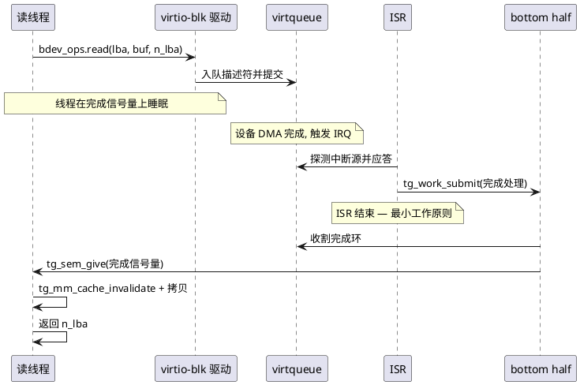

# 05 — 块设备(bdev-core 插件)

> 存储与设备域系列(4 篇): 04-vfs · **05-bdev** · 06-device(域总览) · 07-concrete-fs。
> **契约归属(D19/D20)**: 块设备能力由 **bdev-core 插件**提供——dev-core 通用设备下的**块设备子分类框架**, **依赖 dev-core**(块设备注册进 dev-core 命名空间)——bdev 类 ops/几何/可堆叠/分区映射器; page cache 以堆叠插件构建于其上。
> 版本: v1.0(virtio-blk); 分区 v1.x; page cache vx.0。本篇决策 SD-8/SD-9; 另涉 SD-2 的 bdev 侧(决策记录见 `06-device` §7)。

## 1. bdev 类

```c
typedef struct {
    uint32_t sector_size;     /* 逻辑扇区, 通常 512 */
    uint64_t n_sectors;
    uint32_t max_rw;          /* 单次传输上限(扇区) */
    uint32_t align;           /* 缓冲对齐要求, 0 = 任意(DMA 不敏感) */
    uint32_t flags;           /* TG_BDEV_F_* (可堆叠/只读/...) */
} tg_bdev_geom_t;

typedef struct tg_bdev_ops {
    int (*read)    (void *priv, uint64_t lba, void *buf, size_t n_lba);
    int (*write)   (void *priv, uint64_t lba, const void *buf, size_t n_lba);
    int (*flush)   (void *priv);            /* 必须落介质(page cache 依赖) */
    int (*geometry)(void *priv, tg_bdev_geom_t *g);
    /* D22 预留: ioctl(队列控制等)+ suspend/resume(电源管理); NULL = -ENOTSUP */
    int (*ioctl)(void *priv, uint32_t cmd, void *arg);
    int (*suspend)(void *priv);
    int (*resume)(void *priv);
} tg_bdev_ops;

int tg_bdev_register(const char *name, const tg_bdev_ops *, void *priv);
/* bdev-core API: 块设备注册进 dev-core 的命名空间(依赖 dev-core 的由来) */
const tg_bdev_ops *tg_bdev_get(const char *name, void **priv);   /* FS 插件绑定用 */
```

**可堆叠语义**: provider 同时可以是 consumer——上层看到同一 `tg_bdev_ops`。这是分区(§2)与 page cache(§3)的共同地基: VFS/FS/驱动对堆叠层**无感**(主文档 §10 评审要求)。

- **成功返回值**: `read/write` 成功返回传输扇区数(§5 时序图「返回 n_lba」即此约定); 失败 = SD-10 负 errno

**raw 块访问**: v1 块设备经类 API(`tg_bdev_get`)供 FS 绑定; `/dev/blk0` 的 raw 文件访问 = **v2**(devfs 的 bdev open_file 钩子置 NULL, D21)。

## 2. 分区映射器(SD-9, v1.x)

```c
int tg_bdev_partition(const char *parent_name, uint64_t offset_lba,
                      uint64_t n_lba, const char *child_name);   /* "blk0" → "blk0p1" */
```

子分区是**堆叠 bdev**(对外同接口), manifest 静态声明; v1 不做 MBR/GPT 解析(嵌入式产品分区表固化在 manifest 更可控)。

## 3. page cache 无感层(SD-8, vx.0)

- 形态: 堆叠于 **bdev-core** 之上的插件(上层看到同一 `tg_bdev_ops`), VFS/FS/驱动**无感**
- 预算: manifest 静态定死(无动态增长、无回收、无换页——比 Linux 简单一个量级)
- **写穿优先**(vx.0); **flush 必须转发到下层**(cache 不能吞 fsync)
- EROFS 特例走 FS 级缓存(`07-concrete-fs` §5), 与本层正交
- mmap/XIP 集成 = 开放问题(`07-concrete-fs` O-S1)

## 4. DMA/对齐/cache 约定

- 驱动经 `tg_dma_alloc` 分配传输缓冲(对齐/一致性); 传输前后 `tg_mm` cache 维护(R4: 签名 v1 起定稿; 升格 frozen 走 D15)
- `align` 非零时调用方负责对齐缓冲, 否则驱动内部 bounce
- bdev 请求带 cache 维护职责标注(对齐主文档 R4)

## 5. 关键流程: virtio-blk 中断驱动读(ISR→bh→唤醒)



## 6. 决策记录(本篇)

| # | 决策 | 理由 |
|---|---|---|
| SD-8 | page cache: 堆叠 bdev + 静态预算 + 写穿 + flush 必须转发 | 主文档 §10 既有决策的落地 |
| SD-9 | 分区 = 堆叠 bdev 映射器, manifest 静态声明 | 复用堆叠机制; 无 MBR 解析负担 |

## 7. 风险(本篇)

| # | 说明 |
|---|---|
| 堆叠层纪律 | 任何堆叠 bdev(pagecache/partition)**不得吞 flush**——语义必须守恒, 违者 conformance 用例拦截 |
| R-S4(关联) | 框架件边界漂移见 `06-device` §8——bdev-core 警惕塞入 FS 逻辑/缓存策略膨胀 |
