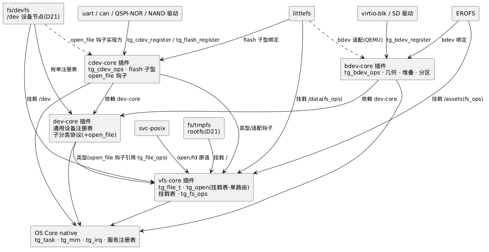

# 06 — 设备管理(dev-core, 通用设备框架件, 存储与设备域枢纽)

> 存储与设备域系列(4 篇): 04-vfs · 05-bdev · **06-device** · 07-concrete-fs。**本篇含域总览**(§1)。
> **契约归属(D19/D20)**: **dev-core 描述通用设备**——注册表(唯一扁平命名空间)、命名规则、调用语义/错误模型、ioctl 编码、**子分类协议**; **向下分为 cdev、bdev 等子分类框架**; **spi-nor/nand 对接 cdev-core**(flash 子型)。
> 版本: v1.0。本篇决策 SD-2/SD-5/SD-6/SD-10/SD-11/SD-12/SD-13/SD-14。

## 1. 域总览: 框架件归属与依赖(D19/D20)

**能力归属**: file/open/VFS 接口 = **vfs-core**; 通用设备 = **dev-core**, 向下子分类: 字符设备 = **cdev-core**(spi-nor/nand 的 flash 子型在此)、块设备 = **bdev-core**(**依赖 dev-core**); 具体文件系统(littlefs)依赖 **vfs-core**(另按介质绑定 cdev-core / bdev-core)。**所有设备经 /dev(devfs)接入 VFS 管理, tmpfs 挂载为 rootfs("/")**(D21, Linux devtmpfs/rCore DeviceFS 同型)。

| 框架件 | 提供(契约) | 依赖 |
|---|---|---|
| **dev-core** | **通用设备**: 注册表(唯一扁平命名空间)、命名规则、调用语义/错误模型、ioctl 编码、**子分类注册协议**(§2) | core native + vfs-core(类型, 仅头文件——open_file 钩子引用 `tg_file_ops`, §2) |
| **cdev-core** | **字符设备子分类**: `tg_cdev_ops`(会话形状)+ `tg_cdev_register`; **flash 子型**: `tg_flash_ops` + `tg_flash_register`(**spi-nor/nand 对接于此**); **open_file 钩子实现**(D21) | **dev-core + vfs-core**(类型/适配钩子) |
| **bdev-core** | **块设备子分类**: `tg_bdev_ops`/几何/可堆叠、分区映射器(SD-9) | **dev-core** |
| **vfs-core** | **`tg_file_t`/`tg_file_ops` 契约、`tg_open` 挂载表·单路由、挂载表、`tg_fs_ops`、目录语义** | **core(纯 VFS, D21: 撤销设备路由)** |

**消费者的依赖声明(manifest):**

| 消费者 | 依赖 |
|---|---|
| **fs/tmpfs(rootfs)** | **vfs-core**(挂载 "/") |
| **fs/devfs(/dev)** | **dev-core**(枚举注册表)+ cdev-core(钩子就绪)+ vfs-core(挂载) |
| littlefs | **vfs-core** + cdev-core(flash 子型绑定)/ bdev-core(QEMU bdev 适配)+ fs/tmpfs(挂载点父目录) |
| EROFS | vfs-core + bdev-core |
| svc-posix | **vfs-core**(open/fd 的底层原语) |
| uart / can / adc / gpio / display 驱动 | cdev-core(`tg_cdev_register`) |
| **QSPI-NOR / NAND 驱动** | **cdev-core**(`tg_flash_register`) |
| virtio-blk / SD 驱动 | bdev-core(`tg_bdev_register`) |



> 源文件: [plantUML/06-device-01.puml](plantUML/06-device-01.puml)

**存储栈全景:**


> 源文件: [plantUML/06-device-02.puml](plantUML/06-device-02.puml)

**框架件的治理身份**: **插件的身份, core 的纪律**——插件形态 ⇒ 可按组合裁剪(无存储产品不链 vfs-core/bdev-core); core 纪律 ⇒ API 面进 golden/门禁(`docs/1-architecture/01-api-contract-governance.md`, D12 机制), 不透明句柄(D14)。这是 core 的第三次收缩: POSIX→接口插件(v0.3), POSIX 运行时→服务(v0.5/D18), **能力框架→框架件(v0.6/D19)**; D20 进一步把设备侧框架**按子分类再切细**。

## 2. 设备注册表(dev-core)

- 唯一扁平命名空间: 设备名 `[a-z][a-z0-9]*`, 无斜杠(devfs 节点名 = 路径分量)
- **子分类注册协议**(框架件间协议, 不入 `docs/2-os-core/08-core-api-list.md` 通用清单): 子分类框架(cdev-core/bdev-core)的注册 API 经"依赖 dev-core"把条目入同一张表——`/dev/nor0`(经 devfs)、`tg_flash_get("nor0")`、`tg_bdev_get("blk0")` 看到同一对象

```c
/* dev-core: 通用注册表条目(子分类框架调用; 形状解释权在子分类框架) */
typedef struct {
    uint16_t class_id;     /* TG_CLASS_CDEV / TG_CLASS_BDEV / ... (append-only) */
    void    *class_priv;   /* 子分类框架的 ops 表指针(如 tg_cdev_ops*) */
    /* D21/D23: 可文件化钩子——devfs 设备节点 lookup 时调用, 返回文件 ops 集与私有 */
    int (*open_file)(void *dev_priv, const tg_file_ops **fops, void **fpriv);
    void *dev_priv;        /* 驱动私有 */
} tg_dev_class_entry_t;
int tg_dev_add(const char *name, const tg_dev_class_entry_t *entry);
```

- **钩子语义演化(D23)**: 自 D21 的"直接产出 `tg_file_t`"改为"返回 **{fops, fpriv}**"——配合 inode 走查模型(devfs 设备节点 inode 携带该二元组); cdev-core 提供通用会话适配 `tg_file_ops`(open 建会话/read/write/…转发)
- 设备名唯一性 = manifest 组合校验主键(§6)
- dev-core **不定义任何具体 ops 形状**——形状归子分类框架(§3), 新增子分类不动 dev-core
- `open_file` 钩子签名引用 `tg_file_ops`(vfs-core 类型)⇒ dev-core 对 vfs-core 为**类型依赖**(仅头文件, 无 init/call 依赖)

## 3. 设备子分类(D20: dev-core 通用, 向下分 cdev/bdev)

| 子分类 | 框架件 | ops 形状 | 注册 API | 例子 |
|---|---|---|---|---|
| **cdev**(字符设备) | **cdev-core** | 会话式 open 工厂(`tg_cdev_ops`) | `tg_cdev_register` | uart / can / adc / gpio / display |
| **cdev · flash 子型** | **cdev-core** | read/program/erase/sync(`tg_flash_ops`) | `tg_flash_register` | **spi-nor / nand** |
| **bdev**(块设备) | **bdev-core**(依赖 dev-core) | 扇区 read/write/flush + 几何 | `tg_bdev_register` | virtio-blk / SD / eMMC |

**设计理由**:
- **通用与形状分离**: dev-core 只管"是个设备"(命名/语义/注册表), 形状归子分类 ⇒ 新增子分类(netdev, O-S5)不动 dev-core
- **spi-nor/nand 对接 cdev-core**(D20): flash 是**字符型介质**(按地址 program/erase, 无磁盘式扇区抽象——擦除以 block 为粒度, 见 `tg_flash_geom_t`), 归字符设备子分类; 其 ops 形状是 cdev 的一个**子型**, 与 littlefs `lfs_config` 1:1(零胶水绑定)
- 磁盘型介质(无擦除、有 flush)语义不同 → bdev 子分类; 强行统一会把两类驱动都写别扭(SD-2 延续)
- **设备接入 VFS(D21)**: 注册表中的设备自动出现为 **/dev/<name> 节点**(fs/devfs 挂载于 /dev, 实时枚举); 打开经类 open_file 钩子——设备生命周期归驱动注册, 文件系统只做投影(`07-concrete-fs` §3)

```c
/* ---- cdev(cdev-core 契约): 会话式字符设备形状 ---- */
typedef struct tg_cdev_ops {
    int     (*open)(void *dev_priv, uint32_t flags, void **sess);
    ssize_t (*read)(void *sess, void *buf, size_t n);
    ssize_t (*write)(void *sess, const void *buf, size_t n);
    int     (*ioctl)(void *sess, uint32_t cmd, void *arg);
    int     (*poll)(void *sess, uint32_t *events);
    int     (*close)(void *sess);
    /* D22: 电源管理(设备级, dev_priv——非会话级); NULL = 不支持(-ENOTSUP) */
    int     (*suspend)(void *dev_priv);
    int     (*resume)(void *dev_priv);
} tg_cdev_ops;
int tg_cdev_register(const char *name, const tg_cdev_ops *, void *dev_priv);

/* ---- cdev · flash 子型(cdev-core 契约, 与 littlefs lfs_config 1:1) ---- */
typedef struct {
    uint32_t read_size, prog_size;   /* 最小读粒度 / 编程页大小 */
    uint32_t block_size;             /* 擦除块 */
    uint32_t block_count;
} tg_flash_geom_t;
typedef struct tg_flash_ops {
    int (*read)  (void *priv, uint32_t addr, void *buf, size_t n);
    int (*program)(void *priv, uint32_t addr, const void *buf, size_t n);
    int (*erase) (void *priv, uint32_t block_idx);
    int (*sync)  (void *priv);
    /* D22 预留: ioctl(NOR 深度下电/特性控制)+ suspend/resume(电源管理) */
    int (*ioctl)(void *priv, uint32_t cmd, void *arg);
    int (*suspend)(void *priv);
    int (*resume)(void *priv);
} tg_flash_ops;
int tg_flash_register(const char *name, const tg_flash_ops *,
                      const tg_flash_geom_t *, void *priv);
const tg_flash_ops *tg_flash_get(const char *name, void **priv);
```

**统一预留槽位(D22)**: 所有设备类别 ops 预留 `ioctl` / `suspend` / `resume`(suspend/resume 恒为设备级; ioctl 于 cdev 为会话级(`sess` 参数)、于 bdev/flash 为设备级); file 面向的 `poll` / `close` 由 **cdev-core** 通用 `tg_file_ops` 适配层提供(devfs 经 open_file 钩子取得该适配)。NULL = -ENOTSUP。
**动机 = D14**: ops 结构布局入 golden——后补字段 = 布局变更 = 二进制不兼容; **预留即免破坏**。suspend/resume 为电源管理钩子: v1 无统一调用方, v2 由 service/pm(或平台 PM 流程)经注册表枚举调用(O-S6)。

(bdev 子分类契约见 `05-bdev` §1。)

## 4. 调用语义与错误模型(SD-6/SD-10)

- **阻塞语义**(SD-6): read/write 阻塞调用线程; 驱动内部异步(DMA + 信号量), 对外同步
- **ISR 禁令**: 设备/存储域全部 API 禁止在 ISR 上下文调用(白名单为空)——静态检查执法(D10 双保险之一; conformance 矩阵 = R1 执法); core native 的白名单见 `docs/2-os-core/08-core-api-list.md` §11
- **错误模型**(SD-10): int 返回, **负 errno**。SD-10 全集(两域并集) = `-EIO/-EAGAIN/-EINVAL/-ENOMEM/-ENODEV/-ENOTSUP/-EBUSY/-EEXIST/-ETIMEDOUT/-ENOSPC/-EROFS`, 各域取子集; **设备/存储域子集**: `-EIO/-ENODEV/-ENOSPC/-EINVAL/-ENOTSUP/-EBUSY/-EROFS`(core 域子集见 `docs/2-os-core/08-core-api-list.md` §11); svc-posix 直接取 `-ret` 作 errno(零转换)
- 并发: 设备 ops 由驱动自锁(v1 单锁即可); FS 侧并发 v1 未另行约定(单 APP + 驱动自锁)

## 5. ioctl 编码(SD-5: Linux 兼容)

```c
/* 与 Linux _IOC 位布局一致: dir[31:30] size[29:16] type[15:8] nr[7:0] */
#define TG_IOR(type, nr, size)   ...
#define TG_IOW(type, nr, size)   ...
#define TG_IOWR(type, nr, size)  ...
/* type = 设备/驱动族魔数字母(每驱动族一个, 全局唯一分配): 'u' uart, 'c' can, 'b' bdev, 'f' flash, 'd' display ... */
```

零学习成本(直觉与 Linux 一致); 编码可静态查表 → 组合器/文档生成器可自动列 ioctl 清单。

## 6. 驱动编写者契约(快速开发的设备侧落点)

驱动作者只需: **实现 ops 表 + 遵守三条纪律 + 声明资源**。

| 纪律 | 内容 | 执法 |
|---|---|---|
| ISR 纪律 | ISR 最小工作 → `tg_work_submit`; 禁阻塞/malloc/持锁返回 | conformance + 评审清单 |
| DMA/cache 纪律 | `tg_dma_alloc` 分配; 传输前后 `tg_mm_cache_flush/invalidate`(R4) | conformance + 真硬件 M4 |
| 资源声明 | manifest: IRQ 号 / DMA 通道 / 引脚 / RAM 预算 | 组合期冲突检测(主文档 §6.4) |

- **框架件依赖声明(D19/D20, §1)**: uart/can/spi-nor/nand 驱动→**cdev-core**(`tg_cdev_register`/`tg_flash_register`), 块设备驱动→**bdev-core**, FS→vfs-core; init-DAG 保证框架件先于消费者初始化
- **级联驱动**(PMIC/GPIO 控制器): 实现 `tg_irq_domain_ops` 而非裸 ISR; 子中断消费者用 `tg_irq_register_child`——子 handler 契约随域类型(FAST=ISR 纪律, SLOW=线程上下文, `docs/2-os-core/08-core-api-list.md` §8.1)
- 平台差异(pinmux/时钟/中断号/region)全部由 Platform 插件数据提供(主文档 §8 三层模式)——**驱动代码板级无关**, 换板只换 Platform 插件

## 7. 决策记录(本篇)

| # | 决策 | 理由 |
|---|---|---|
| SD-2 | 设备子分类: dev-core=通用, cdev/bdev 为子分类框架; **flash = cdev 子型**(spi-nor/nand 对接 cdev-core) | littlefs 1:1 映射零胶水; flash 是字符型介质(无磁盘式扇区抽象); 新增子分类不动 dev-core |
| SD-5 | ioctl 用 Linux 兼容 32 位编码 | 零学习成本; 可静态枚举 |
| SD-6 | 对外同步阻塞 API; 驱动内部异步(DMA+信号量) | API 面最小; async 是 v2+ 优化 |
| SD-10 | 错误 = 负 errno(SD-10 全集 + 各域子集, 设备域 7 码见 §4), svc-posix 零转换 | 单一错误空间 |
| SD-11 | **框架件归属(D19)**: file/open/VFS = vfs-core; 通用设备 = dev-core; bdev = bdev-core(依赖 dev-core); littlefs → vfs-core | 用户指定; core 第三次收缩; 框架件 = 插件身份(可裁剪) + core 纪律(golden/门禁) |
| SD-12 | **设备子分类框架化(D20)**: cdev-core 独立框架件(依赖 dev-core); spi-nor/nand → cdev-core(flash 子型); ~~vfs-core 依赖 dev-core + cdev-core~~ → **SD-13/D21 修订**: 撤销; netdev 的答案空间 = 第三个子分类框架(O-S5) | 用户指定; 通用/形状分离; 子分类对称可扩展 |
| SD-13 | **设备接入 VFS(D21)**: fs/devfs 把 dev-core 注册表发布为 /dev 节点; 类 open_file 钩子(devfs 不依赖子分类形状); **vfs-core 纯化**(撤销设备路由, 依赖收缩到 core); fs/tmpfs 挂载为 rootfs("/") | Linux devtmpfs/rCore DeviceFS 同型; 单路由 = 单一语义; 用户指定 |
| SD-14 | **设备 ops 统一预留(D22)**: `ioctl`/`suspend`/`resume` 槽位全类别预留(poll/close 由 cdev-core 通用 tg_file_ops 适配层提供, devfs 经钩子取得); NULL → -ENOTSUP | D14: ops 布局入 golden, **预留即免二进制破坏**; PM 设备级钩子(suspend/resume); 用户指定 |

## 8. 风险与开放问题(本篇)

| # | 类型 | 说明 |
|---|---|---|
| R-S4 | 风险 | 框架件边界漂移——*-core 是"插件身份 + core 纪律", 警惕往框架件里塞策略(会胖成小内核); golden 面审查是防线 |
| O-S2 | 开放 | NAND: 对接 cdev-core flash 子型后, 坏块管理/OOB 需在其上叠加 bbm/FTL 层(v2+)——子型 ops 是否够用待真实硬件验证 |
| O-S4 | 开放 | flash 子型若膨胀(NAND OOB)可在 cdev-core 内扩展或对称拆出 flash-core(依赖 cdev-core)——真实需求出现再定 |
| O-S5 | 开放 | **netdev(v2.0 网络栈前置)**: D20 子分类模型给出答案空间——**netdev-core 作为第三个子分类框架**(依赖 dev-core, 对称 cdev/bdev); `service/lwip` 对接之; v2.0 设计前定(`docs/1-architecture/02-roadmap.md` v2.0 插件清单 ★) |
| O-S6 | 开放 | **PM 调用方(v2)**: suspend/resume 的统一调用方——service/pm 经 dev-core 注册表枚举, 或平台 PM 流程; 与 sched-tt/低功耗 idle 的组合语义(挂起顺序/失败回滚) |
