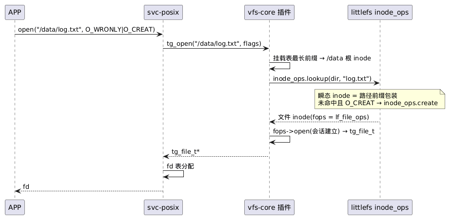

# 7-01 — VFS(vfs-core 插件)

> 存储域系列(3 篇, 章节 **7-storage**): **7-01-vfs** · 7-02-bdev · 7-03-concrete-fs。**设备管理独立成章** → `docs/8-device/8-01-device.md`。
> **契约归属(D19/D21)**: file / open / VFS 接口的能力由 **vfs-core 插件**提供——`tg_file_t`/`tg_file_ops` 契约、`tg_open` 挂载表·单路由、挂载表、`tg_fs_ops`、目录语义; **纯 VFS(D21: 设备依赖移出, 设备经 fs/devfs 接入, 依赖面收缩到 core)**。
> 版本: v1.0(M2 里程碑起)。本篇决策 SD-1/SD-3/SD-4/SD-7/SD-15(决策编号, 分篇列出)。

## 缩略词(abbreviations)

| 缩略词 | 英文全称 | 说明 |
|---|---|---|
| **API** | Application Programming Interface | 应用程序接口 |
| **APP** | Application | 应用(插件类别: 唯一业务逻辑, 恰一个, 不被任何插件依赖) |
| **DeviceFS** | — | rCore 的设备文件系统(devfs 的同型参照) |
| **EROFS** | Enhanced Read-Only File System | 只读压缩文件系统(代码/资产分区, v2.0) |
| **errno(E*)** | error number | POSIX 错误码; core 以**负值**返回 `-EINVAL`/`-EAGAIN`/`-ETIMEDOUT`/`-ENOTSUP`/`-EBUSY`/`-EEXIST`/`-EIO`/`-ENODEV`/`-ENOMEM`/`-ENOSPC` 等, 域用子集 |
| **FS** | File System | 文件系统(插件类别之一) |
| **poll** | — | 可等待事件原语: v1 预留槽位、v2 实现 wait-queue(SD-7) |
| **POSIX** | Portable Operating System Interface | 可移植操作系统接口 |
| **R-S1–R-S4** | — | 存储与设备域的风险编号 |
| **SD-1–SD-15** | — | 存储与设备域决策编号(7-01/7-02/8-01 §决策记录) |
| **super / inode / file / dentry** | — | VFS ops 四层(D23, Linux 型): fs 级 / inode 级 / 打开会话级 / 目录项级(预留) |
| **USB** | Universal Serial Bus | 通用串行总线 |
| **VFS** | Virtual File System | 虚拟文件系统(统一可打开模型 + 挂载表) |

> **编号约定**: `SD-*` = 本篇 §6 决策; `R-S*`/`O-S*` = 风险 / 开放问题(§7); `D1–D26` = 全局决策。

## 1. 统一可打开模型(SD-1, D21 修订)

一切可打开的对象 = `tg_file_t`(不透明句柄, D14)。单一原语 `tg_open`, **只走挂载表**(D21 修订: 撤销裸名设备路由, 设备统一经 /dev 命名空间——Linux devtmpfs / rCore DeviceFS 同型):

- `"/"` → tmpfs(rootfs)——最短前缀兜底
- `"/dev/xxx"` → devfs——节点由 dev-core 注册表自动生成
- `"/data/xxx"` → littlefs——挂载点最长前缀匹配

```c
typedef struct tg_file tg_file_t;          /* 不透明(D14) */

typedef struct tg_file_ops {                /* 不支持的槽位 = NULL, 返回 -ENOTSUP */
    int     (*open) (tg_file_t *f, uint32_t flags);     /* D23: 会话建立 */
    ssize_t (*read) (tg_file_t *f, void *buf, size_t n);
    ssize_t (*write)(tg_file_t *f, const void *buf, size_t n);
    off_t   (*lseek)(tg_file_t *f, off_t off, int whence);
    int     (*ioctl)(tg_file_t *f, uint32_t cmd, void *arg);
    int     (*fsync)(tg_file_t *f);
    int     (*poll) (tg_file_t *f, uint32_t *events);   /* 查询就绪位 */
    int     (*poll_attach)(tg_file_t *f, void *wait);  /* v2 预留: wait-queue 注册(NULL → -ENOTSUP, D22/D14 预留即免布局破坏) */
    int     (*close)(tg_file_t *f);
} tg_file_ops;

/* vfs-core 统一入口 — svc-posix fd 表的底层原语 */
tg_file_t *tg_open(const char *path, uint32_t flags);
ssize_t    tg_file_read (tg_file_t *, void *, size_t);
ssize_t    tg_file_write(tg_file_t *, const void *, size_t);
int        tg_file_ioctl(tg_file_t *, uint32_t cmd, void *arg);
int        tg_file_fsync(tg_file_t *);
int        tg_file_close(tg_file_t *);
```

设计要点:
- **契约归属(D19)**: 本节全部 API 由 **vfs-core 插件**提供
- **设备打开的内部流程(D21/D23)**: `tg_open("/dev/xxx")` → 挂载表 → devfs 根 inode → `inode_ops.lookup("xxx")` → 设备节点文件 inode(**{fops, fpriv} 由类 open_file 钩子给出**)→ `fops->open` 建会话。**vfs-core 因此成为纯 VFS**(零设备知识, 依赖面收缩到 core)
- **svc-posix 的直接受益者**: fd 表项统一持有 `tg_file_t*`, 设备与文件无分别; svc-posix 依赖 vfs-core
- 设备名命名规则: `[a-z][a-z0-9]*`, 无斜杠(devfs 节点名 = 路径分量, D21 下依旧成立)
- `tg_file_t` 由 vfs-core 经 core 堆(`tg_malloc`)分配, close 释放; v1 无引用计数(单 APP 无 fork)
- 独占设备(uart 类典型): 驱动在 `ops->open` 会话建立时自行返回 `-EBUSY`(独占性策略归驱动, cdev 注册契约不设 flags 载体——`8-01-device` §3)

## 2. 挂载与 ops 分层(SD-3/SD-15, D23: Linux 型四层)

```c
/* ---- 层 1: superblock 级(tg_fs_ops, FS 插件注册挂载时提供) ---- */
typedef struct tg_fs_ops {
    int  (*mount)(void *fs_priv, const tg_fs_cfg_t *cfg, tg_inode_t **root);
    void (*free_inode)(tg_inode_t *ino);    /* 瞬态 inode 释放(v1 无缓存, 走查即弃) */
    int  (*unmount)(void *fs_priv);         /* v2 预留 */
    int  (*sync)(void *fs_priv);            /* 卷级 sync(对应 POSIX sync, 与文件级 fsync 并列) */
} tg_fs_ops;

int tg_mount_register(const char *path, const tg_fs_ops *, void *fs_priv);

/* ---- 层 2: inode 级(目录 inode 操作集——路径走查与名字空间变更) ---- */
typedef struct tg_inode_ops {
    tg_inode_t *(*lookup)(tg_inode_t *dir, const char *name);
    int  (*create) (tg_inode_t *dir, const char *name, uint32_t flags, tg_inode_t **out);
    int  (*unlink)(tg_inode_t *dir, const char *name);
    int  (*mkdir)(tg_inode_t *dir, const char *name);
    int  (*rmdir)(tg_inode_t *dir, const char *name);
    int  (*rename)(tg_inode_t *dir, const char *name, tg_inode_t *ndir, const char *nname);
    int  (*getattr)(tg_inode_t *ino, tg_stat_t *st);
    int  (*setattr)(tg_inode_t *ino, const tg_stat_t *st);
    /* v2 预留: symlink / readlink / mknod */
} tg_inode_ops;

/* ---- 层 3: file 级(每文件; open 建会话, close 销毁——D23 自 fs 级移入) ---- */
/* tg_file_ops: open/read/write/lseek/ioctl/fsync/poll/close(§1) */

/* ---- 层 4: dentry 级(预留, v1 全 NULL) ---- */
typedef struct tg_dentry_ops {
    int (*revalidate)(void *dentry);        /* v2: dcache 失效校验 */
    int (*compare)(void *dentry, const char *name);  /* v2: 名字比较定制 */
} tg_dentry_ops;
```

**inode 对象模型**(CA-2 同型: vfs-core 公共头 + FS 私有尾):

```c
typedef struct tg_inode tg_inode_t;        /* 不透明(D14) */
struct tg_inode {                          /* 公共头; 私有尾: littlefs=路径前缀, devfs=设备条目 */
    uint32_t type;                         /* TG_INODE_DIR / TG_INODE_FILE */
    const tg_inode_ops *iops;              /* 目录 inode */
    const tg_file_ops  *fops;              /* 文件 inode */
};
```

- **走查模型**: `tg_open` → 挂载表 → 根 inode → 逐级 `inode_ops.lookup` → 文件 inode → `fops->open` 建会话; 未命中且 O_CREAT → `inode_ops.create`
- **inode v1 瞬态**(SD-3 不变): inode 是走查的中间产物, `free_inode` 即弃——**有 inode ops, 无 inode cache**; littlefs 走查廉价(元数据对)、EROFS 有介质内索引, 单 APP 文件规模下 cache 是优化非需求; v2 dcache 落地时 dentry 持久化并启用 `tg_dentry_ops`
- **目录枚举**: 目录 inode 的 file 面(`opendir` → `tg_dir_t` 迭代), readdir 由 svc-posix 映射
- **能力归属(D19)**: 本节契约由 **vfs-core 插件**提供(**路径走查在 vfs-core**); FS 插件实现 ops 族, manifest 声明依赖(具体 FS 见 `7-03-concrete-fs`)
- **v1 静态挂载**(SD-4): manifest → **挂载计划**(`7-03-concrete-fs` §6): fs/tmpfs → **"/" (rootfs)** 首挂 → fs/devfs → /dev → fs/littlefs → /data; **挂载点在父 FS 缺失时自动 mkdir**(静态组合便利 > 显式 mkdir 仪式); 运行时挂载(USB 热插拔): 事件模型 v2 设计, 挂载落地不早于 v3(O-S3)
- cwd 是 POSIX 概念, 归 svc-posix; **native API 只认绝对路径**

## 3. poll/事件等待(SD-7 分期)

- **v1**: `file_ops.poll` 查询就绪位(`TG_POLLIN/OUT/ERR`); svc-posix 的 `poll()` = 轮询 + `tg_task_sleep` 粗粒度循环——coop 调度下语义正确且够用
- **v1 预留 / v2 实现**: `tg_file_ops` 自 v1 即预留 `poll_attach` 槽位(NULL → -ENOTSUP, 与 `tg_dentry_ops` 同法——D22/D14: ops 布局入 golden, 后补字段 = 布局破坏); v2 实现 wait-queue 注册与精确唤醒——**必须与 preempt 同期**(否则抢占产品上轮询延迟毛刺, 见 R-S1)

## 4. 与其他子系统的接口

### 4.1 svc-posix(D18/D19)

- **依赖 vfs-core(D19/D21)**: open()→`tg_open` 的底层原语; 设备路径经挂载表路由至 fs/devfs, 由 devfs 经 open_file 钩子接入 dev-core 侧(§4.2)
- fd 表项 = `tg_file_t*`(SD-1: 设备/文件统一, fd 层零特判)
- 路径分派: **零特判**——一切经挂载表; `/dev/*` 由 devfs 承接(D21)
- errno = `-ret`(`8-01-device` §4); poll 按 §3 分期实现

### 4.2 设备接入(devfs 插件, D21)

设备不再由 vfs-core 特判路由: **fs/devfs** 插件(挂载于 /dev)把 dev-core 注册表发布为节点, 打开经 D20 子分类协议的 **open_file 钩子**(cdev-core 实现: 会话 → `tg_file_t` 适配)。**vfs-core 成为纯 VFS**——零设备知识, 依赖面收缩到 core。详见 `7-03-concrete-fs` §3、`8-01-device` §2/§3。

### 4.3 page cache(无感)

page cache 以堆叠 bdev 形态存在(`7-02-bdev` §3), **VFS 与 FS 对它无感**——不需要任何配合代码。

## 5. 关键流程: open 全链路(SD-1/SD-3/D23 的运转视图)



> 源文件: [plantUML/7-01-vfs-01.puml](plantUML/7-01-vfs-01.puml)

## 6. 决策记录(本篇)

| # | 决策 | 理由 |
|---|---|---|
| SD-1 | 统一可打开模型: 一切 = `tg_file_t`, `tg_open` **只走挂载表**(D21 修订: 设备经 /dev 接入) | svc-posix fd 层零特判; 单路由 = 单一语义 |
| SD-3 | handle-split VFS, v1 无 inode/dentry **cache**(D23: 有 inode **ops**, inode 瞬态) | 单 APP 文件规模下 cache 是优化非需求; 用数据再决定 |
| SD-4 | v1 静态挂载(manifest 生成配置); 运行时挂载: 事件模型 v2 设计、落地不早于 v3(O-S3) | 热插拔需要事件模型, 与 USB 栈同期 |
| SD-7 | poll 分期: v1 轮询+sleep, v2 wait-queue(与 preempt 同期) | coop 下轮询语义正确; preempt 下必须精确唤醒 |
| SD-15 | **VFS ops 分层(D23)**: super(fs 级)/inode/file/dentry(预留)四层; **路径走查在 vfs-core**(lookup 链); file_ops 增加 open(会话建立); D20 钩子演化为返回 {fops, fpriv} | Linux 型可扩展性(dcache/symlink/mountpoint 的演进路径); inode 瞬态保 SD-3 |

## 7. 风险与开放问题(本篇)

| # | 类型 | 说明 |
|---|---|---|
| R-S1 | 风险 | poll v1 轮询在 preempt 下的延迟毛刺——v2 wait-queue 必须与 preempt 同期落地, 否则仪表类产品有可感知延迟 |
| R-S3 | 风险 | 无 inode cache 的性能上限——深路径/大目录开销需 M3 基准数据, 再决定 v2 是否引入 |
| O-S3 | 开放 | 运行时挂载/热插拔——事件模型 v2 设计(与 USB 栈联动), 挂载落地不早于 v3 |
