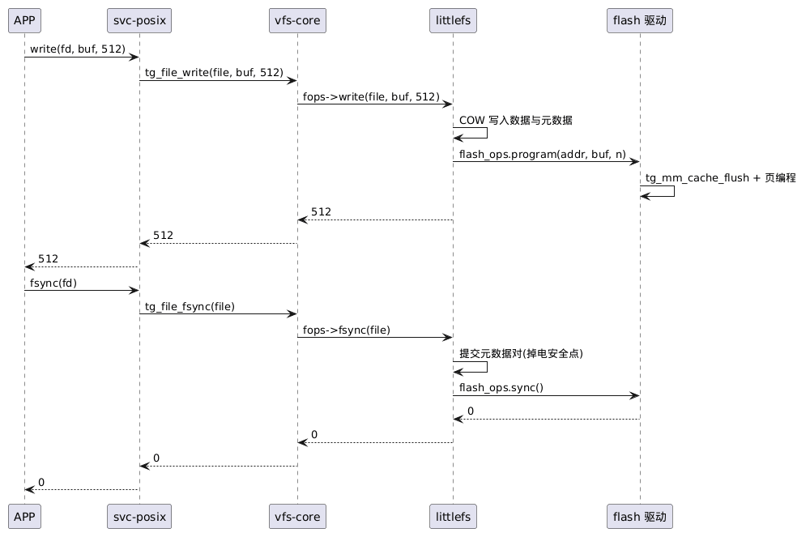

# 7-03 — 具体文件系统(FS 插件)

> 存储域系列(3 篇, 章节 **7-storage**): 7-01-vfs · 7-02-bdev · **7-03-concrete-fs**。**设备管理独立成章** → `docs/8-device/8-01-device.md`。
> 定位: FS 插件**依赖 vfs-core**(fs_ops/挂载注册, `7-01-vfs` §2)。分两类: **管理类 FS**(tmpfs rootfs / devfs 设备节点, D21)与**介质 FS**(littlefs/EROFS, 按介质绑定 cdev-core/bdev-core)。
> 版本: tmpfs / devfs / littlefs v1.0(D17/D21); EROFS v2.0; fatfs/romfs 未排期。

## 缩略词(abbreviations)

| 缩略词 | 英文全称 | 说明 |
|---|---|---|
| **API** | Application Programming Interface | 应用程序接口 |
| **COW** | Copy-On-Write | 写时复制(掉电安全 FS 的提交方式) |
| **D1–D26** | — | 主文档 §1 的全局决策编号(D24–D26 = HSM 完整样例/crypto 版本策略/资产边界) |
| **devfs** | — | 设备文件系统: 把 dev-core 注册表投影为 /dev 节点(D21) |
| **EROFS** | Enhanced Read-Only File System | 只读压缩文件系统(代码/资产分区, v2.0) |
| **FS** | File System | 文件系统(插件类别之一) |
| **fsync** | — | 把文件数据与元数据强制落介质的系统调用(堆叠层不得吞掉) |
| **littlefs** | — | 掉电安全的嵌入式文件系统(数据分区, v1.0) |
| **mkfs.erofs** | — | EROFS 镜像制作工具(与 Linux 同源) |
| **NOR** | Not-OR | 或非门闪存(可随机读 / XIP) |
| **O-S1–O-S8** | — | 存储与设备域的开放问题编号 |
| **page cache** | — | 页缓存: 堆叠于 bdev 之上的无感层(SD-8) |
| **QEMU** | Quick Emulator | 开源模拟器(v1 的主要验证平台) |
| **RAM** | Random Access Memory | 随机访问存储器 |
| **R-S1–R-S4** | — | 存储与设备域的风险编号 |
| **SD-1–SD-15** | — | 存储与设备域决策编号(7-01/7-02/8-01 §决策记录) |
| **tmpfs** | — | 内存文件系统: v1.0 挂为 rootfs("/") |
| **VFS** | Virtual File System | 虚拟文件系统(统一可打开模型 + 挂载表) |
| **wear-leveling** | — | 磨损均衡: flash 写均衡策略(磁盘介质上无意义, R-S2) |
| **XIP** | eXecute In Place | 原地执行(不经 RAM 拷贝直接取指) |

> **编号约定**: `D17`/`D21`/`D22`/`D23` = 全局决策; `SD-*` = 存储域决策(7-01/8-01); `R-S*`/`O-S*` = 风险 / 开放问题(§9)。

## 1. FS 插件契约总览

| | tmpfs(v1.0) | devfs(v1.0) | littlefs(v1.0) | EROFS(v2.0) |
|---|---|---|---|---|
| 角色 | **rootfs("/")** | **/dev 设备节点** | 数据分区 | 代码/资产分区 |
| 介质 | RAM(core 堆) | dev-core 注册表(实时枚举) | flash 子型 / bdev 适配 | bdev 子分类 |
| 写路径 | 完整读写 | n/a——read/write/ioctl 转发设备 ops(设备语义) | COW + 元数据对, 掉电安全 | 只读 → -EROFS |
| 掉电保持 | 否 | n/a | 是 | n/a(只读) |
| 自带缓存 | 无需 | 无 | 内部结构 | FS 级解压页缓存 |

## 2. tmpfs(v1.0, rootfs — D21)

- **RAM 文件系统**: 节点与数据均出自 core 堆(`tg_malloc`); 完整文件语义(read/write/lseek/truncate/unlink/rename/mkdir/stat)
- **挂载为 rootfs("/")**: 命名空间骨架——/dev、/data、/tmp 等目录由 manifest **预建目录列表**生成
- 用途: rootfs 兜底(一切未匹配挂载点的路径落于此)、/tmp 临时文件、**无介质产品也能拥有完整 VFS 命名空间**
- 数据介质归 littlefs/EROFS——tmpfs 掉电不保持, 这是角色分工不是缺陷

## 3. devfs(v1.0, /dev 设备节点 — D21)

**所有设备经 devfs 接入 VFS 管理**(D21, Linux devtmpfs / rCore DeviceFS 同型):

- 节点 = **dev-core 注册表实时枚举**: `tg_cdev/tg_flash/tg_bdev_register` 即出现节点(注册即上线), 无持久化
- **inode 映射(D23)**: 根 inode = 注册表投影; `inode_ops.lookup(name)` → 设备节点**文件 inode**({fops, fpriv} 由类 **open_file 钩子**给出, `8-01-device` §2)→ `fops->open` 建会话
  - cdev-core 提供通用会话适配 `tg_file_ops`(open 建会话/read/write/ioctl/poll/close 转发; lseek/fsync 槽位 NULL → -ENOTSUP)
  - bdev 的 raw 块访问(/dev/blk0)钩子 = **v2**(v1 置 NULL, FS 经 `tg_bdev_get` 类 API 绑定)
- readdir/stat 列设备名与类别; unlink/mkdir → -ENOTSUP(**设备生命周期归驱动注册, 不归文件系统**)
- devfs 依赖 dev-core(枚举/钩子协议)、cdev-core(init 依赖, 保证钩子就绪)与 vfs-core(挂载)——**不依赖任何子分类的 ops 形状**

## 4. littlefs(v1.0, D17)

- **flash 子型绑定 1:1**: `tg_flash_ops`(**cdev-core 的 flash 子型, spi-nor/nand 对接于此**, `8-01-device` §3)与 littlefs 的 `lfs_config` 块设备回调一一对应, 适配层近零
- **inode 映射(D23)**: 目录 inode = **瞬态路径前缀包装**(`lookup(dir, name)` = `lfs_stat(前缀+name)`); 文件 inode 私有尾 = 路径; `fops->open` 建立 lfs_file 会话——无 inode cache, SD-3 不变
- **QEMU bdev 适配器**(v1 工件): `program→write`, `erase→nop`(磁盘无擦除), `sync→flush`——仅测试用途, **wear-leveling 在磁盘介质上无意义**, 代码注释与文档双标注(R-S2)
- **掉电安全**: COW + 元数据对提交; `fsync` 路径见 §7
- manifest 配置: 挂载点(/data) / 设备名 / `block_cycles`
- 角色(与 EROFS 分工, D17): **数据分区**——DA 日志、仪表配置等可写数据

## 5. EROFS(v2.0)

- 只读压缩 FS: 车规生态熟面孔, `mkfs.erofs` 工具链与 Linux 同源
- 用途: **代码/资产分区**(挂 /assets)
- **FS 级解压页缓存**: 静态预算(manifest), 缓存解压后的页; 与 bdev 层 page cache 正交(`7-02-bdev` §3)
- write → -EROFS; XIP(NOR 零拷贝执行)是诱惑但 cache 一致性代价未评估(通路前提见 O-S1)

## 6. 挂载计划与启动顺序(D21, 静态)

```
挂载顺序(manifest 生成, 各 FS 插件 init 时执行):
1. fs/tmpfs  → /          (rootfs; 预建 /dev /data /tmp)
2. fs/devfs  → /dev       (依赖 dev-core + cdev-core 钩子就绪)
3. fs/littlefs → /data    (挂载点父目录在 tmpfs)
4. fs/erofs  → /assets    (v2)
```

- **挂载点在父 FS 缺失时自动 mkdir**——静态组合的便利性优先于显式 mkdir 仪式(manifest 组合期已校验)
- init 顺序由 manifest 依赖声明保证: fs/devfs → {dev-core, cdev-core, vfs-core}; fs/littlefs → {vfs-core, fs/tmpfs, cdev-core + bdev-core(QEMU bdev 适配)}
- 运行时挂载(USB 热插拔): 事件模型 = v2 议题, 挂载落地不早于 v3(O-S3)

## 7. 关键流程: write + fsync 落盘路径



> 源文件: [plantUML/7-03-concrete-fs-01.puml](plantUML/7-03-concrete-fs-01.puml)

## 8. 决策关联

- **D17**(主文档): littlefs v1.0(数据) + EROFS v2.0(代码/资产)分工
- **D21**(主文档): tmpfs rootfs + 设备经 devfs 接入 VFS; tg_open 单路由(SD-1 修订)
- **D22**(主文档): 设备 ops 统一预留 ioctl/PM 钩子(`8-01-device` §3, SD-14)
- **D23**(主文档): VFS ops 四层分层(super/inode/file/dentry 预留, `7-01-vfs` §2, SD-15)
- **SD-3/SD-4**(`7-01-vfs`): 瞬态 inode 走查 + 静态挂载计划
- **SD-2/SD-13**(`8-01-device`): 子分类与 open_file 钩子是 devfs 的底座

## 9. 风险与开放问题(本篇)

| # | 类型 | 说明 |
|---|---|---|
| R-S2 | 风险 | bdev 适配跑 littlefs 的语义失真——wear-leveling 无意义; 仅 QEMU 功能测试, 双标注 |
| O-S1 | 开放 | mmap/XIP 与 page cache 集成——EROFS-on-NOR 的 XIP 是仪表域诱惑(通路前提: NOR 内存映射窗口直读 + 元数据经适配 bdev, 路径待设计), cache 一致性代价未评估 |
| O-S3 | 开放 | 运行时挂载/热插拔: devfs 节点随注册出现(v1 已动态), 但挂/卸载文件系统需 v2 事件模型(设计议题), 运行时挂载落地不早于 v3 |
| — | 未排期 | fatfs / romfs: 存量生态兼容诉求出现时按需拉入 |
