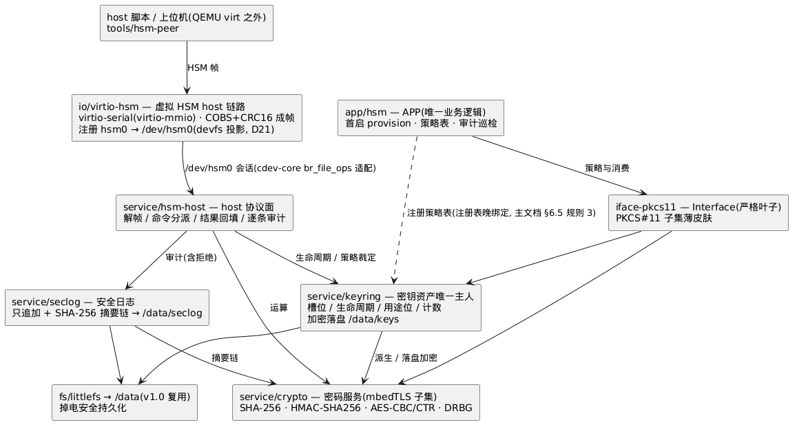
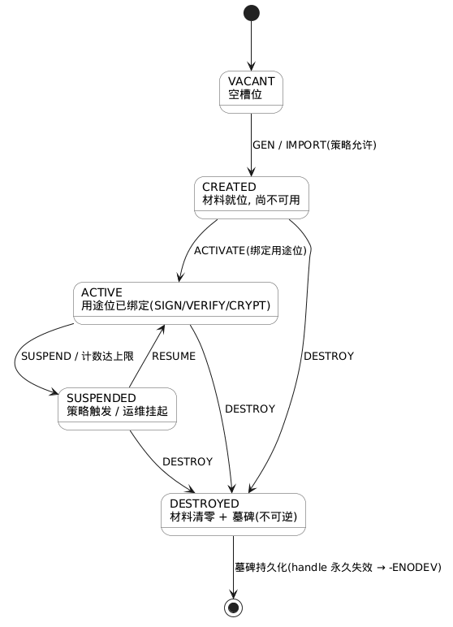

# 9-02 — HSM 完整样例(第二产品域的纵向切片)

> 章节: **9-app**。状态: **成文**(v1.x / M5 的设计基线)。
> 来源: 主文档 §0(核心价值主张: 新产品的 OS 部分零开发)/ §14(两域映射的 HSM 行)/ §1 **D24–D26**(本篇引入); 评审输入 `comment/review2/01-architecture-review.md`(P1「HSM 无资产隔离故事」/ P2「§14 典型插件组合大多未排期」); 版本落点 `docs/1-architecture/1-03-roadmap.md` §1 v1.x + §3 M5。
> 定位: 与 `docs/1-architecture/1-01-architecture.md` §7.6 的 sqlite 样例**正交**——sqlite 证明"三方件能跑通"(**移植性**), 本篇证明"**产品 = 插件组合**"(**组合性**): HSM 产品的 OS 增量只有 `app/hsm` + 一份 manifest。

## 缩略词(abbreviations)

| 缩略词 | 英文全称 | 说明 |
|---|---|---|
| **AES** | Advanced Encryption Standard | 对称分组密码(v1.x crypto 子集) |
| **APP** | Application | 应用(插件类别: 唯一业务逻辑, 恰一个, 不被任何插件依赖) |
| **CBC / CTR** | Cipher Block Chaining / CounTeR | AES 工作模式(v1.x 子集; 无认证加密, §6.1) |
| **COBS** | Consistent Overhead Byte Stuffing | 帧定界编码(host 链路与 debug bridge 同族, `docs/5-debug/5-01-debug.md` §2) |
| **DMA** | Direct Memory Access | 直接内存访问(硬件后端才需要, §7.3) |
| **DoD** | Definition of Done | 完成定义(此处 = M5 验收标准, §11) |
| **HMAC** | Hash-based Message Authentication Code | 基于哈希的消息认证码(HMAC-SHA256) |
| **HSM** | Hardware Security Module | 硬件安全模块(此处 = 第二产品域: 安全核, `docs/1-architecture/1-01-architecture.md` §14) |
| **IV** | Initialization Vector | 初始化向量(CBC/CTR 入参) |
| **key handle** | — | 不透明密钥句柄(D14 纪律: APP 拿不到密钥材料, 只拿 handle) |
| **M0–M5** | — | v1.0/v1.x 内部里程碑(`docs/1-architecture/1-03-roadmap.md` §3; M5 = HSM 完整样例) |
| **manifest** | — | 产品级组合输入(选插件/预算/挂载计划; 语义待 `docs/4-plugin/4-03-plugin-manifest.md` 定稿) |
| **PKCS#11** | Public-Key Cryptography Standards #11 | 密码 token 接口标准(iface-pkcs11 的语义来源) |
| **provision** | — | 首启配置: 注入/生成设备根密钥与策略表(§5.1) |
| **QEMU** | Quick Emulator | 开源模拟器(v1 的主要验证平台) |
| **RoT** | Root of Trust | 信任根(样例中 = provision 注入的设备根密钥) |
| **SHA-256** | Secure Hash Algorithm 256 | 摘要算法(v1.x crypto 子集; 亦用于审计摘要链) |
| **TRNG** | True Random Number Generator | 真随机数发生器(熵源缺口见 O-H1) |
| **VFS** | Virtual File System | 虚拟文件系统(统一可打开模型 + 挂载表) |
| **WORM** | Write Once Read Many | 只追加不可改写(seclog 的写入语义) |

> **编号约定**: `D24–D26` = 全局决策(本篇引入, 记录于 `docs/1-architecture/1-01-architecture.md` §1); `O-H1–O-H8` / `R-H1–R-H3` = 本篇开放问题 / 风险; `TC-HSM-1xx` = conformance 用例组(`docs/6-test/6-01-test.md` §3.9); `D19–D23`/`SD-*`/`CA-*` = 既有决策; P1–P3 = §1.1 的三个命题。

## 1. 为什么是 HSM, 为什么是 v1.x

### 1.1 样例要证明的三个命题

**主文档 §0** 的价值主张"新产品的 OS 部分零开发, 只做组合"此前是一条**断言**, 缺一个可运行的反例检验。HSM 样例把它拆成三个可机械判定的命题:

| # | 命题 | 判据(§11 验收) |
|---|---|---|
| **P1** | **组合即产品**: 一个完整产品 = core + 既有插件 + 一个 APP | 增量只有 `app/hsm` 与其 manifest(§9.1) |
| **P2** | **裁剪与置换**: 调度器 / 密码后端 / 接口面可换, 插件源码零改写 | 变体矩阵(§10)每行只改 manifest |
| **P3** | **域可复用**: 第二个产品域复用同一 core / 调度框架 / 注册表 / 组合模型 | HSM 与 dashboard 共用四件框架件 + vfs 栈 + 服务注册表(§3.1) |

### 1.2 为什么 HSM 是第二域的最佳载体

- 它已经是**主文档 §0/§14** 声明的第二产品域, 但**插件组合此前全部未排期**(评审 P2)——样例落地即把声明兑现为可运行件;
- 它的资产模型(密钥 / 策略 / 审计)迫使样例回答**安全边界**问题(评审 P1), 而 dashboard 样例不会——这是"完整 Sample"最有价值的部分;
- 它对设备 / 服务 / 接口 / APP 四层各有实质要求(host 链路 / 密码与密钥服务 / 域标准皮肤 / 密钥策略), 天然是全栈切片, 而不是单点 demo。

### 1.3 为什么是 v1.x(M5)而不是 v2/v3

| 样例需要的能力 | 版本 | 对样例的含义 |
|---|---|---|
| dev-core / cdev-core / vfs-core + tmpfs / devfs / littlefs | v1.0(M2) | 设备注册、`/dev` 节点、`/data` 持久化已就绪 |
| 服务注册表 + init-DAG | v1.0(M0–M2) | crypto / keyring 以服务形态发布与消费 |
| sched-coop + bottom half(work queue) | v1.0(M1) | host 链路中断路径(ISR→bh→信号量)已就绪 |
| sched-preempt | v2.0 | **置换维**(§10), 非前置 |
| 完整密码算法集 / ed25519 / TLS / 硬件密码引擎 | v2.0 | **置换维**(后端升级, D25), 非前置 |
| MPU 内存隔离 | vx.0(未排期) | **不前置**——v1.x 的资产边界按 §2.3 诚实声明 |

结论: v1.x 是**唯一**能让样例证明组合性、又不必等待隔离 / 抢占 / 完整密码库的版本; 推到 v2 会让**主文档 §0** 的主张在整个 v1 生命周期内没有反例检验。反观 v1.x 在加 M5 之前只有 M4(真实 SoC + PMIC/GPIO), 而 M4 依战略语境**可降级为选配**——把"组合即产品"这一核心主张全押在一条可降级的支线上, 风险不对称。

## 2. 域画像与资产模型

### 2.1 产品画像

安全核侧(本样例 = brickOS 镜像)对**主机**(外部 SoC)提供三件事: **密码运算**、**密钥生命周期**、**审计**; 主机经一条 **host 链路**发命令。样例在 QEMU virt 上用 virtio-serial(virtio-mmio)承载该链路(§7.1)。

与**主文档 §14** 的列一一对应: 调度器(§10 置换)/ 接口 = `iface-pkcs11`(**v1.x, D24**, 原排 v2.0)/ 典型组合 = crypto · keyring · hsm-host · seclog(§3.1)/ APP 关注点 = **密钥策略**。

### 2.2 资产分类

| 资产 | 落点 | 生命周期 |
|---|---|---|
| **密钥材料** | keyring 私有区(不透明 handle 对外)+ `/data/keys`(加密落盘) | §5 |
| **策略元数据**(用途位 / 计数上限 / 可导出位) | keyring 槽位(与密钥同域, 不落 APP) | §5.2 |
| **审计记录** | `/data/seclog`(只追加 + 摘要链) | §8 |
| **熵** | 平台熵源(缺口 = O-H1) | §6.3 |

### 2.3 威胁模型与诚实边界(D26)

主线约束: v1.x **无内存隔离**——单地址空间、单异常级(主文档 §2.2), MPU 插件排 vx.0 且未排期(**主文档 §4.3**); 野指针可破坏一切。

| 威胁 | v1.x 是否设防 | 说明 |
|---|---|---|
| 主机越权使用密钥(错用途 / 越限 / 试图导出) | **是**——逻辑边界 | 用途位 + 计数上限 + 可导出位; 拒绝即审计(§5.2) |
| 密钥材料被 APP 读到 | **部分**——D14 句柄纪律 | 日常使用路径: APP 只见 handle, 材料只在 keyring 私有区与 crypto 栈内。**例外 = 首启 provision**: 若由 APP 提供根密钥材料(§5.1), 材料在 APP 地址空间出现过一次——故本行记为**部分**, 而非"是" |
| 落盘密钥被离线读取 | **部分** | keyring 落盘经 crypto 加密, 密钥派生自设备根密钥(RoT); **RoT 自身由平台 provision 注入并留在平台侧**(不入 `/data`, 见 §5.1)——因此离线拷贝 `/data` 不足以解密, 但**未能防住能摸到平台的攻击者** |
| **同镜像内任意代码直接读走密钥** | **否** | 单地址空间全特权, 无硬件隔离——**已知代价**, 不是缺陷 |
| 物理探测 / 侧信道 | **否** | 无侧信道加固(§6.4); 依赖物理封装 / 外置安全核假设 |
| 审计被篡改 | **部分** | 摘要链可**检测**篡改; 整体重放 / 删除不可防(O-H3) |

> **R-H2(伪安全叙事)的落点**: 上表两处"部分"+ 一处"否"是**刻意保留的**——任何把本样例读作"密钥受保护"的用法都越过了它的边界。防护强度的上限不是这套代码, 而是**部署形态**(物理封装 / 外置安全核 / 未来 MPU)。

**因此(v1.x 的边界声明)**: 本样例是**组合与契约的样例, 不是认证件**; 生产密钥必须落在真实隔离与物理封装上(量产基座或外置安全核)。认证件策略见 `docs/1-architecture/1-01-architecture.md` §12(可完全不编入动态路径)。此声明同时构成 **主文档 §14.1「域支撑矩阵」** 的 HSM 行。

## 3. 插件栈(复用 vs 新增)

### 3.1 组合清单

**复用(v1.0 既有, 零改写)**:

| 件 | 类别 | 在样例中的角色 |
|---|---|---|
| `platform/qemu-aarch64` | Platform | EL1 / GICv3 / PL011 / timer / region 表 |
| `sched-coop` | Scheduler | v1.x 调度(v2 置换为 `sched-preempt`, 源码零改写) |
| `dev-core` · `cdev-core` · `bdev-core` · `vfs-core` | 框架件 | 四件框架件**全在**——`bdev-core` 由 `/data` 介质链路带入(`io/virtio-blk` → bdev-core → littlefs): 设备注册 / 字符设备会话 / 块设备子分类 / `br_open` 单路由 |
| `fs/tmpfs` · `fs/devfs` · `fs/littlefs` | FS | rootfs · `/dev/hsm0` 节点 · `/data` 持久化 |
| `io/virtio-blk` | I/O | `/data` 介质(QEMU bdev + littlefs 适配) |
| `service/trace` | Service | 热路径事件(含 HSM 命令/拒绝/审计探针) |

> **明确不选**: `iface-posix` 与 `svc-posix` **不在**本样例组合内——HSM 的 APP 面走 `iface-pkcs11`(需要零开销直通 native 时选 `iface-min`; A-2, 见 `brickie` v0.1 §13.2), 不需要 POSIX 运行时; 这正是**接口面可裁剪**的证据(§10)。若某客户的 host 侧工具链要求 POSIX 面, 加回二者即可, 服务层零改动。

**新增(v1.x / M5)**:

| 插件 | 类别 | 职责 | 依赖 |
|---|---|---|---|
| `io/virtio-hsm` | I/O | QEMU virt: virtio-serial(virtio-mmio)**虚拟 HSM host 链路** — 成帧(COBS + CRC16)/ 命令-响应环; ISR→bh→信号量 | cdev-core(+dev-core) |
| `service/crypto` | Service | 密码服务(注册表名 `crypto`): **v1.x = mbedTLS 算法子集**(SHA-256 / HMAC-SHA256 / AES-CBC / AES-CTR / DRBG); 服务契约一次定稿(D25) | core |
| `service/keyring` | Service | **密钥资产唯一主人**: 槽位 / 生命周期 / 用途策略 / 计数 / 加密落盘(`/data/keys`); 对外只给不透明 handle | core + service/crypto + vfs-core |
| `service/hsm-host` | Service | **host 协议面**: 解析主机命令(经 `/dev/hsm0`)、路由到 keyring/crypto、逐条审计; 唯一接触 host 的服务 | io/virtio-hsm + service/crypto + service/keyring + service/seclog |
| `service/seclog` | Service | **安全日志**: 只追加事件 + SHA-256 摘要链, 写穿 `/data/seclog`; 经 trace 段位导出 | service/crypto + vfs-core |
| `iface-pkcs11` | Interface | **前置到 v1.x**(原 v2.0): 严格叶子薄皮肤, PKCS#11 子集适配 keyring + crypto | service/crypto + service/keyring |
| `app/hsm` | **APP** | 密钥策略: 首启 provision、策略表装载、命令消费节流、审计巡检 | iface-pkcs11(零开销路径由 `iface-min` 承接; A-2, 见 `brickie` v0.1 §13.2) |

合计 **6 件新插件 + 1 个样例 APP**(D24); 挂载计划复用既有 `tmpfs→/ → devfs→/dev → littlefs→/data`(`docs/7-storage/7-03-concrete-fs.md` §6), **不新增 FS**。

### 3.2 依赖方向校验(**主文档 §7.2** 规则 1/2)

- 服务间依赖(`hsm-host` → `keyring`/`crypto`/`seclog`, `keyring`/`seclog` → `crypto`)全部指向更靠近 core 的一侧, 无环(**主文档 §7.2** 规则 2);
- `iface-pkcs11` 是**严格叶子**: 入边只来自 `app/hsm`;
- `io/virtio-hsm` → cdev-core → dev-core; 设备经 `fs/devfs` 以 `/dev/hsm0` 接入 VFS(D21), 设备名唯一性受组合期校验;
- **host 面与策略面的分离** = 组合性要点: 协议在服务(`hsm-host`), 策略在 APP(`app/hsm`)——同协议换产品策略时只换 APP。

### 3.3 插件栈与命令流



> 源文件: [plantUML/9-02-hsm-sample-01.puml](plantUML/9-02-hsm-sample-01.puml)

## 4. host 命令协议(v1.x 最小集)

### 4.1 命令路径

```
host 脚本 / 上位机
   │  QEMU -chardev socket(QEMU virt 之外, §7.1)
   ▼
io/virtio-hsm(guest 侧前端: 成帧 + 环)
   │  ISR → br_work_submit(bh) → 信号量唤醒
   ▼
/dev/hsm0 会话(cdev-core 通用 br_file_ops 适配)
   │  service/hsm-host: 解帧 → 命令分派 → 结果回填
   ├──► service/keyring   (密钥生命周期 / 策略裁定)
   ├──► service/crypto    (运算)
   └──► service/seclog    (逐条审计; 拒绝也审计)
```

### 4.2 命令集(v1.x 最小集, append-only)

| 命令 | 入参 | 出参 | 策略裁定方 |
|---|---|---|---|
| `INFO` | — | 版本 / 能力位 / 策略摘要 | — |
| `GEN` | 算法 / 用途位 / 可导出位 | key handle | app/hsm(策略表) |
| `IMPORT` | 密钥材料(经策略允许时) / 用途位 | key handle | app/hsm + keyring |
| `ACTIVATE` | handle / 用途位 | — | keyring(状态迁移 `CREATED→ACTIVE`, §5.1) |
| `SUSPEND` / `RESUME` | handle | — | keyring(运维挂起/恢复; 计数达上限时由 keyring **自动 SUSPEND** 并审计, §5.2) |
| `SIGN` | handle / 摘要 | 签名(v1.x 仅 HMAC) | keyring(用途位 + 计数) |
| `VERIFY` | handle / 摘要 / 签名 | 布尔 | keyring |
| `CRYPT` | handle / 模式(CBC/CTR)/ IV / 缓冲 | 缓冲 | keyring |
| `DESTROY` | handle | — | keyring(材料清零 + 墓碑) |
| `AUDIT` | 游标 | 事件序列 + 链摘要 | seclog |

- **未知命令 → `-ENOTSUP`**; 帧损坏 → `-EIO`; 策略拒绝 → `-EPERM`(见下);
- 命令集 append-only: 新命令只能追加编号, 不改既有序号语义(与 ioctl 编码同纪律, `docs/8-device/8-01-device.md` §5)。

> **错误码缺口(O-H8)**: 策略拒绝需要"权限类"错误码, 而既有子集(`docs/8-device/8-01-device.md` §4 SD-10 集 / `docs/3-os-core/3-01-core-api-list.md` §11 core 域子集)只有 `-EINVAL`/`-ENOTSUP` 等, **无权限码**。本样例声明 HSM 域子集**新增 `-EPERM`**(策略 / 用途 / 导出位拒绝); 收口动作 = 并入 3-01 §11 与 6-01 INV-4 的错误码清单(先例: 6-01 §1 的 `-ETIMEDOUT` 缺口即由测试设计前置暴露并回修)。若核心域最终拒绝扩展, 本样例退化为 `-EINVAL` 并在此处文档化。

### 4.3 无 host 鉴权的诚实说明(O-H2)

v1.x 协议**不含主机鉴权**: 能连上 host 链路者即被信任。理由: v1.x 尚无 crypto 的 ed25519(v2 后端), 也无隔离可依赖, 加一道软鉴权只会制造"安全的错觉"。会话级挑战-响应(基于 RoT)登记为 **O-H2**, 落地不早于 v2 的完整密码后端。审计记录会**完整记录谁在何时做了什么**(§8), 但它不是访问控制。

## 5. 密钥生命周期与策略

### 5.1 状态机



> 源文件: [plantUML/9-02-hsm-sample-02.puml](plantUML/9-02-hsm-sample-02.puml)

- `VACANT → CREATED`(`GEN`/`IMPORT`)→ `ACTIVE`(`ACTIVATE` 绑定用途位)→ `SUSPENDED`(`SUSPEND`: 策略触发 / 运维)→ `ACTIVE`(`RESUME`)→ `DESTROYED`(`DESTROY`);
- `DESTROYED` **不可逆**: 材料区清零 + 槽位留墓碑(handle 永久失效 → 后续使用 `-ENODEV`);
- **首启 provision(材料归 keyring)**: `app/hsm` 只提供**标签与策略意图**(要一个"设备根密钥"槽位、用途位、可导出位), **材料由 keyring 在内部生成**并直接落在 keyring 私有区 —— APP 地址空间不出现根密钥材料(唯一例外是显式 `IMPORT` 路径, 由策略开关控制, 且该例外已在 §2.3 威胁表记为"部分"); provision 只发生一次, 幂等(再次启动只校验);
- **RoT 的存放**: 设备根密钥的材料**留在 keyring 私有区**(平台侧 provision 注入, 不入 `/data`); `/data/keys` 只存**被 RoT 加密后的槽位数据与状态/墓碑**, 因此离线拷贝 `/data` 不足以解密(§2.3 第三行);
- 状态与墓碑随 `/data/keys` 持久化(littlefs 掉电安全, `docs/7-storage/7-03-concrete-fs.md` §4)。

### 5.2 策略元数据(每槽位)

| 字段 | 语义 | 违规时 |
|---|---|---|
| **用途位** | `SIGN` / `VERIFY` / `CRYPT` 的允许集合 | `-EPERM` + 审计(O-H8) |
| **可导出位** | 是否允许密钥材料离开 keyring(默认**否**) | `-EPERM` + 审计 |
| **计数上限 / 已用数** | 单个密钥的最大使用次数(防耗尽/防滥用) | 达上限本身 → 自动 `SUSPENDED` + 审计; **越限后再调用** → `-EPERM` + 审计 |
| **算法 / 长度** | 与 crypto 能力面一致性校验(§6.1) | 创建期不匹配 → 拒绝创建 |

**两个层次的区分(避免与 §2.3 / A3 混淆)**:

- **策略表(源)** = `app/hsm` 持有与装载的产品级意图(§5.1 provision 时写入)→ **产品间可换**;
- **槽位策略元数据(生效)** = keyring 槽位内的字段(上表), provision 后**不落 APP**、只由 keyring 裁定。

策略**裁定在 keyring**(机制), **来源在 `app/hsm`**(策略表)——这是 P1 命题在服务层的落点: 同 keyring 换 APP 即换产品策略。

### 5.3 抗回滚(O-H3)

v1.x **无单调硬件**(无 RTC / eFuse / 计费计数器的约定), 因此回滚检测是**软件尽力**: seclog 摘要链 + `/data` 中的 boot 计数可用于**发现**回滚(链不连续), 不能**阻止**回滚。硬件单调计数器(M4 真实 SoC 或外置安全核)登记为 O-H3。

## 6. crypto 服务(v1.x 契约, v2 后端 — D25)

### 6.1 v1.x 算法子集(冻结面)

| 能力 | v1.x | v2.0 |
|---|---|---|
| 摘要 | SHA-256 | + SHA-1/SHA-512 等 |
| 认证 | HMAC-SHA256 | + CMAC/GMAC |
| 对称 | AES-128/256 · CBC / CTR(**无认证加密**) | + GCM/CCM(AEAD) |
| 公钥 / 签名 | **无**(v1.x `SIGN` 仅 HMAC) | + ECC/RSA/ed25519 |
| 证书 / TLS | **无** | + X.509 / TLS(如需) |
| 随机 | DRBG, 熵源见 §6.3 | + 硬件 TRNG 后端 |
| 后端 | **仅软件**(mbedTLS 算法子集包装) | + 恒定时间加固 + 硬件引擎后端 |

- **服务契约(v1.x 定稿)**: 注册表名 `crypto`; ops 表 = {摘要 / 认证 / 对称 / 随机 / 能力查询}; 不透明上下文句柄(D14);
- **算法实现一律引上游**(mbedTLS 裁剪配置), **不自行实现密码原语**——这是风格纪律, 不是建议(R-H1);
- 与 v2.0 的关系: **契约不变, 后端与算法面扩展**(1-03 v2.0 清单的 `service/crypto` 由此改写口径); **主文档 §14** HSM 行的"crypto 服务"从"v2.0"前移到 **v1.x**;
- **ed25519 不在 v1.x 子集**: 动态加载(v3)的依赖链以**重定位(v2)**为绑定约束, 不以 ed25519 为绑定约束; 把 ed25519 留在 v2 是**范围与冻结策略**(认证件与恒定时间要求), 记为 O-H6。

### 6.2 契约治理

crypto / keyring 的 ops 表是**插件间契约**(v2 换后端不得破坏消费者)⇒ 应按框架件的 golden 纪律治理(`docs/1-architecture/1-02-api-contract-governance.md` §2.6, D12/D14 机制)。v1.x 两服务 API 标 **EXPERIMENTAL**。
**O-H7 已关闭(2026-xx): `br-crypto.txt` / `br-keyring.txt` 并入 golden 清单**(与四件框架件同级), 冻结批次 = `docs/3-os-core/3-01-core-api-list.md` §15 **第六批**(M5 随服务契约升格)。**理由**: v2 换后端/加算法面不得破坏消费者契约, 而"ops 布局稳定"只有 golden 能强制; 该结论同时解除 HSM 样例在 `--profile release` 下的冻结排期阻断(`brickie` v0.1 §7.5 的连带结论 A-19/BRV-Q15)。

### 6.3 熵源缺口(O-H1)

v1.x 没有平台级的熵源契约: 真实 SoC 的 TRNG 与"平台→crypto 的熵注入"接口**均未定义**(M4 只承诺 PMIC/GPIO 级联域)。M5 的样例路径: QEMU 侧注入测试种子(`TEST_ENTROPY=1` 构建, **不得用于生产密钥**), 并在 trace/seclog 中标注。**需要一个 core 级熵源契约**(平台提供 / crypto 消费)登记为 **O-H1**, 建议在 M4 真实 SoC 设计时一并收口——这是本样例暴露的**真实契约缺口之一**(另两个: `-EPERM` 错误码 O-H8、crypto ops 是否入 golden O-H7 —— **其中 O-H7 已关闭 = 入 golden**, 见 §6.2)。

### 6.4 侧信道的诚实声明

v1.x 软件后端**不承诺侧信道抗性**(无恒定时间保证, 无缓存/分支加固); AES 用表驱动实现存在缓存时间侧信道。认证件与生产密钥必须使用 v2 的加固后端或硬件引擎; 本样例的密码学目的是**契约与组合验证**(P1–P3), 不是安全认证。

## 7. 设备面: `io/virtio-hsm`

### 7.1 QEMU 对端形态

- **guest 侧**: `io/virtio-hsm` 实现 cdev 会话(`docs/8-device/8-01-device.md` §3 的 `br_cdev_ops`)并注册设备名 `hsm0` → devfs 投影为 `/dev/hsm0`;
- **host 侧对端**: QEMU `-device virtio-serial-device` + `-chardev socket` 接 host 脚本(`tools/hsm-peer`), **无需自研 QEMU 设备模型**——这是选择 virtio-serial 而非自造 virtio 设备的理由;
- `brickie run` 需要把 chardev 参数透出(与 `docs/2-toolchain/2-01-toolchain.md` §3 "`brickie run` 的 QEMU 封装参数"开放问题合流, O-H4);
- **对端形态的备选**(若 virtio-serial 在多实例/时序上不够): 自研最小 virtio-mmio 设备模型 / chardev 直桥 / 真安全核(M4+)——O-H4 记录三项取舍。

### 7.2 形态归属: 形态 A

本样例走**形态 A**(器件 → cdev-core → dev-core → devfs → VFS, `docs/8-device/8-01-device.md` §1.2): 设备统一为 `/dev/hsm0`, 消费者语义与文件同构。§10 的变体矩阵再给形态 B(仅 `br_cdev_*` 会话 API, 不链 vfs-core)作裁剪证明。

### 7.3 中断与缓冲纪律

- 帧小(≤ 4KB): **不做 DMA**, 采用中断 + 有界环形缓冲; 硬件密码引擎后端(v2+)才引入 DMA 与 cache 维护(R4 纪律; 该后端的设备归属与 DMA 纪律见 **O-H5**);
- ISR 只做"取帧首部 + 提交 bh" → `br_work_submit`; 解帧 / 路由 / 审计全部在 bh 与线程上下文(设备域 ISR 禁令, `docs/8-device/8-01-device.md` §4);
- 背压: 环满 → `-EAGAIN`(调用方重试); 命令处理在线程上下文, 经信号量同步(SD-6 对外同步阻塞)。

## 8. 审计与安全日志(`service/seclog`)

- **记录**: {序号, 时刻, 命令, handle(哈希化), 裁定, 结果} + `prev_hash`;
- **摘要链**: `hash_n = SHA-256(hash_{n-1} ‖ 记录_n)`; `AUDIT` 命令返回序列与链摘要, 校验器可逐条验证;
- **写穿 + WORM 语义**: 只追加; 改写/删除由 FS 层不提供(不暴露 unlink 路径);
- **与 trace 的分工**: trace(5-01)是**观测**(可整层移除、零开销、环形覆盖), seclog 是**审计**(不可关闭、只追加、持久化)——两者不互相替代; trace 里保留 HSM 段的轻量探针(命令进入/拒绝/审计提交)。

## 9. 组合与运行

### 9.1 命令(CLI 口径同主文档 §13)

```bash
brickie init hsm --domain hsm
brickie add platform/qemu-aarch64 sched/sched-coop \
       dev-core cdev-core bdev-core vfs-core fs/tmpfs fs/devfs fs/littlefs \
       io/virtio-blk io/virtio-hsm \
       service/crypto service/keyring service/hsm-host service/seclog \
       iface-pkcs11 app/hsm        # 框架件/闭包由 brickie add 自动拉入
brickie build
brickie run qemu --hsm-peer=unix:/tmp/hsm.sock   # 参数形态待 2-01 §3 收口(O-H4)
brickie test hsm                                  # host 平台 CI(含 ASan)
```

> **命名口径(r1/03 P0-7, 同 `brickie-v0.1` §8.3)**: 清单里 `platform/…`、`sched/…`、`fs/…`、`io/…`、`service/…`、`app/hsm` 走推荐形态 `<namespace>/<short>`; **裸名合法, 不强制改名** —— `dev-core`/`cdev-core`/`bdev-core`/`vfs-core`(以及可写作 `sched-coop` 的 `sched/sched-coop`)都是既有名; `iface-pkcs11` 亦取既有裸名(其推荐 namespace 为 `iface/`, 即 `iface/pkcs11`)。原稿此处写作 `iface/pkcs11`, 现与全库(`10-01`/`1-01`/`1-03`/`11-01`)统一为 `iface-pkcs11`。

> manifest 示例**略**: 表达格式(YAML/TOML/DSL)仍在 `docs/4-plugin/4-03-plugin-manifest.md` §3 开放, 样例不预设格式; 其**语义输入**见本表 + §3.1 + §5.2(依赖 / 挂载计划 / 策略表 / 熵源开关 `TEST_ENTROPY`)。

### 9.2 两个后端/调度变体

| 变体 | 与基线的差异 | 验证的东西 |
|---|---|---|
| **V-soft** | 基线: `service/crypto` 软件后端 | P1(组合即产品) |
| **V-hard**(v2+) | crypto 增加硬件引擎后端 | 后端可换(契约不变) |
| **V-coop** | 基线: `sched-coop` | v1.x 可用性 |
| **V-preempt**(v2) | 换 `sched-preempt` | P2(调度器可换, 插件零改写) |

## 10. 样例的元价值: 裁剪与置换证明

证明分两类, 因为它们的**代价不同**(把两类混成一句"只改 manifest"是不诚实的):

**表 A — M5 内可验证的裁剪(只动 manifest, 服务层源码零改写)**

| 证明 | 操作 | 期望 |
|---|---|---|
| **设备接入形态可裁剪** | `io/virtio-hsm` 不链 `fs/devfs`/vfs-core, `hsm-host` 经 `br_cdev_*` 会话直取(形态 B, `8-01` §1.2) | 设备面组合成立; 但 **`keyring`/`seclog` 仍需 vfs-core 落盘**(`/data/keys`、`/data/seclog`)⇒ **形态 B 只对设备面成立, 整样例不以形态 B 成立** |
| **接口面可裁剪** | 不选 `iface-pkcs11` 时, `app/hsm` 改经 `iface-min` 直通 native(keyring/crypto 服务 API); APP 仍只依赖 Interface 插件, 不越过接口层直调(A-2; 见 `brickie` v0.1 §13.2) | 服务层零改写; **APP 源码有差异**(皮肤换成 native 调用) |

**表 B — 需要 v2 能力才能验证的置换(登记为 M5 之外的证明)**

| 证明 | 操作 | 期望 | 前置 |
|---|---|---|---|
| **调度器可置换** | `sched-coop` → `sched-preempt` | 插件源码零改写(SAFE_PREEMPT 纪律**首次**实战, 主文档 §5.2) | v2.0 |
| **后端可置换** | crypto 软件后端 → 硬件引擎 | 服务契约不变(D25) | v2.0+(O-H5) |
| **产品策略可置换** | 换 `app/hsm` 的策略表(数据面) | keyring / crypto / hsm-host **服务层零改写**(P1) | M5(策略表本身是 APP 数据) |

## 11. 验收标准(M5 DoD)

| # | 验收项 | 判据 |
|---|---|---|
| **A1** | 组合即产品 | 增量审计: HSM 组合相对 v1.0 插件库只新增 §3.1 的 6 件 + `app/hsm`; 无 core / 框架件改动(由组合器 `brickie check` 的插件清单与符号表 diff 机械给出; 范围边界纪律见 R-H3) |
| **A2** | 端到端命令 | host 脚本经 `/dev/hsm0` 走通 §4.2 命令全集(INFO/GEN/IMPORT/ACTIVATE/SUSPEND/RESUME/SIGN/VERIFY/CRYPT/DESTROY/AUDIT); 正例结果正确 |
| **A3** | 策略生效 | 用途不符 / **越限调用** / 试导出 → 拒绝(`-EPERM`)且**必留审计**; 计数达上限本身 → 自动 `SUSPENDED` + 审计(§5.2) |
| **A4** | 审计链 | `AUDIT` 摘要链自校验通过; 篡改记录 → 校验失败; QEMU 重启后链连续(littlefs 掉电安全) |
| **A5** | 裁剪与置换证明 | **表 A 两行**在 M5 成立(服务层源码 diff 为空; 接口行的 APP 差异记录在案); **表 B 三行**随 v2 能力到位后验证, 不计入 M5 DoD |
| **A6** | conformance | `docs/6-test/6-01-test.md` §3.9 的 TC-HSM-1xx 中 **101–105** 在 host + target 全绿; **TC-HSM-106(调度器置换等价)前置 v2.0, 不属 M5 DoD** |

## 12. 风险与开放问题

| # | 类型 | 说明 |
|---|---|---|
| **R-H1** | 风险 | **密码学自研诱惑**——必须引上游实现(§6.1 纪律); 一旦出现"自己写个 AES"即评审红灯 |
| **R-H2** | 风险 | **"伪安全"叙事风险**——单地址空间下样例易被读作安全设计; 缓解 = §2.3 边界声明 + 1-01 §16 R10 + 认证件策略(**主文档 §12**) |
| **R-H3** | 风险 | 样例范围蔓延(把 UDS/OTP/证书链全塞进 M5)——边界以 §3.1 清单与 §11 A1 增量审计为准 |
| **O-H1** | 开放 | **平台熵源契约缺失**(§6.3): 需要一个 core 级熵源接口(平台提供 / crypto 消费); 建议 M4 真实 SoC 设计时收口 |
| **O-H2** | 开放 | **host 鉴权**(§4.3): 会话挑战-响应(基于 RoT)落地不早于 v2 完整密码后端 |
| **O-H3** | 开放 | **抗回滚**(§5.3): 需单调硬件计数器; v1.x 只能检测不能阻止 |
| **O-H4** | 开放 | **QEMU 对端形态**(§7.1): virtio-serial+chardev(基线)/ 自研 virtio-mmio 模型 / 真安全核 |
| **O-H5** | 开放 | **硬件密码引擎后端**(§6.1 v2+): 设备子分类归属(cdev 子型? 新子分类?)与 DMA/cache 纪律 |
| **O-H6** | 开放 | **ed25519 的版本归属**(§6.1): v1.x 子集不含是**范围与冻结策略**; 若 v2 前需要签名面, 需重新论证 |
| ~~**O-H7**~~ | **已关闭** | **crypto/keyring ops 入 golden**(§6.2): 已定为**入**, 与四件框架件同级 —— `api/frozen/br-crypto.txt`/`br-keyring.txt`, 冻结批次见 `3-01-core-api-list.md` §15 第六批(M5 随服务契约) |
| **O-H8** | 开放 | **`-EPERM` 错误码缺口**(§4.2): 并入 3-01 §11 与 6-01 INV-4, 否则退化为 `-EINVAL` |

## 13. 决策关联

- **D24**(主文档 §1): HSM 完整样例入 v1.x(M5)——第二产品域纵向切片, 6 件新插件 + `app/hsm`, `iface-pkcs11` 由 v2.0 前移;
- **D25**(主文档 §1): crypto 服务 v1.x 定契约(算法子集 + 服务面), v2.0 只做后端 / 算法面扩展, **契约不变**; 算法实现一律引上游;
- **D26**(主文档 §1): HSM 资产边界诚实声明(§2.3)与主文档 §14.1「域支撑矩阵」的 HSM 行;
- **D19/D20/D21/D22**: 框架件归属、设备子分类与 ioctl 预留、设备经 `/dev` 接入 VFS、ops 统一预留——样例是这四条决策的**首个多域消费者**;
- **D17/D23**: littlefs 数据分区(密钥与审计落 `/data`)、VFS ops 分层;
- **1-03 §3 M5**: 里程碑与验证目标(本篇 = 其设计基线);
- **6-01 §3.9**: TC-HSM-1xx 用例组(本篇 §11 A6 的载体);
- **11-01 §1/§2**: 服务清单与大纲(crypto/keyring/hsm-host/seclog 的深化落点)。
